<p align="center">
  
</p>

<p align="center">
  <strong>Native ABI as a first-class, verifiable object.</strong><br>
  <sub>An ABI semantic layer for describing, identifying, verifying and evolving native binary interfaces.</sub>
</p>

<p align="center">
  <a href="LICENSE"></a>
  
  
  
  
</p>

<p align="center">
  <a href="README_ZH.md">中文</a> · English
</p>

<details>
<summary>Contents</summary>

- [Why ABIX?](#why-abix)
- [A Small Example](#a-small-example)
- [Native, Not a VM](#native-not-a-vm)
- [The ABIX Model](#the-abix-model)
- [ABIX IR](#abix-ir)
- [AMC](#amc)
- [Self-Hosting](#self-hosting)
- [Architecture](#architecture)
- [What ABIX Is Not](#what-abix-is-not)
- [Project Structure](#project-structure)
- [Getting Started](#getting-started)
- [Documentation](#documentation)
- [Current Status](#current-status)
- [Roadmap](#roadmap)
- [Contributing](#contributing)
- [Community](#community)
- [License](#license)

</details>

---

ABIX is an **ABI semantic layer** for describing, identifying, verifying and
evolving native binary interfaces. It makes ABI information explicit and
machine-readable, independent of any particular compiler or language
implementation.

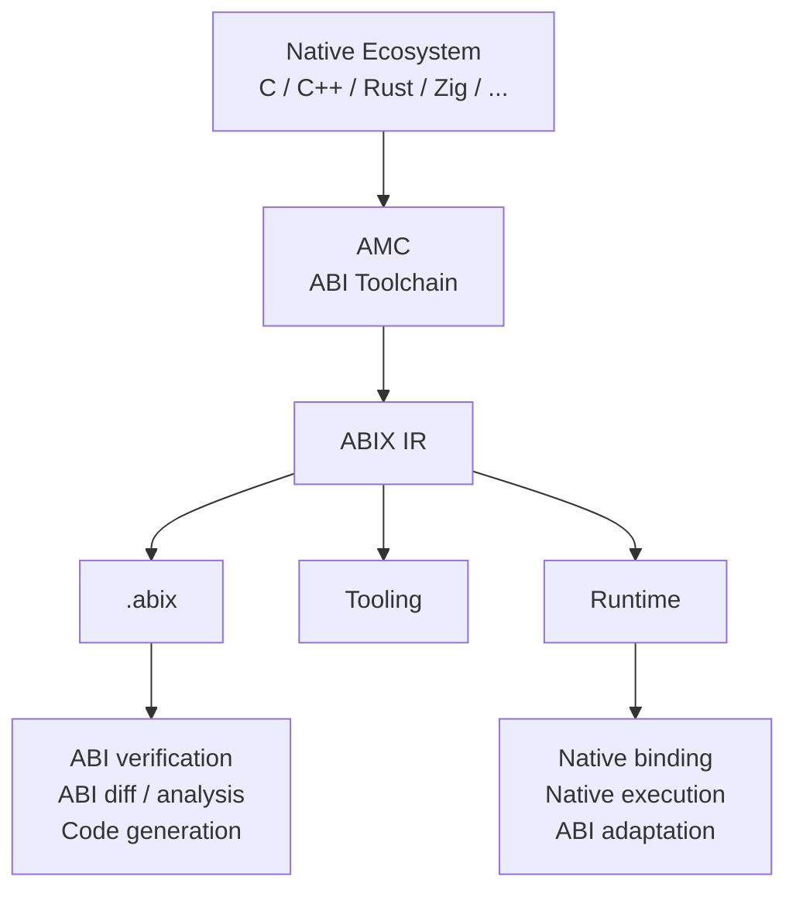

ABIX is currently implemented with **C++ as its first host language**. The ABI
model itself is designed to stay language-independent.

---

## Why ABIX?

In native software the ABI is usually an implicit consequence of the compiler,
target platform, calling convention, data layout, CRT, linker, binary format and
language implementation. It exists, but it is hard to inspect, compare, verify
and reuse as an independent artifact.

ABIX makes it explicit:

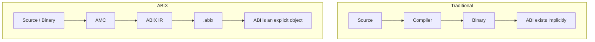

Once ABI is an object, it can be consumed across the toolchain:

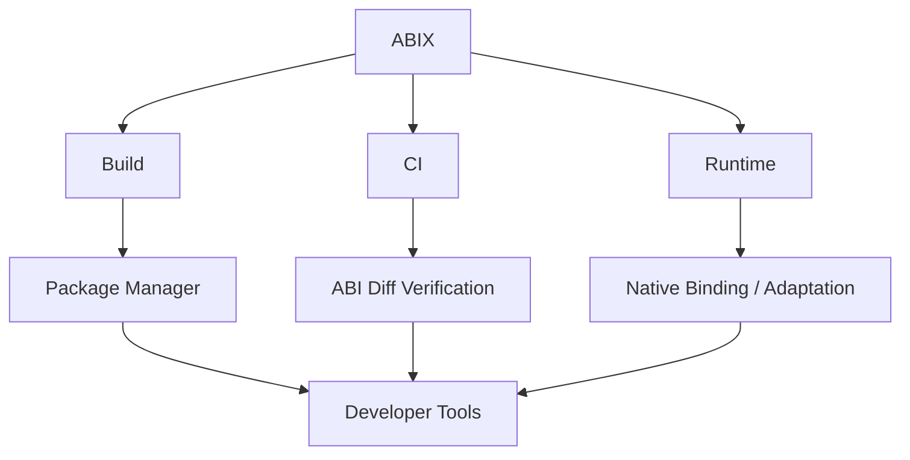

---

## A Small Example

Suppose a library exposes:

```cpp
struct Foo {
    int id;
    double value;
};

int add(int a, int b);
```

The native ABI contains more than the source declaration:

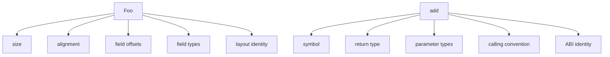

ABIX records these facts in a machine-readable model, so an ABI change becomes
directly observable instead of a crash after loading a binary (illustrative
output):

```text
$ amc diff foo-v1.abix foo-v2.abix

ABI BREAK

Foo
 └── field: value
      offset: 8 → 16

LayoutHash
  old: 7e...
  new: 91...

Result: incompatible
```

---

## Native, Not a VM

ABIX is not a virtual machine, an RPC framework, or a universal object runtime.
For a compatible native function the intended execution path is:

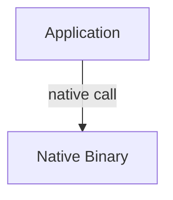

ABIX may participate in **discover / verify / identify / bind / adapt**, but it
does not continuously interpret or dispatch compatible calls.

> **Establish the ABI relationship dynamically, then execute through the native ABI.**

---

## The ABIX Model

ABIX is centered on a small set of concepts:

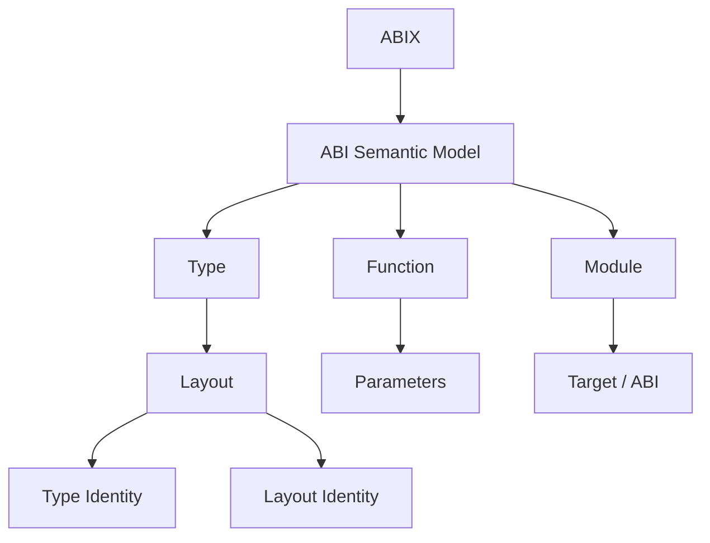

The model describes existing native binary contracts. It does not replace C++,
Rust or C with a new universal runtime type system.

Type identity is a 128-bit `TypeID`; layout identity is a separate
`LayoutHash`; the module-level artifact identity is the `ABIHash`. See
[ABI identity & compatibility](docs/architecture/compatibility.md).

---

## ABIX IR

The ABIX Intermediate Representation is the common representation shared by
language tooling and the runtime:

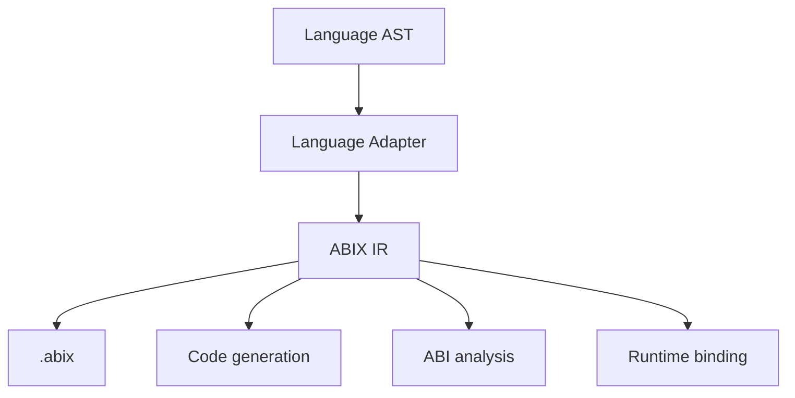

The IR focuses on ABI semantics rather than source-level detail. Its serialized
form is the `.abix` artifact:

* [`docs/abix/abix.md`](docs/abix/abix.md) — the canonical `.abix` artifact
* [`docs/abix/abic.md`](docs/abix/abic.md) — the `.abic.toml` build configuration
* [`docs/abix/metadata_modes.md`](docs/abix/metadata_modes.md) — the three metadata modes

---

## AMC

**AMC — ABI Meta Compiler** is the toolchain entry point.

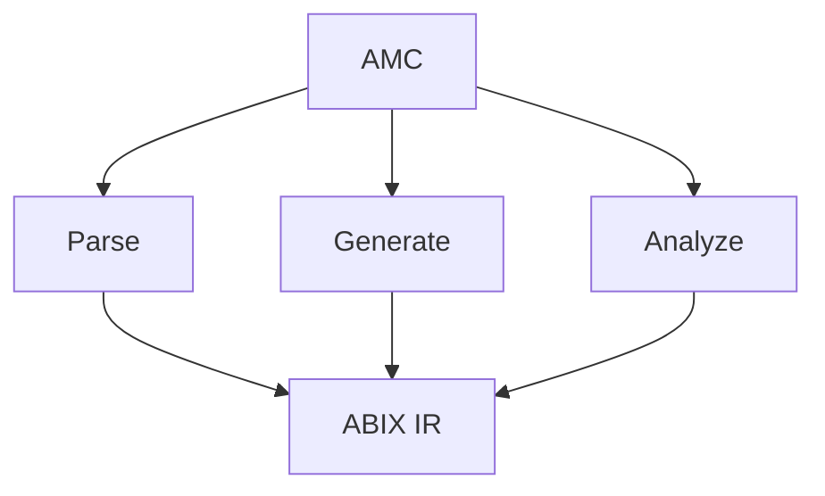

Typical workflows:

```bash
# Build ABI metadata from sources
amc build -c package.abic.toml -B build

# Inspect / query
amc inspect build/build/package.abix
amc query  build/build/package.abix --type Foo --layout

# Compare and verify
amc diff  v1.abix v2.abix
amc verify -c package.abic.toml -B build
```

AMC is an extensible toolchain, not a language-specific compiler: frontends
extract ABI from a language AST, ABIX IR stays the common representation.
See [`docs/amc/amc.md`](docs/amc/amc.md).

---

## Self-Hosting

ABIX 1.0 is self-hosting for its own public ABI: it describes its public ABI with
its own model, and uses that to build and verify the next version.

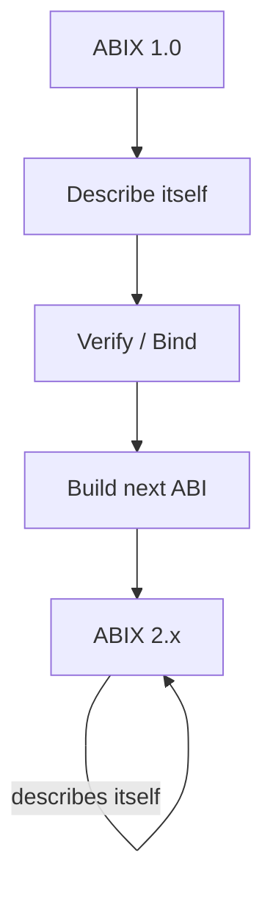

This separates the **stable bootstrap ABI** from **internal implementation**
(runtime internals, data structures, synchronization, caches) so the
implementation can evolve while its external contract stays explicit. See
[`docs/getting-started/self-hosting.md`](docs/getting-started/self-hosting.md).

---

## Architecture

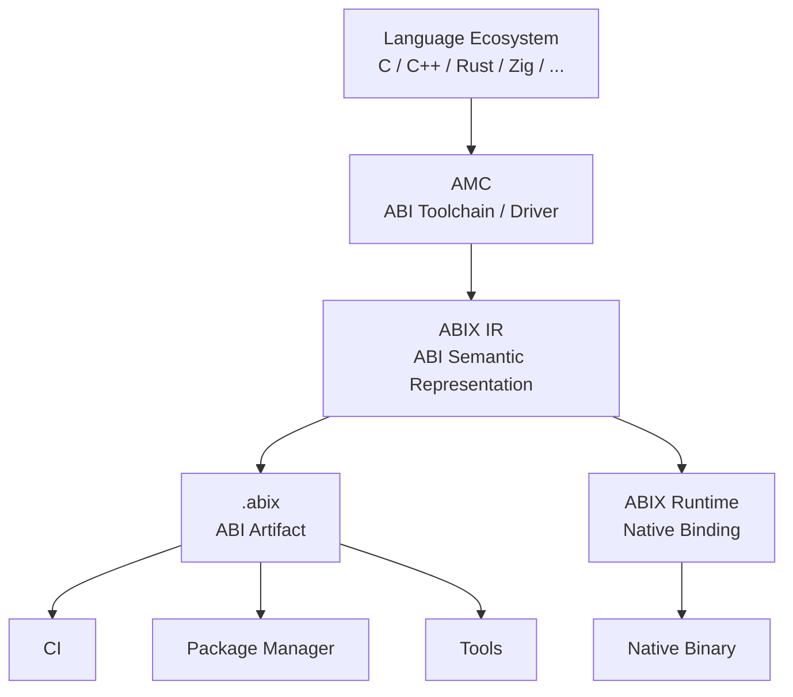

The core architectural rule:

> **There should be one source of ABI truth.** The runtime may use a projection
> of the ABI model, but must not independently redefine ABI semantics.

Tooling is split into `libabix-format` / `libabix-abi` / `libabix-metadata` /
`libabix-tools`, plus the header-only `libabix-runtime`, so every consumer
shares exactly one `.abix` / Metadata Region parser.

---

## What ABIX Is Not

| System                   | ABIX's boundary                                          |
| ------------------------ | -------------------------------------------------------- |
| VM / Interpreter         | Compatible calls remain native                           |
| RPC framework            | No network transport is required                         |
| Universal object model   | Does not define a new object universe                    |
| Debug information format | ABI semantics are separate from source/debug information |
| C ABI wrapper            | Does not reduce every interface to `void*`               |
| Compiler replacement     | AMC builds on language/compiler ecosystems               |
| Reflection-only system   | ABI identity and compatibility are first-class           |

ABIX works alongside existing compiler, linker, debugger, build-system and
language ecosystems rather than replacing them.

---

## Competitive Landscape

ABIX has no single one-to-one competitor. The problems it solves are
scattered across ABI analysis (libabigail), package management (Conan,
vcpkg), FFI (bindgen), component models (COM, Wasm Component Model),
RPC/IDL (gRPC/Protobuf), and build systems (CMake/Bazel). ABIX unifies
these native binary lifecycle capabilities onto a single ABI/IR.

| What others solve       | What ABIX adds                             |
|-------------------------|--------------------------------------------|
| ABI analysis / diff     | ABI IR / contract / verification           |
| Package / build         | ABI metadata as first-class object         |
| Source-oriented FFI     | Binary-oriented binding                    |
| Wire-level contracts    | Native binary boundary semantics           |

For a detailed analysis see [docs/development/competitors.md](docs/development/competitors.md).

---

## Ecosystem

ABIX is designed as an open foundation for native binary interoperability.

AMC provides tooling around ABIX, while higher-level applications can be built independently across areas such as:

* ABI governance and CI
* Cross-language interoperability
* Native plugin systems
* Package and binary management
* IDE and LSP integration
* AI-assisted development
* Robotics and runtime systems

The project aims to support both community-driven and commercial adoption while keeping the core ABI technology broadly reusable and interoperable.

For details see [docs/ecosystem/ecosystem.md](docs/ecosystem/ecosystem.md). For project sustainability, see [docs/ecosystem/sustainability.md](docs/ecosystem/sustainability.md).

---

## Project Structure

```text
ABIX
├── ABIX IR            abix/            ABI model + runtime
├── AMC                amc/             ABI toolchain
├── .abix              serialized ABI artifact
├── tests / benchmarks test/ bench/
├── Aue (experimental) aue/             Lua boundary layer + conformance
└── docs/              specification, design, runtime, AMC, benchmarks
```

---

## Getting Started

### Requirements

* C++17 or later
* CMake 3.20+
* LLVM / Clang tooling (for the AMC C++ frontend)
* a supported native toolchain

### Build

```bash
git clone <repository>
cd ABIX
cmake -B build/Release -DCMAKE_BUILD_TYPE=Release -G Ninja -S .
cmake --build build/Release --parallel
```

### Try it

```bash
# Build an .abix artifact from the example config
./build/Release/bin/amc build -c amc/tests/fixtures/amc_test.abic.toml -B build/demo

# Inspect it
./build/Release/bin/amc inspect build/demo/build/amc_test.abix

# Query a type and its layout
./build/Release/bin/amc query build/demo/build/amc_test.abix --type AmcTestFoo --layout

# LLM-friendly ABI context
./build/Release/bin/amc context build/demo/build/amc_test.abix --format llm
```

For the first complete walkthrough see
[`docs/getting-started/getting-started.md`](docs/getting-started/getting-started.md).

---

## Documentation

### Start Here

* [Getting Started](docs/getting-started/getting-started.md)
* [Architecture](.agents/ARCHITECTURE.md)
* [ABIX Specification](.agents/ABI-SPEC.md)
* [`.abix` — Canonical ABI Artifact](docs/abix/abix.md)

### Core Concepts

* [ABI Identity & Compatibility](docs/architecture/compatibility.md)
* [`.abic` — ABI Configuration](docs/abix/abic.md)
* [Metadata Modes](docs/abix/metadata_modes.md)
* [Self-Hosting](docs/getting-started/self-hosting.md)

### Runtime

* [Runtime Overview](docs/architecture/runtime.md)
* [API Reference](docs/abix/api.md)
* [Performance & Benchmarks](docs/benchmark/benchmark.md)

### AMC Toolchain

* [AMC](docs/amc/amc.md)
* [Language Plugins](.agents/LANGUAGE-PLUGIN.md)
* [MCP: ABI Metadata for AI agents](docs/ai/MCP.md)

### Project

* [Roadmap](.agents/ROADMAP.md)
* [Contributing](CONTRIBUTING.md)
* [Agent Instructions](.agents/AGENTS.md)
* [Design Notes](docs/development/design-notes.md)

---

## Current Status

**ABIX 2.0** — the toolchain release: ABI inspection, diff, compatibility classification, adapter generation, metadata modes and ELF / Mach-O inspection. The project is
under active development; the C++ implementation is the *first* implementation
of the model, not a limitation of it.

Current focus:

* strengthening the ABIX specification
* improving AMC usability
* language / toolchain integration
* ABI compatibility analysis
* documentation and examples
* external validation and adoption

---

## Roadmap

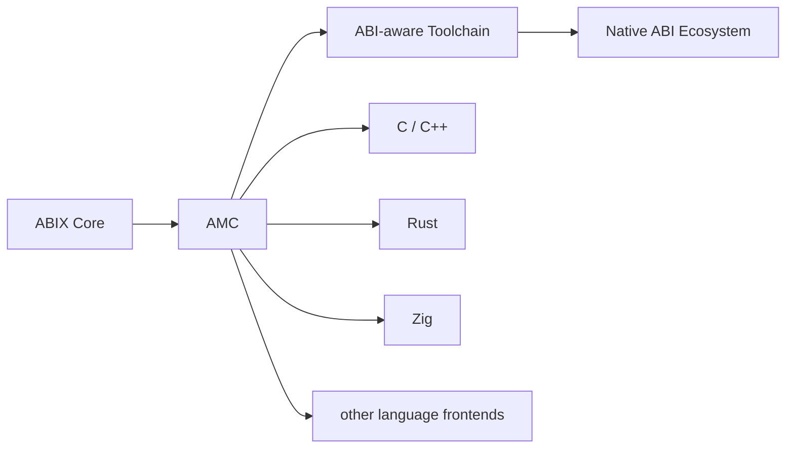

The roadmap prioritises interoperability and real-world usage over adding
runtime features. See [`ROADMAP.md`](.agents/ROADMAP.md).

---

## Contributing

Contributions are welcome: language frontends, ABI extraction, IR design, code
generation, runtime integration, compatibility testing, build-system
integration, documentation, examples and benchmarks.

See [`CONTRIBUTING.md`](CONTRIBUTING.md).

---

## Community

If ABIX is useful to you: star the repository, open issues and discussions,
share experiments and use cases, or contribute documentation and code. External
feedback is especially valuable while the model and toolchain are still
evolving.

---

## License

See [`LICENSE`](LICENSE).
