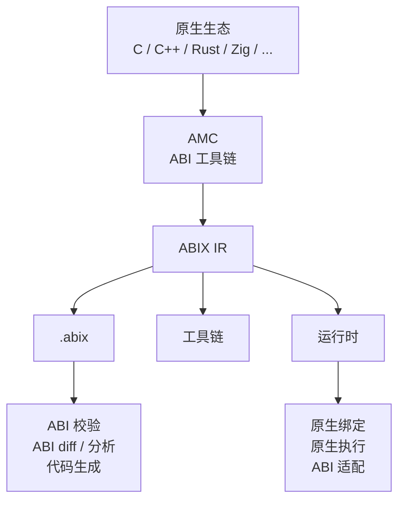
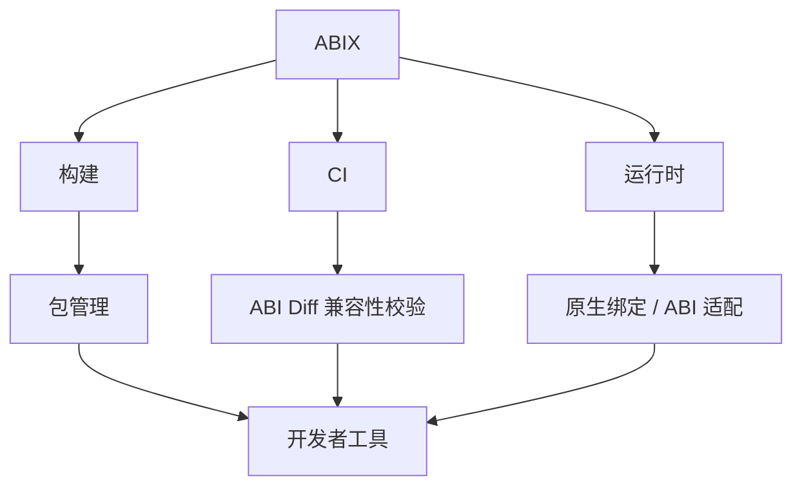
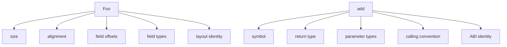
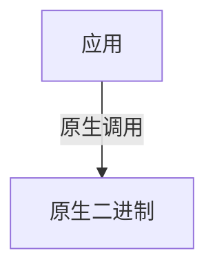
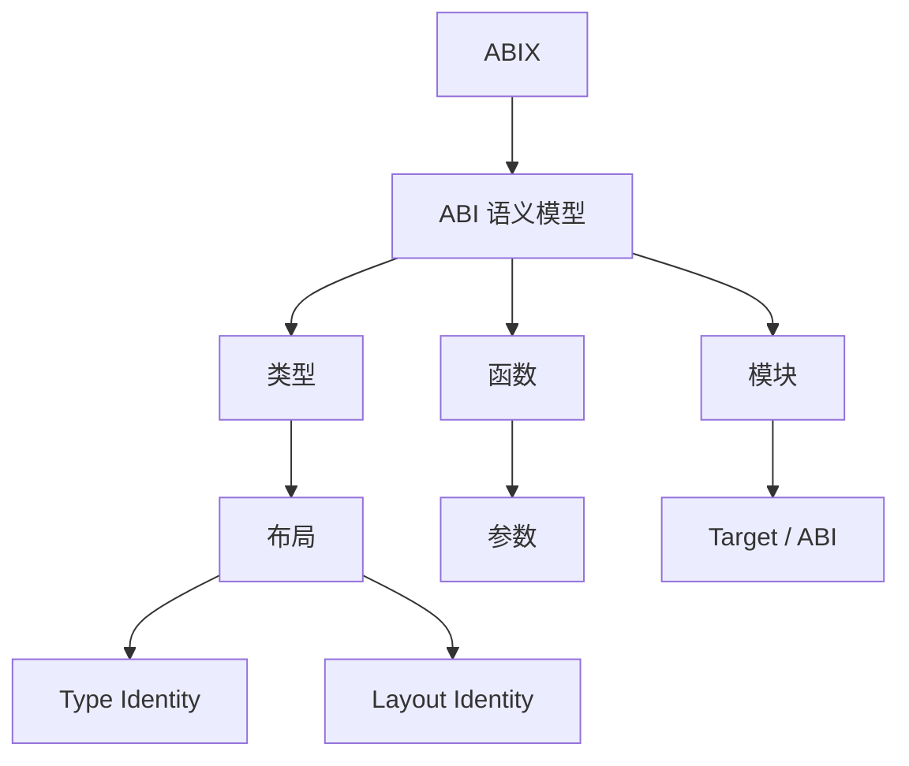
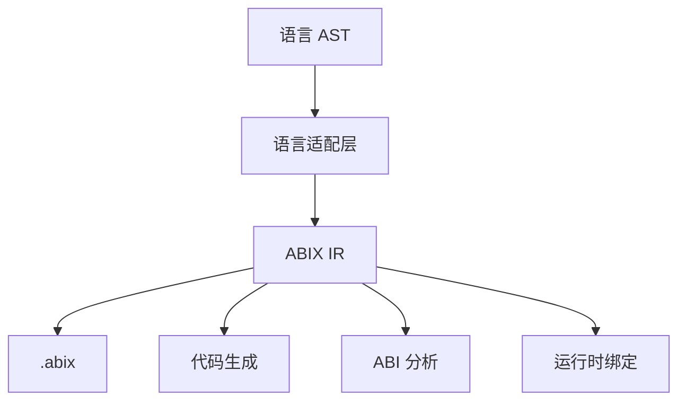
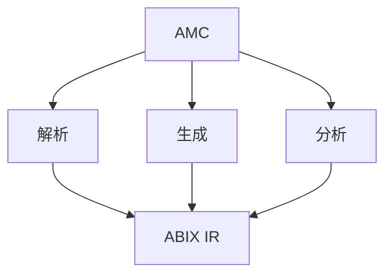
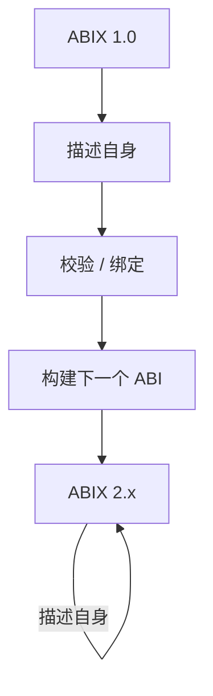
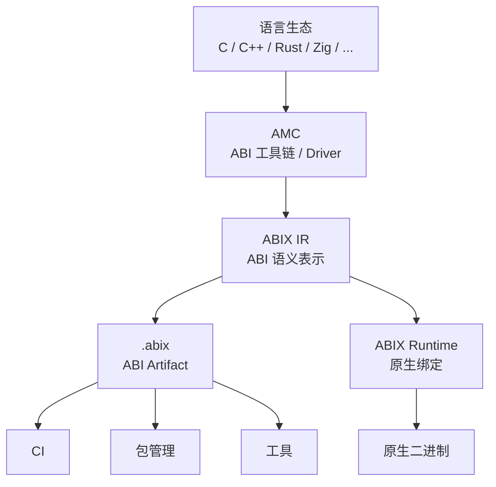
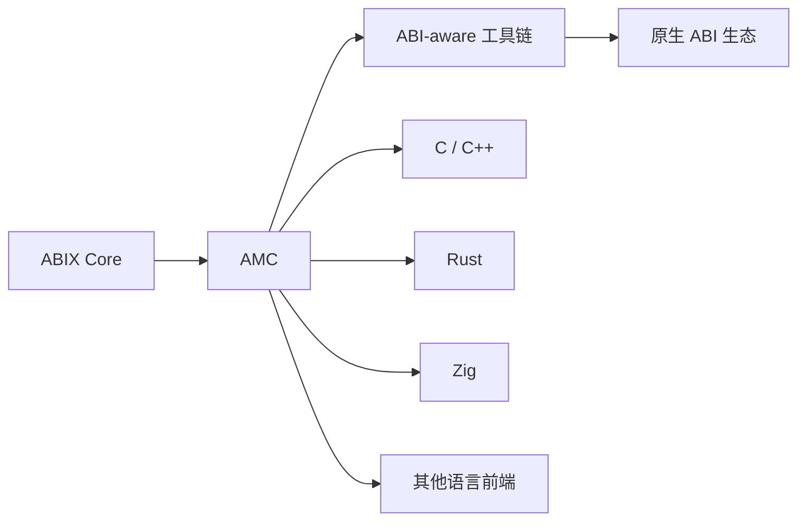

# ABIX

> **把原生 ABI 变成一等、可验证的对象。**

ABIX 是一个 **ABI 语义层**：用于描述、标识、校验并演进原生二进制接口。它让 ABI
信息变得显式、机器可读，且不依赖某个具体编译器或语言实现。



ABIX 目前以 **C++ 作为第一个宿主语言**实现；ABI 模型本身保持语言无关。

---

## 为什么需要 ABIX？

在原生软件里，ABI 通常是编译器、目标平台、调用约定、数据布局、CRT、链接器、
二进制格式和语言实现共同作用下的**隐式结果**。它确实存在，却难以被检查、比较、
验证，也难以作为独立 artifact 复用。

ABIX 让它显式化：


一旦 ABI 成为对象，它就能贯穿整个工具链：



---

## 一个小例子

假设某个库导出：

```cpp
struct Foo {
    int id;
    double value;
};

int add(int a, int b);
```

原生 ABI 远不止源码声明本身：



ABIX 把这些 ABI 事实记录为机器可读模型，于是 ABI 变化可以被直接观察，而不是等到
加载二进制时才崩溃（输出为示意）：

```text
$ amc diff foo-v1.abix foo-v2.abix

ABI BREAK

Foo
 └── field: value
      offset: 8 → 16

LayoutHash
  old: 7e...
  new: 91...

Result: incompatible
```

---

## 原生执行，而不是 VM

ABIX 不是虚拟机、不是 RPC 框架、也不是通用对象运行时。对一个兼容的原生函数，
期望的执行路径是：



ABIX 可以参与 **发现 / 校验 / 标识 / 绑定 / 适配**，但不会持续解释或分派兼容调用。

> **动态建立 ABI 关系，然后走原生 ABI 执行。**

---

## ABIX 模型

ABIX 围绕少量概念展开：



该模型描述的是既有的原生二进制契约，而不是用一套新的通用运行时类型系统去取代
C++ / Rust / C。

类型身份是 128 位 `TypeID`；布局身份是独立的 `LayoutHash`；模块级 artifact 身份是
`ABIHash`。详见 [ABI 身份与兼容性](docs/compatibility_zh.md)。

---

## ABIX IR

ABIX 中间表示是语言工具与运行时共享的统一表示：



IR 关注 ABI 语义，而非源码级实现细节。其序列化形式即 `.abix`：

* [`docs/abix_zh.md`](docs/abix_zh.md) — 规范化的 `.abix` artifact
* [`docs/abic_zh.md`](docs/abic_zh.md) — `.abic.toml` 构建配置
* [`docs/metadata_modes_zh.md`](docs/metadata_modes_zh.md) — 三种 metadata 模式

---

## AMC

**AMC — ABI Meta Compiler** 是工具链入口。



典型用法：

```bash
# 从源码构建 ABI metadata
amc build -c package.abic.toml -B build

# 查看 / 查询
amc inspect build/build/package.abix
amc query  build/build/package.abix --type Foo --layout

# 对比与校验
amc diff  v1.abix v2.abix
amc verify -c package.abic.toml -B build
```

AMC 是可扩展工具链而非语言专用编译器：前端从语言 AST 提取 ABI，ABIX IR 始终是
统一表示。详见 [`docs/amc_zh.md`](docs/amc_zh.md)。

---

## 自举（Self-Hosting）

ABIX 1.0 对自身公开 ABI 是自举的：用自己的模型描述自己的公开 ABI，并用它构建和
校验下一个版本。



这把**稳定的 bootstrap ABI** 与**内部实现**（运行时内部结构、数据结构、同步、缓存）
分离开，使实现可以演进，而对外契约始终显式、可验证。详见
[`docs/self-hosting_zh.md`](docs/self-hosting_zh.md)。

---

## 架构



核心架构原则：

> **ABI 事实只能有一个来源。** 运行时可以使用 ABI 模型的投影，但不得自行重新定义
> ABI 语义。

工具链拆分为 `libabix-format` / `libabix-abi` / `libabix-metadata` / `libabix-tools`，
外加 header-only 的 `libabix-runtime`，确保所有消费者共享唯一的
`.abix` / Metadata Region parser。

---

## ABIX 不是什么

| 系统             | ABIX 的边界                                   |
| ---------------- | --------------------------------------------- |
| VM / 解释器      | 兼容调用保持原生                              |
| RPC 框架         | 不需要网络传输                                |
| 通用对象模型     | 不定义新的对象宇宙                            |
| 调试信息格式     | ABI 语义与源码/调试信息分离                   |
| C ABI wrapper    | 不要求把所有接口退化为 `void*`                |
| 编译器替代品     | AMC 建立在既有语言/编译器生态之上             |
| 纯反射系统       | ABI 身份与兼容性是一等公民                    |

ABIX 与既有编译器、链接器、调试器、构建系统和语言生态并存，而不是取代它们。

---

## 项目结构

```text
ABIX
├── ABIX IR            abix/            ABI 模型 + 运行时
├── AMC                amc/             ABI 工具链
├── .abix              serialized ABI artifact
├── 测试 / 基准         test/ bench/
├── Aue（实验性）       aue/             Lua 边界层 + 一致性测试
└── docs/              规范、设计、运行时、AMC、基准
```

---

## 快速上手

### 依赖

* C++17 或更高
* CMake 3.20+
* LLVM / Clang 工具链（AMC C++ 前端需要）
* 受支持的原生工具链

### 构建

```bash
git clone <repository>
cd ABIX
cmake -B build/Release -DCMAKE_BUILD_TYPE=Release -G Ninja -S .
cmake --build build/Release --parallel
```

### 试用

```bash
# 从示例配置构建 .abix
./build/Release/bin/amc build -c amc/tests/fixtures/amc_test.abic.toml -B build/demo

# 查看
./build/Release/bin/amc inspect build/demo/build/amc_test.abix

# 查询类型及其布局
./build/Release/bin/amc query build/demo/build/amc_test.abix --type AmcTestFoo --layout

# LLM 友好的 ABI 上下文
./build/Release/bin/amc context build/demo/build/amc_test.abix --format llm
```

完整走查见 [`docs/getting-started_zh.md`](docs/getting-started_zh.md)。

---

## 文档

### 从这里开始

* [快速上手](docs/getting-started_zh.md)
* [架构](.agents/ARCHITECTURE.md)
* [ABIX 规范](.agents/ABI-SPEC.md)
* [`.abix` — 规范化 ABI Artifact](docs/abix_zh.md)

### 核心概念

* [ABI 身份与兼容性](docs/compatibility_zh.md)
* [`.abic` — ABI 配置](docs/abic_zh.md)
* [Metadata 三种模式](docs/metadata_modes_zh.md)
* [自举](docs/self-hosting_zh.md)

### 运行时

* [运行时概览](docs/runtime_zh.md)
* [API 参考](docs/api_zh.md)
* [性能与基准](docs/benchmark_ZH.md)

### AMC 工具链

* [AMC](docs/amc_zh.md)
* [语言插件](.agents/LANGUAGE-PLUGIN.md)
* [MCP：面向 AI Agent 的 ABI Metadata](docs/MCP.md)

### 项目

* [路线图](docs/roadmap_zh.md)
* [参与贡献](CONTRIBUTING.md)
* [Agent 行为准则](.agents/AGENTS.md)
* [设计笔记](docs/design-notes_zh.md)

---

## 当前状态

**ABIX 1.0** — 初始稳定的 ABI 模型与 bootstrap ABI。项目仍在积极开发中；C++ 实现
是 ABIX 模型的**第一个**实现，而不是模型的限制。

当前重点：

* 强化 ABIX 规范
* 提升 AMC 易用性
* 语言 / 工具链集成
* ABI 兼容性分析
* 文档与示例
* 外部验证与采用

---

## 路线图



路线图优先考虑互操作性与真实使用，而不是增加运行时特性。见
[`docs/roadmap_zh.md`](docs/roadmap_zh.md)。

---

## 参与贡献

欢迎贡献：语言前端、ABI 提取、IR 设计、代码生成、运行时集成、兼容性测试、
构建系统集成、文档、示例与基准。

见 [`CONTRIBUTING.md`](CONTRIBUTING.md)。

---

## 社区

如果 ABIX 对你有用：欢迎 star、提 issue / discussion、分享实验与用例，或贡献文档和
代码。在模型与工具链仍在演进时，外部反馈尤其宝贵。

---

## 许可证

见 [`LICENSE`](LICENSE)。
