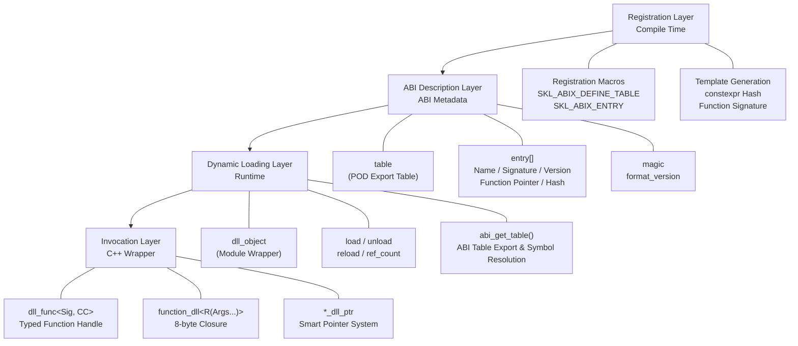

# ABIX API Reference

This document covers the ABIX cross-DLL function calling library (`abix/`).

---

## Architecture Overview



---

## 1. `config.h` — Platform Detection & Core Enums

**Namespace:** `skl::abix`

### Platform Macros

| Macro | Value | Description |
|-------|-------|-------------|
| `SKL_ABIX_WINDOWS` | `1` or `0` | Windows platform detection |
| `SKL_ABIX_CALL_CDECL` | `__cdecl` or empty | `__cdecl` calling convention attribute |
| `SKL_ABIX_CALL_STDCALL` | `__stdcall` or empty | `__stdcall` calling convention attribute |
| `SKL_ABIX_DLL_EXPORT` | `__declspec(dllexport)` or visibility attribute | DLL export attribute |
| `SKL_ABIX_NAMESPACE_BEGIN` | — | Opens `namespace skl { namespace abix {` |
| `SKL_ABIX_NAMESPACE_END` | — | Closes `} }` |
| `SKL_ABIX_MAGIC64` | `0xFDFDFDFDFDFDFDFDULL` | Magic number for control blocks |

---

## 2. `type.h` — Core Types

**Namespace:** `skl::abix`

### Type Aliases

| Symbol | Type | Description |
|--------|------|-------------|
| `sig_t` | `uint64_t` | Function signature hash (FNV-1a 64-bit) |
| `name_hash_t` | `uint32_t` | Function name hash (FNV-1a 32-bit) |
| `version_t` | `uint64_t` | Version token (FNV-1a hash of version string) |
| `index_t` | `uint32_t` | Entry index within the table |

### Constants

| Constant | Value | Description |
|----------|-------|-------------|
| `SKL_ABIX_TABLE_MAGIC` | `0xAB1E7A81U` | Table magic number for validation |
| `SKL_ABIX_TABLE_FORMAT_VERSION` | `1U` | Table format version |
| `SKL_ABIX_ENTRY_HOT` | `0x1ULL` | Hot entry flag |

### `entry` — Function Table Entry

```cpp
struct entry {
    const char *name;       // Function name (null-terminated C string)
    sig_t sig;              // Compile-time signature hash
    version_t version;      // Version token (0 = unversioned)
    uintptr_t fnptr;        // Function pointer (uintptr_t for portability)
    name_hash_t name_hash;  // 32-bit FNV-1a hash of name
    uint32_t flags;         // Bit flags (SKL_ABIX_ENTRY_HOT = 0x1)
};
```

### `table` — Export Table

```cpp
struct table {
    uint32_t count;          // Number of entries
    uint32_t magic;          // Must equal SKL_ABIX_TABLE_MAGIC
    uint32_t format_version; // Must equal SKL_ABIX_TABLE_FORMAT_VERSION
    uint32_t reserved;       // Reserved for future use
    const entry *entries;    // Pointer to entry array (count elements)
};
```

### `make_table()`

```cpp
template<size_t N>
inline const table *make_table(const entry (&arr)[N]) noexcept;
```

Creates a static `table` from a compile-time entry array. Used internally by `SKL_ABIX_DEFINE_TABLE`.

---

## 3. `register.h` — Registration Macros

**Namespace:** `skl::abix`

### Export Table Macros

| Macro | Description |
|-------|-------------|
| `SKL_ABIX_DEFINE_TABLE(...)` | Define the export table with a comma-separated list of `SKL_ABIX_ENTRY*` macros. Generates `abi_get_table()` |
| `SKL_ABIX_ENTRY(name, func)` | Register a function with `Cdecl` calling convention and version `0` |
| `SKL_ABIX_ENTRY_CC(name, func, cctype)` | Register a function with a specific calling convention (`Cdecl` or `Stdcall`) |
| `SKL_ABIX_ENTRY_FULL(name, func, cctype, ver, flg)` | Register a function with all parameters: calling convention, version, and flags |
| `SKL_ABIX_VERSION("1.0")` | Create a version token from a version string (FNV-1a hash) |

### Calling Convention Pickers

| Macro | Expands To |
|-------|------------|
| `SKL_ABIX_CCPICK(Cdecl)` | `::skl::abix::cc::tag::Cdecl` |
| `SKL_ABIX_CCPICK(Stdcall)` | `::skl::abix::cc::tag::Stdcall` |

### Memory Allocation

| Function | Description |
|----------|-------------|
| `abi_alloc(n)` | Allocate `n` bytes (uses `HeapAlloc` on Windows, `malloc` otherwise) |
| `abi_free(p)` | Free memory allocated by `abi_alloc` |

---

## 4. `obj_dll.h` — DLL Module Wrapper

**Namespace:** `skl::abix`

### `call_error` Enum

| Value | Description |
|-------|-------------|
| `none` | No error |
| `not_loaded` | DLL is not loaded |
| `not_found` | Function name not found in the export table |
| `sig_mismatch` | Signature hash does not match |
| `version_mismatch` | Version token does not match |
| `stale_handle` | Cannot unload while live handles reference the module |
| `table_changed` | Table content changed after handle was resolved |
| `invalid` | Invalid handle or corrupted closure |
| `load_failed` | DLL load failed (missing file, bad table, etc.) |
| `unloading` | DLL is currently unloading (RCU grace period) |

### `last_error()`

```cpp
inline call_error &last_error() noexcept;
```

Returns a reference to the thread-local last error code. Thread-safe (each thread has its own error state).

### `dll_object`

| Method | Returns | Description |
|--------|---------|-------------|
| `load(path)` | `bool` | Load a DLL/SO, resolve `abi_get_table()`, validate magic/version |
| `unload()` | `bool` | Mark unloading → wait for RCU readers → unload if `ref_count() == 0`; returns `false` and sets `stale_handle` if handles are alive |
| `force_unload()` | `void` | Unload regardless of ref-count (bypasses RCU, caller must ensure no concurrent readers) |
| `reload(path)` | `bool` | `force_unload()` + `load(path)` |
| `is_loaded()` | `bool` | Whether the module is currently loaded and not in the unloading state |
| `get_table()` | `const table*` | Get the validated export table pointer |
| `module()` | `module_handle` | Raw OS module handle (`HMODULE` on Windows, `void*` on POSIX) |
| `ref_count()` | `uint32_t` | Current number of live handles |
| `add_ref()` | `void` | Increment reference count |
| `release_ref()` | `void` | Decrement reference count |
| `try_enter_read()` | `bool` | Enter RCU read-side critical section with double-checked locking; returns `false` and sets `call_error::unloading` if the module is unloading or zombie |
| `exit_read()` | `void` | Exit RCU read-side critical section (decrements active reader count) |
| `begin_rcu_unload()` | `bool` | Initiate RCU unload: set `_unloading` flag → spin-wait until `_active_readers == 0` or timeout → apply `_timeout_policy`; returns `true` on success |
| `set_timeout_policy(p)` | `void` | Set the RCU timeout policy (`RCUTimeoutPolicy::Safe` / `ForceUnload` / `ForceLeak`) |
| `timeout_policy()` | `RCUTimeoutPolicy` | Get the current RCU timeout policy |

**Usage Example:**
```cpp
dll_object lib;
if (lib.load("my_plugin.dll")) {
    const table *t = lib.get_table();
    // Use the table...
    lib.unload();  // Only succeeds if no live handles and no active readers
}
```

### RCU Non-Blocking Unload

ABIX implements RCU (Read-Copy-Update) with epoch-based reclamation (EBR) for thread-safe DLL unloading. The design uses compiler-builtin atomic operations (`_Interlocked*` on Windows, `__atomic_*` on POSIX) to avoid `<atomic>` ABI compatibility issues.

**Architecture:**

| Phase | Write Side (unloader) | Read Side (caller) |
|-------|----------------------|---------------------|
| Mark | `begin_rcu_unload()` sets `_unloading = true` | `try_enter_read()` checks `_unloading` before inc |
| Grace | `wait_for_readers()` spins until `_active_readers == 0` | Active readers hold `_active_readers > 0` |
| Reclaim | `unload_internal()` calls `FreeLibrary`/`dlclose` | `exit_read()` decrements `_active_readers` |

**Design:**

- **_Double-checked locking**: `try_enter_read()` checks `_unloading` before and after incrementing `_active_readers`, preventing the TOCTOU race where a reader detects `_unloading == false` but the unloader sets the flag before the reader increments.
- **_Spin-wait**: `wait_for_readers()` busy-waits. This is appropriate for DLL function calls that are expected to return quickly.
- **_Zero STL dependency**: Atomics operate on plain `bool` and `uint32_t` via compiler builtins — no `<atomic>`, no layout variance across STL implementations.
- **_`force_unload` / `reload` bypass RCU**: These methods directly unload without RCU protection. Callers must guarantee no concurrent readers.

**Usage Example:**
```cpp
// Thread 1: Reader
auto add = dll_func<int(int, int)>(lib, "add");
int result = add(2, 3);  // operator() auto-calls try_enter_read/exit_read

// Thread 2: Unloader
lib.unload();  // Marks unloading, waits for reader, then unloads
```

### RCU Timeout Policies

When `ABIX_RCU_TIMEOUT_ENABLE` is `1` (default), `wait_for_readers()` periodically checks elapsed time against `ABIX_RCU_TIMEOUT_MS`. If the grace period exceeds the threshold, one of three policies is applied:

| Policy | Enum | Behavior |
|--------|------|----------|
| **Safe** | `RCUTimeoutPolicy::Safe` | Sets `_zombie = true`, clears `_unloading`. DLL stays loaded but inaccessible. **Never crashes.** (Default) |
| **ForceUnload** | `RCUTimeoutPolicy::ForceUnload` | Calls `unload_internal()` immediately. Active callers receive dangling pointers — **will crash**. |
| **ForceLeak** | `RCUTimeoutPolicy::ForceLeak` | Detaches module handle, DLL stays loaded in OS. Requires `#define ABIX_ENABLE_FORCE_LEAK_POLICY`. |

**Zombie lifecycle:**
```
begin_rcu_unload() → timeout → _zombie = true
    ↓
is_loaded() → false      (new callers rejected)
try_enter_read() → false  (sets call_error::unloading)
load() → force_unload zombie → load fresh DLL
~dll_object() → unload_internal() (force cleanup)
```

### Timeout Check: Dual-Fuel (Time + Frames)

ABIX treats wall-clock time and frame count as two orthogonal fuel sources. Both are always available at runtime — no compile-time mode switch required.

- **Time fuel**: `get_tick_ms()` always returns the system wall-clock. No host cooperation needed.
- **Frame fuel**: `abix::tick(timestamp)` injects frame counts from the host loop. Optional, zero overhead if unused.
- **Deadline check**: `wait_for_readers()` checks both `timeout_ms` AND `timeout_frames` every ~1M spin iterations. Whichever deadline arrives first triggers the timeout.

### `RCUTimeoutConfig` (`rcu_config.h`)

**Namespace:** `skl::abix`

Runtime configuration for RCU timeout behavior. Replaces the old compile-time-only `ABIX_RCU_TIMEOUT_MS` macro with per-instance settings.

| Field | Type | Default | Description |
|-------|------|---------|-------------|
| `timeout_ms` | `uint64_t` | `ABIX_RCU_TIMEOUT_MS` | Timeout threshold in milliseconds. Checked against `get_tick_ms()`. 0 = disabled. |
| `timeout_frames` | `uint64_t` | `ABIX_RCU_TIMEOUT_FRAMES_DEFAULT` (0) | Timeout threshold in frames. Checked against `get_tick_frames()`. 0 = disabled. |

**Constructor:**
```cpp
constexpr RCUTimeoutConfig(
    uint64_t ms = ABIX_RCU_TIMEOUT_MS,
    uint64_t frames = ABIX_RCU_TIMEOUT_FRAMES_DEFAULT
) noexcept;
```

**Usage patterns:**
```cpp
// Scenario 1: pure defaults (macro values used)
dll_object lib1;

// Scenario 2: explicit timeout, no frames
dll_object lib2(RCUTimeoutConfig{3000});

// Scenario 3: game engine — both time and frame thresholds
dll_object lib3(RCUTimeoutConfig{5000, 300});  // 5s or 300 frames, whichever triggers first

// Scenario 4: runtime config from file
uint64_t cfg_timeout = app_config.get("plugin_timeout_ms", 5000);
dll_object lib4(RCUTimeoutConfig{cfg_timeout});
```

### Lazy Starvation Guard

When no RCU unload is in progress, the timeout check only fires inside `wait_for_readers()`. If no new readers arrive, the time baseline may go stale. The starvation guard prevents this with three configurable levels:

| Level | Macro Value | Behavior |
|-------|-------------|----------|
| **Off** | `ABIX_LAZY_STARVATION_GUARD_OFF` (0) | Pure lazy, zero overhead. Accepts starvation risk. |
| **Tick** | `ABIX_LAZY_STARVATION_GUARD_TICK` (1) | `try_enter_read()` calls `try_passive_check()` — updates `g_last_check_time` every 30s. `abix::tick()` also updates it. **(Default)** |
| **Idle** | `ABIX_LAZY_STARVATION_GUARD_IDLE` (2) | Same as Tick, plus a background thread that wakes every 30s. Requires `#define ABIX_ENABLE_IDLE_BACKGROUND_THREAD`. |

**`abix::tick()` is always available.** When the starvation guard is enabled, calling `tick()` from the main loop keeps the time baseline current without calling `get_tick_ms()` (a system call) on every `try_enter_read()`. It also feeds the frame counter for frame-based timeout deadlines.

### Logging (`log.h`)

**Namespace:** `skl::abix`

| Type / Function | Description |
|-----------------|-------------|
| `LogLevel` | Enum: `Debug`, `Info`, `Warning`, `Error` |
| `log_sink_t` | `void (*)(LogLevel level, const char *message)` — C-callback, ABI-safe |
| `set_log_sink(sink)` | Set the global log sink. Default: no-op (no output). |
| `log(level, fmt, ...)` | Internal formatter; formats via `vsnprintf` into a 1KB buffer, then calls the sink. |

**Macros:**

| Macro | When Active |
|-------|------------|
| `ABIX_LOG_DEBUG(fmt, ...)` | Unless `ABIX_DISABLE_LOGGING` or `ABIX_DISABLE_LOG_LEVEL_DEBUG` |
| `ABIX_LOG_INFO(fmt, ...)` | Unless `ABIX_DISABLE_LOGGING` or `ABIX_DISABLE_LOG_LEVEL_INFO` |
| `ABIX_LOG_WARNING(fmt, ...)` | Unless `ABIX_DISABLE_LOGGING` or `ABIX_DISABLE_LOG_LEVEL_WARNING` |
| `ABIX_LOG_ERROR(fmt, ...)` | Unless `ABIX_DISABLE_LOGGING` or `ABIX_DISABLE_LOG_LEVEL_ERROR` |

---

## 5. `fn_dll.h` — Typed Function Handles

**Namespace:** `skl::abix`

### `dll_func_cc<C, Sig>`

The primary template for typed function handles. Template parameters:

- `C` — Calling convention tag (`cc::tag::Cdecl` or `cc::tag::Stdcall`)
- `Sig` — Function signature (e.g., `int(int, double)`)

| Method | Returns | Description |
|--------|---------|-------------|
| `resolve(lib, name, ver)` | `void` | Resolve a function by name and optional version |
| `valid()` | `bool` | Whether the handle is valid and the library is loaded |
| `operator bool()` | `bool` | Same as `valid()` |
| `index()` | `index_t` | Entry index in the table |
| `library()` | `const dll_object*` | The associated DLL object |
| `handle_id()` | `uint64_t` | Opaque handle ID (stable across reload) |
| `raw()` | `fn_type` | Raw function pointer |
| `operator()(Args...)` | `R` | Call the function with type safety |

**`operator()` behavior:**
- Acquires RCU read-side critical section via `try_enter_read()` before calling the DLL function
- Releases the critical section via `exit_read()` on all exit paths (including error paths)
- If `try_enter_read()` fails (module is unloading) → sets `call_error::unloading`, returns default `R{}`
- If library is not loaded → sets `call_error::not_loaded`, returns default `R{}`
- If index is out of bounds → sets `call_error::table_changed`, returns default `R{}`
- If entry signature/name/hash changed → sets `call_error::table_changed`, returns default `R{}`
- If function pointer is null → sets `call_error::invalid`, returns default `R{}`

### `dll_func<Sig, C>`

Convenience alias for `dll_func_cc` with default calling convention `Cdecl`:

```cpp
template<typename Sig, cc::tag C = SKL_ABIX_CCPICK(Cdecl)>
class dll_func : public dll_func_cc<C, Sig> { ... };
```

**Usage Example:**
```cpp
dll_object lib;
lib.load("math_dll.dll");

// Resolve with default Cdecl
auto add = dll_func<int(int, int)>(lib, "add");

// Resolve with explicit version
auto log = dll_func<void(const char*)>(lib, "log", SKL_ABIX_VERSION("1.0"));

// Resolve with stdcall calling convention
auto proc = dll_func<void(int), SKL_ABIX_CCPICK(Stdcall)>(lib, "process");

// Call
int result = add(2, 3);
if (!add.valid()) {
    // Check last_error()
}
```

---

## 6. `fn_sig.h` — Compile-time Signature Hashing

**Namespace:** `skl::abix`

### `fn_sig<Sig, C>`

```cpp
template<typename Sig, cc::tag C = SKL_ABIX_CCPICK(Cdecl)>
struct fn_sig;
```

Compile-time function signature hash generator. The `value` member is a `sig_t` constant.

| Member | Type | Description |
|--------|------|-------------|
| `value` | `constexpr sig_t` | Unique FNV-1a hash of the function signature |

### `fn_sig_v<Sig, C>`

```cpp
template<typename Sig, cc::tag C = SKL_ABIX_CCPICK(Cdecl)>
inline constexpr sig_t fn_sig_v = fn_sig<Sig, C>::value;
```

Convenience variable template for `fn_sig::value`.

### `type_sig<T>()`

```cpp
template<typename T>
constexpr sig_t type_sig();
```

Returns the compile-time type signature hash for type `T`. Strips cv-qualifiers and resolves references.

**Usage Example:**
```cpp
constexpr sig_t add_sig = fn_sig<int(int, int)>::value;
constexpr sig_t mul_sig = fn_sig_v<double(double, double)>;
constexpr sig_t int_sig = type_sig<int>();
```

---

## 7. `type_sig.h` — Type Signature Hashing

**Namespace:** `skl::abix`

### `type_sig_impl<T>`

Specialized for ABIX smart pointer types and `function_dll`:

| Type | Hash Formula |
|------|-------------|
| `unique_dll_ptr<T>` | `mix(cstr64("abix::unique_dll_ptr"), type_hash<T>)` |
| `ref_dll_ptr<T>` | `mix(cstr64("abix::ref_dll_ptr"), type_hash<T>)` |
| `view_dll_ptr<T>` | `mix(cstr64("abix::view_dll_ptr"), type_hash<T>)` |
| `shared_dll_ptr<T>` | `mix(cstr64("abix::shared_dll_ptr"), type_hash<T>)` |
| `weak_dll_ptr<T>` | `mix(cstr64("abix::weak_dll_ptr"), type_hash<T>)` |
| `function_dll<R(Args...)>` | Compound hash of return type and all argument types |
| All other types | Delegates to `Utils::type_hash<T>()` |

### `SKL_ABIX_TYPE_TAG(T, tag)`

```cpp
#define SKL_ABIX_TYPE_TAG(T, tag) STATIC_TYPE_TAG(T, tag)
```

Register a custom type tag for user type `T`, enabling stable cross-compiler type hashing.

---

## 8. `search.h` — Table Search Functions

**Namespace:** `skl::abix`

### `lookup_result` Enum

| Value | Description |
|-------|-------------|
| `ok` | Entry found with matching signature |
| `not_found` | No entry with the given name |
| `sig_mismatch` | Name found but signature differs |
| `version_mismatch` | Name found but version differs |
| `bad_table` | Invalid or corrupted table |

### `find_index()`

```cpp
inline lookup_result find_index(const table &t, const hash_index &idx, const char *name, sig_t sig, version_t ver, index_t &out) noexcept;
```

Automatically selects the optimal lookup strategy based on whether `idx` is valid:
- If `idx.valid()` → uses HashIndex lookup (`find_hash`)
- Otherwise → uses linear scan (`find_linear`)

### `find_linear()`

```cpp
inline lookup_result find_linear(const table &t, const char *name, sig_t sig, version_t ver, index_t &out) noexcept;
```

Full table linear scan. Used for small tables (< 64 entries).

**Search logic:**
1. Validate table magic
2. Compute 32-bit name hash (FNV-1a)
3. Linear scan: match name hash → strcmp → version check → sig check
4. Return `ok`, `sig_mismatch`, `version_mismatch`, or `not_found`

### `find_hash()`

```cpp
inline lookup_result find_hash(const table &t, const hash_index &idx, const char *name, sig_t sig, version_t ver, index_t &out) noexcept;
```

Open-addressing hash index lookup. Used for large tables (≥ 64 entries). O(1) average time.

### `lookup_linear()`

```cpp
inline const entry *lookup_linear(const table &t, const char *name, name_hash_t nh, sig_t sig) noexcept;
```

Direct linear lookup returning the entry pointer (or `nullptr`).

### `lookup_hash()`

```cpp
inline const entry *lookup_hash(const table &t, const hash_index &idx, const char *name, name_hash_t nh, sig_t sig) noexcept;
```

Direct hash index lookup returning the entry pointer (or `nullptr`).

### `hash_slot`

```cpp
struct hash_slot {
    name_hash_t hash;
    index_t index;
};
```

A single slot in the hash index. Stores only the name hash and entry index — never copies `entry` data.

### `hash_index`

```cpp
struct hash_index {
    hash_slot *slots;
    uint32_t capacity;
    uint32_t mask;

    bool valid() const noexcept;
    void build(const table &t) noexcept;
    void destroy() noexcept;
};
```

Runtime hash index for large tables. Built once at DLL load time.

| Member | Type | Description |
|--------|------|-------------|
| `slots` | `hash_slot*` | Open-addressing slot array (power-of-two capacity) |
| `capacity` | `uint32_t` | Total number of slots (always `next_pow2(count * 2)`) |
| `mask` | `uint32_t` | `capacity - 1` for fast modulo |

| Method | Description |
|--------|-------------|
| `valid()` | Whether the hash index has been built (slots != nullptr) |
| `build(t)` | Build the hash index from a table. Inserts all entries with linear probing |
| `destroy()` | Free the slot array |

**Design notes:**
- **Load factor ~50%**: `capacity = next_pow2(count * 2)`
- **Open addressing**: Linear probing `pos = (pos + 1) & mask` on collision
- **Zero ABI impact**: `hash_index` is runtime-only metadata; `table` and `entry` structs remain unchanged
- **Built at load time**: No runtime initialization races, no lazy initialization complexity

### Constants

| Constant | Value | Description |
|----------|-------|-------------|
| `HASH_THRESHOLD` | `64` | Tables with fewer entries use linear scan; tables with ≥ 64 entries use HashIndex |
| `HASH_SLOT_EMPTY` | `~index_t{0}` | Sentinel value for empty hash slots |

---

## 9. `function.h` — Cross-Boundary Closure

**Namespace:** `skl::abix`

### `function_dll<R(Args...)>`

An 8-byte (64-bit) closure type for passing callbacks across DLL boundaries. Similar to `std::function` but uses a stable ABI with manual memory management via `abi_alloc`/`abi_free`.

**Design:**
- `sizeof(function_dll<R(Args...)>)` == 8 bytes (always, on 64-bit platforms)
- Stores a heap-allocated `closure_base` pointer as a `uint64_t` handle
- Closure contains invoke/destroy/clone function pointers
- `SKL_ABIX_CLOSURE_MAGIC` validates the closure at call time

**API:**

| Method | Returns | Description |
|--------|---------|-------------|
| `function_dll()` | — | Default constructor, empty |
| `function_dll(F f)` | — | Construct from a callable (lambda, function pointer, etc.) |
| `function_dll(const&)` | — | Copy constructor (deep copy via clone handler) |
| `function_dll(&&)` | — | Move constructor |
| `operator=(rhs)` | `function_dll&` | Copy-and-swap assignment |
| `operator()(Args...)` | `R` | Invoke the stored callable |
| `operator bool()` | `bool` | Whether the closure contains a callable |
| `empty()` | `bool` | Whether the closure is empty |
| `handle()` | `uint64_t` | Raw handle value |
| `swap(other)` | `void` | Swap two closures |

**Usage Example:**
```cpp
int captured = 100;
function_dll<void(int)> cb = [captured](int x) {
    printf("captured=%d, x=%d, sum=%d\n", captured, x, captured + x);
};

// Pass to DLL
auto reg = dll_func<void(function_dll<void(int)>)>(lib, "register_callback");
reg(std::move(cb));
```

---

## 10. Smart Pointers (`dll_ptr/`)

**Namespace:** `skl::abix`

### `unique_handle<T>`

```cpp
template<typename T>
struct unique_handle {
    T *ptr;
    void (*destroy)(T *);
};
```

Raw handle pair (pointer + deleter). Used as the return type of `release()` on smart pointers.

### `unique_dll_ptr<T>`

Exclusive-ownership smart pointer. Calls the DLL-side deleter on destruction.

| Method | Returns | Description |
|--------|---------|-------------|
| `unique_dll_ptr(p, d)` | — | Construct with pointer and deleter function |
| `reset(p, d)` | `void` | Release current and take new ownership |
| `release()` | `unique_handle<T>*` | Release ownership without destroying |
| `get()` | `T*` | Raw pointer |
| `operator->()` | `T*` | Pointer access |
| `operator*()` | `T&` | Dereference |
| `operator bool()` | `bool` | Whether non-null |

### `fn_deleter<T>`

```cpp
template<typename T>
struct fn_deleter {
    void (*d)(T *) = nullptr;
    void operator()(T *p) const noexcept;
};
```

Custom deleter for use with `std::unique_ptr<T, fn_deleter<T>>`, wrapping a DLL destroy function.

### `ref_dll_ptr<T>`

Non-atomic reference-counted shared pointer. Single-thread safe.

| Method | Returns | Description |
|--------|---------|-------------|
| `ref_dll_ptr(p, d)` | — | Construct with pointer and deleter |
| `get()` | `T*` | Raw pointer |
| `operator->()` | `T*` | Pointer access |
| `operator*()` | `T&` | Dereference |
| `use_count()` | `uint32_t` | Current reference count |
| `view_count()` | `uint32_t` | Current view count |
| `try_unique()` | `bool` | Whether `use_count() == 1` |
| `from_unique(uhd)` | `ref_dll_ptr<D>` | Static factory from `unique_handle` |

### `view_dll_ptr<T>`

Non-owning observer for `ref_dll_ptr<T>`. Does not prevent resource destruction.

| Method | Returns | Description |
|--------|---------|-------------|
| `view_dll_ptr()` | — | Default constructor, empty |
| `view_dll_ptr(const ref_dll_ptr<T>&)` | — | Construct from a `ref_dll_ptr` |
| `alive()` | `bool` | Whether the referenced resource is still alive |
| `expired()` | `bool` | Whether the resource has been destroyed |
| `lock()` | `ref_dll_ptr<T>` | Promote to a `ref_dll_ptr` (if alive) |
| `use_count()` | `uint32_t` | Current ref count of the underlying resource |

### `shared_dll_ptr<T>`

Atomic reference-counted shared pointer. Thread-safe.

| Method | Returns | Description |
|--------|---------|-------------|
| `shared_dll_ptr(p, d)` | — | Construct with pointer and deleter |
| `get()` | `T*` | Raw pointer |
| `use_count()` | `uint32_t` | Current strong reference count |
| `weak_count()` | `uint32_t` | Current weak reference count |
| `try_unique()` | `bool` | Whether `use_count() == 1` |
| `from_unique(uhd)` | `shared_dll_ptr<D>` | Static factory from `unique_handle` |

### `weak_dll_ptr<T>`

Non-owning observer for `shared_dll_ptr<T>`. Does not prevent resource destruction.

| Method | Returns | Description |
|--------|---------|-------------|
| `weak_dll_ptr()` | — | Default constructor, empty |
| `weak_dll_ptr(const shared_dll_ptr<T>&)` | — | Construct from a `shared_dll_ptr` |
| `alive()` | `bool` | Whether the referenced resource is still alive |
| `expired()` | `bool` | Whether the resource has been destroyed |
| `lock()` | `shared_dll_ptr<T>` | Promote to a `shared_dll_ptr` (if alive) |
| `use_count()` | `uint32_t` | Current strong count of the underlying resource |

---

## 11. `refl.h` — Dynamic Reflection Integration

**Namespace:** `skl::abix::refl` (reflection helpers), `skl::abix` (convenience types)

### Type Aliases

| Alias | Full Type | Description |
|-------|-----------|-------------|
| `DynamicAny` | `DRefl::Any` | Type-erased value container |
| `DynamicRegistry` | `DRefl::Registry` | Global type registry singleton |
| `DynamicTypeInfo` | `DRefl::TypeInfo` | Runtime type descriptor |
| `DynamicFieldAccessor` | `DRefl::FieldAccessor` | Field accessor with getter/setter |
| `DynamicFieldInfo` | `DRefl::FieldInfo` | Field metadata |

### `make_pod_type_info<T>()`

```cpp
template<typename T>
inline DynamicTypeInfo make_pod_type_info(const char *name);
```

Creates a `TypeInfo` descriptor for a trivial/POD type `T`. Requires `std::is_trivial_v<T>`.

### `make_offset_field<T, MemberT, Offset>()`

```cpp
template<typename T, typename MemberT, size_t Offset>
inline DynamicFieldAccessor make_offset_field(const char *name);
```

Creates a `FieldAccessor` for a field at a known byte offset within a POD type. The getter returns `static_cast<char*>(obj) + Offset`, and the setter writes through `reinterpret_cast<MemberT*>`.

### `dll_func_call_any()`

```cpp
template<typename R, typename... Args>
inline DynamicAny dll_func_call_any(dll_func<R(Args...)> &fn, Args... args);
```

Wraps a `dll_func` call and returns the result as a `DynamicAny`. For `void` return types, returns an empty `DynamicAny`.

### `any_cast_val<T>()`

```cpp
template<typename T>
inline T any_cast_val(const DynamicAny &a);
```

Casts a `DynamicAny` to `T` by value. Returns `T{}` if the cast fails.

### `register_dll_table()`

```cpp
inline void register_dll_table(const table *t, const char *dll_name);
```

Registers all entries from an ABIX export table into the dynamic reflection registry.

### Compile-time Reflection Helpers (`refl` namespace)

| Symbol | Description |
|--------|-------------|
| `fn_entry_tag<Sig, NameHash>` | Tag type pairing a signature hash and name hash |
| `has_unique_sigs<TypeList>` | Compile-time check: all `fn_entry_tag` entries in the list have unique signatures |
| `find_by_sig<TypeList, TargetSig>` | Compile-time search: find the index of a `fn_entry_tag` with matching `sig` |

---

## 12. Complete Usage Example

```cpp
#include "abix/abix.hpp"

using namespace skl::abix;

// ============================================================
// DLL Side: math_dll.cpp
// ============================================================
extern "C" int add(int a, int b) { return a + b; }
extern "C" double multiply(double a, double b) { return a * b; }
extern "C" const char *get_version() { return "1.0.0"; }

SKL_ABIX_DEFINE_TABLE(
    SKL_ABIX_ENTRY("add", add),
    SKL_ABIX_ENTRY("multiply", multiply),
    SKL_ABIX_ENTRY("get_version", get_version),
)

// ============================================================
// Host Side
// ============================================================
void host_example() {
    // --- Load the DLL ---
    dll_object lib;
    if (!lib.load("math_dll.dll")) {
        printf("Failed to load: error=%d\n", (int)last_error());
        return;
    }

    // --- Resolve typed function handles ---
    auto add = dll_func<int(int, int)>(lib, "add");
    auto mul = dll_func<double(double, double)>(lib, "multiply");
    auto ver = dll_func<const char *()>(lib, "get_version");

    // --- Call with type safety ---
    if (add.valid()) {
        int result = add(10, 20);           // 30
        printf("add(10, 20) = %d\n", result);
    }

    if (mul.valid()) {
        double result = mul(2.5, 4.0);      // 10.0
        printf("multiply(2.5, 4.0) = %.1f\n", result);
    }

    if (ver.valid()) {
        printf("DLL version: %s\n", ver());
    }

    // --- Signature mismatch detection ---
    auto bad = dll_func<void(double)>(lib, "add");  // Wrong signature!
    if (!bad.valid()) {
        printf("Signature mismatch detected (error=%d)\n", (int)last_error());
    }

    // --- Versioned functions ---
    // In version_dll.cpp:
    //   SKL_ABIX_ENTRY_FULL("log", log_v1, Cdecl, SKL_ABIX_VERSION("1.0"), 0),
    //   SKL_ABIX_ENTRY_FULL("log", log_v2, Cdecl, SKL_ABIX_VERSION("2.0"), 0),
    dll_object vlib;
    vlib.load("version_dll.dll");
    auto log_v1 = dll_func<void(const char *)>(vlib, "log", SKL_ABIX_VERSION("1.0"));
    auto log_v2 = dll_func<void(const char *, int)>(vlib, "log", SKL_ABIX_VERSION("2.0"));
    log_v1("hello from v1 client");
    log_v2("hello from v2 client", 7);

    // --- Resource management with smart pointers ---
    dll_object rlib;
    rlib.load("resource_dll.dll");
    auto create = dll_func<Resource *(int)>(rlib, "create_resource");
    auto destroy = dll_func<void(Resource *)>(rlib, "destroy_resource");

    {
        unique_dll_ptr<Resource> res(create(42), destroy.raw());
        // Resource automatically destroyed when res goes out of scope
    }

    // --- Cross-boundary callback ---
    dll_object clib;
    clib.load("callback_dll.dll");
    auto reg = dll_func<void(function_dll<void(int)>)>(clib, "register_callback");

    int captured = 100;
    function_dll<void(int)> cb = [captured](int x) {
        printf("Callback: captured=%d, x=%d\n", captured, x);
    };
    reg(std::move(cb));

    // --- Hot-reload ---
    lib.reload("math_dll_v2.dll");  // Handle IDs remain stable
}
```