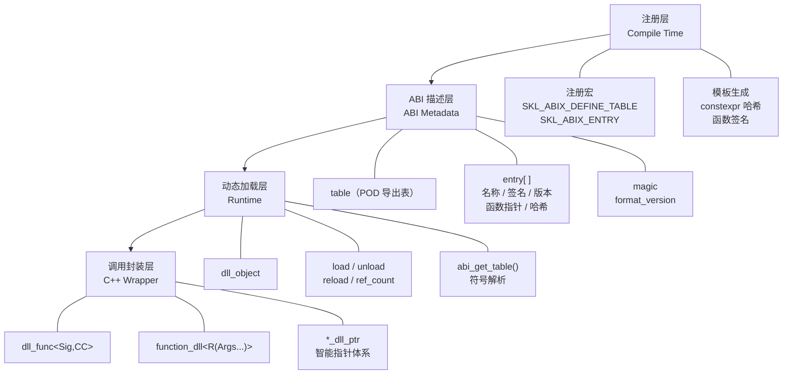

# ABIX API 参考文档

本文档涵盖 ABIX 跨 DLL 函数调用库（`abix/`）。

---

## 架构概览



---

## 1. `config.h` — 平台检测与核心枚举

**命名空间：** `skl::abix`

### 平台宏

| 宏 | 值 | 说明 |
|-------|-------|-------------|
| `SKL_ABIX_WINDOWS` | `1` 或 `0` | Windows 平台检测 |
| `SKL_ABIX_CALL_CDECL` | `__cdecl` 或空 | `__cdecl` 调用约定属性 |
| `SKL_ABIX_CALL_STDCALL` | `__stdcall` 或空 | `__stdcall` 调用约定属性 |
| `SKL_ABIX_DLL_EXPORT` | `__declspec(dllexport)` 或可见性属性 | DLL 导出属性 |
| `SKL_ABIX_NAMESPACE_BEGIN` | — | 打开 `namespace skl { namespace abix {` |
| `SKL_ABIX_NAMESPACE_END` | — | 关闭 `} }` |
| `SKL_ABIX_MAGIC64` | `0xFDFDFDFDFDFDFDFDULL` | 控制块的魔数 |

---

## 2. `type.h` — 核心类型

**命名空间：** `skl::abix`

### 类型别名

| 符号 | 类型 | 说明 |
|--------|------|-------------|
| `sig_t` | `uint64_t` | 函数签名哈希（FNV-1a 64 位） |
| `name_hash_t` | `uint32_t` | 函数名哈希（FNV-1a 32 位） |
| `version_t` | `uint64_t` | 版本令牌（版本字符串的 FNV-1a 哈希） |
| `index_t` | `uint32_t` | 表中条目索引 |

### 常量

| 常量 | 值 | 说明 |
|----------|-------|-------------|
| `SKL_ABIX_TABLE_MAGIC` | `0xAB1E7A81U` | 表魔数，用于校验 |
| `SKL_ABIX_TABLE_FORMAT_VERSION` | `1U` | 表格式版本 |
| `SKL_ABIX_ENTRY_HOT` | `0x1ULL` | 热点条目标志 |

### `entry` — 函数表条目

```cpp
struct entry {
    const char *name;       // 函数名称（以 '\0' 结尾的 C 字符串）
    sig_t sig;              // 编译期签名哈希
    version_t version;      // 版本令牌（0 = 无版本号）
    uintptr_t fnptr;        // 函数指针（uintptr_t 以保证可移植性）
    name_hash_t name_hash;  // 32 位 FNV-1a 名称哈希
    uint32_t flags;         // 位标志（SKL_ABIX_ENTRY_HOT = 0x1）
};
```

### `table` — 导出表

```cpp
struct table {
    uint32_t count;          // 条目数量
    uint32_t magic;          // 必须等于 SKL_ABIX_TABLE_MAGIC
    uint32_t format_version; // 必须等于 SKL_ABIX_TABLE_FORMAT_VERSION
    uint32_t reserved;       // 预留，供未来使用
    const entry *entries;    // 指向条目数组的指针（count 个元素）
};
```

### `make_table()`

```cpp
template<size_t N>
inline const table *make_table(const entry (&arr)[N]) noexcept;
```

从编译期条目数组创建静态 `table`。由 `SKL_ABIX_DEFINE_TABLE` 内部使用。

---

## 3. `register.h` — 注册宏

**命名空间：** `skl::abix`

### 导出表宏

| 宏 | 说明 |
|-------|-------------|
| `SKL_ABIX_DEFINE_TABLE(...)` | 用逗号分隔的 `SKL_ABIX_ENTRY*` 宏列表定义导出表。生成 `abi_get_table()` |
| `SKL_ABIX_ENTRY(name, func)` | 以 `Cdecl` 调用约定和版本 `0` 注册函数 |
| `SKL_ABIX_ENTRY_CC(name, func, cctype)` | 以指定调用约定（`Cdecl` 或 `Stdcall`）注册函数 |
| `SKL_ABIX_ENTRY_FULL(name, func, cctype, ver, flg)` | 以全部参数注册函数：调用约定、版本和标志 |
| `SKL_ABIX_VERSION("1.0")` | 从版本字符串创建版本令牌（FNV-1a 哈希） |

### 调用约定选择器

| 宏 | 展开为 |
|-------|------------|
| `SKL_ABIX_CCPICK(Cdecl)` | `::skl::abix::cc::tag::Cdecl` |
| `SKL_ABIX_CCPICK(Stdcall)` | `::skl::abix::cc::tag::Stdcall` |

### 内存分配

| 函数 | 说明 |
|----------|-------------|
| `abi_alloc(n)` | 分配 `n` 字节（Windows 上使用 `HeapAlloc`，否则使用 `malloc`） |
| `abi_free(p)` | 释放由 `abi_alloc` 分配的内存 |

---

## 4. `obj_dll.h` — DLL 模块包装器

**命名空间：** `skl::abix`

### `call_error` 枚举

| 值 | 说明 |
|-------|-------------|
| `none` | 无错误 |
| `not_loaded` | DLL 未加载 |
| `not_found` | 导出表中未找到函数名 |
| `sig_mismatch` | 签名哈希不匹配 |
| `version_mismatch` | 版本令牌不匹配 |
| `stale_handle` | 存在活跃句柄引用模块时无法卸载 |
| `table_changed` | 句柄解析后表内容已变更 |
| `invalid` | 无效句柄或损坏的闭包 |
| `load_failed` | DLL 加载失败（文件缺失、表损坏等） |
| `unloading` | DLL 正在卸载中（RCU 宽限期） |

### `last_error()`

```cpp
inline call_error &last_error() noexcept;
```

返回线程局部最近错误码的引用。线程安全（每个线程拥有独立的错误状态）。

### `dll_object`

| 方法 | 返回值 | 说明 |
|--------|---------|-------------|
| `load(path)` | `bool` | 加载 DLL/SO，解析 `abi_get_table()`，校验魔数/版本 |
| `unload()` | `bool` | 标记卸载 → 等待 RCU 读者 → 若 `ref_count() == 0` 则卸载；若有活跃句柄则返回 `false` 并设置 `stale_handle` |
| `force_unload()` | `void` | 无条件卸载，忽略引用计数（绕过 RCU，调用者需保证无并发读者） |
| `reload(path)` | `bool` | `force_unload()` + `load(path)` |
| `is_loaded()` | `bool` | 模块当前是否已加载且未处于卸载中 |
| `get_table()` | `const table*` | 获取已校验的导出表指针 |
| `module()` | `module_handle` | 原始操作系统模块句柄（Windows 上为 `HMODULE`，POSIX 上为 `void*`） |
| `ref_count()` | `uint32_t` | 当前活跃句柄数量 |
| `add_ref()` | `void` | 增加引用计数 |
| `release_ref()` | `void` | 减少引用计数 |
| `enter_read()` | `const table*` | 进入 RCU 读侧临界区（委托至全局 `rcu_domain`），返回已验证的导出表指针；若模块未加载或已僵尸则返回 `nullptr` 并设置 `call_error::unloading` |
| `exit_read()` | `void` | 退出 RCU 读侧临界区（委托至全局 `rcu_domain`） |
| `set_timeout_policy(p)` | `void` | 设置 RCU 超时策略（`RCUTimeoutPolicy::Safe` / `ForceUnload` / `ForceLeak`） |
| `timeout_policy()` | `RCUTimeoutPolicy` | 获取当前 RCU 超时策略 |

**使用示例：**
```cpp
dll_object lib;
if (lib.load("my_plugin.dll")) {
    const table *t = lib.get_table();
    // 使用表...
    lib.unload();  // 仅当无活跃句柄且无活跃读者时成功
}
```

### RCU 非阻塞卸载

ABIX 使用全局 **`rcu_domain`**（基于 Epoch-Based Reclamation）实现线程安全 DLL 卸载。`dll_object` 通过 `rcu_domain::instance()` 委托所有读写操作，自身不再维护独立的读者计数器。

**架构：**

| 角色 | 操作 | 说明 |
|------|------|------|
| 读者 | `enter_read()` → `rcu_domain::enter()` | 记录当前全局 epoch，无锁、无竞争 |
| 读者 | `exit_read()` → `rcu_domain::exit()` | 标记本线程为静止态（epoch=0） |
| 写者 | `unload()` → `retire()` + `synchronize()` | 将旧 image 推入 retired 列表 → 等待所有读者通过 → 回收 |
| 写者 | `reload()` → `retire()` + `synchronize()` | 原子交换新旧 image，旧 image 异步回收 |

**设计要点：**

- **全局 EBR 域**：所有 `dll_object` 实例共享同一个 `rcu_domain` 单例，epoch 推进对所有模块生效。
- **线程局部状态**：每个线程首次调用 `enter()` 时自动注册，`exit()` 仅写本地 cache-line，无竞争。
- **Retire 批量化**：`retire()` 在本地累积 64 个对象后才发布到全局列表，减少锁竞争。
- **零 `<atomic>` 依赖**：原子操作使用编译器内建函数，避免跨 STL 实现的 ABI 兼容性问题。
- **`force_unload` / `reload` 绕过 EBR**：这些方法直接调用 `synchronize()` 而非依赖超时策略，但调用者仍需保证无并发读者。

**使用示例：**
```cpp
// 线程 1：读者
auto add = dll_func<int(int, int)>(lib, "add");
int result = add(2, 3);  // operator() 自动调用 enter_read/exit_read

// 线程 2：卸载者
lib.unload();  // retire 旧 image → synchronize → 回收
```

### RCU 超时策略

当 `ABIX_RCU_TIMEOUT_ENABLE` 为 `1`（默认）且 `synchronize()` 中的宽限期超过 `ABIX_RCU_TIMEOUT_MS` 时，应用以下三种策略之一：

| 策略 | 枚举 | 行为 |
|------|------|------|
| **Safe** | `RCUTimeoutPolicy::Safe` | 设置模块为僵尸态（`image_state::zombie`）。DLL 保持加载但不可访问。**绝不崩溃。**（默认） |
| **ForceUnload** | `RCUTimeoutPolicy::ForceUnload` | 绕过 EBR 直接调用 `unload_internal()`。活跃调用者将收到悬空指针——**将崩溃**。 |
| **ForceLeak** | `RCUTimeoutPolicy::ForceLeak` | 摘除模块句柄，DLL 在操作系统中保持加载。需 `#define ABIX_ENABLE_FORCE_LEAK_POLICY`。 |

### `RCUTimeoutConfig`（`rcu_config.h`）

**命名空间：** `skl::abix`

RCU 超时行为的运行时配置，逐实例设置。

| 字段 | 类型 | 默认值 | 说明 |
|------|------|--------|------|
| `timeout_ms` | `uint64_t` | `ABIX_RCU_TIMEOUT_MS` | 超时阈值（毫秒）。0 = 禁用。 |
| `timeout_frames` | `uint64_t` | `ABIX_RCU_TIMEOUT_FRAMES_DEFAULT` (0) | 超时阈值（帧数）。0 = 禁用。 |

**使用模式：**
```cpp
dll_object lib1;                                          // 默认超时
dll_object lib2(RCUTimeoutConfig{3000});                  // 3 秒超时
dll_object lib3(RCUTimeoutConfig{5000, 300});             // 5 秒或 300 帧
```

### 惰性饥饿防护

当无 RCU 卸载进行时，超时检查仅在 `synchronize()` 内部触发。若无新读者到来，时间基线可能过时。饥饿防护通过三个可配置等级防止此问题：

| 等级 | 宏值 | 行为 |
|------|------|------|
| **关闭** | `ABIX_LAZY_STARVATION_GUARD_OFF` (0) | 纯惰性，零开销。接受饥饿风险。 |
| **Tick** | `ABIX_LAZY_STARVATION_GUARD_TICK` (1) | `enter_read()` 调用 `try_passive_check()`——每 30 秒更新 `g_last_check_time`。`abix::tick()` 也会更新它。**（默认）** |
| **空闲线程** | `ABIX_LAZY_STARVATION_GUARD_IDLE` (2) | 与 Tick 相同，外加一个每 30 秒唤醒的后台线程。需 `#define ABIX_ENABLE_IDLE_BACKGROUND_THREAD`。 |

**`abix::tick()` 始终可用。** 启用饥饿防护后，在主循环中调用 `tick()` 可保持时间基线最新，同时为帧数超时截止提供帧计数器。

---

### `rcu_domain`（`rcu_domain.h`）

**命名空间：** `skl::abix`

全局 EBR（Epoch-Based Reclamation）域，为所有 `dll_object` 实例提供线程安全的内存回收。

| 方法 | 返回值 | 说明 |
|------|--------|------|
| `instance()` | `rcu_domain&` | 全局单例 |
| `enter()` | `void` | 进入读侧临界区：记录当前全局 epoch，无锁、无竞争 |
| `exit()` | `void` | 退出读侧临界区：标记本线程为静止态（epoch=0） |
| `retire(obj, reclaim)` | `void` | 将对象加入本地 retired 批次；累积 64 个后自动发布到全局列表 |
| `synchronize()` | `void` | 推进全局 epoch，等待所有线程通过，回收安全对象 |
| `try_collect()` | `void` | 尝试回收：若获取写锁成功，扫描并回收已通过的 retired 对象 |
| `global_epoch()` | `uint64_t` | 诊断用：返回当前全局 epoch 值 |

**设计要点：**

- **线程局部状态**：每个线程首次调用 `enter()` 时在 TLS 中注册 `rcu_thread`，`exit()` 仅写本地 cache-line，零竞争。
- **Retire 批量化**：`BATCH_PUBLISH_SIZE = 64`，本地累积以减少全局锁竞争。
- **Cache-line 隔离**：`_epoch` 结构体与 `_writer_lock` 位于不同 cache line，避免 false sharing。
- **零 `<atomic>` 依赖**：全部使用编译器内建原子操作（`atomic.h`）。

**使用示例：**
```cpp
rcu_domain &domain = rcu_domain::instance();

// 读者
domain.enter();
// ... 安全访问共享数据 ...
domain.exit();

// 写者
domain.retire(old_object, [](void *p) { delete static_cast<MyType *>(p); });
domain.synchronize();
```

### 日志系统（`log.h`）

**命名空间：** `skl::abix`

| 类型 / 函数 | 说明 |
|-------------|------|
| `LogLevel` | 枚举：`Debug`、`Info`、`Warning`、`Error` |
| `log_sink_t` | `void (*)(LogLevel level, const char *message)` — C 回调，ABI 安全 |
| `set_log_sink(sink)` | 设置全局日志接收器。默认：无操作（无输出）。 |
| `log(level, fmt, ...)` | 内部格式化器；通过 `vsnprintf` 格式化到 1KB 缓冲区，然后调用接收器。 |

**宏：**

| 宏 | 生效条件 |
|-------|----------|
| `ABIX_LOG_DEBUG(fmt, ...)` | 除非定义 `ABIX_DISABLE_LOGGING` 或 `ABIX_DISABLE_LOG_LEVEL_DEBUG` |
| `ABIX_LOG_INFO(fmt, ...)` | 除非定义 `ABIX_DISABLE_LOGGING` 或 `ABIX_DISABLE_LOG_LEVEL_INFO` |
| `ABIX_LOG_WARNING(fmt, ...)` | 除非定义 `ABIX_DISABLE_LOGGING` 或 `ABIX_DISABLE_LOG_LEVEL_WARNING` |
| `ABIX_LOG_ERROR(fmt, ...)` | 除非定义 `ABIX_DISABLE_LOGGING` 或 `ABIX_DISABLE_LOG_LEVEL_ERROR` |

---

## 5. `fn_dll.h` — 类型化函数句柄

**命名空间：** `skl::abix`

### `dll_func_cc<C, Sig>`

类型化函数句柄的主模板。模板参数：

- `C` — 调用约定标签（`cc::tag::Cdecl` 或 `cc::tag::Stdcall`）
- `Sig` — 函数签名（例如 `int(int, double)`）

| 方法 | 返回值 | 说明 |
|--------|---------|-------------|
| `resolve(lib, name, ver)` | `void` | 按名称和可选版本解析函数 |
| `valid()` | `bool` | 句柄是否有效且库已加载 |
| `operator bool()` | `bool` | 同 `valid()` |
| `index()` | `index_t` | 表中的条目索引 |
| `library()` | `const dll_object*` | 关联的 DLL 对象 |
| `handle_id()` | `uint64_t` | 不透明句柄 ID（在重载中保持稳定） |
| `raw()` | `fn_type` | 原始函数指针 |
| `operator()(Args...)` | `R` | 以类型安全方式调用函数 |

**`operator()` 的错误行为：**
- 调用 DLL 函数前通过 `try_enter_read()` 进入 RCU 读侧临界区
- 所有退出路径（包括错误路径）均调用 `exit_read()` 退出临界区
- 若 `try_enter_read()` 失败（模块正在卸载）→ 设置 `call_error::unloading`，返回默认 `R{}`
- 若库未加载 → 设置 `call_error::not_loaded`，返回默认 `R{}`
- 若索引越界 → 设置 `call_error::table_changed`，返回默认 `R{}`
- 若条目的签名/名称/哈希已变更 → 设置 `call_error::table_changed`，返回默认 `R{}`
- 若函数指针为空 → 设置 `call_error::invalid`，返回默认 `R{}`

### `dll_func<Sig, C>`

`dll_func_cc` 的便捷别名，默认调用约定为 `Cdecl`：

```cpp
template<typename Sig, cc::tag C = SKL_ABIX_CCPICK(Cdecl)>
class dll_func : public dll_func_cc<C, Sig> { ... };
```

**使用示例：**
```cpp
dll_object lib;
lib.load("math_dll.dll");

// 以默认 Cdecl 解析
auto add = dll_func<int(int, int)>(lib, "add");

// 以显式版本解析
auto log = dll_func<void(const char*)>(lib, "log", SKL_ABIX_VERSION("1.0"));

// 以 stdcall 调用约定解析
auto proc = dll_func<void(int), SKL_ABIX_CCPICK(Stdcall)>(lib, "process");

// 调用
int result = add(2, 3);
if (!add.valid()) {
    // 检查 last_error()
}
```

---

## 6. `fn_sig.h` — 编译期签名哈希

**命名空间：** `skl::abix`

### `fn_sig<Sig, C>`

```cpp
template<typename Sig, cc::tag C = SKL_ABIX_CCPICK(Cdecl)>
struct fn_sig;
```

编译期函数签名哈希生成器。`value` 成员为 `sig_t` 常量。

| 成员 | 类型 | 说明 |
|--------|------|-------------|
| `value` | `constexpr sig_t` | 函数签名唯一 FNV-1a 哈希 |

### `fn_sig_v<Sig, C>`

```cpp
template<typename Sig, cc::tag C = SKL_ABIX_CCPICK(Cdecl)>
inline constexpr sig_t fn_sig_v = fn_sig<Sig, C>::value;
```

`fn_sig::value` 的便捷变量模板。

### `type_sig<T>()`

```cpp
template<typename T>
constexpr sig_t type_sig();
```

返回类型 `T` 的编译期类型签名哈希。去除 cv 限定符并解析引用。

**使用示例：**
```cpp
constexpr sig_t add_sig = fn_sig<int(int, int)>::value;
constexpr sig_t mul_sig = fn_sig_v<double(double, double)>;
constexpr sig_t int_sig = type_sig<int>();
```

---

## 7. `type_sig.h` — 类型签名哈希

**命名空间：** `skl::abix`

### `type_sig_impl<T>`

为 ABIX 智能指针类型和 `function_dll` 特化：

| 类型 | 哈希公式 |
|------|-------------|
| `unique_dll_ptr<T>` | `mix(cstr64("abix::unique_dll_ptr"), type_hash<T>)` |
| `ref_dll_ptr<T>` | `mix(cstr64("abix::ref_dll_ptr"), type_hash<T>)` |
| `view_dll_ptr<T>` | `mix(cstr64("abix::view_dll_ptr"), type_hash<T>)` |
| `shared_dll_ptr<T>` | `mix(cstr64("abix::shared_dll_ptr"), type_hash<T>)` |
| `weak_dll_ptr<T>` | `mix(cstr64("abix::weak_dll_ptr"), type_hash<T>)` |
| `function_dll<R(Args...)>` | 返回类型与所有参数类型的复合哈希 |
| 所有其他类型 | 委托给 `Utils::type_hash<T>()` |

### `SKL_ABIX_TYPE_TAG(T, tag)`

```cpp
#define SKL_ABIX_TYPE_TAG(T, tag) STATIC_TYPE_TAG(T, tag)
```

为用户类型 `T` 注册自定义类型标签，实现稳定的跨编译器类型哈希。

---

## 8. `search.h` — 表查找函数

**命名空间：** `skl::abix`

### `lookup_result` 枚举

| 值 | 说明 |
|-------|-------------|
| `ok` | 找到条目且签名匹配 |
| `not_found` | 未找到该名称的条目 |
| `sig_mismatch` | 找到名称但签名不匹配 |
| `version_mismatch` | 找到名称但版本不匹配 |
| `bad_table` | 无效或损坏的表 |

### `find_index()`

```cpp
inline lookup_result find_index(const table &t, const hash_index &idx, const char *name, sig_t sig, version_t ver, index_t &out) noexcept;
```

根据 `idx` 是否有效自动选择最优查找策略：
- 若 `idx.valid()` → 使用 HashIndex 查找（`find_hash`）
- 否则 → 使用线性扫描（`find_linear`）

### `find_linear()`

```cpp
inline lookup_result find_linear(const table &t, const char *name, sig_t sig, version_t ver, index_t &out) noexcept;
```

全表线性扫描。用于小表（< 64 条目）。

**搜索逻辑：**
1. 校验表魔数
2. 计算 32 位名称哈希（FNV-1a）
3. 线性扫描：匹配名称哈希 → strcmp → 版本检查 → 签名检查
4. 返回 `ok`、`sig_mismatch`、`version_mismatch` 或 `not_found`

### `find_hash()`

```cpp
inline lookup_result find_hash(const table &t, const hash_index &idx, const char *name, sig_t sig, version_t ver, index_t &out) noexcept;
```

开放寻址哈希索引查找。用于大表（≥ 64 条目）。平均 O(1) 时间。

### `lookup_linear()`

```cpp
inline const entry *lookup_linear(const table &t, const char *name, name_hash_t nh, sig_t sig) noexcept;
```

直接线性查找，返回条目指针（或 `nullptr`）。

### `lookup_hash()`

```cpp
inline const entry *lookup_hash(const table &t, const hash_index &idx, const char *name, name_hash_t nh, sig_t sig) noexcept;
```

直接哈希索引查找，返回条目指针（或 `nullptr`）。

### `hash_slot`

```cpp
struct hash_slot {
    name_hash_t hash;
    index_t index;
};
```

哈希索引中的单个槽位。仅存储名称哈希和条目索引——从不复制 `entry` 数据。

### `hash_index`

```cpp
struct hash_index {
    hash_slot *slots;
    uint32_t capacity;
    uint32_t mask;

    bool valid() const noexcept;
    void build(const table &t) noexcept;
    void destroy() noexcept;
};
```

大表的运行时哈希索引。在 DLL 加载时一次性构建。

| 成员 | 类型 | 说明 |
|--------|------|-------------|
| `slots` | `hash_slot*` | 开放寻址槽位数组（容量为 2 的幂次方） |
| `capacity` | `uint32_t` | 槽位总数（始终为 `next_pow2(count * 2)`） |
| `mask` | `uint32_t` | `capacity - 1`，用于快速取模 |

| 方法 | 说明 |
|--------|-------------|
| `valid()` | 哈希索引是否已构建（slots != nullptr） |
| `build(t)` | 从表构建哈希索引。使用线性探测插入所有条目 |
| `destroy()` | 释放槽位数组 |

**设计要点：**
- **负载率 ~50%**：`capacity = next_pow2(count * 2)`
- **开放寻址**：冲突时线性探测 `pos = (pos + 1) & mask`
- **零 ABI 影响**：`hash_index` 为纯运行时元数据；`table` 和 `entry` 结构体保持不变
- **加载时构建**：无运行时初始化竞争，无惰性初始化复杂性

### 常量

| 常量 | 值 | 说明 |
|----------|-------|-------------|
| `HASH_THRESHOLD` | `64` | 少于 64 条目的表使用线性扫描；≥ 64 条目的表使用 HashIndex |
| `HASH_SLOT_EMPTY` | `~index_t{0}` | 空哈希槽位的哨兵值 |

---

## 9. `function.h` — 跨边界闭包

**命名空间：** `skl::abix`

### `function_dll<R(Args...)>`

一个 8 字节（64 位）的闭包类型，用于跨 DLL 边界传递回调。类似于 `std::function`，但使用稳定的 ABI 并通过 `abi_alloc`/`abi_free` 进行手动内存管理。

**设计：**
- `sizeof(function_dll<R(Args...)>)` == 8 字节（在 64 位平台上始终成立）
- 将堆分配的 `closure_base` 指针存储为 `uint64_t` 句柄
- 闭包包含调用/销毁/克隆函数指针
- `SKL_ABIX_CLOSURE_MAGIC` 在调用时校验闭包

**API：**

| 方法 | 返回值 | 说明 |
|--------|---------|-------------|
| `function_dll()` | — | 默认构造函数，空闭包 |
| `function_dll(F f)` | — | 从可调用对象构造（lambda、函数指针等） |
| `function_dll(const&)` | — | 拷贝构造函数（通过克隆处理器深拷贝） |
| `function_dll(&&)` | — | 移动构造函数 |
| `operator=(rhs)` | `function_dll&` | 拷贝并交换赋值 |
| `operator()(Args...)` | `R` | 调用存储的可调用对象 |
| `operator bool()` | `bool` | 闭包中是否包含可调用对象 |
| `empty()` | `bool` | 闭包是否为空 |
| `handle()` | `uint64_t` | 原始句柄值 |
| `swap(other)` | `void` | 交换两个闭包 |

**使用示例：**
```cpp
int captured = 100;
function_dll<void(int)> cb = [captured](int x) {
    printf("捕获值=%d, 参数x=%d, 和=%d\n", captured, x, captured + x);
};

// 传递给 DLL
auto reg = dll_func<void(function_dll<void(int)>)>(lib, "register_callback");
reg(std::move(cb));
```

---

## 10. 智能指针（`dll_ptr/`）

**命名空间：** `skl::abix`

### `unique_handle<T>`

```cpp
template<typename T>
struct unique_handle {
    T *ptr;
    void (*destroy)(T *);
};
```

原始句柄对（指针 + 删除器）。用作智能指针 `release()` 的返回类型。

### `unique_dll_ptr<T>`

独占所有权智能指针。析构时调用 DLL 端删除器。

| 方法 | 返回值 | 说明 |
|--------|---------|-------------|
| `unique_dll_ptr(p, d)` | — | 以指针和删除器函数构造 |
| `reset(p, d)` | `void` | 释放当前并接管新所有权 |
| `release()` | `unique_handle<T>*` | 释放所有权但不销毁 |
| `get()` | `T*` | 原始指针 |
| `operator->()` | `T*` | 指针访问 |
| `operator*()` | `T&` | 解引用 |
| `operator bool()` | `bool` | 是否非空 |

### `fn_deleter<T>`

```cpp
template<typename T>
struct fn_deleter {
    void (*d)(T *) = nullptr;
    void operator()(T *p) const noexcept;
};
```

自定义删除器，用于 `std::unique_ptr<T, fn_deleter<T>>`，包装 DLL 释放函数。

### `ref_dll_ptr<T>`

非原子引用计数共享指针。单线程安全。

| 方法 | 返回值 | 说明 |
|--------|---------|-------------|
| `ref_dll_ptr(p, d)` | — | 以指针和删除器构造 |
| `get()` | `T*` | 原始指针 |
| `operator->()` | `T*` | 指针访问 |
| `operator*()` | `T&` | 解引用 |
| `use_count()` | `uint32_t` | 当前引用计数 |
| `view_count()` | `uint32_t` | 当前视图计数 |
| `try_unique()` | `bool` | `use_count() == 1` 是否成立 |
| `from_unique(uhd)` | `ref_dll_ptr<D>` | 从 `unique_handle` 静态创建 |

### `view_dll_ptr<T>`

`ref_dll_ptr<T>` 的非拥有观察者。不阻止资源销毁。

| 方法 | 返回值 | 说明 |
|--------|---------|-------------|
| `view_dll_ptr()` | — | 默认构造函数，空 |
| `view_dll_ptr(const ref_dll_ptr<T>&)` | — | 从 `ref_dll_ptr` 构造 |
| `alive()` | `bool` | 引用的资源是否仍然存活 |
| `expired()` | `bool` | 资源是否已被销毁 |
| `lock()` | `ref_dll_ptr<T>` | 提升为 `ref_dll_ptr`（若仍存活） |
| `use_count()` | `uint32_t` | 底层资源的当前引用计数 |

### `shared_dll_ptr<T>`

原子引用计数共享指针。线程安全。

| 方法 | 返回值 | 说明 |
|--------|---------|-------------|
| `shared_dll_ptr(p, d)` | — | 以指针和删除器构造 |
| `get()` | `T*` | 原始指针 |
| `use_count()` | `uint32_t` | 当前强引用计数 |
| `weak_count()` | `uint32_t` | 当前弱引用计数 |
| `try_unique()` | `bool` | `use_count() == 1` 是否成立 |
| `from_unique(uhd)` | `shared_dll_ptr<D>` | 从 `unique_handle` 静态创建 |

### `weak_dll_ptr<T>`

`shared_dll_ptr<T>` 的非拥有观察者。不阻止资源销毁。

| 方法 | 返回值 | 说明 |
|--------|---------|-------------|
| `weak_dll_ptr()` | — | 默认构造函数，空 |
| `weak_dll_ptr(const shared_dll_ptr<T>&)` | — | 从 `shared_dll_ptr` 构造 |
| `alive()` | `bool` | 引用的资源是否仍然存活 |
| `expired()` | `bool` | 资源是否已被销毁 |
| `lock()` | `shared_dll_ptr<T>` | 提升为 `shared_dll_ptr`（若仍存活） |
| `use_count()` | `uint32_t` | 底层资源的当前强引用计数 |

---

## 11. `refl.h` — 动态反射集成

**命名空间：** `skl::abix::refl`（反射辅助工具），`skl::abix`（便捷类型）

### 类型别名

| 别名 | 完整类型 | 说明 |
|-------|-----------|-------------|
| `DynamicAny` | `DRefl::Any` | 类型擦除的值容器 |
| `DynamicRegistry` | `DRefl::Registry` | 全局类型注册表单例 |
| `DynamicTypeInfo` | `DRefl::TypeInfo` | 运行时类型描述符 |
| `DynamicFieldAccessor` | `DRefl::FieldAccessor` | 带 getter/setter 的字段访问器 |
| `DynamicFieldInfo` | `DRefl::FieldInfo` | 字段元数据 |

### `make_pod_type_info<T>()`

```cpp
template<typename T>
inline DynamicTypeInfo make_pod_type_info(const char *name);
```

为平凡/POD 类型 `T` 创建 `TypeInfo` 描述符。要求 `std::is_trivial_v<T>`。

### `make_offset_field<T, MemberT, Offset>()`

```cpp
template<typename T, typename MemberT, size_t Offset>
inline DynamicFieldAccessor make_offset_field(const char *name);
```

为 POD 类型中已知字节偏移量的字段创建 `FieldAccessor`。getter 返回 `static_cast<char*>(obj) + Offset`，setter 通过 `reinterpret_cast<MemberT*>` 写入。

### `dll_func_call_any()`

```cpp
template<typename R, typename... Args>
inline DynamicAny dll_func_call_any(dll_func<R(Args...)> &fn, Args... args);
```

包装 `dll_func` 调用并将结果作为 `DynamicAny` 返回。对于 `void` 返回类型，返回空的 `DynamicAny`。

### `any_cast_val<T>()`

```cpp
template<typename T>
inline T any_cast_val(const DynamicAny &a);
```

按值将 `DynamicAny` 转换为 `T`。若转换失败返回 `T{}`。

### `register_dll_table()`

```cpp
inline void register_dll_table(const table *t, const char *dll_name);
```

将 ABIX 导出表中的所有条目注册到动态反射注册表中。

### 编译期反射辅助工具（`refl` 命名空间）

| 符号 | 说明 |
|--------|-------------|
| `fn_entry_tag<Sig, NameHash>` | 将签名哈希和名称哈希配对的标签类型 |
| `has_unique_sigs<TypeList>` | 编译期检查：列表中所有 `fn_entry_tag` 条目的签名是否唯一 |
| `find_by_sig<TypeList, TargetSig>` | 编译期搜索：查找具有匹配 `sig` 的 `fn_entry_tag` 的索引 |

---

## 12. 完整使用示例

```cpp
#include "abix/abix.hpp"

using namespace skl::abix;

// ============================================================
// DLL 端：math_dll.cpp
// ============================================================
extern "C" int add(int a, int b) { return a + b; }
extern "C" double multiply(double a, double b) { return a * b; }
extern "C" const char *get_version() { return "1.0.0"; }

SKL_ABIX_DEFINE_TABLE(
    SKL_ABIX_ENTRY("add", add),
    SKL_ABIX_ENTRY("multiply", multiply),
    SKL_ABIX_ENTRY("get_version", get_version),
)

// ============================================================
// 宿主端
// ============================================================
void host_example() {
    // --- 加载 DLL ---
    dll_object lib;
    if (!lib.load("math_dll.dll")) {
        printf("加载失败：error=%d\n", (int)last_error());
        return;
    }

    // --- 解析类型化函数句柄 ---
    auto add = dll_func<int(int, int)>(lib, "add");
    auto mul = dll_func<double(double, double)>(lib, "multiply");
    auto ver = dll_func<const char *()>(lib, "get_version");

    // --- 以类型安全方式调用 ---
    if (add.valid()) {
        int result = add(10, 20);           // 30
        printf("add(10, 20) = %d\n", result);
    }

    if (mul.valid()) {
        double result = mul(2.5, 4.0);      // 10.0
        printf("multiply(2.5, 4.0) = %.1f\n", result);
    }

    if (ver.valid()) {
        printf("DLL 版本：%s\n", ver());
    }

    // --- 签名不匹配检测 ---
    auto bad = dll_func<void(double)>(lib, "add");  // 签名错误！
    if (!bad.valid()) {
        printf("检测到签名不匹配（error=%d）\n", (int)last_error());
    }

    // --- 版本化函数 ---
    // 在 version_dll.cpp 中：
    //   SKL_ABIX_ENTRY_FULL("log", log_v1, Cdecl, SKL_ABIX_VERSION("1.0"), 0),
    //   SKL_ABIX_ENTRY_FULL("log", log_v2, Cdecl, SKL_ABIX_VERSION("2.0"), 0),
    dll_object vlib;
    vlib.load("version_dll.dll");
    auto log_v1 = dll_func<void(const char *)>(vlib, "log", SKL_ABIX_VERSION("1.0"));
    auto log_v2 = dll_func<void(const char *, int)>(vlib, "log", SKL_ABIX_VERSION("2.0"));
    log_v1("来自 v1 客户端的问候");
    log_v2("来自 v2 客户端的问候", 7);

    // --- 使用智能指针管理资源 ---
    dll_object rlib;
    rlib.load("resource_dll.dll");
    auto create = dll_func<Resource *(int)>(rlib, "create_resource");
    auto destroy = dll_func<void(Resource *)>(rlib, "destroy_resource");

    {
        unique_dll_ptr<Resource> res(create(42), destroy.raw());
        // res 超出作用域时资源自动销毁
    }

    // --- 跨边界回调 ---
    dll_object clib;
    clib.load("callback_dll.dll");
    auto reg = dll_func<void(function_dll<void(int)>)>(clib, "register_callback");

    int captured = 100;
    function_dll<void(int)> cb = [captured](int x) {
        printf("回调：捕获值=%d, 参数x=%d\n", captured, x);
    };
    reg(std::move(cb));

    // --- 热重载 ---
    lib.reload("math_dll_v2.dll");  // 句柄 ID 保持稳定
}
```