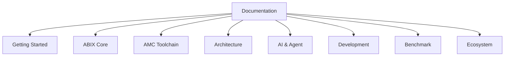

# ABIX Documentation

  <a href="README.md">English</a> · <a href="README_zh.md">中文</a>

> The [project README](README.md) is the entry point. This file navigates the `docs/` tree.

## Choose your path

| I want to … | Go to |
|-------------|-------|
| **install and try ABIX** | [Getting Started](getting-started/) |
| **understand the ABI model** | [ABIX](abix/) |
| **use the AMC toolchain** | [AMC](amc/) |
| **learn internal architecture** | [Architecture](architecture/) |
| **integrate AI / Agent workflows** | [AI](ai/) |
| **see benchmarks and metrics** | [Benchmark](benchmark/) |
| **contribute or understand design** | [Development](development/) |
| **adopt ABIX in a project** | [Ecosystem](ecosystem/) |

---

## Authoritative documents

These live at the repository root and are the sources of truth.

| Document | Answers |
|----------|---------|
| [ABI-SPEC.md](../.agents/ABI-SPEC.md) | what a legal ABIX ABI is |
| [ARCHITECTURE.md](../.agents/ARCHITECTURE.md) | how the system is shaped, and invariants |
| [LANGUAGE-PLUGIN.md](../.agents/LANGUAGE-PLUGIN.md) | how to add a language |
| [AGENTS.md](../.agents/AGENTS.md) | how an AI agent should work here |
| [ROADMAP.md](../.agents/ROADMAP.md) | what is in scope now |
| [CONTRIBUTING.md](../CONTRIBUTING.md) | contribution workflow |

---

## Getting Started

Start here if you are new to ABIX.

| Document | 中文 | Description |
|----------|------|-------------|
| [getting-started.md](getting-started/getting-started.md) | [getting-started_zh.md](getting-started/getting-started_zh.md) | build + first walkthrough |
| [bootstrap.md](getting-started/bootstrap.md) | [bootstrap_zh.md](getting-started/bootstrap_zh.md) | bootstrap model and milestones |
| [self-hosting.md](getting-started/self-hosting.md) | [self-hosting_zh.md](getting-started/self-hosting_zh.md) | bootstrap ABI and the self-description loop |

## ABIX

Core ABI model, format, and API documentation.

| Document | 中文 | Description |
|----------|------|-------------|
| [abix.md](abix/abix.md) | [abix_zh.md](abix/abix_zh.md) | the canonical `.abix` artifact format |
| [abic.md](abix/abic.md) | [abic_zh.md](abix/abic_zh.md) | `.abic.toml` configuration reference |
| [api.md](abix/api.md) | [api_zh.md](abix/api_zh.md) | full C++ API reference |
| [metadata_modes.md](abix/metadata_modes.md) | [metadata_modes_zh.md](abix/metadata_modes_zh.md) | three metadata modes: Debug / Release / RelWithDebInfo |

## AMC

Toolchain documentation.

| Document | 中文 | Description |
|----------|------|-------------|
| [amc.md](amc/amc.md) | [amc_zh.md](amc/amc_zh.md) | the AMC toolchain and CLI |

## Architecture

How ABIX and AMC work internally.

| Document | 中文 | Description |
|----------|------|-------------|
| [architecture.md](architecture/architecture.md) | [architecture_zh.md](architecture/architecture_zh.md) | system overview, design map, invariants |
| [runtime.md](architecture/runtime.md) | [runtime_zh.md](architecture/runtime_zh.md) | runtime responsibilities, registry, execution model |
| [compatibility.md](architecture/compatibility.md) | [compatibility_zh.md](architecture/compatibility_zh.md) | TypeID / LayoutHash / BuildID / MetadataID |
| [elf-inspection.md](architecture/elf-inspection.md) | [elf-inspection_zh.md](architecture/elf-inspection_zh.md) | inspecting ABIX metadata sections in ELF / Mach-O binaries |

## AI

AI and Agent integration.

| Document | 中文 | Description |
|----------|------|-------------|
| [ai.md](ai/ai.md) | [ai_zh.md](ai/ai_zh.md) | ABIX in AI Vibe Coding — theoretical foundation |
| [MCP.md](ai/MCP.md) | [MCP_zh.md](ai/MCP_zh.md) | MCP server and the ABIX tool catalogue |
| [troi.md](ai/troi.md) | [troi_zh.md](ai/troi_zh.md) | TROI token-efficiency metric for AMC/MCP agent workflows |
| [metrics.md](ai/metrics.md) | [metrics_zh.md](ai/metrics_zh.md) | quantitative evaluation framework and metric definitions |

## Benchmark

Quantitative evaluation.

| Document | 中文 | Description |
|----------|------|-------------|
| [benchmark.md](benchmark/benchmark.md) | [benchmark_zh.md](benchmark/benchmark_zh.md) | performance measurements |

## Development

Project design, comparison, and roadmap.

| Document | 中文 | Description |
|----------|------|-------------|
| [design-notes.md](development/design-notes.md) | [design-notes_zh.md](development/design-notes_zh.md) | design principles and project history |
| [competitors.md](development/competitors.md) | [competitors_zh.md](development/competitors_zh.md) | competitive landscape analysis |
| [roadmap.md](development/roadmap.md) | [roadmap_zh.md](development/roadmap_zh.md) | scope and sequencing |

## Ecosystem

Adoption, applications, and sustainability.

| Document | 中文 | Description |
|----------|------|-------------|
| [ecosystem.md](ecosystem/ecosystem.md) | [ecosystem_zh.md](ecosystem/ecosystem_zh.md) | ecosystem, adoption, and application directions |
| [sustainability.md](ecosystem/sustainability.md) | [sustainability_zh.md](ecosystem/sustainability_zh.md) | project sustainability and community funding |
