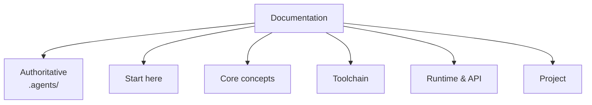

# ABIX Documentation

  <a href="README.md">English</a> · <a href="README_zh.md">中文</a>

> Map of the ABIX documentation. The [project README](../README.md) is the entry point.

## Authoritative documents

These live at the repository root and are the sources of truth.

| Document | Answers |
|----------|---------|
| [ABI-SPEC.md](../.agents/ABI-SPEC.md) | what a legal ABIX ABI is |
| [ARCHITECTURE.md](../.agents/ARCHITECTURE.md) | how the system is shaped, and invariants |
| [LANGUAGE-PLUGIN.md](../.agents/LANGUAGE-PLUGIN.md) | how to add a language |
| [AGENTS.md](../.agents/AGENTS.md) | how an AI agent should work here |
| [ROADMAP.md](../.agents/ROADMAP.md) | what is in scope now |
| [CONTRIBUTING.md](../CONTRIBUTING.md) | contribution workflow |

## Start here

| English | 中文 | Contents |
|---------|------|----------|
| [getting-started.md](getting-started.md) | [getting-started_zh.md](getting-started_zh.md) | build + first walkthrough |
| [abix.md](abix.md) | [abix_zh.md](abix_zh.md) | the canonical `.abix` artifact format |
| [architecture.md](architecture.md) | [architecture_zh.md](architecture_zh.md) | deeper, implementation-oriented architecture |

## Core concepts

| English | 中文 | Contents |
|---------|------|----------|
| [compatibility.md](compatibility.md) | [compatibility_zh.md](compatibility_zh.md) | TypeID / LayoutHash / BuildID / MetadataID |
| [abic.md](abic.md) | [abic_zh.md](abic_zh.md) | `.abic.toml` configuration reference |
| [metadata_modes.md](metadata_modes.md) | [metadata_modes_zh.md](metadata_modes_zh.md) | full artifact / Metadata Region / runtime descriptor |
| [self-hosting.md](self-hosting.md) | [self-hosting_zh.md](self-hosting_zh.md) | bootstrap ABI and the self-description loop |

## Runtime and API

| English | 中文 | Contents |
|---------|------|----------|
| [runtime.md](runtime.md) | [runtime_zh.md](runtime_zh.md) | runtime responsibilities, registry, execution model |
| [api.md](api.md) | [api_zh.md](api_zh.md) | full C++ API reference |
| [benchmark.md](benchmark.md) | [benchmark_zh.md](benchmark_zh.md) | performance measurements |

## Toolchain

| English | 中文 | Contents |
|---------|------|----------|
| [amc.md](amc.md) | [amc_zh.md](amc_zh.md) | the AMC toolchain and CLI |
| [MCP.md](MCP.md) | [MCP_zh.md](MCP_zh.md) | MCP server and the ABIX tool catalogue |
| [troi.md](troi.md) | [troi_zh.md](troi_zh.md) | TROI token-efficiency metric for AMC/MCP agent workflows |
| [elf-inspection.md](elf-inspection.md) | [elf-inspection_zh.md](elf-inspection_zh.md) | inspecting ABIX metadata sections in ELF / Mach-O binaries |

## Project

| English | 中文 | Contents |
|---------|------|----------|
| [design-notes.md](design-notes.md) | [design-notes_zh.md](design-notes_zh.md) | design principles and project history |
| [bootstrap.md](bootstrap.md) | [bootstrap_zh.md](bootstrap_zh.md) | bootstrap model and milestones |
| [ROADMAP.md](../.agents/ROADMAP.md) | [roadmap_zh.md](roadmap_zh.md) | scope and sequencing |

The roadmap is the only pair whose English edition lives outside `docs/`
(`.agents/ROADMAP.md`).
