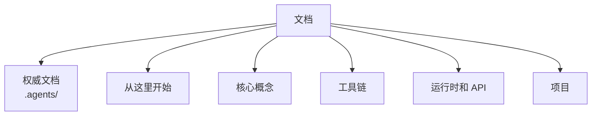

# ABIX 文档

  <a href="README.md">English</a> · <a href="README_zh.md">中文</a>

> ABIX 文档地图。[项目 README](../README_zh.md) 是入口。

## 权威文档

位于仓库根目录，是事实来源。

| 文档 | 回答 |
|------|------|
| [ABI-SPEC.md](../.agents/ABI-SPEC.md) | 合法的 ABIX ABI 是什么 |
| [ARCHITECTURE.md](../.agents/ARCHITECTURE.md) | 系统如何构建，以及不变量 |
| [LANGUAGE-PLUGIN.md](../.agents/LANGUAGE-PLUGIN.md) | 如何添加语言 |
| [AGENTS.md](../.agents/AGENTS.md) | AI Agent 应如何工作 |
| [ROADMAP.md](../.agents/ROADMAP.md) | 当前范围 |
| [CONTRIBUTING.md](../CONTRIBUTING.md) | 贡献工作流 |

## 从这里开始

| 中文 | English | 内容 |
|------|---------|------|
| [getting-started_zh.md](getting-started_zh.md) | [getting-started.md](getting-started.md) | 构建 + 首次演练 |
| [abix_zh.md](abix_zh.md) | [abix.md](abix.md) | 规范的 `.abix` 产物格式 |
| [architecture_zh.md](architecture_zh.md) | [architecture.md](architecture.md) | 更深入的、面向实现的架构 |

## 核心概念

| 中文 | English | 内容 |
|------|---------|------|
| [compatibility_zh.md](compatibility_zh.md) | [compatibility.md](compatibility.md) | TypeID / LayoutHash / BuildID / MetadataID |
| [abic_zh.md](abic_zh.md) | [abic.md](abic.md) | `.abic.toml` 配置参考 |
| [metadata_modes_zh.md](metadata_modes_zh.md) | [metadata_modes.md](metadata_modes.md) | 完整产物 / Metadata Region / 运行时描述符 |
| [self-hosting_zh.md](self-hosting_zh.md) | [self-hosting.md](self-hosting.md) | 引导 ABI 和自描述循环 |

## 运行时和 API

| 中文 | English | 内容 |
|------|---------|------|
| [runtime_zh.md](runtime_zh.md) | [runtime.md](runtime.md) | 运行时职责、注册表、执行模型 |
| [api_zh.md](api_zh.md) | [api.md](api.md) | 完整的 C++ API 参考 |
| [benchmark_zh.md](benchmark_zh.md) | [benchmark.md](benchmark.md) | 性能测量 |

## 工具链

| 中文 | English | 内容 |
|------|---------|------|
| [amc_zh.md](amc_zh.md) | [amc.md](amc.md) | AMC 工具链和 CLI |
| [MCP_zh.md](MCP_zh.md) | [MCP.md](MCP.md) | MCP 服务器和 ABIX 工具目录 |
| [troi_zh.md](troi_zh.md) | [troi.md](troi.md) | AMC/MCP Agent 工作流的 TROI token 效率度量 |
| [elf-inspection_zh.md](elf-inspection_zh.md) | [elf-inspection.md](elf-inspection.md) | 在 ELF / Mach-O 二进制中检查 ABIX 元数据节区 |

## 项目

| 中文 | English | 内容 |
|------|---------|------|
| [design-notes_zh.md](design-notes_zh.md) | [design-notes.md](design-notes.md) | 设计原则和项目历史 |
| [bootstrap_zh.md](bootstrap_zh.md) | [bootstrap.md](bootstrap.md) | 引导模型和里程碑 |
| [roadmap_zh.md](roadmap_zh.md) | [ROADMAP.md](../.agents/ROADMAP.md) | 范围与排期 |

路线图是唯一英文版本位于 `docs/` 之外的文档对（`.agents/ROADMAP.md`）。
