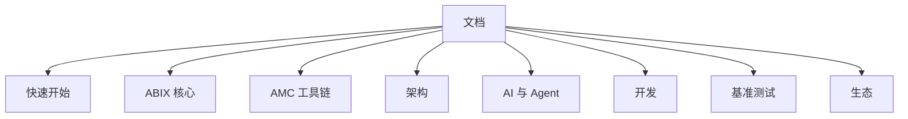

# ABIX 文档

  <a href="README.md">English</a> · <a href="README_zh.md">中文</a>

> [项目 README](README_zh.md) 是入口。本文件导航 `docs/` 目录。

## 选择你的路径

| 我想要 … | 去这里 |
|----------|--------|
| **安装并试用 ABIX** | [快速开始](getting-started/) |
| **理解 ABI 模型** | [ABIX](abix/) |
| **使用 AMC 工具链** | [AMC](amc/) |
| **了解内部架构** | [架构](architecture/) |
| **集成 AI / Agent 工作流** | [AI](ai/) |
| **查看基准测试和指标** | [基准测试](benchmark/) |
| **贡献或了解设计** | [开发](development/) |
| **在项目中采用 ABIX** | [生态](ecosystem/) |

---

## 权威文档

位于仓库根目录，是事实来源。

| 文档 | 回答 |
|------|------|
| [ABI-SPEC.md](../.agents/ABI-SPEC.md) | 合法的 ABIX ABI 是什么 |
| [ARCHITECTURE.md](../.agents/ARCHITECTURE.md) | 系统如何构建，以及不变量 |
| [LANGUAGE-PLUGIN.md](../.agents/LANGUAGE-PLUGIN.md) | 如何添加语言 |
| [AGENTS.md](../.agents/AGENTS.md) | AI Agent 应如何工作 |
| [ROADMAP.md](../.agents/ROADMAP.md) | 当前范围 |
| [CONTRIBUTING.md](../CONTRIBUTING.md) | 贡献工作流 |

---

## 快速开始

如果你是 ABIX 新手，从这里开始。

| 文档 | English | 描述 |
|------|---------|------|
| [getting-started_zh.md](getting-started/getting-started_zh.md) | [getting-started.md](getting-started/getting-started.md) | 构建 + 首次演练 |
| [bootstrap_zh.md](getting-started/bootstrap_zh.md) | [bootstrap.md](getting-started/bootstrap.md) | 引导模型和里程碑 |
| [self-hosting_zh.md](getting-started/self-hosting_zh.md) | [self-hosting.md](getting-started/self-hosting.md) | 引导 ABI 和自描述循环 |

## ABIX

核心 ABI 模型、格式和 API 文档。

| 文档 | English | 描述 |
|------|---------|------|
| [abix_zh.md](abix/abix_zh.md) | [abix.md](abix/abix.md) | 规范的 `.abix` 产物格式 |
| [abic_zh.md](abix/abic_zh.md) | [abic.md](abix/abic.md) | `.abic.toml` 配置参考 |
| [api_zh.md](abix/api_zh.md) | [api.md](abix/api.md) | 完整的 C++ API 参考 |
| [metadata_modes_zh.md](abix/metadata_modes_zh.md) | [metadata_modes.md](abix/metadata_modes.md) | 三种元数据模式：Debug / Release / RelWithDebInfo |

## AMC

工具链文档。

| 文档 | English | 描述 |
|------|---------|------|
| [amc_zh.md](amc/amc_zh.md) | [amc.md](amc/amc.md) | AMC 工具链和 CLI |

## 架构

ABIX 和 AMC 内部工作原理。

| 文档 | English | 描述 |
|------|---------|------|
| [architecture_zh.md](architecture/architecture_zh.md) | [architecture.md](architecture/architecture.md) | 系统概览、设计地图、不变量 |
| [runtime_zh.md](architecture/runtime_zh.md) | [runtime.md](architecture/runtime.md) | 运行时职责、注册表、执行模型 |
| [compatibility_zh.md](architecture/compatibility_zh.md) | [compatibility.md](architecture/compatibility.md) | TypeID / LayoutHash / BuildID / MetadataID |
| [elf-inspection_zh.md](architecture/elf-inspection_zh.md) | [elf-inspection.md](architecture/elf-inspection.md) | 在 ELF / Mach-O 二进制中检查 ABIX 元数据节区 |

## AI

AI 和 Agent 集成。

| 文档 | English | 描述 |
|------|---------|------|
| [ai_zh.md](ai/ai_zh.md) | [ai.md](ai/ai.md) | ABIX 在 AI Vibe Coding 中的作用 — 理论基础 |
| [MCP_zh.md](ai/MCP_zh.md) | [MCP.md](ai/MCP.md) | MCP 服务器和 ABIX 工具目录 |
| [troi_zh.md](ai/troi_zh.md) | [troi.md](ai/troi.md) | AMC/MCP Agent 工作流的 TROI token 效率度量 |
| [metrics_zh.md](ai/metrics_zh.md) | [metrics.md](ai/metrics.md) | 定量评估框架和指标定义 |

## 基准测试

定量评估。

| 文档 | English | 描述 |
|------|---------|------|
| [benchmark_zh.md](benchmark/benchmark_zh.md) | [benchmark.md](benchmark/benchmark.md) | 性能测量 |

## 开发

项目设计、对比和路线图。

| 文档 | English | 描述 |
|------|---------|------|
| [design-notes_zh.md](development/design-notes_zh.md) | [design-notes.md](development/design-notes.md) | 设计原则和项目历史 |
| [type-model_zh.md](development/type-model_zh.md) | [type-model.md](development/type-model.md) | ABI 事实与源语言类型的边界，以及逐 target 生成模型 |
| [competitors_zh.md](development/competitors_zh.md) | [competitors.md](development/competitors.md) | 竞品分析 |
| [roadmap_zh.md](development/roadmap_zh.md) | [roadmap.md](development/roadmap.md) | 范围与排期 |

## 生态

采用、应用和可持续性。

| 文档 | English | 描述 |
|------|---------|------|
| [ecosystem_zh.md](ecosystem/ecosystem_zh.md) | [ecosystem.md](ecosystem/ecosystem.md) | 生态、采用与应用方向 |
| [sustainability_zh.md](ecosystem/sustainability_zh.md) | [sustainability.md](ecosystem/sustainability.md) | 项目可持续性与社区资助 |
