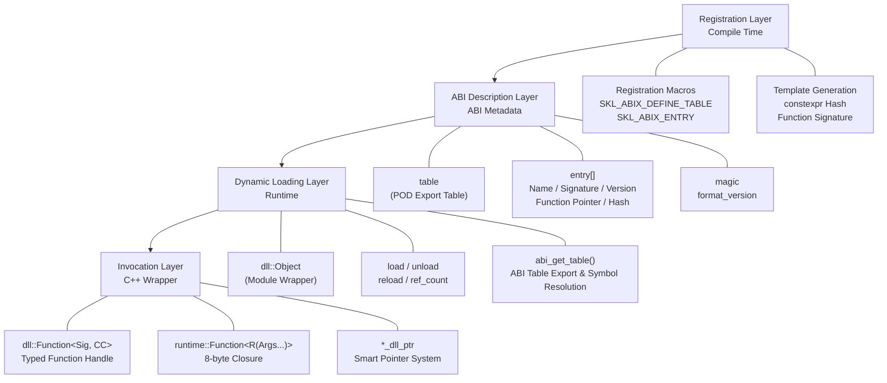

# ABIX API Reference

<p align="center">
  <a href="api_zh.md">中文</a> · English
</p>

<details>

<summary>Contents</summary>

- [Architecture Overview](#architecture-overview)
- [ABI Metadata Runtime and AMC](#abi-metadata-runtime-and-amc)
- [1. `ABIX/Util/Config.h` — Platform Detection & Core Enums](#1-abixutilconfigh--platform-detection--core-enums)
- [2. `ABIX/Runtime/Type.h` — Core Types](#2-abixruntimetypeh--core-types)
- [3. `ABIX/DLL/Export.h` — Registration Macros](#3-abixdllexporth--registration-macros)
- [4. `ABIX/DLL/Object.h` — DLL Module Wrapper](#4-abixdllobjecth--dll-module-wrapper)
- [5. `ABIX/DLL/Function.h` — Typed Function Handles](#5-abixdllfunctionh--typed-function-handles)
- [6. `ABIX/DLL/FnSig.h` — Compile-time Signature Hashing](#6-abixdllfnsigh--compile-time-signature-hashing)
- [7. `ABIX/Runtime/TypeSig.h` — Type Signature Hashing](#7-abixruntimetypesigh--type-signature-hashing)
- [8. `ABIX/Runtime/Search.h` — Table Search Functions](#8-abixruntimesearchh--table-search-functions)
- [9. `ABIX/Runtime/Function.h` — Cross-Boundary Closure](#9-abixruntimefunctionh--cross-boundary-closure)
- [10. Smart Pointers (`ABIX/DLL/DLLPtr.h`)](#10-smart-pointers-abixdlldllptrh)
- [11. `ABIX/Bridge/Refl.h` — Dynamic mics Integration](#11-abixbridgereflh--dynamic-mics-integration)
- [12. Complete Usage Example](#12-complete-usage-example)

</details>

This document covers the ABIX cross-DLL function calling library (`ABIX/`).

## Architecture Overview



## ABI Metadata Runtime and AMC

The POD DLL export table documented below remains ABIX's public call ABI.
AMC metadata is separate from that table: it describes selected native C++ ABI
surfaces in a `.abix` v4 artifact and can project those records as C++17
`constexpr` descriptors. The artifact contains type/layout, field, function,
symbol, hash, compatibility, and map data. Its wire format is documented in
[`.abix` format notes](abix.md).

### Build, inspect, and compare artifacts

```sh
amc build -c package.abic.toml -B build
amc validate build/build/package.abix
amc inspect build/build/package.abix
amc generate build/build/package.abix -l cpp -o package_metadata.hpp
amc diff old.abix new.abix -o compatibility.abix
amc compatibility old.abix new.abix
amc-dump diff old.abix new.abix
amc-dump diff old.abix new.abix --json compatibility.json
```

`amc diff` records identical, layout-compatible, map-compatible, or
incompatible types. The generated `MapPrivate<A, B>` plan performs copy/default
operations; integer and floating conversions require an explicit native
converter and therefore do not silently reinterpret values.

`amc-dump diff` is the human/JSON inspection counterpart: it computes the
same core compatibility report without writing an artifact, and prints both
artifact identities plus compatibility records and Map operations. Plain
`amc-dump` reflects every currently defined `.abix` v4 section, including the
optional compatibility, map, and map-operation sections.

### `runtime::Registry`

Headers: `ABIX/Metadata/Descriptor.h`, `ABIX/Runtime/Registry.h`.

`ModuleDescriptor` is the generated, static view of one metadata module.
`runtime::Registry<Capacity>::register_module()` first validates the entire
module, including type references and duplicate IDs, then registers it
atomically from the caller's perspective. The registry retains canonical
`model::TypeDesc`/`TypeLayout` views alongside generated descriptors.
Registration is keyed by `(TypeID, version)`: a repeated `TypeID` within the
same version must carry an identical `LayoutHash` (Boundary #1), while a later
version may carry a different layout and coexists as its own entry.

| API | Result |
|---|---|
| `register_module(const ModuleDescriptor&)` | `runtime::RegisterStatus`; rejects malformed, duplicate, oversized, or unresolved modules |
| `register_module(const ModuleDescriptor&, uint32_t version)` | Versioned registration; the same `TypeID` may coexist across versions with different layouts |
| `find_by_id(TypeId)` / `find_by_name(const char*)` | Generated `runtime::RegistryEntry`, or `nullptr`; `find_by_id` returns the newest version |
| `find_type(TypeId, uint32_t version)` | Entry for that exact `(TypeID, version)` pair, or `nullptr` |
| `module_version(const ModuleDescriptor&)` / `parse_version(const char*)` | Leading decimal integer of a module version string (`"2.1"` → `2`) |
| `type_of<T>()` | Entry selected by generated `TypeTraits<T>::type_id` |
| `canonical()` | Underlying bounded `metadata::Registry` view |

`type_of<T>()` is intentionally available only for types whose generated header
defines `TypeTraits<T>`. Enable those specializations explicitly:

```cpp
#include "my_native_types.hpp"
#define AMC_GENERATED_DECLARE_NATIVE_TYPE_TRAITS
#include "package_metadata.hpp"

skl::abix::runtime::Registry<128> registry;
if (registry.register_module(amc_generated::amc_module) ==
    skl::abix::runtime::RegisterStatus::ok) {
    const auto *metadata = registry.type_of<my::NativeType>();
    // metadata is non-null after successful registration.
}
```

ABIX Runtime and AMC core metadata are covered by reproducible self-description
tests. This is metadata self-hosting, not C++ compiler-source self-hosting:
AMC's C++ provider continues to depend on Clang/LLVM semantic analysis.

## 1. `ABIX/Util/Config.h` — Platform Detection & Core Enums

**Namespace:** `skl::abix`

### Platform Macros

| Macro | Value | Description |
|-------|-------|-------------|
| `SKL_ABIX_WINDOWS` | `1` or `0` | Windows platform detection |
| `SKL_ABIX_CALL_CDECL` | `__cdecl` or empty | `__cdecl` calling convention attribute |
| `SKL_ABIX_CALL_STDCALL` | `__stdcall` or empty | `__stdcall` calling convention attribute |
| `SKL_ABIX_DLL_EXPORT` | `__declspec(dllexport)` or visibility attribute | DLL export attribute |
| `SKL_ABIX_MAGIC64` | `0xFDFDFDFDFDFDFDFDULL` | Magic number for control blocks |

## 2. `ABIX/Runtime/Type.h` — Core Types

**Namespace:** `skl::abix::runtime`

### Type Aliases

| Symbol | Type | Description |
|--------|------|-------------|
| `sig_t` | `uint64_t` | Function signature hash (FNV-1a 64-bit) |
| `name_hash_t` | `uint32_t` | Function name hash (FNV-1a 32-bit) |
| `version_t` | `uint64_t` | Version token (FNV-1a hash of version string) |
| `index_t` | `uint32_t` | Entry index within the table |

### Constants

| Constant | Value | Description |
|----------|-------|-------------|
| `SKL_ABIX_TABLE_MAGIC` | `0xAB1E7A81U` | Table magic number for validation |
| `SKL_ABIX_TABLE_FORMAT_VERSION` | `1U` | Table format version |
| `SKL_ABIX_ENTRY_HOT` | `0x1ULL` | Hot entry flag |

### `runtime::Entry` — Function Table Entry

```cpp
struct Entry {
    const char *name;       // Function name (null-terminated C string)
    sig_t sig;              // Compile-time signature hash
    version_t version;      // Version token (0 = unversioned)
    uintptr_t fnptr;        // Function pointer (uintptr_t for portability)
    name_hash_t name_hash;  // 32-bit FNV-1a hash of name
    uint32_t flags;         // Bit flags (SKL_ABIX_ENTRY_HOT = 0x1)
};
```

### `runtime::Table` — Export Table

```cpp
struct Table {
    uint32_t count;          // Number of entries
    uint32_t magic;          // Must equal SKL_ABIX_TABLE_MAGIC
    uint32_t format_version; // Must equal SKL_ABIX_TABLE_FORMAT_VERSION
    uint32_t reserved;       // Reserved for future use
    const Entry *entries;    // Pointer to entry array (count elements)
};
```

### `runtime::make_table()`

```cpp
template<size_t N>
inline const Table *make_table(const Entry (&arr)[N]) noexcept;
```

Creates a static `Table` from a compile-time entry array. Used internally by `SKL_ABIX_DEFINE_TABLE`.

## 3. `ABIX/DLL/Export.h` — Registration Macros

**Namespace:** `skl::abix`

### Export Table Macros

| Macro | Description |
|-------|-------------|
| `SKL_ABIX_DEFINE_TABLE(...)` | Define the export table with a comma-separated list of `SKL_ABIX_ENTRY*` macros. Generates `abi_get_table()` |
| `SKL_ABIX_ENTRY(name, func)` | Register a function with `Cdecl` calling convention and version `0` |
| `SKL_ABIX_ENTRY_CC(name, func, cctype)` | Register a function with a specific calling convention (`Cdecl` or `Stdcall`) |
| `SKL_ABIX_ENTRY_FULL(name, func, cctype, ver, flg)` | Register a function with all parameters: calling convention, version, and flags |
| `SKL_ABIX_VERSION("1.0")` | Create a version token from a version string (FNV-1a hash) |

### Calling Convention Pickers

| Macro | Expands To |
|-------|------------|
| `SKL_ABIX_CCPICK(Cdecl)` | `::skl::abix::cc::tag::Cdecl` |
| `SKL_ABIX_CCPICK(Stdcall)` | `::skl::abix::cc::tag::Stdcall` |

### Memory Allocation

Internal allocator, declared in `ABIX/Util/Mem.h` (`skl::abix::mem`):

| Function | Description |
|----------|-------------|
| `mem::alloc(n)` | Allocate `n` bytes (`HeapAlloc` on Windows, `malloc` otherwise) |
| `mem::zalloc(n)` | Zero-initialised allocation |
| `mem::alloc_array(count, elem)` | Overflow-checked array allocation |
| `mem::alloc_aligned(n, align)` | Aligned allocation (pair with `dealloc_aligned`) |
| `mem::dealloc(p)` | Free memory from `alloc` / `zalloc` / `alloc_array` |
| `mem::dealloc_aligned(p)` | Free memory from `alloc_aligned` |

## 4. `ABIX/DLL/Object.h` — DLL Module Wrapper

**Namespace:** `skl::abix::dll`

### `dll::CallError` Enum

| Value | Description |
|-------|-------------|
| `none` | No error |
| `not_loaded` | DLL is not loaded |
| `not_found` | Function name not found in the export table |
| `sig_mismatch` | Signature hash does not match |
| `version_mismatch` | Version token does not match |
| `stale_handle` | Cannot unload while live handles reference the module |
| `table_changed` | Table content changed after handle was resolved |
| `invalid` | Invalid handle or corrupted closure |
| `load_failed` | DLL load failed (missing file, bad table, etc.) |
| `unloading` | DLL is currently unloading (RCU grace period) |

### `last_error()`

```cpp
inline dll::CallError &last_error() noexcept;
```

Returns a reference to the thread-local last error code. Thread-safe (each thread has its own error state).

### `dll::Object`

| Method | Returns | Description |
|--------|---------|-------------|
| `load(path)` | `bool` | Load a DLL/SO, resolve `abi_get_table()`, validate magic/version |
| `unload()` | `bool` | Mark unloading → wait for RCU readers → unload if `ref_count() == 0`; returns `false` and sets `stale_handle` if handles are alive |
| `force_unload()` | `void` | Unload regardless of ref-count (bypasses RCU, caller must ensure no concurrent readers) |
| `reload(path)` | `bool` | `force_unload()` + `load(path)` |
| `is_loaded()` | `bool` | Whether the module is currently loaded and not in the unloading state |
| `get_table()` | `const runtime::Table*` | Get the validated export table pointer |
| `module()` | `module_handle` | Raw OS module handle (`HMODULE` on Windows, `void*` on POSIX) |
| `ref_count()` | `uint32_t` | Number of live `Function` handles (strong refs to the shared Control) |
| `try_enter_read()` | `bool` | Enter RCU read-side critical section with double-checked locking; returns `false` and sets `dll::CallError::unloading` if the module is unloading or zombie |
| `exit_read()` | `void` | Exit RCU read-side critical section (decrements active reader count) |
| `begin_rcu_unload()` | `bool` | Initiate RCU unload: set `_unloading` flag → spin-wait until `_active_readers == 0` or timeout → apply `_timeout_policy`; returns `true` on success |
| `set_timeout_policy(p)` | `void` | Set the RCU timeout policy (`rcu::TimeoutPolicy::Safe` / `ForceUnload` / `ForceLeak`) |
| `timeout_policy()` | `rcu::TimeoutPolicy` | Get the current RCU timeout policy |

**Usage Example:**
```cpp
dll::Object lib;
if (lib.load("my_plugin.dll")) {
    const runtime::Table *t = lib.get_table();
    // Use the table...
    lib.unload();  // Only succeeds if no live handles and no active readers
}
```

### RCU Non-Blocking Unload

ABIX implements RCU (Read-Copy-Update) with epoch-based reclamation (EBR) for thread-safe DLL unloading. The design uses compiler-builtin atomic operations (`_Interlocked*` on Windows, `__atomic_*` on POSIX) to avoid `<atomic>` ABI compatibility issues.

**Architecture:**

| Phase | Write Side (unloader) | Read Side (caller) |
|-------|----------------------|---------------------|
| Mark | `begin_rcu_unload()` sets `_unloading = true` | `try_enter_read()` checks `_unloading` before inc |
| Grace | `wait_for_readers()` spins until `_active_readers == 0` | Active readers hold `_active_readers > 0` |
| Reclaim | `unload_internal()` calls `FreeLibrary`/`dlclose` | `exit_read()` decrements `_active_readers` |

**Design:**

- **_Double-checked locking**: `try_enter_read()` checks `_unloading` before and after incrementing `_active_readers`, preventing the TOCTOU race where a reader detects `_unloading == false` but the unloader sets the flag before the reader increments.
- **_Spin-wait**: `wait_for_readers()` busy-waits. This is appropriate for DLL function calls that are expected to return quickly.
- **_Zero STL dependency**: Atomics operate on plain `bool` and `uint32_t` via compiler builtins — no `<atomic>`, no layout variance across STL implementations.
- **_`force_unload` / `reload` bypass RCU**: These methods directly unload without RCU protection. Callers must guarantee no concurrent readers.

**Usage Example:**
```cpp
// Thread 1: Reader
auto add = dll::Function<int(int, int)>(lib, "add");
int result = add(2, 3);  // operator() auto-calls try_enter_read/exit_read

// Thread 2: Unloader
lib.unload();  // Marks unloading, waits for reader, then unloads
```

### RCU Timeout Policies

When `ABIX_RCU_TIMEOUT_ENABLE` is `1` (default), `wait_for_readers()` periodically checks elapsed time against `ABIX_RCU_TIMEOUT_MS`. If the grace period exceeds the threshold, one of three policies is applied:

| Policy | Enum | Behavior |
|--------|------|----------|
| **Safe** | `rcu::TimeoutPolicy::Safe` | Sets `_zombie = true`, clears `_unloading`. DLL stays loaded but inaccessible. **Never crashes.** (Default) |
| **ForceUnload** | `rcu::TimeoutPolicy::ForceUnload` | Calls `unload_internal()` immediately. Active callers receive dangling pointers — **will crash**. |
| **ForceLeak** | `rcu::TimeoutPolicy::ForceLeak` | Detaches module handle, DLL stays loaded in OS. Requires `#define ABIX_ENABLE_FORCE_LEAK_POLICY`. |

**Zombie lifecycle:**
```
begin_rcu_unload() → timeout → _zombie = true
    ↓
is_loaded() → false      (new callers rejected)
try_enter_read() → false  (sets dll::CallError::unloading)
load() → force_unload zombie → load fresh DLL
~dll::Object() → unload_internal() (force cleanup)
```

### Timeout Check: Dual-Fuel (Time + Frames)

ABIX treats wall-clock time and frame count as two orthogonal fuel sources. Both are always available at runtime — no compile-time mode switch required.

- **Time fuel**: `get_tick_ms()` always returns the system wall-clock. No host cooperation needed.
- **Frame fuel**: `abix::tick(timestamp)` injects frame counts from the host loop. Optional, zero overhead if unused.
- **Deadline check**: `wait_for_readers()` checks both `timeout_ms` AND `timeout_frames` every ~1M spin iterations. Whichever deadline arrives first triggers the timeout.

### `rcu::TimeoutConfig` (`ABIX/RCU/Config.h`)

**Namespace:** `skl::abix::rcu`

Runtime configuration for RCU timeout behavior. Replaces the old compile-time-only `ABIX_RCU_TIMEOUT_MS` macro with per-instance settings.

| Field | Type | Default | Description |
|-------|------|---------|-------------|
| `timeout_ms` | `uint64_t` | `ABIX_RCU_TIMEOUT_MS` | Timeout threshold in milliseconds. Checked against `get_tick_ms()`. 0 = disabled. |
| `timeout_frames` | `uint64_t` | `ABIX_RCU_TIMEOUT_FRAMES_DEFAULT` (0) | Timeout threshold in frames. Checked against `get_tick_frames()`. 0 = disabled. |

**Constructor:**
```cpp
constexpr rcu::TimeoutConfig(
    uint64_t ms = ABIX_RCU_TIMEOUT_MS,
    uint64_t frames = ABIX_RCU_TIMEOUT_FRAMES_DEFAULT
) noexcept;
```

**Usage patterns:**
```cpp
// Scenario 1: pure defaults (macro values used)
dll::Object lib1;

// Scenario 2: explicit timeout, no frames
dll::Object lib2(rcu::TimeoutConfig{3000});

// Scenario 3: game engine — both time and frame thresholds
dll::Object lib3(rcu::TimeoutConfig{5000, 300});  // 5s or 300 frames, whichever triggers first

// Scenario 4: runtime config from file
uint64_t cfg_timeout = app_config.get("plugin_timeout_ms", 5000);
dll::Object lib4(rcu::TimeoutConfig{cfg_timeout});
```

### Lazy Starvation Guard

When no RCU unload is in progress, the timeout check only fires inside `wait_for_readers()`. If no new readers arrive, the time baseline may go stale. The starvation guard prevents this with three configurable levels:

| Level | Macro Value | Behavior |
|-------|-------------|----------|
| **Off** | `ABIX_LAZY_STARVATION_GUARD_OFF` (0) | Pure lazy, zero overhead. Accepts starvation risk. |
| **Tick** | `ABIX_LAZY_STARVATION_GUARD_TICK` (1) | `try_enter_read()` calls `try_passive_check()` — updates `g_last_check_time` every 30s. `abix::tick()` also updates it. **(Default)** |
| **Idle** | `ABIX_LAZY_STARVATION_GUARD_IDLE` (2) | Same as Tick, plus a background thread that wakes every 30s. Requires `#define ABIX_ENABLE_IDLE_BACKGROUND_THREAD`. |

**`abix::tick()` is always available.** When the starvation guard is enabled, calling `tick()` from the main loop keeps the time baseline current without calling `get_tick_ms()` (a system call) on every `try_enter_read()`. It also feeds the frame counter for frame-based timeout deadlines.

### Logging (`ABIX/Util/Log.h`)

**Namespace:** `skl::abix::util`

| Type / Function | Description |
|-----------------|-------------|
| `LogLevel` | Enum: `Debug`, `Info`, `Warning`, `Error` |
| `log_sink_t` | `void (*)(LogLevel level, const char *message)` — C-callback, ABI-safe |
| `set_log_sink(sink)` | Set the global log sink. Default: no-op (no output). |
| `log(level, fmt, ...)` | Internal formatter; formats via `vsnprintf` into a 1KB buffer, then calls the sink. |

**Macros:**

| Macro | When Active |
|-------|------------|
| `ABIX_LOG_DEBUG(fmt, ...)` | Unless `ABIX_DISABLE_LOGGING` or `ABIX_DISABLE_LOG_LEVEL_DEBUG` |
| `ABIX_LOG_INFO(fmt, ...)` | Unless `ABIX_DISABLE_LOGGING` or `ABIX_DISABLE_LOG_LEVEL_INFO` |
| `ABIX_LOG_WARNING(fmt, ...)` | Unless `ABIX_DISABLE_LOGGING` or `ABIX_DISABLE_LOG_LEVEL_WARNING` |
| `ABIX_LOG_ERROR(fmt, ...)` | Unless `ABIX_DISABLE_LOGGING` or `ABIX_DISABLE_LOG_LEVEL_ERROR` |

## 5. `ABIX/DLL/Function.h` — Typed Function Handles

**Namespace:** `skl::abix::dll`

### `dll::FunctionCC<C, Sig>`

The primary template for typed function handles. Template parameters:

- `C` — Calling convention tag (`cc::tag::Cdecl` or `cc::tag::Stdcall`)
- `Sig` — Function signature (e.g., `int(int, double)`)

| Method | Returns | Description |
|--------|---------|-------------|
| `resolve(lib, name, ver)` | `void` | Resolve a function by name and optional version |
| `valid()` | `bool` | Whether the handle is valid and the library is loaded |
| `operator bool()` | `bool` | Same as `valid()` |
| `index()` | `index_t` | Entry index in the table |
| `library()` | `const dll::Object*` | The associated DLL object |
| `handle_id()` | `uint64_t` | Opaque handle ID (stable across reload) |
| `raw()` | `fn_type` | Raw function pointer |
| `operator()(Args...)` | `R` | Call the function with type safety |

**`operator()` behavior:**
- Acquires RCU read-side critical section via `try_enter_read()` before calling the DLL function
- Releases the critical section via `exit_read()` on all exit paths (including error paths)
- If `try_enter_read()` fails (module is unloading) → sets `dll::CallError::unloading`, returns default `R{}`
- If library is not loaded → sets `dll::CallError::not_loaded`, returns default `R{}`
- If index is out of bounds → sets `dll::CallError::table_changed`, returns default `R{}`
- If entry signature/name/hash changed → sets `dll::CallError::table_changed`, returns default `R{}`
- If function pointer is null → sets `dll::CallError::invalid`, returns default `R{}`

### `dll::Function<Sig, C>`

Convenience alias for `dll::FunctionCC` with default calling convention `Cdecl`:

```cpp
template<typename Sig, cc::tag C = SKL_ABIX_CCPICK(Cdecl)>
class dll::Function : public dll::FunctionCC<C, Sig> { ... };
```

**Usage Example:**
```cpp
dll::Object lib;
lib.load("math_dll.dll");

// Resolve with default Cdecl
auto add = dll::Function<int(int, int)>(lib, "add");

// Resolve with explicit version
auto log = dll::Function<void(const char*)>(lib, "log", SKL_ABIX_VERSION("1.0"));

// Resolve with stdcall calling convention
auto proc = dll::Function<void(int), SKL_ABIX_CCPICK(Stdcall)>(lib, "process");

// Call
int result = add(2, 3);
if (!add.valid()) {
    // Check last_error()
}
```

## 6. `ABIX/DLL/FnSig.h` — Compile-time Signature Hashing

**Namespace:** `skl::abix::dll`

### `FnSig<Sig, C>`

```cpp
template<typename Sig, cc::tag C = SKL_ABIX_CCPICK(Cdecl)>
struct FnSig;
```

Compile-time function signature hash generator. The `value` member is a `sig_t` constant.

| Member | Type | Description |
|--------|------|-------------|
| `value` | `constexpr sig_t` | Unique FNV-1a hash of the function signature |

### `FnSigV<Sig, C>`

```cpp
template<typename Sig, cc::tag C = SKL_ABIX_CCPICK(Cdecl)>
inline constexpr auto FnSigV = FnSig<Sig, C>::value;
```

Convenience variable template for `FnSig::value`.

### `type_sig<T>()`

```cpp
template<typename T>
constexpr sig_t type_sig();
```

Returns the compile-time type signature hash for type `T`. Strips cv-qualifiers and resolves references.

**Usage Example:**
```cpp
constexpr sig_t add_sig = FnSig<int(int, int)>::value;
constexpr sig_t mul_sig = FnSigV<double(double, double)>;
constexpr sig_t int_sig = type_sig<int>();
```

## 7. `ABIX/Runtime/TypeSig.h` — Type Signature Hashing

**Namespace:** `skl::abix` (+ `skl::abix::runtime::detail`)

### `TypeSigImpl<T>`

Specialized for ABIX smart pointer types and `runtime::Function`:

| Type | Hash Formula |
|------|-------------|
| `dll::UniquePtr<T>` | `mix(cstr64("abix::dll::UniquePtr"), type_hash<T>)` |
| `dll::RefPtr<T>` | `mix(cstr64("abix::dll::RefPtr"), type_hash<T>)` |
| `dll::ViewPtr<T>` | `mix(cstr64("abix::dll::ViewPtr"), type_hash<T>)` |
| `dll::SharedPtr<T>` | `mix(cstr64("abix::dll::SharedPtr"), type_hash<T>)` |
| `dll::WeakPtr<T>` | `mix(cstr64("abix::dll::WeakPtr"), type_hash<T>)` |
| `runtime::Function<R(Args...)>` | Compound hash of return type and all argument types |
| All other types | Delegates to `Utils::type_hash<T>()` |

### `SKL_ABIX_TYPE_TAG(T, tag)`

```cpp
#define SKL_ABIX_TYPE_TAG(T, tag) STATIC_TYPE_TAG(T, tag)
```

Register a custom type tag for user type `T`, enabling stable cross-compiler type hashing.

## 8. `ABIX/Runtime/Search.h` — Table Search Functions

**Namespace:** `skl::abix::runtime`

### `runtime::LookupResult` Enum

| Value | Description |
|-------|-------------|
| `ok` | Entry found with matching signature |
| `not_found` | No entry with the given name |
| `sig_mismatch` | Name found but signature differs |
| `version_mismatch` | Name found but version differs |
| `bad_table` | Invalid or corrupted table |

### `find_index()`

```cpp
inline runtime::LookupResult find_index(const runtime::Table &t, const runtime::HashIndex &idx, const char *name, runtime::sig_t sig, version_t ver, index_t &out) noexcept;
```

Automatically selects the optimal lookup strategy based on whether `idx` is valid:
- If `idx.valid()` → uses HashIndex lookup (`find_hash`)
- Otherwise → uses linear scan (`find_linear`)

### `find_linear()`

```cpp
inline runtime::LookupResult find_linear(const runtime::Table &t, const char *name, runtime::sig_t sig, version_t ver, index_t &out) noexcept;
```

Full table linear scan. Used for small tables (< 64 entries).

**Search logic:**
1. Validate table magic
2. Compute 32-bit name hash (FNV-1a)
3. Linear scan: match name hash → strcmp → version check → sig check
4. Return `ok`, `sig_mismatch`, `version_mismatch`, or `not_found`

### `find_hash()`

```cpp
inline runtime::LookupResult find_hash(const runtime::Table &t, const runtime::HashIndex &idx, const char *name, runtime::sig_t sig, version_t ver, index_t &out) noexcept;
```

Open-addressing hash index lookup. Used for large tables (≥ 64 entries). O(1) average time.

### `lookup_linear()`

```cpp
inline const runtime::Entry *lookup_linear(const runtime::Table &t, const char *name, name_hash_t nh, runtime::sig_t sig) noexcept;
```

Direct linear lookup returning the entry pointer (or `nullptr`).

### `lookup_hash()`

```cpp
inline const runtime::Entry *lookup_hash(const runtime::Table &t, const runtime::HashIndex &idx, const char *name, name_hash_t nh, runtime::sig_t sig) noexcept;
```

Direct hash index lookup returning the entry pointer (or `nullptr`).

### `runtime::HashSlot`

```cpp
struct HashSlot {
    name_hash_t hash;
    index_t index;
};
```

A single slot in the hash index. Stores only the name hash and entry index — never copies `entry` data.

### `runtime::HashIndex`

```cpp
struct runtime::HashIndex {
    runtime::HashSlot *slots;
    uint32_t capacity;
    uint32_t mask;

    bool valid() const noexcept;
    void build(const runtime::Table &t) noexcept;
    void destroy() noexcept;
};
```

Runtime hash index for large tables. Built once at DLL load time.

| Member | Type | Description |
|--------|------|-------------|
| `slots` | `runtime::HashSlot*` | Open-addressing slot array (power-of-two capacity) |
| `capacity` | `uint32_t` | Total number of slots (always `next_pow2(count * 2)`) |
| `mask` | `uint32_t` | `capacity - 1` for fast modulo |

| Method | Description |
|--------|-------------|
| `valid()` | Whether the hash index has been built (slots != nullptr) |
| `build(t)` | Build the hash index from a table. Inserts all entries with linear probing |
| `destroy()` | Free the slot array |

**Design notes:**
- **Load factor ~50%**: `capacity = next_pow2(count * 2)`
- **Open addressing**: Linear probing `pos = (pos + 1) & mask` on collision
- **Zero ABI impact**: `runtime::HashIndex` is runtime-only metadata; `table` and `entry` structs remain unchanged
- **Built at load time**: No runtime initialization races, no lazy initialization complexity

### Constants

| Constant | Value | Description |
|----------|-------|-------------|
| `SKL_ABIX_HASH_THRESHOLD` | `64` | Tables with fewer entries use linear scan; tables with ≥ 64 entries use HashIndex |
| `SKL_ABIX_HASHSLOT_EMPTY` | `~index_t{0}` | Sentinel value for empty hash slots |

## 9. `ABIX/Runtime/Function.h` — Cross-Boundary Closure

**Namespace:** `skl::abix::runtime`

### `runtime::Function<R(Args...)>`

An 8-byte (64-bit) closure type for passing callbacks across DLL boundaries. Similar to `std::function` but uses a stable ABI with manual memory management via `mem::alloc`/`mem::dealloc`.

**Design:**
- `sizeof(runtime::Function<R(Args...)>)` == 8 bytes (always, on 64-bit platforms)
- Stores a heap-allocated `closure_base` pointer as a `uint64_t` handle
- Closure contains invoke/destroy/clone function pointers
- `SKL_ABIX_CLOSURE_MAGIC` validates the closure at call time

**API:**

| Method | Returns | Description |
|--------|---------|-------------|
| `runtime::Function()` | — | Default constructor, empty |
| `runtime::Function(F f)` | — | Construct from a callable (lambda, function pointer, etc.) |
| `runtime::Function(const&)` | — | Copy constructor (deep copy via clone handler) |
| `runtime::Function(&&)` | — | Move constructor |
| `operator=(rhs)` | `runtime::Function&` | Copy-and-swap assignment |
| `operator()(Args...)` | `R` | Invoke the stored callable |
| `operator bool()` | `bool` | Whether the closure contains a callable |
| `empty()` | `bool` | Whether the closure is empty |
| `handle()` | `uint64_t` | Raw handle value |
| `swap(other)` | `void` | Swap two closures |

**Usage Example:**
```cpp
int captured = 100;
runtime::Function<void(int)> cb = [captured](int x) {
    printf("captured=%d, x=%d, sum=%d\n", captured, x, captured + x);
};

// Pass to DLL
auto reg = dll::Function<void(runtime::Function<void(int)>)>(lib, "register_callback");
reg(std::move(cb));
```

## 10. Smart Pointers (`ABIX/DLL/DLLPtr.h`)

**Namespace:** `skl::abix::dll`

### `dll::UniqueHandle<T>`

```cpp
template<typename T>
struct dll::UniqueHandle {
    T *ptr;
    void (*destroy)(T *);
};
```

Raw handle pair (pointer + deleter). Used as the return type of `release()` on smart pointers.

### `dll::UniquePtr<T>`

Exclusive-ownership smart pointer. Calls the DLL-side deleter on destruction.

| Method | Returns | Description |
|--------|---------|-------------|
| `dll::UniquePtr(p, d)` | — | Construct with pointer and deleter function |
| `reset(p, d)` | `void` | Release current and take new ownership |
| `release()` | `dll::UniqueHandle<T>*` | Release ownership without destroying |
| `get()` | `T*` | Raw pointer |
| `operator->()` | `T*` | Pointer access |
| `operator*()` | `T&` | Dereference |
| `operator bool()` | `bool` | Whether non-null |

### `dll::FnDeleter<T>`

```cpp
template<typename T>
struct dll::FnDeleter {
    void (*d)(T *) = nullptr;
    void operator()(T *p) const noexcept;
};
```

Custom deleter for use with `std::unique_ptr<T, dll::FnDeleter<T>>`, wrapping a DLL destroy function.

### `dll::RefPtr<T>`

Non-atomic reference-counted shared pointer. Single-thread safe.

| Method | Returns | Description |
|--------|---------|-------------|
| `dll::RefPtr(p, d)` | — | Construct with pointer and deleter |
| `get()` | `T*` | Raw pointer |
| `operator->()` | `T*` | Pointer access |
| `operator*()` | `T&` | Dereference |
| `use_count()` | `uint32_t` | Current reference count |
| `view_count()` | `uint32_t` | Current view count |
| `try_unique()` | `bool` | Whether `use_count() == 1` |
| `from_unique(uhd)` | `dll::RefPtr<D>` | Static factory from `dll::UniqueHandle` |

### `dll::ViewPtr<T>`

Non-owning observer for `dll::RefPtr<T>`. Does not prevent resource destruction.

| Method | Returns | Description |
|--------|---------|-------------|
| `dll::ViewPtr()` | — | Default constructor, empty |
| `dll::ViewPtr(const dll::RefPtr<T>&)` | — | Construct from a `dll::RefPtr` |
| `alive()` | `bool` | Whether the referenced resource is still alive |
| `expired()` | `bool` | Whether the resource has been destroyed |
| `lock()` | `dll::RefPtr<T>` | Promote to a `dll::RefPtr` (if alive) |
| `use_count()` | `uint32_t` | Current ref count of the underlying resource |

### `dll::SharedPtr<T>`

Atomic reference-counted shared pointer. Thread-safe.

| Method | Returns | Description |
|--------|---------|-------------|
| `dll::SharedPtr(p, d)` | — | Construct with pointer and deleter |
| `get()` | `T*` | Raw pointer |
| `use_count()` | `uint32_t` | Current strong reference count |
| `weak_count()` | `uint32_t` | Current weak reference count |
| `try_unique()` | `bool` | Whether `use_count() == 1` |
| `from_unique(uhd)` | `dll::SharedPtr<D>` | Static factory from `dll::UniqueHandle` |

### `dll::WeakPtr<T>`

Non-owning observer for `dll::SharedPtr<T>`. Does not prevent resource destruction.

| Method | Returns | Description |
|--------|---------|-------------|
| `dll::WeakPtr()` | — | Default constructor, empty |
| `dll::WeakPtr(const dll::SharedPtr<T>&)` | — | Construct from a `dll::SharedPtr` |
| `alive()` | `bool` | Whether the referenced resource is still alive |
| `expired()` | `bool` | Whether the resource has been destroyed |
| `lock()` | `dll::SharedPtr<T>` | Promote to a `dll::SharedPtr` (if alive) |
| `use_count()` | `uint32_t` | Current strong count of the underlying resource |

## 11. `ABIX/Bridge/Refl.h` — Dynamic mics Integration

**Namespace:** `skl::abix::bridge`

### Type Aliases

| Alias | Full Type | Description |
|-------|-----------|-------------|
| `DynamicAny` | `DRefl::Any` | Type-erased value container |
| `DynamicRegistry` | `DRefl::Registry` | Global type registry singleton |
| `DynamicTypeInfo` | `DRefl::TypeInfo` | Runtime type descriptor |
| `DynamicFieldAccessor` | `DRefl::FieldAccessor` | Field accessor with getter/setter |
| `DynamicFieldInfo` | `DRefl::FieldInfo` | Field metadata |

### `make_pod_type_info<T>()`

```cpp
template<typename T>
inline DynamicTypeInfo make_pod_type_info(const char *name);
```

Creates a `TypeInfo` descriptor for a trivial/POD type `T`. Requires `std::is_trivial_v<T>`.

### `make_offset_field<T, MemberT, Offset>()`

```cpp
template<typename T, typename MemberT, size_t Offset>
inline DynamicFieldAccessor make_offset_field(const char *name);
```

Creates a `FieldAccessor` for a field at a known byte offset within a POD type. The getter returns `static_cast<char*>(obj) + Offset`, and the setter writes through `reinterpret_cast<MemberT*>`.

### `dll_func_call_any()`

```cpp
template<typename R, typename... Args>
inline DynamicAny dll_func_call_any(dll::Function<R(Args...)> &fn, Args... args);
```

Wraps a `dll::Function` call and returns the result as a `DynamicAny`. For `void` return types, returns an empty `DynamicAny`.

### `any_cast_val<T>()`

```cpp
template<typename T>
inline T any_cast_val(const DynamicAny &a);
```

Casts a `DynamicAny` to `T` by value. Returns `T{}` if the cast fails.

### `register_dll_table()`

```cpp
inline void register_dll_table(const runtime::Table *t, const char *dll_name);
```

Registers all entries from an ABIX export table into the dynamic mics registry.

### Compile-time mics Helpers (`bridge` namespace)

| Symbol | Description |
|--------|-------------|
| `FnEntryTag<SigValue, NameHashValue>` | Tag type pairing a signature hash and name hash |
| `HasUniqueSigs<TypeList>` | Compile-time check: all `FnEntryTag` entries in the list have unique signatures |
| `FindBySig<TypeList, TargetSig>` | Compile-time search: find the index of a `FnEntryTag` with matching `sig` |

## 12. Complete Usage Example

```cpp
#include "ABIX/ABIX.h"

using namespace skl::abix;

// ============================================================
// DLL Side: math_dll.cpp
// ============================================================
extern "C" int add(int a, int b) { return a + b; }
extern "C" double multiply(double a, double b) { return a * b; }
extern "C" const char *get_version() { return "1.0.0"; }

SKL_ABIX_DEFINE_TABLE(
    SKL_ABIX_ENTRY("add", add),
    SKL_ABIX_ENTRY("multiply", multiply),
    SKL_ABIX_ENTRY("get_version", get_version),
)

// ============================================================
// Host Side
// ============================================================
void host_example() {
    // --- Load the DLL ---
    dll::Object lib;
    if (!lib.load("math_dll.dll")) {
        printf("Failed to load: error=%d\n", (int)last_error());
        return;
    }

    // --- Resolve typed function handles ---
    auto add = dll::Function<int(int, int)>(lib, "add");
    auto mul = dll::Function<double(double, double)>(lib, "multiply");
    auto ver = dll::Function<const char *()>(lib, "get_version");

    // --- Call with type safety ---
    if (add.valid()) {
        int result = add(10, 20);           // 30
        printf("add(10, 20) = %d\n", result);
    }

    if (mul.valid()) {
        double result = mul(2.5, 4.0);      // 10.0
        printf("multiply(2.5, 4.0) = %.1f\n", result);
    }

    if (ver.valid()) {
        printf("DLL version: %s\n", ver());
    }

    // --- Signature mismatch detection ---
    auto bad = dll::Function<void(double)>(lib, "add");  // Wrong signature!
    if (!bad.valid()) {
        printf("Signature mismatch detected (error=%d)\n", (int)last_error());
    }

    // --- Versioned functions ---
    // In version_dll.cpp:
    //   SKL_ABIX_ENTRY_FULL("log", log_v1, Cdecl, SKL_ABIX_VERSION("1.0"), 0),
    //   SKL_ABIX_ENTRY_FULL("log", log_v2, Cdecl, SKL_ABIX_VERSION("2.0"), 0),
    dll::Object vlib;
    vlib.load("version_dll.dll");
    auto log_v1 = dll::Function<void(const char *)>(vlib, "log", SKL_ABIX_VERSION("1.0"));
    auto log_v2 = dll::Function<void(const char *, int)>(vlib, "log", SKL_ABIX_VERSION("2.0"));
    log_v1("hello from v1 client");
    log_v2("hello from v2 client", 7);

    // --- Resource management with smart pointers ---
    dll::Object rlib;
    rlib.load("resource_dll.dll");
    auto create = dll::Function<Resource *(int)>(rlib, "create_resource");
    auto destroy = dll::Function<void(Resource *)>(rlib, "destroy_resource");

    {
        dll::UniquePtr<Resource> res(create(42), destroy.raw());
        // Resource automatically destroyed when res goes out of scope
    }

    // --- Cross-boundary callback ---
    dll::Object clib;
    clib.load("callback_dll.dll");
    auto reg = dll::Function<void(runtime::Function<void(int)>)>(clib, "register_callback");

    int captured = 100;
    runtime::Function<void(int)> cb = [captured](int x) {
        printf("Callback: captured=%d, x=%d\n", captured, x);
    };
    reg(std::move(cb));

    // --- Hot-reload ---
    lib.reload("math_dll_v2.dll");  // Handle IDs remain stable
}
```
