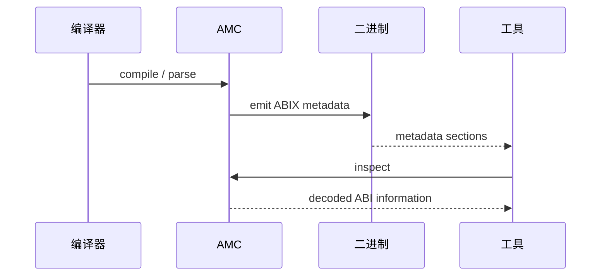
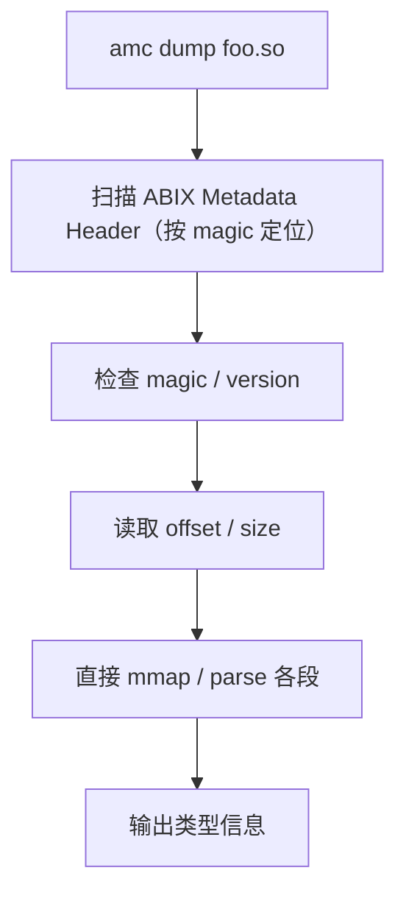
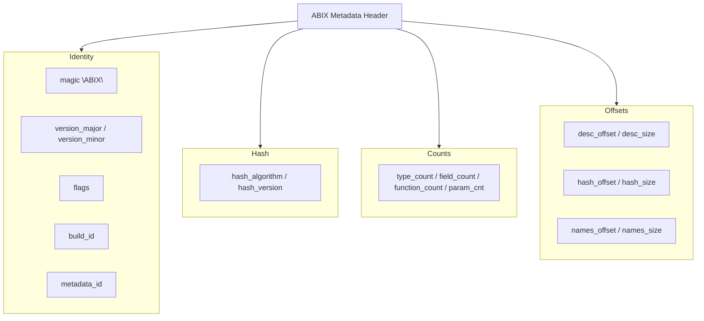

# ABIX Metadata Image 设计

<p align="center">
  中文 · <a href="metadata_modes.md">English</a>
</p>

<details>

<summary>目录</summary>

- [核心目标](#核心目标)
- [四种 ID 的明确区分](#四种-id-的明确区分)
- ["Name 不是 ABI 数据"](#name-不是-abi-数据)
- [三档 Metadata 模式](#三档-metadata-模式)
- [Metadata 生命周期](#metadata-生命周期)
- [独立 Metadata Region](#独立-metadata-region)
- [Metadata Header / Manifest](#metadata-header-manifest)
- [Metadata Region 四段结构](#metadata-region-四段结构)
- [Runtime Descriptor 与 `.abix` Record 分离](#runtime-descriptor-与-abix-record-分离)
- [Linker GC 与 Metadata 裁剪](#linker-gc-与-metadata-裁剪)
- [`.abix` 与 `.abix.meta` 的职责划分](#abix-与-abixmeta-的职责划分)
- [ABIX Symbol Server](#abix-symbol-server)
- [最终架构](#最终架构)
- [七条设计原则](#七条设计原则)
- [操作指南](#操作指南)
- [设计边界](#设计边界)
- [附录：与 DWARF 的对比](#附录与-dwarf-的对比)
- [ABIX 工具链集成：LLDB 与 clangd](#abix-工具链集成lldb-与-clangd)

</details>

## 核心目标

ABIX Metadata 最初面对的问题是：Runtime Descriptor 为了保存完整调试信息，导致每个类型携带 `name`、字段信息、裸指针等大量静态数据，使最终 `.data.rel.ro` / `.rdata` 膨胀。

设计目标因此演变为：

1. **Runtime ABI 数据尽可能小** —— Release 路径只保留契约校验必需的数据
2. **名称等诊断信息不进入 Release Runtime 热路径** —— 名字是符号，不是数据
3. **Metadata 从普通程序数据中独立出来** —— 形成独立的 ABIX Metadata Region
4. **可以被 `amc` 快速扫描** —— 自描述 Header，不依赖 linker symbol
5. **可以从 Release 二进制中剥离** —— 运行时行为不变
6. **可以单独归档为 `.abix`** —— 通过 BuildID 定位
7. **Metadata 本身成为一个稳定、可版本化的二进制格式** —— 跨语言、跨平台

## 四种 ID 的明确区分

ABIX Metadata 体系涉及四种不同职责的 ID：

| ID | 含义 | 用途 |
|----|------|------|
| **TypeID** | 类型语义身份 | 判断"是不是同一个类型" |
| **LayoutHash** | ABI 布局身份 | 判断内存布局是否兼容 |
| **BuildID** | 二进制构建身份 | 找到对应 `.abix` |
| **MetadataID** | Metadata 内容身份 | 完整 Metadata 去重/完整性校验 |

查找链条：

```
Binary
  └── BuildID
        │
        ▼
     xxx.abix
        │
        ├── TypeID ──→ type information
        │             ├── LayoutHash
        │             ├── fields
        │             └── functions
        │
        ├── MetadataID (完整性校验)
        └── ...
```

不能简单 `TypeID → .abix`。TypeID 只回答"这是什么类型"，BuildID 回答"这是哪个具体程序/库"，
MetadataID 回答"这份 Metadata 本身是哪一份内容"。三个维度独立。

## "Name 不是 ABI 数据"

Name 不是 ABI Identity，而是 Diagnostic Identity。

对以下类型：

```cpp
namespace foo { struct Bar {}; }
```

真正参与 ABI 的是：**TypeID**、**LayoutHash**、**size**、**align**、**fields**、**functions**、**parameters**。

而 `"foo::Bar"` 主要用于：调试、crash report、`amc dump`、ABI 分析、人类阅读、symbol server。

所以 Release Runtime 没有必要为了 `registry.find_by_name(...)` 保存字符串。
Release 可以直接 `registry.find_by_id(type_id)`。

## Metadata 生命周期

Metadata 从编译到运行时使用经历三个阶段：



编译期，AMC 从语言 AST 提取 ABI 事实并写入二进制 section（`.abix.metadata`、`.abix.names`）。
离线工具可以直接 mmap 二进制读取 Metadata Region，也可以回调 AMC 获取解码后的视图。
运行时，同一 Region 被 materialize 为 pointer-rich 的 descriptor，供热路径查找使用。

## 三档 Metadata 模式

| 档位 | TypeDescriptor | 字符串位置 | `.abix` 文件 | 典型场景 |
|------|---------------|-----------|-------------|---------|
| **Debug** | 可含 `name` 指针 | 内嵌 `.abix.names` section | 可选生成 | 开发 / 单步调试 |
| **RelWithDebInfo** | 无 `name` | 独立 `.abix` 归档 | 必须归档 | 灰度 / 崩溃分析 |
| **Release** | 无 `name` | 无 | 建议归档 | 线上发布 |

关键性质：
- **RelWithDebInfo 和 Release 的二进制完全一致**，区别仅在 `.abix` 文件是否归档
- **同一份二进制**，strip `.abix.names` 前是含诊断信息，strip 后是纯 release
- **编译一次，两种形态**，可做 differential testing

### Debug

完整 Metadata，`TypeDescriptor` 可含 `name` 指针：

```cpp
struct TypeDescriptor {           // 72 B
    const char *name;             //  8 B  → .abix.names
    Hash128 type_id;              // 16 B
    LayoutHash layout_hash;       // 16 B
    uint32_t flags;               //  4 B
    uint32_t size;                //  4 B
    uint32_t align;               //  4 B
    const FieldDescriptor *fields;//  8 B
    uint32_t field_count;         //  4 B
    // padding                    //  8 B
};
```

Descriptor + `.abix.names` 方便调试器、Runtime Debug API 等直接访问。

### RelWithDebInfo

Runtime 与 Release 相同（56 B Descriptor，无 `name`），但归档了同伴 `.abix`：

```
binary + external xxx.abix
```

用于：crash analysis、ABI debugging、CI 发布归档、symbol server。

### Release

56 B Descriptor，运行时完全不依赖名字字符串：

```cpp
struct TypeDescriptor {           // 56 B
    const FieldDescriptor *fields; //  8 B
    Hash128 type_id;              // 16 B
    LayoutHash layout_hash;       // 16 B
    uint32_t flags;               //  4 B
    uint32_t size;                //  4 B
    uint32_t align;               //  4 B
    uint32_t field_count;         //  4 B
};
```

### Descriptor 压缩结果

| 结构体 | Debug 大小 | Release 大小 | 节省 |
|--------|-----------|-------------|------|
| `TypeDescriptor` | 72 B | 56 B | **22%** |
| `FieldDescriptor` | 32 B | 24 B | **25%** |
| `FunctionDescriptor` | 56 B | 48 B | **14%** |
| `ParameterDescriptor` | 32 B | 24 B | **25%** |
| `SymbolDescriptor` | 24 B | 8 B | **67%** |

500 类型估算：
- 旧方案：≈ 500 × 128 B ≈ **64 KB**
- Release TypeDescriptor：≈ 500 × 56 B ≈ **28 KB**（节省 56%）

## 独立 Metadata Region

即使 Descriptor 已经压缩到 56 B，它们仍然属于普通 ELF/Mach-O/PE 数据区，
混入 `.data.rel.ro` / `.rdata`。因此提出 **ABIX Metadata Region**——把 ABIX 静态
Metadata 从普通程序数据中隔离出来。

### 逻辑结构

```
Executable / Shared Library
│
├── .text
├── .rodata
├── .data
├── .data.rel.ro
│
└── ABIX Metadata Region
     ├── manifest    (必须)
     ├── desc        (必须)
     ├── hash        (可选)
     └── names       (可选、可剥离)
```

具体平台实现：
- **ELF**：`.abix.manifest` / `.abix.desc` / `.abix.hash` / `.abix.names`
- **Mach-O**：`__DATA,__abix_manifest` / `__DATA,__abix_desc` 等
- **PE**：`.abix$m` / `.abix$d` / `.abix$h` / `.abix$n`

> ABIX 规范不绑定 ELF section 名称。`.abix.desc` 是 ELF 实现，不是 ABIX 协议本身。
> 抽象层应称为 **ABIX Metadata Region**。

## Metadata Header / Manifest

自描述的文件头，使 `amc dump` 不依赖 linker symbol：

```cpp
struct MetadataHeader {
    uint32_t magic;              // "ABIX"
    uint16_t version_major;
    uint16_t version_minor;
    uint32_t flags;

    Hash128  build_id;
    Hash128  metadata_id;

    uint32_t hash_algorithm;
    uint32_t hash_version;

    uint32_t type_count;
    uint32_t field_count;
    uint32_t function_count;
    uint32_t parameter_count;

    uint64_t desc_offset;
    uint64_t desc_size;

    uint64_t hash_offset;        // optional
    uint64_t hash_size;

    uint64_t names_offset;       // optional, strippable
    uint64_t names_size;
};
```

有 Header 后，`amc dump foo.so` 的工作流程变成：



不再需要 `__start_abix_desc` / `__stop_abix_desc` 这类 linker symbol 依赖。

## Metadata Region 四段结构

### manifest — 必须



### desc — 必须

所有类型/字段/函数/参数/符号记录的连续数组。

使用 **offset** 而非 **pointer**：

```cpp
// Serialized (.abix / Metadata Region) —— pointer-free
struct TypeRecord {
    uint32_t fields_offset;     // 相对 Metadata base 的偏移
    Hash128  type_id;
    LayoutHash layout_hash;
    uint32_t flags;
    uint32_t size;
    uint32_t align;
    uint32_t field_count;
    uint32_t name_offset;       // → .abix.names string table
};
```

好处：不需要 relocation、不受 ASLR 影响、PIE 友好、shared library 友好、mmap 友好、
offline parser 友好、cross-process 友好、Metadata 可直接复制、`.abix` 可成为稳定格式。

### hash — 可选

Hash index section，加速运行时查找。没有时可以退化为线性扫描（小表）或外部 HashIndex（大表）。

### names — 可选、可剥离

String table 格式，不是 `const char*[]`：

```
.abix.names:
0x0000  "foo::Bar\0"
0x0009  "value\0"
0x000F  "size\0"
```

Descriptor 中保存 `uint32_t name_offset`。这样：
- 没有 `const char*` 指针 → 没有 relocation
- strip `.abix.names` 后 descriptor 语义仍然干净（不留 dangling pointer）
- 可以 mmap 直接访问
- `.abix` 与 Debug metadata 共用同一格式

如果 Debug 中使用 `const char* name` 指向 `.abix.names`，strip `.abix.names` 会留下 dangling pointer——即使运行时不会访问它，数据结构语义上仍然不干净。因此即使 Debug 模式也应使用 `name_offset`，Debug Runtime 在初始化阶段将 offset 转成 pointer 供快速访问。

## Runtime Descriptor 与 `.abix` Record 分离

`TypeDescriptor` 不是 `.abix` 文件格式本身，而是 `.abix` Metadata 在某种 Runtime 中的投影。

```
                ABIX Metadata Specification
                         │
                         ▼
                Serialized Metadata
                   (.abix format)
                         │
             ┌───────────┴───────────┐
             ▼                       ▼
        Runtime Projection       Offline Tool
             │                       │
             ▼                       ▼
    C++ TypeDescriptor           amc dump
    C++ FieldDescriptor          debugger
    C++ FunctionDescriptor       symbol server
             │
             ▼
          ABIX Runtime
```

这样未来 Rust、C、Swift、Python binding 都可以有自己的 Runtime representation。

### 运行时 materialization

Runtime 可以在初始化阶段将 serialized metadata 一次性 materialize 为 pointer-rich 结构：

```
.abix.desc (offset-based)
    │
    ▼  one-time materialization at init
pointer-rich Runtime Descriptor
    │
    ▼  hot path (zero overhead beyond static ABI)
Dynamic ABI Bind
```

动态/复杂成本集中到 bind / initialization 阶段，稳定后的热路径接近纯静态 ABI。

## Linker GC 与 Metadata 裁剪

### 三种候选方案

| 方案 | 描述 | 优缺点 |
|------|------|--------|
| **A. 整体 `.abix.desc`** | 所有 Descriptor 在一个 section，`__start`/`__stop` 遍历 | 简单、Runtime 快、但单个 Type 不容易 linker GC |
| **B. 每 Type 一个 section** | `.abix.type.1234`、`.abix.type.5678` | 可细粒度 GC，但 Runtime enumeration 复杂 |
| **C. 全局 Index** | Index → Type A/B/C，Index 引用了所有 Type | Index 拉回所有 Type，GC 无效 |

### 推荐方案：A + AMC 显式裁剪

```
.abic.toml
    │
    ├── [export]  ← 白名单标注 ABI public surface
    │
    ▼
AMC 生成阶段裁剪（只 emit 需要的 descriptor）
    │
    ▼
.abix.desc（整体 section）
    │
    ▼
Linker 只负责放置和保留
```

**ABIX 的 Metadata ownership 在 AMC，而不是 linker。**

Linker 不知道 TypeDescriptor 是否属于 ABI public surface——AMC 知道。
因此裁剪权不应交给 `KEEP()` / `--gc-sections`，而是前移到 AMC 的生成阶段。

## `.abix` 与 `.abix.meta` 的职责划分

| 文件 | 职责 | 谁消费 |
|------|------|--------|
| `.abix` | 机器可解析的形式 Metadata Artifact：Header + desc + hash + names | Runtime Registry、`amc dump`、debugger |
| `.abix.meta` | CI / Symbol Server / Build 元信息：compiler、target、git_commit、timestamp | 构建系统、符号服务器、human |

**`.abix.meta` 不应该是解析 `.abix` 所必需的文件。** 否则 Metadata 就不再自描述。

`.abix.meta` 示例：

```ini
build_id = "20260315-abcdef"
metadata_id = "abc123def456"
timestamp = 2026-03-15T10:30:00Z
compiler = "Clang 22.0"
compiler_version = "22.0.0"
target = "x86_64-linux-gnu"
git_commit = "a1b2c3d4"
package_version = "1.2.3"
```

## ABIX Symbol Server

该设计带来 ABIX 符号服务器。

```
线上崩溃
    │
    ├── 提取 BuildID
    │
    ├── 查询 ABIX symbol server
    │       │
    │       ▼
    │   拉取对应的 .abix 文件
    │       │
    │       ▼
    │   还原类型名 / 字段名 / 布局
    │
    └── 崩溃栈中的 TypeID → type information
```

与微软 symbol server、Mozilla Tecken 同一模式。hash 是内容寻址的，
同一份 `.abix` artifact 可在多个项目间共享。

## 最终架构

```
                    ┌─────────────────────┐
                    │      .abic          │
                    │  configuration      │
                    └──────────┬──────────┘
                               │
                               ▼
                    ┌─────────────────────┐
                    │        AMC          │
                    │ AST + ABI analysis  │
                    └──────────┬──────────┘
                               │
                               ▼
                    ┌─────────────────────┐
                    │  ABIX Metadata IR   │
                    └──────────┬──────────┘
                               │
             ┌─────────────────┼─────────────────┐
             │                 │                 │
             ▼                 ▼                 ▼
       Runtime Image      Embedded Metadata    .abix
       (C++ Descriptor)   (ABIX Region)       (Standalone)
             │             manifest/desc        │
             │             hash/names      offline debugger
             │                                  amc dump
             ▼                                  symbol server
       ABIX Runtime
             │
             ▼
      Dynamic ABI Bind
             │
             ▼
       Hot Path ≈ Static
```

## 七条设计原则

ABIX Metadata 的设计原则如下：

**① Metadata ≠ Runtime ABI**
Metadata 是描述，Runtime 是使用。两者在结构上分离，在初始化阶段通过 materialization 桥接。

**② Name ∉ ABI Identity**
| 维度 | 代表什么 |
|------|---------|
| TypeID | semantic identity |
| LayoutHash | ABI layout |
| Name | **diagnostic identity** |

**③ Release 不携带诊断字符串**
Release 只保留：TypeID、LayoutHash、Layout、Function。Names → external `.abix`。

**④ Metadata Region 独立于普通 `.data`**
形成独立的 ABIX Metadata Region，不混入 `.data.rel.ro` / `.rdata` / `.rodata`。

**⑤ Serialized Metadata 必须 pointer-free**
`offset + size` 优于绝对指针。无 relocation、ASLR 友好、PIE 友好、mmap 友好。

**⑥ Runtime 可以为速度重新 materialize**
```serialized (offset) → one-time init → pointer-rich → hot path```
兼顾文件稳定性、加载效率、Runtime 性能三者。

**⑦ AMC 负责 Metadata 裁剪**
ABI export policy 在 AMC，不在 linker。linker 只负责放置和保留。

## 操作指南

### 场景一：本地开发（Debug）

```bash
amc build -c my_project.abic.toml -B build/debug
# Debug Runtime 含 name_offset → 初始化时 materialize 为 pointer
# .abix.names section 完整，调试器可直接访问
```

### 场景二：线上发布（Release）

```bash
amc build -c my_project.abic.toml -B build/release
# AMC 生成 Release 模式 C++ projection（56 B Descriptor）
# 确认 strip 后无 .abix.names section
strip --strip-section=.abix.names bin/my_app
readelf -S bin/my_app | grep .abix.names  # 无输出
```

### 场景三：灰度/崩溃分析（RelWithDebInfo）

```bash
amc build -c my_project.abic.toml -B build/relwithdebinfo

# 归档 .abix + .abix.meta 到符号服务器
cp build/relwithdebinfo/build/my_project.abix /symbol-server/releases/v1.2.3/
cp build/relwithdebinfo/build/my_project.abix.meta /symbol-server/releases/v1.2.3/

# 发布与 Release 完全相同的二进制
# 线上崩溃时，用 BuildID + TypeID 查询符号服务器
```

### 验证：strip 前后一致性

```bash
# 1. 编译 Debug 版本
./bin/test_all

# 2. strip 移除 .abix.names
strip --strip-section=.abix.names bin/test_all

# 3. 再次运行同一组测试，行为完全一致
./bin/test_all

# 4. 验证 .abix.names 已被移除
readelf -S bin/test_all | grep -c .abix.names  # 输出 0
```

## 设计边界

### 边界一：`.abix` 文件必须和二进制版本精确对应

Hash 校验能防错配，但前提是**校验真的执行了**。加载期必须做一次 TypeID 集合比对，
不能只信文件存在。BuildID 是配对键。

### 边界二：Release 下不能有"依赖名字"的运行时逻辑

一旦某个热路径依赖 name 字符串，Release 就会出现空指针或占位符。
规则：**名字只在诊断路径使用，诊断路径必须能容忍名字缺失。**

### 边界三：Serialized Metadata 不进 ABI 契约

`TypeRecord`（serialized）和 `TypeDescriptor`（runtime projection）是两种不同的结构。
如果未来需要跨 DLL/so 传递 descriptor，用 `TypeRecord`（固定、offset-based），
不用 `TypeDescriptor`（布局随平台和构建模式变化）。

### 边界四：`.abix` 的归档策略要明确

`.abix` 是正式 Metadata Artifact（机器解析用），`.abix.meta` 是辅助元信息（CI/人类用）。
**解析 `.abix` 绝不能依赖 `.abix.meta`。**

## 附录：与 DWARF 的对比

| 维度 | DWARF | ABIX Metadata |
|------|-------|---------------|
| 定位 | 调试信息格式 | ABI 元数据格式 |
| 可剥离 | 是（`strip` 移除 debug section） | 是（`strip` 移除 `.abix.names`） |
| 运行时依赖 | 不依赖 | 依赖 desc section |
| 名字校验 | DW_AT_name 是字符串，无内建校验 | name_offset → .abix.names，但 TypeID 是强校验 |
| 版本配对 | build ID 可选 | BuildID 是 head 字段 |
| 跨语言 | 只为 C/C++/Fortran | 语言无关 |
| mmap 友好 | 部分（需解析 CU/TU） | 是（offset-based，Header 直接定位） |
| 内容寻址 | 不支持 | MetadataID 天然支持 |

## ABIX 工具链集成：LLDB 与 clangd

LLDB 插件和 clangd 插件不直接重新解析 ABIX Runtime，而是统一建立在
`.abix` Metadata Image / AMC 查询层之上：

```
                         ┌──────────────┐
                         │   .abix      │
                         │  Metadata    │
                         └──────┬───────┘
                                │
                         ABIX Metadata API
                                │
                 ┌──────────────┴──────────────┐
                 │                             │
          ┌──────▼──────┐               ┌──────▼──────┐
          │ LLDB Plugin │               │   clangd    │
          └──────┬──────┘               └──────┬──────┘
                 │                             │
          调试/运行时 ABI                 静态 ABI 分析
```

LLDB 偏 Runtime/Debug，clangd 偏 Source/Static Analysis，
但两者共享同一套 ABIX ABI 语义。

### 共享库分层

不要分别写多套 ABIX Parser：

```
LLDB  └── 自己解析 .abix
clangd└── 自己解析 .abix
AMC   └── 自己解析 .abix
Runtime└── 自己解析 .abix
→ 4 套 Metadata parser、4 套 TypeID 解释、4 套 ABI compatibility logic
```

共享同一份解析层：

```
                 libabix-metadata
                       │
             ┌─────────┼─────────┐
             │         │         │
            AMC      LLDB     clangd
             │         │         │
             └─────────┼─────────┘
                       │
                     .abix
```

建议分层：

| 库 | 职责 |
|----|------|
| `libabix-format` | Header、Record、Offset、Endian、Version、Hash |
| `libabix-metadata` | Type、Field、Function、Parameter、Module |
| `libabix-abi` | TypeID、LayoutHash、ABI comparison、compatibility、diff |
| `libabix-runtime` | Registry、RCU、binding、dispatch、Map |

### LLDB 插件

#### 核心定位：运行时对象 → ABIX Type

LLDB 本身已经知道：
```
process → module → symbol → address
```

ABIX 再提供：
```
address / symbol → FunctionID / TypeID → ABIX Metadata → Type / Layout / Field
```

ABIX LLDB 插件最重要的不是替代 DWARF，而是**把 ABIX 的 ABI 信息接入 LLDB
的类型、符号和内存检查体系**。

#### 四个能力

##### ① ABIX Metadata Loader

程序加载时，LLDB 插件检查 ELF 中的 `.abix` + BuildID，或通过 BuildID 从
symbol server 拉取 `.abix`：

```
libfoo.so
    │
    ├── ELF .abix (embedded)
    │
    └── BuildID → symbol server → foo.abix (external)
            │
            ▼
        ABIXModule {
            BuildID,
            MetadataID,
            MetadataHeader,
            TypeTable,
            FunctionTable,
            ...
        }
```

##### ② `abix` 命令

```
(lldb) abix info
ABIX Module
  Name: libfoo.so
  BuildID: 91a3...
  MetadataID: 72be...
  ABI Version: 1
  Types: 61
  Functions: 37

(lldb) abix type Foo
Type: Foo
TypeID: 0x83f2...
LayoutHash: 0x192a...
size: 32
align: 8
fields:
  +0    int      x
  +8    double   y
  +16   ...

(lldb) abix function foo
foo(int, double)
FunctionID: ...
CallingConvention: SysV
Return: int
Parameters:
  0: int
  1: double
```

> LLDB 不应主要依靠名字寻找类型，而应使用 TypeID。
> 即使不同 namespace 存在同名 `Foo`，TypeID 仍然能准确区分。

##### ③ `abix check` — ABI 兼容性调试

```
(lldb) abix check Foo
ABIX ABI Check

TypeID:      ✓ compatible
Layout:      ✗ incompatible

Expected:    size = 32, align = 8
Actual:      size = 40, align = 8

Field: Foo::bar
  expected offset = 16
  actual offset   = 24
```

这比传统 `ptype Foo` 更适合 ABIX：
- LLDB 传统类型系统关注："这个类型是什么？"
- ABIX 关注："这个类型能不能安全地作为另一个 ABI 类型使用？"

##### ④ `abix verify` — 运行时 ABI Compatibility Debugger

```
(lldb) abix verify
ABIX Compatibility

Host ↔ Plugin
Functions  128/128 compatible
Types       94/97  compatible

Incompatible:
  Foo        LayoutHash mismatch
  Bar        missing field: x
  baz()      calling convention mismatch
```

##### ⑤ `abix cast` — 内存解释

```
(lldb) abix cast 0x12345678 Foo
0x12345678: Foo
+0x00  x = 123
+0x08  y = 3.14
+0x10  ...
```

ABIX Runtime 的 Layout Metadata 与 LLDB 的内存可视化共享同一份数据。

#### LLDB 与 DWARF 的关系

不要把 ABIX 设计为 DWARF 的替代品：

```
                Debugger
                   │
       ┌───────────┴───────────┐
       │                       │
     DWARF                    ABIX
       │                       │
源码级调试                 ABI 级调试
```

| 能力 | DWARF | ABIX |
|------|-------|------|
| 源码行 | ✓ | — |
| 局部变量 | ✓ | — |
| inline | ✓ | — |
| 模板实例化 | ✓ | — |
| TypeID | — | ✓ |
| LayoutHash | — | ✓ |
| ABI compatibility | — | ✓ |
| cross-module types | — | ✓ |
| dynamic binding | — | ✓ |

两者互补，不冲突。

### clangd 插件

#### 核心定位：把 ABIX ABI 语义映射回源码 AST

clangd 的核心世界是 `source code → Clang AST → Semantic Model`。
ABIX 的核心世界是 `source/binary → AMC → .abix`。

clangd 与 AMC 的关系：

```
clangd = interactive analysis
AMC    = authoritative ABI compiler
```

clangd 不应该自己重新生成 `.abix`：

```
clangd → AST → ABIX clangd integration → AMC / libabix-abi → ABI analysis
```

正式构建走 AMC：`source → AMC → .abix`

#### 核心功能

##### ① ABI Compatibility Diagnostics

用户在编辑器中修改类型定义时，实时检测 ABI 是否被破坏：

```cpp
struct Foo {
    int x;
    double y;
};
```

```
clangd:
  warning: ABIX LayoutHash mismatch
  expected: size = 16, align = 8
  current:  size = 24, align = 8
```

从"编译后发现 ABI 崩溃"提前到"编辑代码时发现 ABI 问题"。

##### ② ABIX Semantic Highlighting

```cpp
abix::import<Foo>();  // clangd 区分：local type vs imported ABIX type
```

鼠标悬停：

```
Foo
ABIX Type
TypeID:     83f2...
LayoutHash: 19ab...
size:       32
align:      8
ABI status: ✓ compatible
```

##### ③ Go-to-Definition 接入 ABIX

```cpp
abix::Foo foo;  // Ctrl + Click
```

跳转链路：`ABIX TypeID → .abix → source declaration`

如果 `.abix` 中包含 Source Origin：

```
struct TypeSource {
    uint32_t file_id;
    uint32_t line;
    uint32_t column;
};
```

则可跳回 `include/foo.hpp:42`。Release 可以不包含 Source Origin。

##### ④ ABI Refactoring Detection

```cpp
// 修改前
struct Foo { int x; double y; };

// 修改后
struct Foo { int x; int z; double y; };
```

clangd 实时检测：

```
ABIX ABI BREAK

Foo:
  old LayoutHash: 192a...
  new LayoutHash: 73be...

Reason: field inserted at offset 8

Affected:
  libA
  libB
  pluginC
```

##### ⑤ ABI Code Actions

Quick Fix 菜单：

```
Foo ABI changed

[Generate ABI adapter]    → AMC → Foo_v1 ↔ Foo_v2 adapter
[Update ABI version]      → 版本号更新
[Show ABI diff]           → 详细对比
[Find affected imports]   → 搜索导入此类型的模块
```

`Generate ABI adapter` 可调用 AMC 生成 `abix::adapter<Foo_v1, Foo_v2>`，
形成完整闭环：`clangd → AMC → ABIX adapter`。

### 完整开发体验

```
Foo.hpp → 修改 struct Foo { int x; double y; };

clangd (editing):
  ✓ TypeID unchanged
  ✓ LayoutHash compatible

→ 改成 struct Foo { int x; int z; double y; };

clangd:
  ✗ ABI BREAK
    Foo: size 16 → 24, LayoutHash 19ab → 82fe
    Affected: pluginA, pluginB, libfoo.so
    [Generate Adapter] [Show ABI Diff] [Bump ABI Version]

→ 编译后

lldb:
  (lldb) abix verify
  Host ↔ Plugin
    Functions  128/128 compatible
    Types       94/97  compatible
    Incompatible: Baz LayoutHash mismatch
```

独立、自描述、pointer-free 的 `.abix` Metadata Image 把 Runtime、Compiler、Debugger 和
Static Analyzer 统一起来。BuildID → `.abix` → TypeID → LayoutHash 这条链同时服务 LLDB、
AMC、clangd 以及未来的 MCP/AI Agent。
