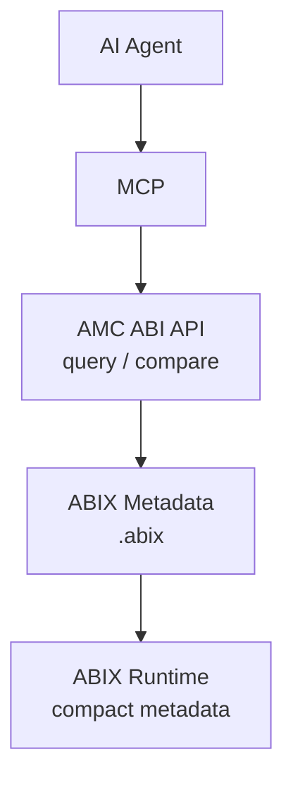
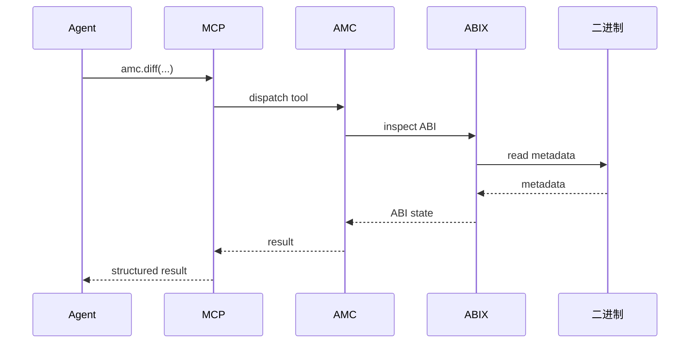
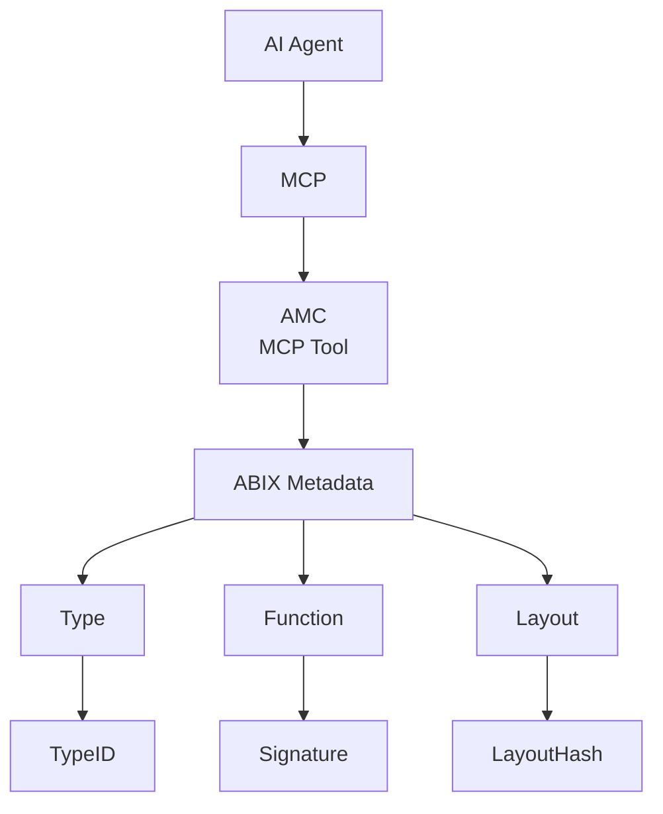

# ABIX MCP：ABI Metadata 作为 AI Agent 的 ABI 信息入口

<p align="center">
  中文 · <a href="MCP.md">English</a>
</p>

<details>

<summary>目录</summary>

- [定位](#定位)
- [`amc-mcp` 原型](#amc-mcp-原型)
- [对 `amc dump` 的简化](#对-amc-dump-的简化)
- [MCP 集成](#mcp-集成)
- [Token 成本](#token-成本)
- [ABIX 作为 Agent 的 "ABI API"](#abix-作为-agent-的-abi-api)
- [外部 `.abix`](#外部-abix)
- [`.abix` 作为 ABI Knowledge Base](#abix-作为-abi-knowledge-base)
- [三层统一入口](#三层统一入口)

</details>

## 定位

独立的 ABIX Metadata Region + 外部 `.abix` 为 AMC 提供了面向机器/AI Agent 的
ABI 信息入口。



## MCP 调用链

Agent 调用 ABIX 工具时，请求经过四层传递：



MCP 是轻量的 JSON-RPC 传输层；所有查询和验证逻辑都驻留在 AMC 中。
Agent 收到结构化 JSON，可直接用于推理。

## `amc-mcp` 原型

`amc-mcp` 在 stdio 上实现 MCP JSON-RPC（newline-delimited），支持
`initialize` / `ping` / `tools/list` / `tools/call`；notification 不产生响应，未知 method
返回 `-32601`，解析失败返回 `-32700`。服务端支持 `2024-11-05` 与 `2025-06-18` 两个
MCP protocol version，并优先采用较新的 `2025-06-18`：`initialize` 时若支持客户端请求的
`protocolVersion` 则原样回显，否则向下协商到所支持的最新优先版本；`serverInfo`
固定返回 `{"name": "amc-mcp", "version": "1.0.0"}`。当前暴露的工具：

| 工具 | 参数 | 说明 |
|------|------|------|
| `abix.get_module` | `module?` | package/target/ABIHash/counts |
| `abix.list_types` | `module?` | 全部类型的 TypeID / LayoutHash / size / align |
| `abix.get_type` | `name`\|`id`, `layout?`, `module?` | 单个类型；`layout` 附字段偏移 |
| `abix.list_functions` | `module?` | 全部函数：签名、返回类型、参数个数 |
| `abix.get_function` | `name`, `module?` | 函数签名、返回类型、参数 |
| `abix.get_layout` | `name`\|`id`, `module?` | 单个类型的内存布局（size/align/字段偏移） |
| `abix.resolve_type` | `name`\|`id`, `module?` | 按名/部分 TypeID 解析出匹配类型 |
| `abix.compare_abi` | `other`, `module?` | 严格 ABI 对比（缺类型/布局变化均算 drift） |
| `abix.compare_types` | `name`, `other`, `module?` | 跨 artifact 比较单个类型 |
| `abix.find_compatible` | `name`, `other?`, `module?` | 跨 artifact 判断单个类型是否兼容；省略 `other` 时在整库内比较 |
| `abix.list_modules` | — | 列出知识库中所有已索引模块 |
| `abix.search_type` | `name`\|`id` | 跨模块搜索类型，按名分组并标注各模块 ABI 是否一致 |

工具复用 AMC 的 query 与 verify 实现，返回
`structuredContent`（结构化 JSON）与 `content[].text`（同一 JSON 的文本形式），
CLI、MCP 与其他消费者因此共享同一实现。运行方式：

```sh
amc-mcp path/to/module.abix        # 以某个 module 作为默认数据源
amc-mcp --list-tools               # 打印工具目录
```

### `abix.get_module` 中的可读名称

`abix.get_module` 返回的 `target` 对象在数值编码之外附带可读名称：

```json
{
  "arch": 0,
  "arch_name": "x86_64",
  "os": 0,
  "os_name": "linux",
  "compiler": 0,
  "compiler_name": "gcc",
  "calling_convention": 0,
  "calling_convention_name": "sysv_abi"
}
```

编码约定：`arch`（0=x86_64、1=aarch64、2=riscv64、…）、`os`（0=linux、1=windows、
2=macos、…）、`compiler`（0=gcc、1=clang、2=msvc、…）、`calling_convention`
（0=sysv_abi、1=ms_abi、2=aapcs、…）。`target.abi` 仍只有数值：该字段没有文档化的
编码，因此不存在对应的名称字段。

这些 `*_name` 字段仅用于诊断展示，绝不参与 ABI identity 与兼容性判定；后者仍由
TypeID / LayoutHash / ABIHash 决定。

### `abix.list_functions`：calling convention 名称

每个函数条目在数值 `calling_convention` 之外新增 `calling_convention_name`，
采用 AMC 的函数级编号：0=unspecified、1=c、2=stdcall、3=fastcall、4=thiscall、
5=aarch64_sve。

### 类型查询参数

`abix.get_type`、`abix.get_layout`、`abix.resolve_type` 与 `abix.search_type`
在 input schema 中正式要求 `name` 与 `id` 二选一（JSON Schema `anyOf`），调用时
必须且只能给出其中一个。

其中 `abix.resolve_type` 与 `abix.search_type` 的 `id` 接受部分 TypeID 前缀
（例如 `0x18da104f`），完整 TypeID 同样有效；`name` 则接受完整名称或名称子串。

### 多模块 ABI 知识库

`amc-mcp` 可一次索引多个 artifact（`.abix` 或带内嵌 Metadata Region 的二进制），
启动时全部加载，于是跨模块查询只是一次 index 遍历，而不是反复解析文件：

```sh
amc-mcp libfoo.abix libbar.abix plugin.so    # 位置参数全部索引
amc-mcp --index libfoo.abix --index plugin.so # 等价写法
```

索引后：

* `abix.list_modules` 列出每个模块的 path / package / ABIHash / counts；
* `abix.search_type "Foo"` 在每个模块里查找匹配类型，按类型名分组，每个分组标注
  `consistent`——该名字的所有出现是否共享同一个 TypeID 与 LayoutHash。这直接回答
  "找出所有实现相同 ABI 的类型"；
* `abix.find_compatible "Foo"`（不带 `other`）以默认模块为源，对整库中其它模块的
  同名类型逐一判定兼容性并汇总；若没有任何其它已索引模块声明所请求的类型，结果会
  携带 `reason` 字段说明这一点。

单模块调用方式不变：只给一个路径时，该模块即默认数据源。

## 对 `amc dump` 的简化

传统方式：`amc dump` 需要做 ELF 解析。

```
.so / executable
    ↓
ELF/Mach-O/PE 解析
    ↓
扫描各种 section
    ↓
定位 Descriptor
    ↓
处理 relocation / pointer
    ↓
解析字符串
```

独立 Metadata 后，`amc dump` 只需要解析 Metadata 自身。

```
binary
   ↓
ABIX Metadata Header（magic 定位）
   ↓
offset + size（自描述）
   ↓
直接 mmap
   ↓
amc dump
```

采用 Header + TypeRecords + FieldRecords + FunctionRecords + **offset-based、pointer-free** 后，
`amc dump` 主要是一个 Metadata parser，而不是 ELF parser。

### 支持的操作

```bash
amc dump libfoo.so           # 从二进制扫描 Metadata Region
amc dump foo.abix            # 从独立 .abix 文件读取
amc dump foo.abix --type Foo           # 查询特定类型
amc dump foo.abix --function bar       # 查询特定函数
amc dump foo.abix --layout Foo         # 查询布局信息
amc query foo.abix "Foo::bar"          # 按名字查询
```

## MCP 集成

该设计面向 MCP：Agent 无需为每次查询让 LLM 阅读数十 MB 的 ELF、头文件或
反编译结果。

### 架构



### 查询接口

```
get_type("Foo")                 → 结构化类型信息
get_function("Foo::bar")        → 函数签名 + ABI 信息
get_layout(type_id)             → 布局详情
find_compatible_type(type_id)   → 兼容类型列表
find_function("create")         → 按名字查找函数
get_module_info()               → 模块元信息
```

返回值为结构化数据（JSON / protobuf），而非大量文本。

## Token 成本

传统方式：让 Agent 阅读 C++ 源码推断 ABI。

```cpp
class Foo {
public:
    virtual void update(
        const std::string& name,
        std::vector<int>& values
    );
private:
    // ...
};
```

Agent 需要从源码中推断：ABI、layout、visibility、calling convention、
parameter type、inheritance、template 实例、实际导出情况。

ABIX 直接给出已经解析好的结果：

```json
{
  "type": "Foo",
  "type_id": "abc123...",
  "layout_hash": "def456...",
  "size": 128,
  "align": 8,
  "functions": [
    {
      "name": "update",
      "signature": "abc789...",
      "abi": "aarch64_linux",
      "parameter_count": 2,
      "parameters": [
        { "type": "const std::string&", "type_id": "..." },
        { "type": "std::vector<int>&", "type_id": "..." }
      ]
    }
  ]
}
```

返回的是经过 AMC 语义归一化后的 ABI 事实，而不是让 AI 自行分析 C++ AST
得到的推断。这一 token 效率收益由 [TROI](troi_zh.md) 指标度量，它面向
AMC 与 MCP 的 Agent 工作流。

## ABIX 作为 Agent 的 "ABI API"

MCP 暴露的是更高层的 ABI 查询 API，而非直接暴露 `read_abix_file()`：

```
abix.get_module()          → 模块基本信息
abix.list_types()          → 类型列表
abix.get_type()            → 单个类型详情
abix.get_layout()          → 布局信息
abix.list_functions()      → 函数列表
abix.get_function()        → 单个函数详情
abix.compare_types()       → 类型比较
abix.compare_abi()         → ABI 兼容性分析
abix.find_compatible()     → 查找兼容类型
abix.resolve_type()        → 按名字/ID 解析类型
```

### 示例：跨 artifact 类型兼容性查询

```
libA.Foo
   ↓
TypeID + LayoutHash
   ↓
libB.Foo
   ↓
TypeID + LayoutHash
   ↓
ABIX compatibility analysis
   ↓
结果：

Semantic type:     compatible
Layout:            compatible
Calling convention: compatible
Fields:            compatible
Functions:         compatible
ABI patch:         possible
```

该查询由 ABIX 在 Metadata 层面完成，无需读取源码。

## 外部 `.abix`

### 生产环境 vs 分析环境的分离

Release：
```
program
├── code
└── compact ABIX Runtime Metadata
```

Debug / AI / 分析环境：
```
program
       │
       └── BuildID
              ↓
          symbol server
              ↓
          foo.abix
              ↓
        MCP / AMC / Debugger
```

Release binary 仅包含最小 Runtime Metadata；分析环境通过 BuildID 关联
`.abix`，从而获得完整 ABI 信息。

## `.abix` 作为 ABI Knowledge Base

多个 `.abix` 文件可以组成一个可索引的 ABI Knowledge Base：

```
ABIX Repository
│
├── libfoo.abix
├── libbar.abix
├── pluginA.abix
└── pluginB.abix
```

MCP 在上面建立索引：

```
TypeID      → Type
FunctionID  → Function
LayoutHash  → Layout
BuildID     → Module
```

### 推理查询示例

- "找出所有实现相同 ABI 的类型"
- "找出 Foo 的兼容版本"
- "这个插件是否兼容当前 Host？"
- "这个 ABI crash 对应哪个类型？"
- "哪个版本改变了 Foo 的 layout？"
- "能不能自动生成 ABIX binding？"

该结构对应 Metadata 到 ABI 知识图谱再到 Agent 推理的路径：

> ABIX Metadata → ABI Knowledge Graph → AI Agent ABI reasoning

## 三层统一入口

"简洁 Runtime Metadata + 独立 Metadata Region + 外部 `.abix`" 同时对应 ABIX
的三个入口：

| 入口 | 消费方式 | 用途 |
|------|---------|------|
| **Runtime** | 高速 ABI lookup | 动态绑定、契约校验 |
| **AMC** | 快速 dump / query / verify / generate | 开发调试、兼容性分析 |
| **AI Agent / MCP** | 结构化 ABI 查询 / 比较 / 推理 / 自动生成 | 智能代码生成、ABI 推理 |

ABIX Metadata 因此也是 ABIX 生态中的机器可读 ABI Interface，而不仅是 Runtime
为动态绑定附带的描述数据。
