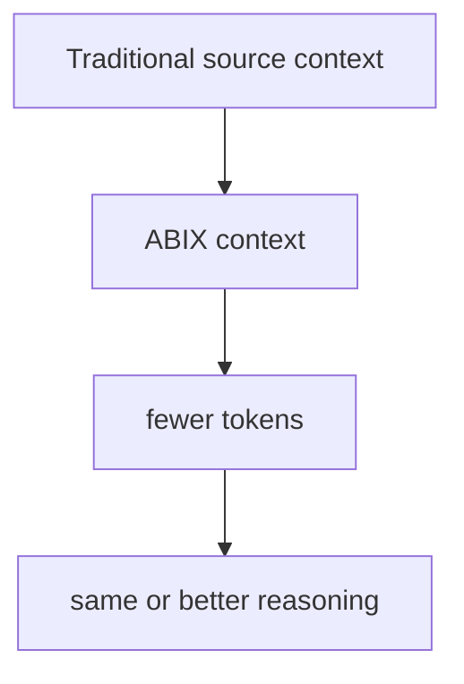
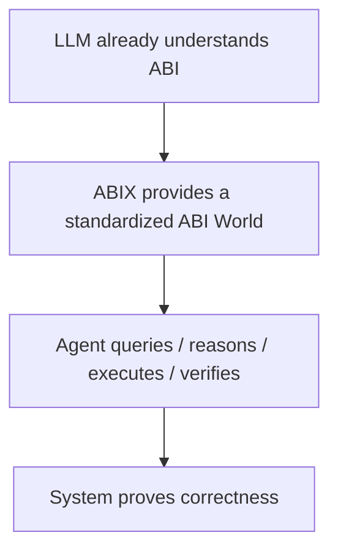
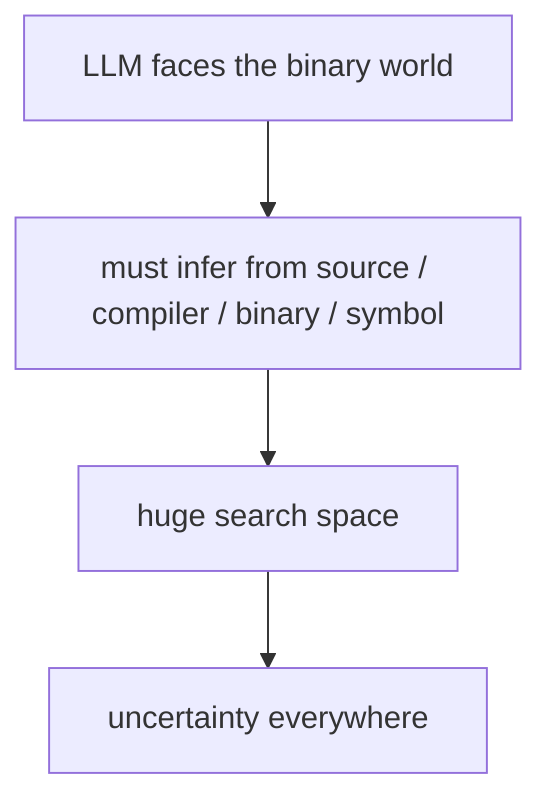
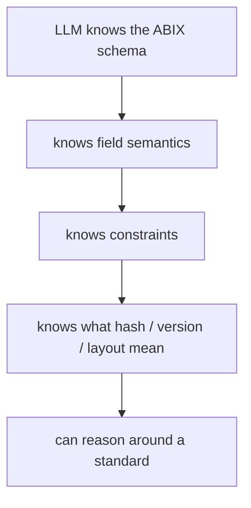
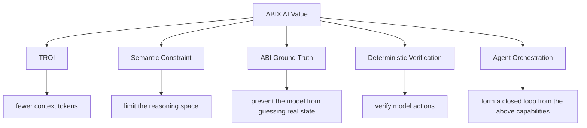
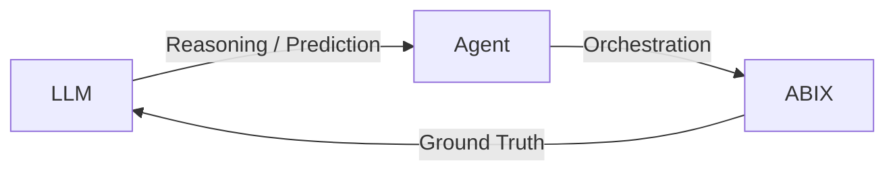
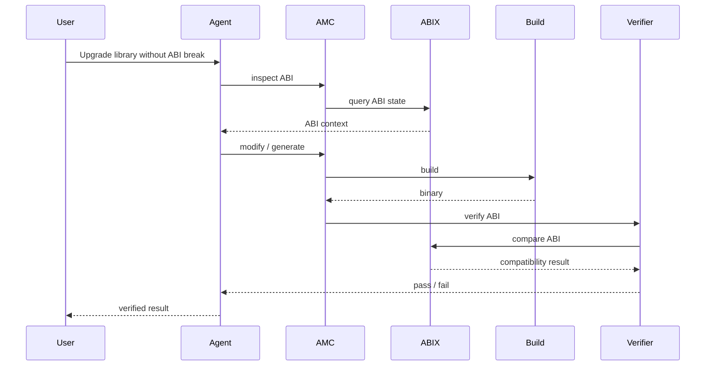
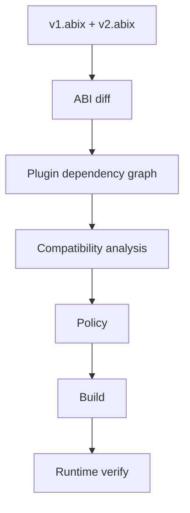
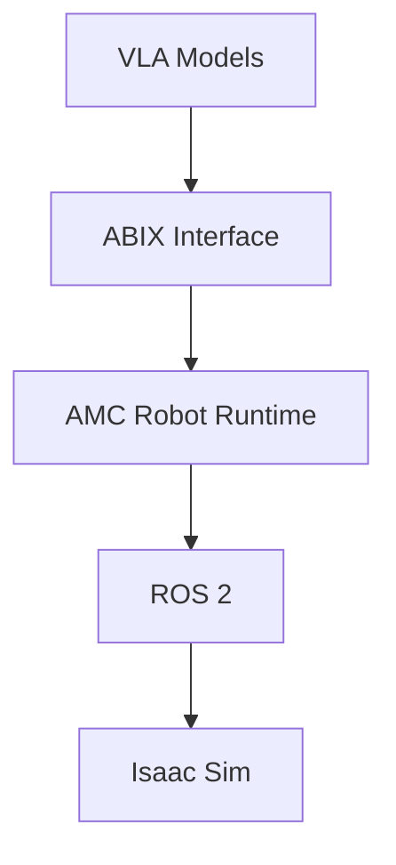

# ABIX in AI Vibe Coding: Standardized Binary Semantics as Ground Truth

<p align="center">
  <a href="ai_zh.md">中文</a> · English
</p>

<details>

<summary>Contents</summary>

- [Core Insight](#core-insight)
- [Two Eras of ABIX AI Value](#two-eras-of-abix-ai-value)
- [ABI Knowledge vs ABI Instance](#abi-knowledge-vs-abi-instance)
- [ABIX as Semantic Constraint](#abix-as-semantic-constraint)
- [The Five-Layer AI Value Model](#the-five-layer-ai-value-model)
- [The Triangle: LLM / Agent / ABIX](#the-triangle-llm--agent--abix)
- [Why ABIX Matters Even When LLMs Know ABI](#why-abix-matters-even-when-llms-know-abi)
- [Robotics Application](#robotics-application)
- [Positioning Statement](#positioning-statement)

</details>

## Core Insight

The AI value of ABIX should not be built on:

> "LLMs don't understand ABI, so we need to teach them."

It should be built on:

> **"Even when LLMs understand ABI, they still need ABIX to turn ABI into a standardized, predictable, verifiable, operable external world."**

Knowing what ABI is and owning a verifiable, instantiable, organized ABI
standard are two different things.

## Two Eras of ABIX AI Value

### Current Era: Token Efficiency



ABIX compresses complex ABI information into a structured,
machine-readable format. The LLM reads less and reasons better.

This is the short-term AI selling point: **TROI (Token ROI)**.

### Mature Era: Ground Truth



ABIX does not disappear when models get smarter. It becomes more
valuable as the **standardized, deterministic, verifiable external
representation** that even a strong LLM needs to operate on real binary
systems.

This is the long-term AI value: **Ground Truth**.

## ABI Knowledge vs ABI Instance

An LLM may know:

```text
ABI
├── calling convention
├── struct layout
├── size / alignment
├── vtable
├── compiler ABI
├── CRT
└── platform ABI
```

It may even infer:

> "This is MSVC x64, so `Widget` probably has this layout."

But real-world ABI is affected by:

```text
compiler × compiler version × target × architecture
× OS × calling convention × packing × language ABI
× CRT × build flags × dependency ABI × version
```

So:

```text
ABI Knowledge  = "How ABI should work."
ABI Instance   = "What this specific .dll/.so actually is right now."
```

These are not the same thing.

## ABIX as Semantic Constraint

Without ABIX:



With ABIX:



ABIX does not替 LLM think. It gives LLM **a set of world rules it can
safely depend on**.

When the model sees:

```
Widget {
    size: 128
    alignment: 8
    abi_hash: ...
    compiler: msvc
    target: x86_64-windows
}
```

It does not need to ask:

> "What does 'size' even mean?"

Or:

> "Which tool defined this metadata?"

It can immediately ask:

> "Is this Widget ABI-compatible with the old version?"

This is **Search Space Constraint** / **Semantic Constraint**: ABIX narrows
the reasoning space so the model can focus on the actual decision.

## The Five-Layer AI Value Model



TROI is only the first layer.

| Layer | Solves | Survives LLM evolution? |
|-------|--------|------------------------|
| TROI | efficiency | weakens as context grows |
| Semantic Constraint | reasoning precision | **strengthens** — more data means tighter constraints needed |
| ABI Ground Truth | factual accuracy | **permanent** — real binary state never changes |
| Deterministic Verification | correctness guarantee | **permanent** — "system proves" beats "model guesses" |
| Agent Orchestration | closed-loop operation | **permanent** — someone must take action |

## The Triangle: LLM / Agent / ABIX



### LLM

```text
reasoning
prediction
planning
generation
```

### ABIX

```text
standard
state
facts
constraints
verification
```

### Agent

```text
resolve
query
combine
execute
verify
recover
```

ABIX defines "what the facts are."
Agent decides "which facts are needed now and how to use them."
LLM reasons over the structured facts.

## Agent Verification Loop

When an agent needs to upgrade a library without breaking ABI, the full
closed-loop looks like this:



This is where TROI, Ground Truth, Agent orchestration and deterministic
verification converge into a single workflow.

## Why ABIX Matters Even When LLMs Know ABI

Example: upgrade `libfoo v1 → v2`, ensure all plugins keep working.

A strong LLM might read all source, headers, CMake, and binary, then
conclude:

> "Looks compatible."

The problem: **"looks like" is not a guarantee.**

An ABIX Agent does:



Then reports:

```
v2:
    Widget ABI compatible
    Renderer ABI compatible
    PluginA compatible
    PluginB incompatible

Reason:
    Widget::Config layout changed

Action:
    generated adapter for PluginB

Verification:
    passed
```

Even if the LLM could read every line of source code, ABIX still
matters. The gap it bridges is:


## Robotics Application

The same principle applies to robotics:



Even when VLA models are extremely capable:

```text
already懂 robots
already懂 action
already懂 ROS
```

They still face:

```text
Robot Plugin
Controller
Sensor
Model
Simulation
Hardware
```

with constantly evolving interfaces.

ABIX standardizes:

```text
RobotState
Observation
Action
Controller
Plugin
```

as verifiable ABI/metadata.

The AI value is not:

> "teaching AI what a robot is."

It is:

> **"giving AI a standardized, operable, verifiable robot software world."**

## Positioning Statement

**ABIX is not an ABI tutorial for LLMs.**

**ABIX is the ABI language that LLMs can safely reason over.**

Or more precisely:

> ABIX does not make AI understand ABI. It makes "what AI understands
> about ABI" into a standardized, deterministic, exchangeable, and
> verifiable external world.

**TROI can be weakened as models evolve. But "standardized binary
semantics + external ground truth + deterministic verification" will not
disappear because LLMs get smarter.**

---

*This document captures the theoretical foundation for ABIX × AI. For the
MCP tool interface, see [MCP.md](MCP.md). For the token-efficiency metric,
see [troi.md](troi.md). For the Agent architecture, see
**AGENT.md** (planned).*
