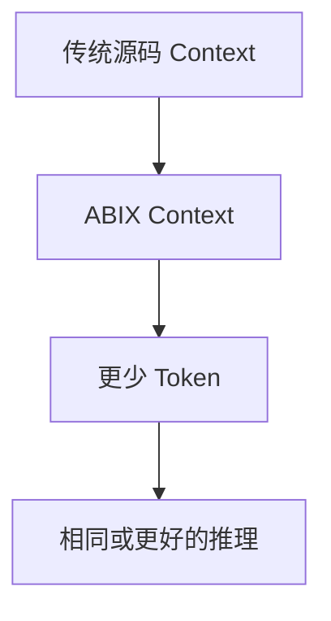
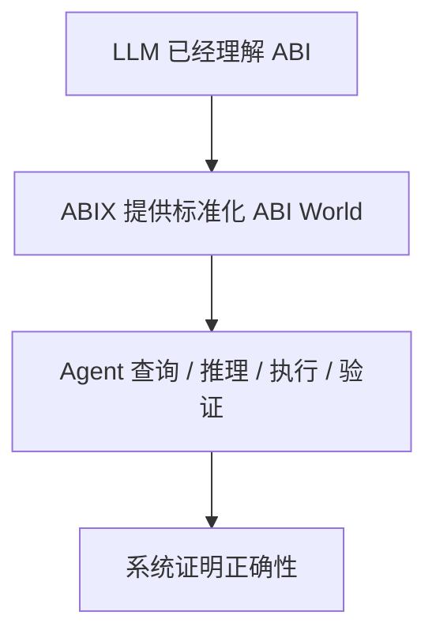
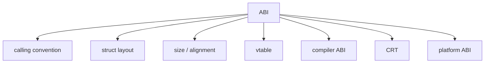
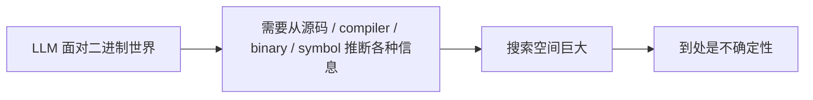
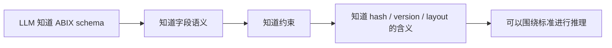
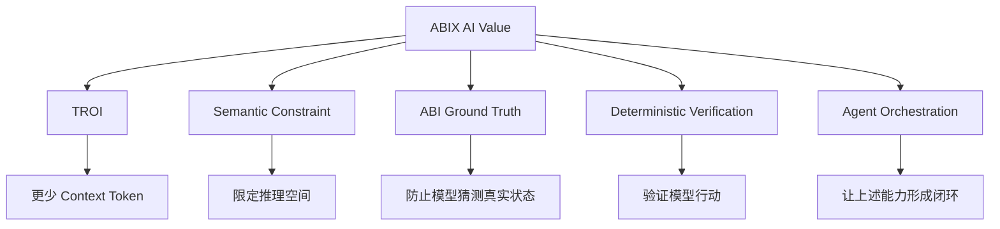
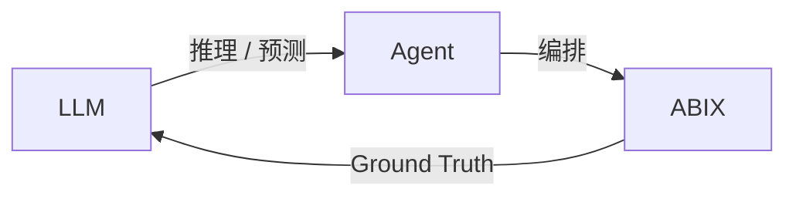
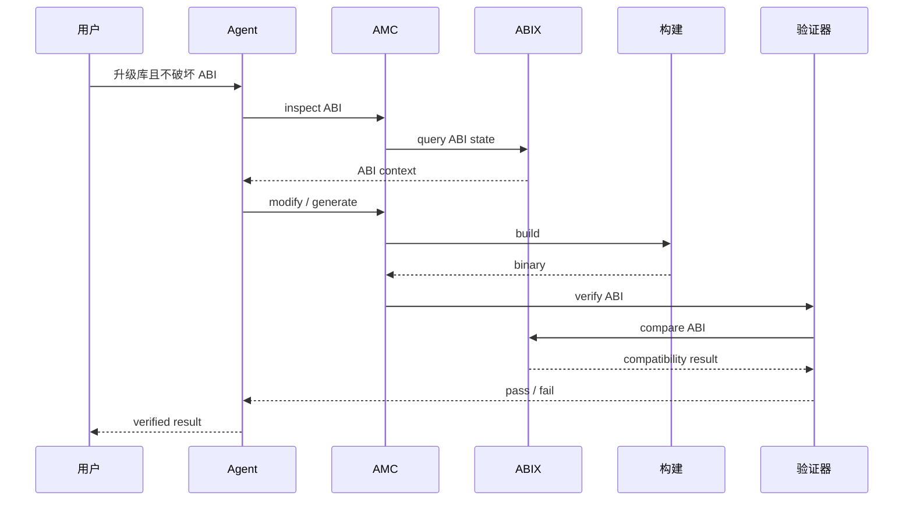
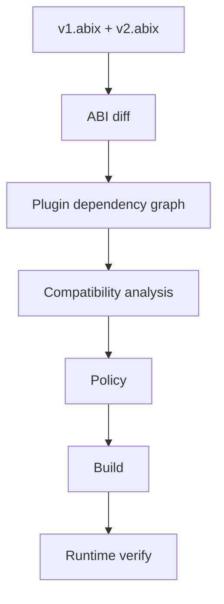
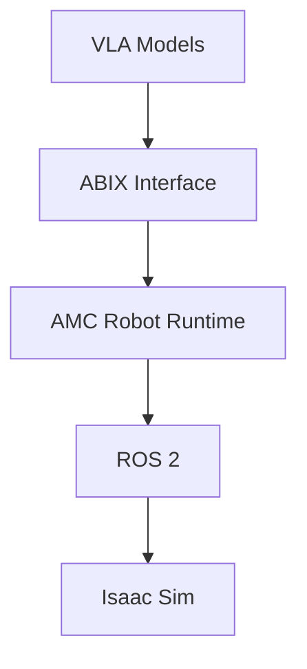

# ABIX 在 AI Vibe Coding 中的作用：标准化二进制语义作为 Ground Truth

<p align="center">
  English · <a href="ai_zh.md">中文</a>
</p>

<details>

<summary>目录</summary>

- [核心命题](#核心命题)
- [ABIX AI 价值的两个时代](#abix-ai-价值的两个时代)
- [ABI Knowledge vs ABI Instance](#abi-knowledge-vs-abi-instance)
- [ABIX 作为语义约束](#abix-作为语义约束)
- [五层 AI 价值模型](#五层-ai-价值模型)
- [三角关系：LLM / Agent / ABIX](#三角关系llm--agent--abix)
- [Agent 验证闭环](#agent-验证闭环)
- [即使 LLM 懂 ABI，ABIX 仍然有意义](#即使-llm-懂-abiabix-仍然有意义)
- [Robotics 应用](#robotics-应用)
- [定位](#定位)

</details>

## 核心命题

ABIX 的 AI 价值不应该建立在：

> "LLM 不懂 ABI，因此要教它。"

而应该建立在：

> **"LLM 懂 ABI 以后，仍然需要 ABIX 把 ABI 变成一个标准化、可预测、可验证、可操作的外部世界。"**

知道 ABI 是什么，和拥有一个可验证、可实例化、有组织的 ABI 标准，是两回事。

## ABIX AI 价值的两个时刻

### 当前时刻：Token 效率



ABIX 将复杂的 ABI 信息压缩成结构化、机器可读的格式。LLM 读得更少，推理更好。

这是短期 AI 卖点：**TROI（Token ROI）**。

### 成熟时刻：Ground Truth



ABIX 不会因为模型变聪明而消失。它反而更有价值——作为**标准化、确定性、可验证的外部表示**，即使是最强大的 LLM 也需要它来操作真实的二进制系统。

这是长期 AI 价值：**Ground Truth**。

## ABI Knowledge vs ABI Instance

LLM 可能知道：



它甚至可能推断：

> "这是 MSVC x64，所以 `Widget` 大概率是这个布局。"

但真实世界的 ABI 受到以下因素影响：

```text
compiler × compiler version × target × architecture
× OS × calling convention × packing × language ABI
× CRT × build flags × dependency ABI × version
```

因此：

```text
ABI Knowledge  = "ABI 应该怎么工作。"
ABI Instance   = "这个具体 .dll/.so 此时此刻到底是什么 ABI。"
```

这两者不是一回事。

## ABIX 作为语义约束

没有 ABIX 时：



有 ABIX 后：



ABIX 不替 LLM 思考。它给 LLM **一套可以放心依赖的世界规则**。

当模型看到：

```
Widget {
    size: 128
    alignment: 8
    abi_hash: ...
    compiler: msvc
    target: x86_64-windows
}
```

它不需要思考：

> "size 这个东西到底是什么意思？"

也不需要：

> "这个 metadata 是哪个工具私有定义的？"

而可以直接开始：

> "这个 Widget 与旧版本的 ABI 是否兼容？"

这就是**搜索空间约束 / 语义约束**：ABIX 缩小推理空间，让模型聚焦于实际决策。

## 五层 AI 价值模型



TROI 只是第一层。

| 层 | 解决什么 | 能否经受 LLM 进化？ |
|---|---------|-------------------|
| TROI | 效率 | 随着 Context 增大而减弱 |
| Semantic Constraint | 推理精度 | **增强** — 数据越多，越需要更紧的约束 |
| ABI Ground Truth | 事实准确性 | **永久** — 真实二进制状态永不改变 |
| Deterministic Verification | 正确性保证 | **永久** — "系统证明"胜过"模型猜测" |
| Agent Orchestration | 闭环操作 | **永久** — 总得有人去执行 |

## 三角关系：LLM / Agent / ABIX



| 角色 | 核心动作 | 输出 |
|------|----------|------|
| LLM | 推理、预测、规划、生成 | 候选解 / 计划 |
| Agent | 取数、组合、执行、验证、恢复 | 可执行动作序列 |
| ABIX | 标准、状态、事实、约束、验证 | Ground Truth |

ABIX 定义"事实是什么"。Agent 决定"现在需要哪些事实以及怎么使用它们"。LLM 在结构化事实之上进行推理。

## Agent 验证闭环

当 Agent 需要在不破坏 ABI 的前提下升级库时，完整闭环如下：



这正是 TROI、ABIX Ground Truth、Agent 编排和确定性验证汇聚为一个工作流的地方。

## 即使 LLM 懂 ABI，ABIX 仍然有意义

例子：升级 `libfoo v1 → v2`，确保所有插件继续工作。

一个强大的 LLM 可能阅读所有源码、头文件、CMake 和二进制，然后得出结论：

> "看起来兼容。"

问题是：**"看起来"不是保证。**

ABIX Agent 则：



然后报告：

```text
v2:
    Widget ABI compatible
    Renderer ABI compatible
    PluginA compatible
    PluginB incompatible

Reason:
    Widget::Config layout changed

Action:
    generated adapter for PluginB

Verification:
    passed
```

即使 LLM 能阅读每一行源码，ABIX 仍然有意义。它弥合的鸿沟是：


## Robotics 应用

同样的原则适用于机器人领域：



即使 VLA 模型非常强大：

- 懂 robots
- 懂 action
- 懂 ROS

它们仍然面对：

- Robot Plugin
- Controller
- Sensor
- Model
- Simulation
- Hardware

之间大量动态变化的接口。

ABIX 将以下内容标准化：

- RobotState
- Observation
- Action
- Controller
- Plugin

作为可验证的 ABI/metadata。

AI 价值不是：

> "教 AI 什么是机器人。"

而是：

> **"给 AI 一个标准化、可操作、可验证的机器人软件世界。"**

## 定位

**ABIX 不是给 LLM 的 ABI 教程。**

**ABIX 是 LLM 可以安全推理的 ABI 语言。**

更准确地说：

> ABIX 不是让 AI 理解 ABI，而是让"AI 所理解的 ABI"变成一个标准化、确定、可交换、可验证的外部世界。

**TROI 可以随着模型进化被削弱。但"标准化二进制语义 + 外部 Ground Truth + 确定性验证"不会因为 LLM 变聪明而消失。**

---

*本文档论述 ABIX × AI 的理论基础。MCP 工具接口见 [MCP.md](MCP.md)。Token 效率指标见 [troi.md](troi.md)。Agent 架构见 **AGENT.md**（规划中）。*
