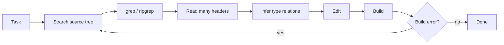
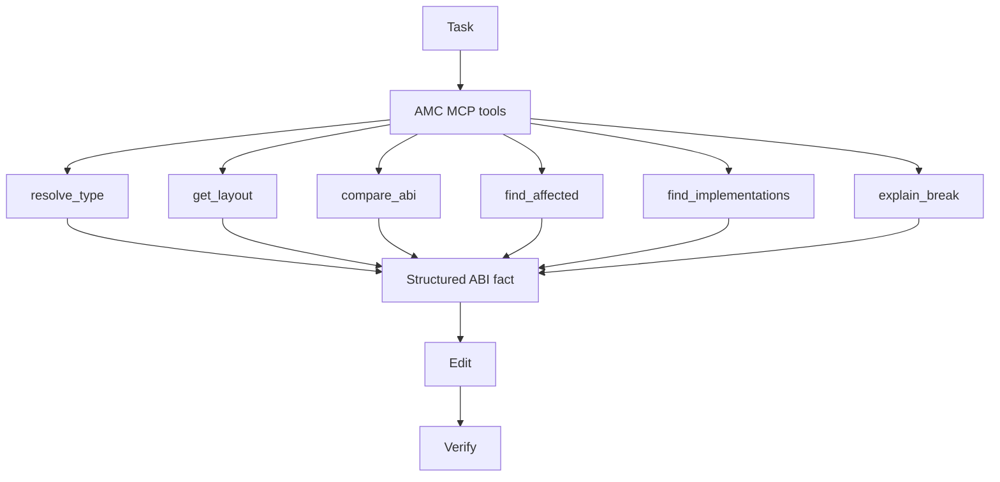
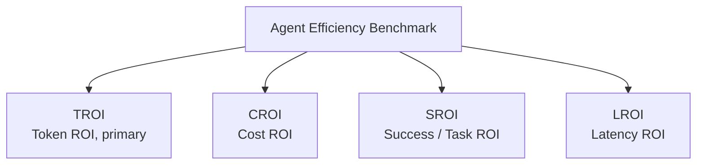
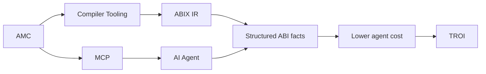

# TROI: Token Return on Investment

<p align="center">
  <a href="troi_zh.md">中文</a> · English
</p>

<details>

<summary>Contents</summary>

- [Definition](#definition)
- [Why: the agent information-acquisition cost](#why-the-agent-information-acquisition-cost)
- [Formula](#formula)
- [Token Compression Ratio (TCR)](#token-compression-ratio-tcr)
- [Metric family: the Agent Efficiency Benchmark](#metric-family-the-agent-efficiency-benchmark)
- [What TROI is not](#what-troi-is-not)
- [Status](#status)
- [Current measurement: abix_token_cost.py](#current-measurement-abix_token_costpy)
- [Planned: amc agent benchmark](#planned-amc-agent-benchmark)
- [Relation to ABIX/AMC positioning](#relation-to-abixamc-positioning)

</details>

> TROI is a documentation concept for talking about the token efficiency of
> AI-agent workflows that consume structured ABI knowledge through AMC/MCP.
> Every number in this document is an illustrative example, not a measurement.
> Capabilities that do not exist yet are marked as planned or proposed.

## Definition

TROI, Token Return on Investment, measures AI-agent work accomplished per
token when structured ABI knowledge is available through AMC/MCP, relative to
a traditional AI development flow.

In one sentence: TROI measures how much AI-agent work can be accomplished per
token when structured ABI knowledge is available through AMC.

## Why: the agent information-acquisition cost

In a traditional flow, an agent that needs an ABI fact has to rediscover it
from source, and pay for that rediscovery on every iteration:



Each pass through the loop spends input tokens (headers read again), output
tokens (reasoning over them), tool calls, and build/test iterations.

With AMC + MCP, the agent asks for the fact directly:



The core thesis: AMC converts agent reasoning cost into machine-queryable ABI
facts. That matters more than merely using fewer tokens. The agent stops
spending its context window and tool budget on rediscovering information the
toolchain already knows, and spends them on the task instead.

The current `amc-mcp` catalogue covers the query and comparison tools
(`abix.resolve_type`, `abix.get_layout`, `abix.compare_abi`, and friends; see
[MCP.md](MCP.md)). Impact-analysis tools such as `find_affected`,
`find_implementations` and `explain_break` are planned, not implemented (see
[Status](#status)).

## Formula

The general form compares the total cost of completing the same task under
two workflows:

$$
TROI = \frac{C_{traditional}}{C_{amc+mcp}} \\
$$

where `C` is the composite Agent cost:

$$
C = \alpha T + \beta N + \gamma L + \delta B
$$

- `T` is token consumption,
- `N` is tool calls,
- `L` is latency,
- `B` is build/test iterations.

> The weights `alpha`, `beta`, `gamma`, `delta` are deployment-specific.

The first version uses tokens only, which is equivalent to setting
`beta = gamma = delta = 0`:

$$
TROI_{token} = \frac{Tokens_{traditional}}{Tokens_{amc}}
$$

Worked example (illustrative, not a measurement):

| Metric (illustrative) | Traditional | AMC + MCP |
|---|---:|---:|
| Input tokens | 80k | 15k |
| Output tokens | 20k | 5k |
| Tool calls | 43 | 11 |
| Build iterations | 8 | 3 |
| Total tokens | 100k | 20k |
| TROI_token | 1.0x | 5.0x |

This reads as: "AMC achieved a 5.0x token ROI for this task", or equivalently
"AMC reduced agent token consumption by 80%".

## Token Compression Ratio (TCR)

$$
TCR = \frac{Traditional Tokens}{AMC Tokens}
$$

TCR states the same idea as compression: how much smaller the token footprint
of a task becomes when the agent reads ABI metadata instead of source. In the
first phase, TCR and TROI_token are numerically equal. The two names exist
because they frame the same ratio differently: TCR as compression, TROI as
return.

A more attractive future definition is:

$$
TROI = \frac{Useful Work}{Token Cost}
$$

but it is hard to standardize: "useful work" requires task success criteria,
grading, and normalization across repositories. Phase 1 therefore deliberately
keeps TROI simple and token-based.

## Metric family: the Agent Efficiency Benchmark

TROI is the primary member of a planned metric family:



- **TROI**: token return (this document).
- **CROI**: monetary cost return.
- **SROI**: task success rate return.
- **LROI**: latency return.

TROI is the headline metric because it is the most communicable: one ratio,
no price list, no timing noise.

## What TROI is not

TROI is not:

- engineering productivity,
- monetary ROI,
- a measure of model intelligence.

An 80% token reduction does not imply an 80% development-cost reduction.
Tokens are one cost dimension; tool calls, latency, builds, and task success
move independently. Illustrative divergence for a single task:

| Dimension | Change (illustrative) |
|---|---:|
| Tokens | -80% |
| Tool calls | -60% |
| Wall-clock time | -20% |
| Task success rate | +15% |

## Status

- Today, [`tools/abix_token_cost.py`](../../tools/abix_token_cost.py) produces a
  TCR-style estimate for a single module (see below).
- The full Agent Efficiency Benchmark (composite cost `C`, multi-task suites,
  success-rate tracking) is **planned, not implemented**.
- There is no `amc agent benchmark` command today; the CLI shown below is a
  proposal.

## Current measurement: abix_token_cost.py

`tools/abix_token_cost.py` compares two views of the same module:

- the source view: the C/C++ headers an agent would read to infer the ABI,
- the metadata view: `amc context <file.abix> --format llm`.

```sh
tools/abix_token_cost.py --abix module.abix --source a.hpp [b.hpp ...]
```

It reports `source_tokens`, `metadata_tokens`, and their ratio
`source_over_metadata` (illustrative output):

```json
{
  "source_tokens": 51234,
  "metadata_tokens": 10247,
  "source_over_metadata": 5.0
}
```

Stated limits:

- token counts come from a simple lexical tokenizer (identifier/number runs
  plus single punctuation characters): a reproducible proxy, not a model
  tokenizer;
- the comparison covers a single module;
- the source view omits transitive includes, the C++ standard library, and the
  implementations an agent often needs to inspect, while the metadata view is
  dense and complete.

Treat the ratio as the phase-1 TCR indicator, not a benchmark.

## Planned: amc agent benchmark

This section is a proposal. The command does not exist.

```sh
amc agent benchmark --project ./llvm --task abi-change \
    --baseline traditional --agent mcp
```

Illustrative output (not a measurement):

```text
Task:              abi-change
Input Tokens:      80k  -> 15k
Output Tokens:     20k  -> 5k
Tool Calls:        43   -> 11
Build Iterations:  8    -> 3
Elapsed Time:      60m  -> 48m
Token Cost:        100k -> 20k
TROI:              5.0x
Token Reduction:   80%
Tool Reduction:    74%
Build Reduction:   62.5%
```

Task matrix (proposal):

| Category | Tasks |
|---|---|
| Navigation | symbol lookup, type lookup, caller analysis, implementation lookup |
| ABI | layout query, compatibility check, ABI diff, break explanation |
| Refactoring | dependency analysis, impact analysis, migration, rename |

Comparison ladder (proposal):

| Configuration | Adds |
|---|---|
| Baseline Agent | source search, grep, header reading |
| Agent + clangd | language-server navigation |
| Agent + AMC | structured ABI queries |
| Agent + AMC + ABIX | cross-module ABI knowledge base |

## Relation to ABIX/AMC positioning



ABIX lowers the cost of machines understanding the native binary interface;
AMC + MCP further lower the cost of AI agents understanding native codebases.
TROI is the metric that makes that claim discussable.
