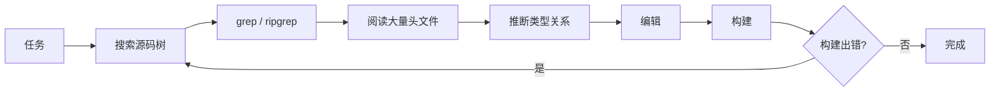
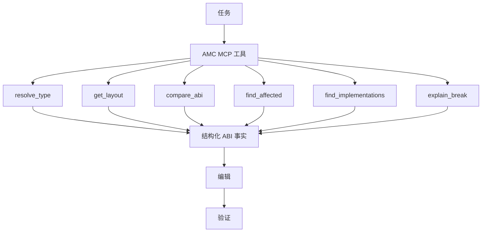
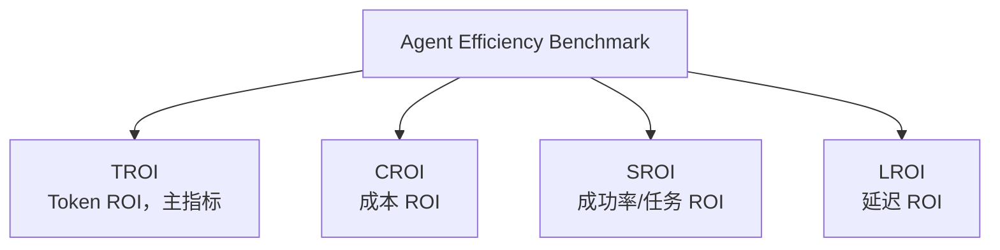
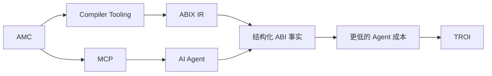

# TROI:Token 投资回报率

<p align="center">
  中文 · <a href="troi.md">English</a>
</p>

<details>

<summary>目录</summary>

- [定义](#定义)
- [为什么: `Agent` 的信息获取成本](#为什么-agent-的信息获取成本)
- [计算公式](#计算公式)
- [`Token` 压缩比(`TCR`)](#token-压缩比tcr)
- [指标家族: `Agent Efficiency Benchmark`](#指标家族-agent-efficiency-benchmark)
- [`TROI` 不是什么](#troi-不是什么)
- [现状](#现状)
- [当前测量手段: `abix_token_cost.py`](#当前测量手段-abix_token_costpy)
- [规划:amc agent benchmark](#规划amc-agent-benchmark)
- [与 ABIX/AMC 定位的关系](#与-abixamc-定位的关系)

</details>

> TROI 是一个文档概念，用于讨论 AI Agent 在通过 AMC/MCP 获得结构化 ABI
> 知识时，每个 token 能完成多少工作。本文中的所有数字都是说明性示例，
> 不是实测结果。尚未实现的能力均标注为"规划中"或"提案"。

## 定义

`TROI` (Token Return on Investment，Token 投资回报率) 衡量的是:
> 当结构化ABI 知识可以通过 `AMC/MCP` 获得时，相对于传统 `AI` 开发流程，`AI Agent` 每个 `token` 所能完成的工作量。

即衡量当结构化 `ABI` 知识可以通过 `AMC` 获得时，每个 `token` 能完成多少 `AI Agent` 工作。

## 为什么: `Agent` 的信息获取成本

在传统流程中，`Agent` 每需要一个 `ABI` 事实，都要从源码重新发现它，并且每一轮迭代都要为这次重新发现付费:



每经过一轮循环，都要消耗输入 `token` (重读头文件)、输出 `token` (对其进行推理)、工具调用次数和构建/测试迭代次数。

有了 AMC + MCP，Agent 直接询问事实:



核心论点:AMC 把"`Agent` 推理成本"转化为"机器可查询的 `ABI` 事实"。这比单纯"用更少的 `token`"更重要的是`Agent` 不再把上下文窗口和工具预算花在重新发现工具链已知的信息上，而是把它们花在任务本身。

当前 `amc-mcp` 的工具目录覆盖查询与比较类工具(`abix.resolve_type`、`abix.get_layout`、`abix.compare_abi` 等，见 [MCP_zh.md](MCP_zh.md))；`find_affected`、`find_implementations`、`explain_break` 这类影响分析工具属于规划内容，尚未实现(见[现状](#现状))。

## 计算公式

一般形式比较的是同一任务在两种工作流下的总成本:

$$
TROI = \frac{C_{traditional}}{C_{amc+mcp}} \\
$$
其中 C 可以是综合 Agent 成本:
$$
C = \alpha T + \beta N + \gamma L + \delta B
$$

- `T` 是 token 消耗
- `N` 是工具调用次数
- `L` 是延迟
- `B` 是构建/测试迭代次数。

> 权重 `alpha`、`beta`、`gamma`、`delta` 因部署环境而异。

第一个版本只使用 token，相当于令 `beta = gamma = delta = 0`:

$$
TROI_{token} = \frac{Tokens_{traditional}}{Tokens_{amc}}
$$

示例演算(说明性示例，非实测结果):

| 指标(示例) | 传统流程 | AMC + MCP |
|---|---:|---:|
| 输入 token | 80k | 15k |
| 输出 token | 20k | 5k |
| 工具调用 | 43 | 11 |
| 构建迭代 | 8 | 3 |
| 总 token | 100k | 20k |
| TROI_token | 1.0x | 5.0x |

上表读作:"`AMC` 在该任务上取得了 5.0x 的 `TROI`"，或等价地，"`AMC` 把 `Agent` 的 `token` 消耗降低了 80%"。

## `Token` 压缩比(`TCR`)

$$
TCR = \frac{Traditional Tokens}{AMC Tokens}
$$

`TCR` 用压缩的视角陈述同一个想法:当 `Agent` 阅读 `ABI metadata` 而不是源码时，任务的 `token` 足迹缩小了多少。在第一阶段，`TCR` 与 `TROI token` 在数值上相等；保留两个名字是因为它们以不同方式框定同一个比值: `TCR` 是压缩，`TROI` 是回报。<br>
未来更具吸引力的定义是:

$$
TROI = \frac{Useful Work}{Token Cost}
$$

但它难以标准化:"有用工作"需要任务成功判据、评分方式以及跨仓库的归一化。<br>
因此第一阶段刻意保持 `TROI` 简单、只基于 `token`。

## 指标家族: `Agent Efficiency Benchmark`

`TROI` 是规划中的指标家族的主指标:



- **TROI**:token 回报(本文档)。
- **CROI**:货币成本回报。
- **SROI**:任务成功率回报。
- **LROI**:延迟回报。

`TROI` 是头条指标，因为它最容易传播:一个比值，不涉及价格表，也没有计时噪声。

## `TROI` 不是什么

TROI 不是:

- 工程生产力，
- 货币意义上的 ROI，
- 模型智能的度量。

token 降低 80% 并不意味着开发成本降低 80%。token 只是成本的一个维度；工具调用、延迟、构建次数和任务成功率各自独立变化。单个任务的说明性差异示例:

| 维度 | 变化(示例) |
|---|---:|
| Token | -80% |
| 工具调用 | -60% |
| 墙钟时间 | -20% |
| 任务成功率 | +15% |

## 现状

- 目前，[`tools/abix_token_cost.py`](../../tools/abix_token_cost.py) 可以对单个模块给出 TCR 式估算(见下文)。
- 完整的 `Agent Efficiency Benchmark` (综合成本 `C`、多任务套件、成功率追踪) 属于**规划内容，尚未实现**。
- 今天不存在 `amc agent benchmark` 命令；下文展示的 CLI 是提案。

## 当前测量手段: `abix_token_cost.py`

`tools/abix_token_cost.py` 比较同一模块的两种视图:

- 源码视图:`Agent` 为推断 `ABI` 所要阅读的 `C/C++` 头文件；
- metadata 视图:`amc context <file.abix> --format llm`。

```sh
tools/abix_token_cost.py --abix module.abix --source a.hpp [b.hpp ...]
```

它报告 `source_tokens`、`metadata_tokens` 以及两者的比值 `source_over_metadata`(说明性输出):

```json
{
  "source_tokens": 51234,
  "metadata_tokens": 10247,
  "source_over_metadata": 5.0
}
```

已声明的限制:

- `token` 计数来自一个简单的词法 `tokenizer`(标识符/数字串加单个标点字符):它是可复现的代理，不是模型 `tokenizer`；
- 比较只覆盖单个模块；
- 源码视图省略了传递包含的头文件、`C++` 标准库以及 `Agent` 常常需要查看的实现部分，而 `metadata` 视图是密集且完整的。

请把这个比值当作第一阶段的 TCR 指示器，而不是基准测试。

## 规划:amc agent benchmark

本节是提案。该命令并不存在。

```sh
amc agent benchmark --project ./llvm --task abi-change \
    --baseline traditional --agent mcp
```

说明性输出(非实测结果):

```text
Task:              abi-change
Input Tokens:      80k  -> 15k
Output Tokens:     20k  -> 5k
Tool Calls:        43   -> 11
Build Iterations:  8    -> 3
Elapsed Time:      60m  -> 48m
Token Cost:        100k -> 20k
TROI:              5.0x
Token Reduction:   80%
Tool Reduction:    74%
Build Reduction:   62.5%
```

任务矩阵 (提案):

| 类别 | 任务 |
|---|---|
| 导航 | 符号查找、类型查找、调用方分析、实现查找 |
| ABI | layout 查询、兼容性检查、ABI diff、break 解释 |
| 重构 | 依赖分析、影响分析、迁移、重命名 |

对比阶梯(提案):

| 配置 | 新增能力 |
|---|---|
| Baseline Agent | 源码搜索、grep、阅读头文件 |
| Agent + clangd | 语言服务导航 |
| Agent + AMC | 结构化 ABI 查询 |
| Agent + AMC + ABIX | 跨模块 ABI 知识库 |

## 与 ABIX/AMC 定位的关系



ABIX 降低了机器理解原生二进制接口的成本；`AMC` + `MCP` 进一步降低 `AI Agent` 理解原生代码库的成本。TROI 是让这个主张可以被讨论的指标。
