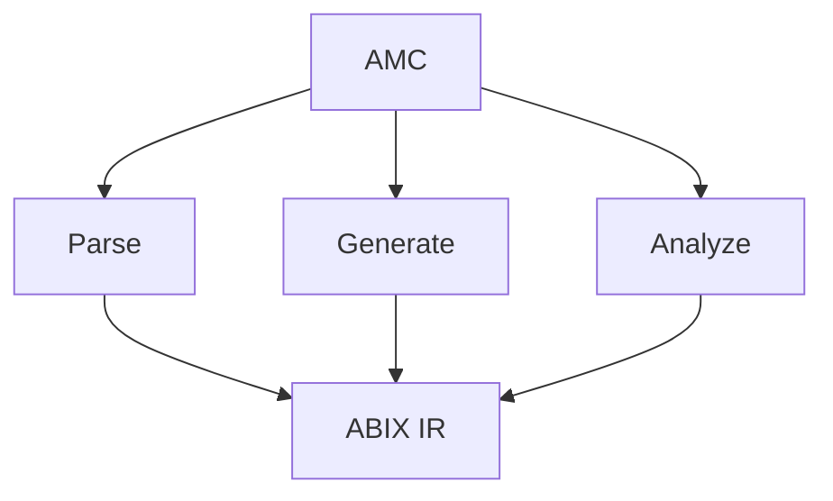

# AMC — ABI Meta Compiler

AMC is the ABIX toolchain entry point. It extracts ABI information from a
language AST, projects it into ABIX IR, and provides inspection, comparison,
verification, generation and distribution tooling.



AMC is an extensible toolchain, not a language-specific compiler: language
frontends extract ABI, ABIX IR stays the common representation.

## Configuration

Builds are described by an `.abic.toml` file:

```toml
[package]
name = "math_api"
version = "1.0"

[[import]]
language = "cpp"
flags = ["-std=c++17"]
files = ["math_api.hpp"]
symbols = ["math::add", "math::Point"]

[[export]]
output = "build/math_api.abix"
```

See [`abic.md`](abic.md) for the complete reference.

## Commands

### `amc build`

Runs the configured frontend, projects the requested symbols and writes the
`.abix` artifact (plus a `.abix.meta` indexing sidecar):

```bash
amc build -c package.abic.toml [-B <build_dir>]
```

### `amc inspect` / `amc validate`

```bash
amc inspect  file.abix      # one-line summary
amc validate file.abix      # structural + hash validation
amc inspect  libfoo.so      # decode the embedded Metadata Region
```

### `amc query`

Structured queries for humans and agents. Accepts `.abix` or a compiled binary.

```bash
amc query file.abix --type Foo --layout          # type + field offsets
amc query file.abix --function Foo::bar          # signature, params, return
amc query file.abix --compatible other.abix      # strict ABI comparison
amc query file.abix --type Foo --format json     # abix.query/1 JSON
```

`--type`/`--function` accept exact names, `Owner::name`, substrings, or a
`0x`-prefixed `TypeID`.

### `amc context`

Dense ABI context for LLMs: types/fields/functions are indexed (`T0/F0/P0`) so
cross references stay short instead of repeating 128-bit hashes.

```bash
amc context file.abix --format llm
amc context file.abix --format json --no-names
```

### `amc diff` / `amc compatibility`

```bash
amc diff v1.abix v2.abix [-o report.abix]
amc compatibility v1.abix v2.abix        # exit 1 when incompatible
```

### `amc verify`

Compares a frozen contract against a regenerated implementation, or two
artifacts directly.

```bash
amc verify -c package.abic.toml [-B <build_dir>]
amc verify contract.abix implementation.abix
amc verify contract.abix implementation.abix --format diagnostics
```

`--format diagnostics` emits `file:line:column: error: ABI <kind> ...` lines
using the contract's Source Origin, for editors and CI annotations.

### `amc generate`

```bash
amc generate file.abix -l cpp -o generated.hpp    # native C++17 projection
amc generate file.abix -l lua -o aue_contract.hpp # Aue contract (header)
amc generate file.abix -l lua -o conformance.lua  # generated Lua test case
```

The C++ provider writes `amc_generated.hpp` (the projection) and, next to it,
`amc_abi_check.hpp` — a compile-time ABI check that turns layout drift into an
ordinary compiler/clangd diagnostic while editing, with no clangd plugin:

```cpp
#include "my_native_types.hpp"   // declares ns::Foo
#include "amc_abi_check.hpp"     // static_asserts sizeof/alignof/offsetof
```

Include the check header *after* the native declarations it names. It asserts
`sizeof`, `alignof`, per-field `offsetof` **and per-field width**
(`sizeof(static_cast<T *>(nullptr)->field)`) for every type whose ABIX name is a
valid C++ qualified name, so a mismatch such as an inserted field is reported at
the point of inclusion instead of at runtime. The width assertion catches a
field whose type changed to another type of a different size without moving the
following offsets or the total size — the part of the LayoutHash comparison the
offset checks miss. Bit-fields are skipped because `offsetof`/`sizeof` are not
defined for them, and types AMC names implicitly (`struct Foo *`, anonymous
enums) are skipped.

### `amc adapter`

Generates a standalone C++ ABI adapter from the mapping between two artifacts:
a raw-memory `apply(source, target)` per compatible type, plus an entry table.
The target buffer is zero-initialised, so `add_default`/`skip_field` need no
code, and `convert_int`/`convert_float` are emitted as widening/narrowing casts.
Unsignedness is not tracked by the model, so conversions go through signed
intermediates.

```bash
amc adapter foo_v1.abix foo_v2.abix -o adapter_foo.hpp
```

```cpp
const auto *entry = abix_adapter::find("ns::Foo", "ns::Foo");
if (entry) entry->apply(&foo_v1, &foo_v2);
```

With `--typed`, it also emits an `abix::adapter<Source, Target>` specialization
over the generated C++ projection types (`<namespace>::<type>_ABIX`). Include
the projection header, define `ABIX_ADAPTER_TYPED`, then include the adapter:

```cpp
#define ABIX_ADAPTER_TYPED 1
#include "amc_generated.hpp"   // amc_generated::ns_Foo_ABIX
#include "adapter_foo.hpp"
abix::adapter<amc_generated::ns_Foo_v2_ABIX,
              amc_generated::ns_Foo_v2_ABIX>::apply(&v2, &v1);
```

`--typed-namespace <ns>` overrides the projection namespace (default
`amc_generated`).

`--shim` emits the adapter as a translation unit with a C ABI, so it can be
compiled into a standalone shim shared library:

```bash
amc adapter foo_v1.abix foo_v2.abix --shim -o shim.cpp
clang++ -std=c++17 -shared -fPIC shim.cpp -o libabix_shim.so
```

```c
/* host side */
void *h = dlopen("./libabix_shim.so", RTLD_NOW);
bool (*apply)(const char *, const char *, const void *, void *) =
    dlsym(h, "abix_adapter_apply");
apply("ns::Foo", "ns::Foo", &foo_v1, &foo_v2);
```

### `amc metadata`

The self-describing Metadata Region (manifest + desc + hash + names), emitted,
verified and scanned offline.

```bash
amc metadata file.abix -o region.abixmeta [--no-names] [--build-id 0x...]
amc metadata --verify region.abixmeta
amc metadata --from-elf libfoo.so --format json
amc metadata --verify libfoo.so --format json
```

### `amc publish` / `amc fetch`

A local symbol server keyed by the ELF GNU BuildID:

```bash
amc publish libfoo.so --root ~/.abix/symbols
amc publish file.abix --root ~/.abix/symbols --build-id 0x...
amc fetch libfoo.so -o libfoo.abixmeta
amc fetch --build-id 0x... -o libfoo.abix
```

Store layout: `{root}/{build_id[0:2]}/{build_id[2:]}.{abix|abixmeta}` plus
`.meta`. Remote fallback is not implemented yet.

## Structured errors

Every AMC tool can emit one error envelope on stderr:

```bash
amc validate missing.abix --error-format json
```

```json
{"schema":"abix.error/1","error":{"code":"AMC-IO","category":"io",
 "stage":"read_abix","message":"cannot open input: missing.abix",
 "file":"missing.abix","detail":null}}
```

`--format json` on a command also switches errors to JSON.

## Other tools

| Tool | Purpose |
|------|---------|
| `amc-cpp` | C++ frontend/backend provider (JSON-lines IPC) |
| `amc-dump` | raw `.abix` dump (text / JSON) |
| `amc-mcp` | MCP server exposing ABIX tools; indexes multiple artifacts as a knowledge base ([MCP.md](MCP.md)) |
| `libabix_lldb.so` | native LLDB command plugin (`abix ...`) linked against `libabix-*` ([`tools/lldb_abix.cpp`](../tools/lldb_abix.cpp)) |
| `abix-conformance` | Aue L0/L1 differential runner (when Lua is present) |
