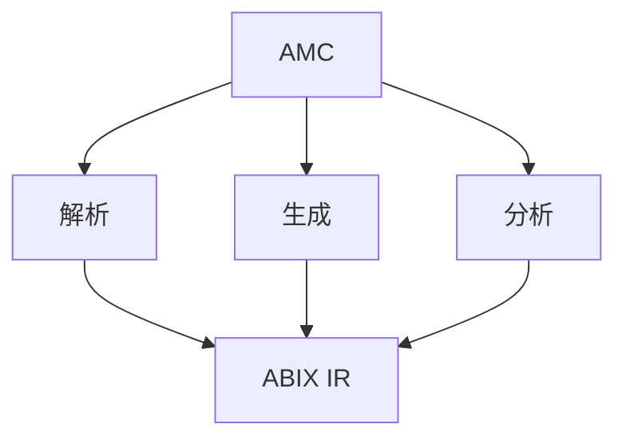

# AMC — ABI Meta Compiler

AMC 是 ABIX 工具链入口：从语言 AST 提取 ABI、投影为 ABIX IR，并提供查看、比较、
校验、生成与分发工具。



AMC 是可扩展工具链而非语言专用编译器：前端提取 ABI，ABIX IR 始终是统一表示。

## 配置

```toml
[package]
name = "math_api"
version = "1.0"

[[import]]
language = "cpp"
flags = ["-std=c++17"]
files = ["math_api.hpp"]
symbols = ["math::add", "math::Point"]

[[export]]
output = "build/math_api.abix"
```

完整参考见 [`abic_zh.md`](abic_zh.md)。

## 命令

### `amc build`

```bash
amc build -c package.abic.toml [-B <build_dir>]
```

按配置运行前端、投影导出符号，写出 `.abix` 及 `.abix.meta` 索引 sidecar。

### inspect / validate

```bash
amc inspect  file.abix      # 一行摘要
amc validate file.abix      # 结构与 hash 校验
amc inspect  libfoo.so      # 解码内嵌 Metadata Region
```

### query

```bash
amc query file.abix --type Foo --layout
amc query file.abix --function Foo::bar
amc query file.abix --compatible other.abix
amc query file.abix --type Foo --format json
```

`--type`/`--function` 支持精确名、`Owner::name`、子串或 `0x` TypeID。

### context

```bash
amc context file.abix --format llm
amc context file.abix --format json --no-names
```

类型/字段/函数以 `T0/F0/P0` 索引，交叉引用不再重复 128 位 hash。

### diff / compatibility

```bash
amc diff v1.abix v2.abix [-o report.abix]
amc compatibility v1.abix v2.abix        # 不兼容退出 1
```

### verify

```bash
amc verify -c package.abic.toml [-B <build_dir>]
amc verify contract.abix implementation.abix
amc verify contract.abix implementation.abix --format diagnostics
```

`--format diagnostics` 输出 `file:line:column: error: ABI <kind> ...`（使用契约的
Source Origin），供编辑器/CI 使用。

### generate

```bash
amc generate file.abix -l cpp -o generated.hpp
amc generate file.abix -l lua -o aue_contract.hpp
amc generate file.abix -l lua -o conformance.lua
```

C++ provider 在写出 `amc_generated.hpp`（projection）的同时，会在同目录生成
`amc_abi_check.hpp`：把 layout 漂移转化为编译器/clangd 的普通诊断，无需 clangd 插件：

```cpp
#include "my_native_types.hpp"   // 声明 ns::Foo
#include "amc_abi_check.hpp"     // static_assert sizeof/alignof/offsetof/字段宽度
```

该检查头需在它引用的 native 声明**之后**包含。它为每个 ABIX 名字是合法 C++
限定名的类型断言 `sizeof`、`alignof`、逐字段 `offsetof` 以及逐字段**宽度**
（`sizeof(static_cast<T *>(nullptr)->field)`）；因此插入字段这类漂移会在包含处被
报告，而不是等到运行时。宽度断言能捕获"字段改成另一种不同大小的类型、但后续
offset 与总大小都没变"的情况——这是 offset 检查漏掉的、LayoutHash 比较的一部分。
位域（`offsetof`/`sizeof` 对其未定义）与 AMC 隐式命名的类型（`struct Foo *`、
匿名 enum）会被跳过。

### metadata

```bash
amc metadata file.abix -o region.abixmeta [--no-names] [--build-id 0x...]
amc metadata --verify region.abixmeta
amc metadata --from-elf libfoo.so --format json
```

### publish / fetch

以 ELF GNU BuildID 为 key 的本地 symbol server：

```bash
amc publish libfoo.so --root ~/.abix/symbols
amc publish file.abix --root ~/.abix/symbols --build-id 0x...
amc fetch libfoo.so -o libfoo.abixmeta
amc fetch --build-id 0x... -o libfoo.abix
```

目录：`{root}/{build_id[0:2]}/{build_id[2:]}.{abix|abixmeta}` 及 `.meta`。
远端 fallback 尚未实现。

## 结构化错误

```bash
amc validate missing.abix --error-format json
```

```json
{"schema":"abix.error/1","error":{"code":"AMC-IO","category":"io",
 "stage":"read_abix","message":"cannot open input: missing.abix",
 "file":"missing.abix","detail":null}}
```

命令带 `--format json` 时错误也切到 JSON。

## 其他工具

| 工具 | 用途 |
|------|------|
| `amc-cpp` | C++ 前端/后端 provider（JSON-lines IPC） |
| `amc-dump` | `.abix` 原始 dump（text/JSON） |
| `amc-mcp` | MCP server；可把多个 artifact 索引成 ABI 知识库（见 [MCP_zh.md](MCP_zh.md)） |
| `libabix_lldb.so` | 原生 LLDB 命令插件（`abix ...`），直接链接 `libabix-*`（[`tools/lldb_abix.cpp`](../tools/lldb_abix.cpp)） |
| `abix-conformance` | Aue L0/L1 差分运行器（有 Lua 时构建） |
