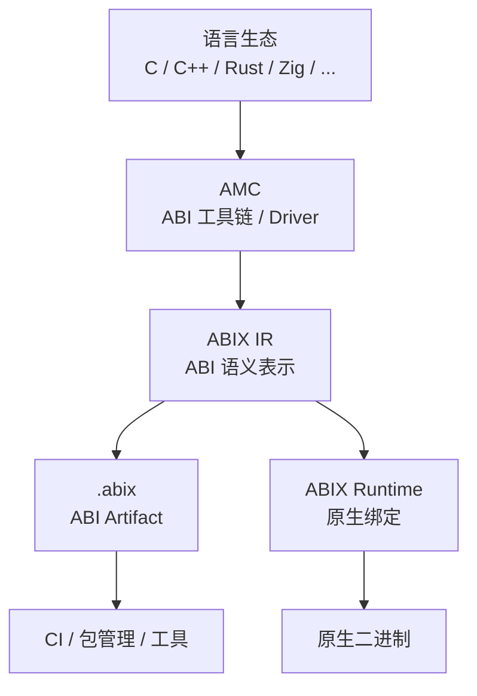
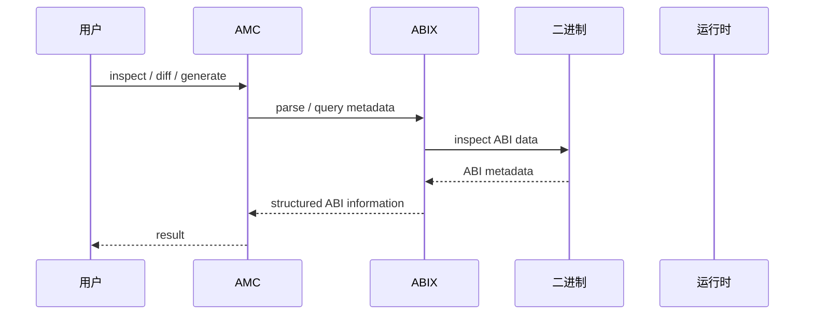
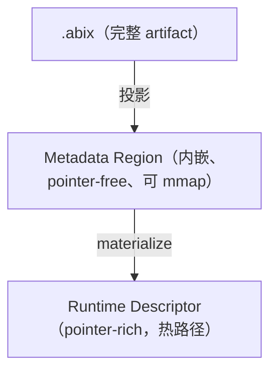

# 架构

<p align="center">
  中文 · <a href="architecture.md">English</a>
</p>

<details>

<summary>目录</summary>

- [分层](#分层)
- [唯一 ABI 事实来源](#唯一-abi-事实来源)
- [身份](#身份)
- [Metadata 三种模式](#metadata-三种模式)
- [执行模型](#执行模型)
- [仓库结构](#仓库结构)

</details>

> 设计地图与不变量以 [`../../ARCHITECTURE.md`](../../.agents/ARCHITECTURE.md) 为权威。

ABIX 把 ABI 变成显式、机器可读的对象，并在整个工具链与运行时中保持**唯一 ABI 事实来源**。

## 分层



* **ABIX IR** — 语言无关的 ABI 模型：类型、字段、函数、参数、符号、hash、兼容性与映射。
* **`.abix`** — 序列化的规范化 artifact，见 [`abix_zh.md`](../abix/abix_zh.md)。
* **AMC** — 从语言 AST 提取 ABI，投影/比较模块并生成原生代码，见 [`amc_zh.md`](../amc/amc_zh.md)。
* **ABIX Runtime** — 消费 ABI：注册、绑定、分派、适配，见 [`runtime_zh.md`](runtime_zh.md)。

## 运行时交互

以下时序展示了典型的 inspect/diff 操作如何流经各系统层：



此图仅展示"谁和谁交互"；各层的实现细节参见对应的专题文档。

## 唯一 ABI 事实来源

> 运行时可以使用 ABI 模型的**投影**，但不得自行重新定义 ABI 语义。

工具链拆分为多个库，使每个消费者只链接所需部分，同时共享唯一的 parser：

| 库 | 职责 |
|----|------|
| `libabix-format` | `.abix` v4 读写、hash、canonical 形式、ELF reader |
| `libabix-abi` | `TypeID`/`LayoutHash` 比较、兼容性 diff |
| `libabix-metadata` | Metadata Region 序列化/解析/materialize、context、query |
| `libabix-tools` | Lua 契约生成、symbol store |
| `libabix-runtime` | header-only 注册/绑定层 |

## 身份

ABIX 区分四种经常被混用的身份：

| ID | 含义 | 用途 |
|----|------|------|
| **TypeID** | 类型语义身份 | 是不是同一个类型 |
| **LayoutHash** | 布局身份 | 内存布局是否兼容 |
| **BuildID** | 二进制构建身份 | 定位对应 artifact |
| **MetadataID** | Metadata 内容身份 | 去重 / 完整性 |

查找链条：`Binary → BuildID → .abix → MetadataID → TypeID → LayoutHash`。
见 [`compatibility_zh.md`](compatibility_zh.md)。

## Metadata 三种模式



Region 是 offset-based、无 relocation，可作为独立文件、嵌入 ELF 段或被离线 parser
mmap；Runtime Descriptor 是初始化期的一次性物化，之后热路径接近纯静态 ABI。
见 [`metadata_modes_zh.md`](../abix/metadata_modes_zh.md)。

## 执行模型

ABIX **不是** VM、RPC 框架或通用对象运行时。对兼容的原生函数，ABIX 建立关系后走
原生 ABI 执行：


## 仓库结构

```text
ABIX
├── abix/      ABI 模型 + 运行时（header-only 注册表）
├── amc/       AMC 工具链：core/、cpp/ 前后端、dump/、mcp/
├── test/      运行时与单元测试（Catch2）
├── bench/     基准测试
├── aue/       实验性 Lua 边界层 + 一致性运行器
├── tools/     辅助脚本（MCP demo、token 成本、LLDB 命令）
└── docs/      规范与设计
```
