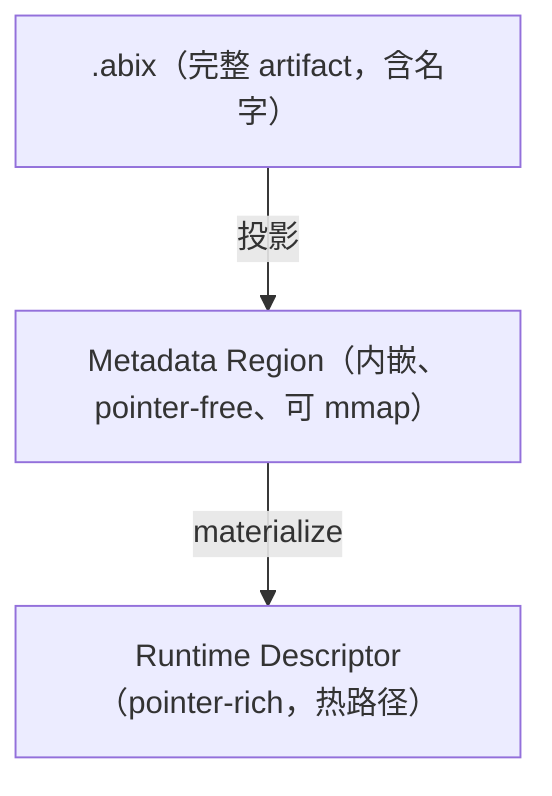
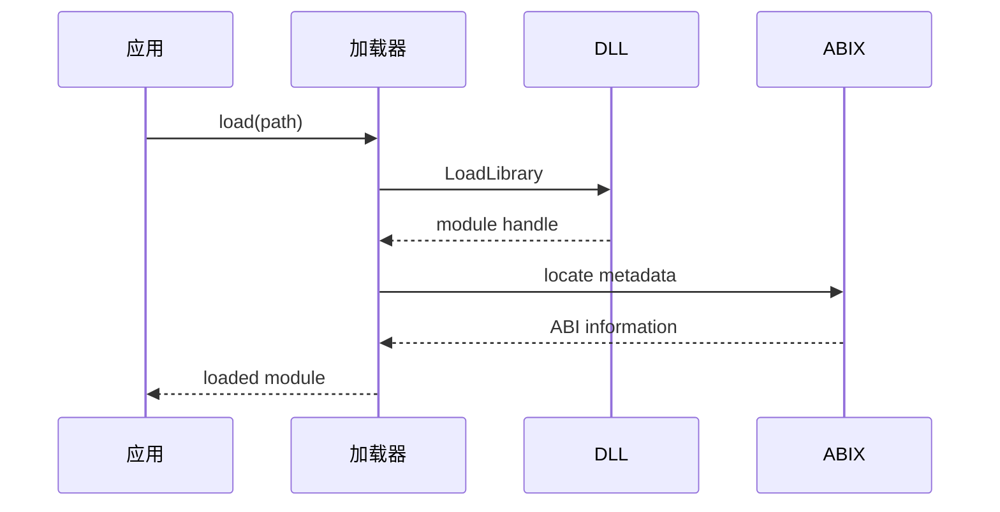
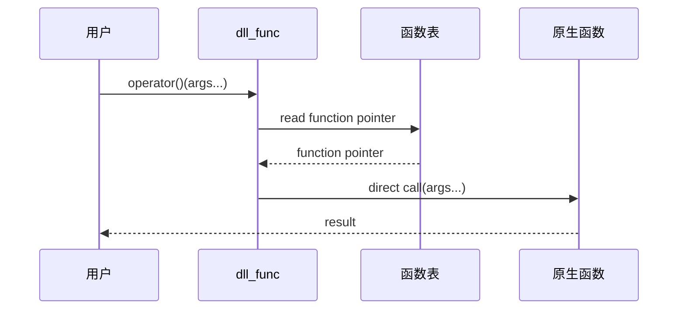

# 运行时概览

<p align="center">
  中文 · <a href="runtime.md">English</a>
</p>

<details>

<summary>目录</summary>

- [职责](#职责)
- [注册表](#注册表)
- [Metadata 三种模式](#metadata-三种模式)
- [DLL 函数表](#dll-函数表)
- [DLL 加载时序](#dll-加载时序)
- [函数调用时序](#函数调用时序)
- [快速开始](#快速开始)
- [API 参考](#api-参考)
- [性能](#性能)

</details>

ABIX 运行时消费 ABI metadata，并保持执行路径为原生调用，不会解释兼容调用。

## 职责


运行时可以参与以上全部环节，但绑定完成后，兼容调用直接走原生 ABI，不再有逐调用的
ABI 机制。

## 注册表

`RuntimeRegistry` 持有所有已加载模块的 ABI 事实，并在加载期校验：

* canonical `TypeDesc` / `TypeLayout` 是唯一 ABI 事实；
* 同一 module version 内共享 TypeID 必须携带相同 `LayoutHash`（兼容重复去重，冲突拒绝）；
  更新的 version 可以携带不同 layout，作为独立 entry 共存；
* 查找基于 `TypeID`（`find_by_id` 取最新版本、`find_type(id, version)` 精确版本、
  `type_of<T>()`）；名字查找仅为诊断用途，紧凑构建下返回 `nullptr`。

## Metadata 三种模式



* 工具链把 Region 写入生成头文件的 `.abix.metadata` 段；离线工具无需加载程序即可扫描。
* `MaterializedModule` 可把 Region 重新投影为 pointer-rich 的 `ModuleDescriptor`，
  使注册表完全由 metadata image 驱动，无需编译期 descriptor 数组。

设计细节见 [`metadata_modes_zh.md`](../abix/metadata_modes_zh.md)。

## DLL 函数表

稳定的公开调用 ABI 是 DLL 导出表：一张扁平、带版本的函数 entry 表。metadata 是其上
额外的一层显式描述。

## DLL 加载时序



加载器定位内嵌在二进制中的 ABIX Metadata Region，将其 materialize 为
`ModuleDescriptor` 并注册到 `RuntimeRegistry`。此后所有类型查找都从注册表解析，
不再重新解析 section。

## 函数调用时序



绑定完成后，调用走的是原生函数指针。没有逐调用的类型查找、参数编组或动态分派——
运行时不参与热路径。

## 快速开始

### DLL 端（提供方）

```cpp
#include "abix/abix.hpp"

extern "C" int add(int a, int b) { return a + b; }
extern "C" double multiply(double a, double b) { return a * b; }

SKL_ABIX_DEFINE_TABLE(
    SKL_ABIX_ENTRY("add", add),
    SKL_ABIX_ENTRY("multiply", multiply),
)
```

### 宿主端（使用方）

```cpp
#include "abix/abix.hpp"

using namespace skl::abix;

dll_object lib;
lib.load("math_dll.dll");

auto add = dll_func<int(int, int)>(lib, "add");
if (add.valid()) {
    int result = add(2, 3);  // 5
}

auto mul = dll_func<double(double, double)>(lib, "multiply");
if (mul.valid()) {
    double result = mul(1.5, 4.0);  // 6.0
}
```

运行时 API 见 [`api_zh.md`](../abix/api_zh.md)。

## API 参考

完整运行时 API（`entry`、`table`、`dll_object`、`call_error`、DLL 资源智能指针、
日志、RCU 超时策略、类型化函数句柄与签名 hash）见 [`api_zh.md`](../abix/api_zh.md)。

## 性能

绑定与 metadata 投影发生在初始化阶段；边界开销与查找基准见
[`benchmark_zh.md`](../benchmark/benchmark_zh.md)。
