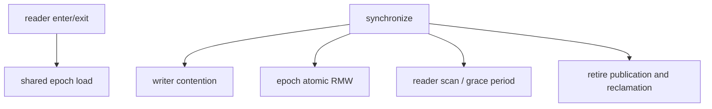

# ABIX Benchmark & Performance Analysis

<p align="center">
  <a href="benchmark_zh.md">中文</a> · English
</p>

<details>

<summary>Contents</summary>

- [1. Scope and Overview](#1-scope-and-overview)
- [2. What Is Measured](#2-what-is-measured)
- [3. Workload Semantics](#3-workload-semantics)
- [4. Measurement Environment and Reproduction](#4-measurement-environment-and-reproduction)
- [5. Analysis Method](#5-analysis-method)
- [6. Configuration Guidance](#6-configuration-guidance)
- [7. Limitations](#7-limitations)
- [8. Full Benchmark Suite](#8-full-benchmark-suite)
- [9. References](#9-references)

</details>

> This document records the benchmark scope, method, and conclusions that can be checked against the current source tree. Throughput values are platform-specific observations, not cross-machine guarantees.

Agent-efficiency benchmarking (TROI) is a separate concern and is documented in [troi.md](troi.md).

## 1. Scope and Overview

- ABIX targets **read-mostly** workloads: many readers execute short read-side critical sections while a small number of writers perform `retire()` and `synchronize()`.
- `bench_all` covers atomics, calls, lookup, plugin reload, EBR fast paths, grace periods, false sharing, and EBR workloads.
- `BM_EBR_SyncPhase` isolates synchronization cost. `BM_EBR_Workload/role_based` is the more representative N-readers/one-writer model.
- AMC extraction, `.abix` serialization, compatibility analysis, and generated metadata registration are build/control-plane operations. They are not included in these DLL-call or EBR hot-path measurements, and this document makes no latency claim for them.
- `synthetic_mixed` keeps total work fixed across thread counts and is suitable for scalability comparisons. `role_based` changes the writer operation count as readers are added; it models role separation, but is not a fixed-work scaling curve.
- CPU frequency scaling is enabled on the measurement platform, and short-run variance is high; the observations below do not establish a B8/B16 performance winner or a fixed percentage claim.

## 2. What Is Measured

| Layer | Benchmarks | Purpose |
|---|---|---|
| Fast path | `BM_EBR_EnterExit`, `BM_EBR_ProtectedLoad` | Basic reader entry/exit and protected-load cost |
| Synchronization | `BM_EBR_SyncPhase` | Contention and scaling of `synchronize()` |
| Reclamation | `BM_EBR_GracePhase`, `BM_EBR_ReclaimBatch` | Grace-period and reclamation costs |
| Role workload | `BM_EBR_Workload/synthetic_mixed` | Same complete schedule on every thread; fixed total work |
| Role workload | `BM_EBR_Workload/role_based` | N readers plus one writer; target usage model |
| Microarchitecture | False-sharing and atomic-contention tests | Evidence for shared writes, atomic RMW, and cache-line isolation |

`bench_all` also contains call overhead, linear-vs-HashIndex lookup crossover, ABI resolve, reload, and DLL benchmarks. Their metrics are different and should not be merged into one overall ranking.

## 3. Workload Semantics

`workload_runner` defines `read_heavy`, `balanced`, and `write_heavy` schedules. `synthetic_mixed` uses 10,000,000 total operations for every tested thread count, comprising 9,000,000 reads, 900,000 retires, and 100,000 synchronizations.

In `role_based`, only thread 0 performs retire/sync work and the other threads perform reads. A decreasing retire/sync count as the thread count increases is therefore expected behavior, not a benchmark failure. Use `synthetic_mixed` for fixed-work scaling and `role_based` for the real role split.

## 4. Measurement Environment and Reproduction

```text
System:      Linux 7.2.2-1-cachyos
CPU:         Intel Core i7-14700K, 20 logical / 20 physical CPUs
NUMA:        1 node
Compiler:    GNU 16.2.1
Build:       Release
Benchmark:   Google Benchmark found and linked
Default:     SKL_ABIX_RCU_EPOCH_BATCH=8
```

This environment exposes 20 CPUs and is not a Windows P-core/E-core setup. Google Benchmark also reports that CPU scaling is enabled, so frequency changes add noise to real-time measurements.

### Reproduction Command

```bash
cmake -S . -B build/Release -G Ninja -DCMAKE_BUILD_TYPE=Release
cmake --build build/Release --target bench_all --parallel 4

build/Release/bin/bench_all \
  --benchmark_filter='BM_EBR_Workload/role_based/(read_heavy|balanced|write_heavy)/20T' \
  --benchmark_min_time=1s \
  --benchmark_repetitions=10 \
  --benchmark_report_aggregates_only=true
```

### B8/B16 Observations

Both `SKL_ABIX_RCU_EPOCH_BATCH=8` and `SKL_ABIX_RCU_EPOCH_BATCH=16` builds run the 20-thread role-based workloads. With CPU scaling enabled, repeated short runs show coefficients of variation of roughly 29% to 44%, which is insufficient to establish which value is faster or to claim a fixed percentage improvement.

## 5. Analysis Method

1. Confirm a Release build, correct operation counts, and the intended benchmark filter.
2. Use `SyncPhase` to identify synchronization degradation with thread count.
3. Use `synthetic_mixed` for fixed-work scalability.
4. Use `role_based` for target read-mostly throughput.
5. Sweep neighboring values around B8/B16 and threshold values instead of testing only round numbers.
6. Repeat at least 10 times and record median, p90, standard deviation, and CV. When CV is high, report the result as inconclusive.

The potential contention chain is:



`alignas`, epoch batching, and publish batching should be retained only when measurements support the corresponding change. Global padding can reduce cache utilization, while batching can increase reclamation delay; neither is a universal optimization.

## 6. Configuration Guidance

| Parameter | Purpose |
|---|---|
| `SKL_ABIX_RCU_CACHE_LINE_SIZE` | Cache-line isolation size for contended fields |
| `SKL_ABIX_RCU_EPOCH_BATCH` | Synchronization calls per epoch advancement |
| `SKL_ABIX_RCU_BATCH_PUBLISH` | Retired objects accumulated before global publication |

The current default epoch batch is 8. Treat it as a conservative default, not as an optimum for every CPU and workload. Before changing it, rerun a Release benchmark on the target platform with stable CPU affinity, frequency, and enough repetitions.

## 7. Limitations

- These results describe the current implementation under the stated workloads; they are not general claims about RCU or concurrent containers.
- Absolute throughput across Linux, Windows, macOS, and different CPU topologies is not directly comparable.
- Frequency scaling, migration, Turbo, temperature, NUMA, ASLR, and background activity affect short benchmarks.
- Historical numbers without raw output and complete environment metadata cannot be independently reproduced.
- Performance tests do not replace correctness tests. Run the full test suite after changing reclamation or synchronization code.

## 8. Full Benchmark Suite

### Execution

The benchmark executables reside in `build/Release/bin` and are run as follows:

```bash
for bench in atomic_bench call_bench reload_bench falseSharing_bench \
  lookup_bench abix_resolve_bench abix_lookup_cross_bench \
  stress_bench ebr_bench ebr_profile_bench; do
  (cd build/Release/bin && LD_LIBRARY_PATH=. ./$bench \
    --benchmark_min_time=0.1s \
    --benchmark_repetitions=3 \
    --benchmark_report_aggregates_only=true)
done
```

The benchmarks must be launched from `build/Release/bin` with `LD_LIBRARY_PATH=.`. `dll_path()` produces a bare filename, and Linux `dlopen("hotcache_dll.so")` does not automatically search the current directory.

In its current unity build, `bench_all` uses the `ebr_profile_bench` `main`, so it registers only part of the source suites by default. It is not the only complete benchmark entry point.

### Representative Results

The following are median values observed on the reference platform described above, each from three repetitions. They characterize the current implementation and are not release baselines.

| Category | Benchmark | Result |
|---|---|---:|
| EBR fast path | `BM_EBR_EnterExit` | 0.491 ns |
| EBR fast path | `BM_EBR_ProtectedLoad` | 0.530 ns |
| EBR synchronization | `BM_EBR_SyncPhase/20T` | 3.23 us wall / 1.46 us CPU |
| EBR role-based | read-heavy / 20T | 12.34 G/s |
| EBR role-based | balanced / 20T | 11.70 G/s |
| EBR role-based | write-heavy / 20T | 11.92 G/s |
| Reload | logical | 3.00 us |
| Reload | real DLL | 2.96 us |
| Calls | `BM_ABIX_Call` | 3.91 ns |
| Lookup crossover | uniform, linear, 16K | 1.59 us |
| Lookup crossover | uniform, hash index, 16K | 13.2 ns |
| False sharing | packed, 16T | 128 ns |
| False sharing | padded, 16T | 3.87 ns |

The limited conclusions are that shared-write contention grows with thread count in the packed false-sharing test while the padded variant stays around 3.4-4.0 ns; HashIndex is substantially faster than linear scanning for the 16K uniform lookup; and 20-thread role-based EBR throughput is around 12 G/s. These are platform-specific observations, and the write-heavy role-based CV was about 14.7%.

### Lookup Benchmark Measurements

With `LD_LIBRARY_PATH=.` set as described above, `BM_FindIndex_Only` measures about 33.6 ns, `BM_Resolve_Linear` about 232 ns, and `BM_Resolve_WithEBR` about 34.3 ns.

## 9. References

- [ABIX README](../README.md)
- [Google Benchmark User Guide](https://github.com/google/benchmark)
- [User-Level Implementations of Read-Copy Update](https://doi.org/10.1109/TPDS.2011.159)
