# Bootstrap and Runtime

ABIX is intended to describe its own internal types — `Registry`, `TypeInfo`,
RCU/EBR state and the rest — with the same cross-ABI model it provides to
users. Describing that machinery recursively raises a chicken-and-egg problem.
The bootstrap route resolves it by splitting the work into four phases and
placing a small, manually maintained kernel at the base.

This page documents that route: the meta-model, the bootstrap kernel, the
runtime dependency and state model, and the self-hosting closure it enables.
The artifact format itself is specified in [`abix.md`](abix.md); the runtime
API is in [`runtime.md`](runtime.md).

## The problem

The goal "ABIX describes itself" means that ABIX's own internal types should be
consumable through ABIX's cross-ABI mechanisms. A direct implementation is
circular: the machinery that describes a type is itself a type that must be
described before it can run. Without a fixed base there is no starting point.

The resolution is to freeze the data model first, implement the smallest
possible loader on top of it, grow the runtime from that loader, and only then
let the runtime describe its own components.

## Four-phase route

The original plan was three phases — `Bootstrap → Runtime → Self-hosting`. It
was adjusted to four by moving the ABI meta-model forward as an independent
Phase 0.

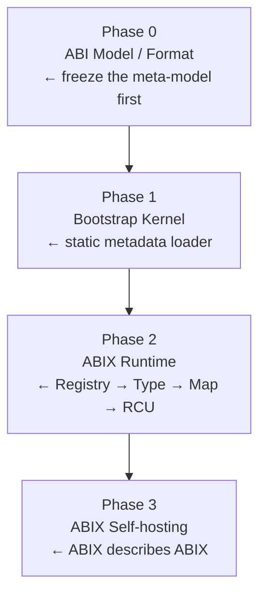

Phase 0 carries the weight. What the bootstrap kernel must consume depends on
the final shape of `.abix`, `TypeInfo`, `Registry` and `Map`; freezing the
meta-model first prevents late rework when those data models turn out to
depend on each other.

### Phase 0 — ABI meta-model

Defines the object model that all later phases consume:

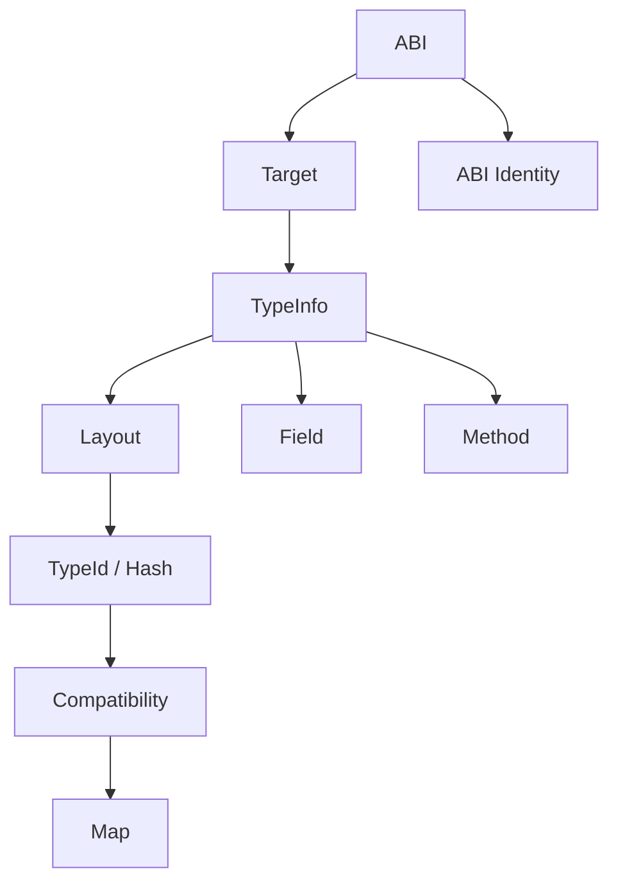

### Phase 1 — Bootstrap kernel

A static metadata loader, not a cut-down registry. It moves generated metadata
from read-only storage into the runtime and then stops being used. Its
constraints are described under [Bootstrap kernel](#bootstrap-kernel).

### Phase 2 — ABIX runtime

Builds `Registry`, the type system, `Map` and finally RCU/EBR on top of the
loaded metadata. Development proceeds single-threaded first, so that the
`Bootstrap → Registry → Type lookup → self metadata` loop can be proven before
concurrency is introduced.

### Phase 3 — Self-hosting

ABIX's own type, registry, map, RCU, compatibility and bootstrap metadata are
produced by ABIX tooling and registered at runtime, with the bootstrap kernel
retained as the only hand-written trusted base.

## Type and hash model

### TypeInfo split into three types

A single `TypeInfo` is not allowed to carry every responsibility. It is split
by question answered:

| Type | Question | Content |
|------|----------|---------|
| `TypeId` | "Who am I?" | canonical type identity as a `Hash128` |
| `TypeDesc` | "What am I?" | id, flags, name offset, layout reference |
| `TypeLayout` | "What is my ABI layout?" | size, alignment, field range, layout hash |

```cpp
struct TypeId {
    Hash128 hash;       // hash of the canonical type identity
};

struct TypeDesc {
    TypeId id;
    uint32_t flags;     // POD / trivially_copyable / polymorphic ...
    uint32_t name;      // offset into the StringTable
    uint32_t layout;    // index into TypeLayout
};

struct TypeLayout {
    uint32_t size;
    uint32_t align;
    uint32_t field_begin;   // start index into the Field table
    uint32_t field_count;   // number of fields
    Hash128 layout_hash;    // full hash of the layout
};
```

The separation keeps identity, description and physical layout independent, so
compatibility can reason about each without conflating them.

### TypeHash and LayoutHash

Two hashes are derived from different inputs:

```cpp
// identity hash (who)
TypeId = hash(canonical type identity)

// layout hash (what it looks like)
LayoutHash = hash(
    TypeId,
    size,
    alignment,
    field_count,
    field TypeId,
    field offset,
    bitfield,
    base_class,
    vtable_abi,
    ...
)
```

`TypeHash ≠ LayoutHash` is the foundation of the compatibility system. The same
type identity may appear with different layouts across build configurations,
and compatibility checks key off the distinction. See
[`compatibility.md`](compatibility.md).

### Hash128

The hash algorithm is not fixed to any specific function:

```cpp
struct Hash128 {
    uint64_t lo;
    uint64_t hi;
};

constexpr TypeId type_id(...);
constexpr LayoutHash layout_hash(...);
```

The first implementation may use FNV-1a; later implementations may substitute
XXH3, BLAKE3 or truncated SHA-256 without changing the `.abix` model. The hash
algorithm is recorded as explicit schema/version information in the artifact
rather than being implied by the implementation.

### Supporting concepts

| Concept | Meaning |
|---------|---------|
| `Field` | field description: name, `TypeId`, offset, bitfield, flags |
| `Function` | function description: name, signature hash, calling convention, parameters |
| `Symbol` | exportable symbol: name, `TypeId`/`FunctionId`, visibility |
| `MapInfo` | ABI mapping description: conversion rules from source type to target type |
| `Compatibility` | compatibility rule: `TypeId` pair → compatible / incompatible |
| `ABI Identity` | unique identity of platform, compiler and calling convention |
| `Target` | target platform description: arch, OS, ABI convention |

## `.abix` artifact

`abixc` consumes a Clang AST and emits two coordinated products:

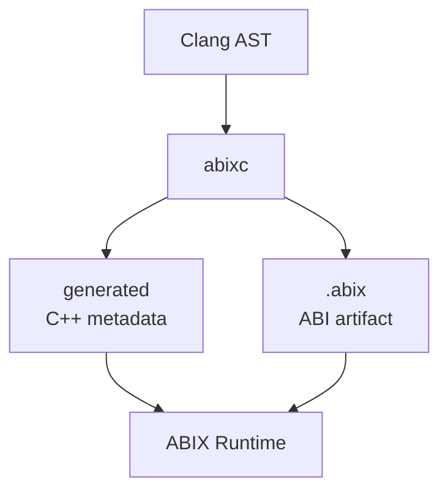

* `.abix` — a stable ABI artifact shared across processes, tools and languages.
* `generated/*.abix.hpp` — zero-cost C++ compile-time metadata specialized for
  the current compilation environment.

The v0 layout is a flat sequence:

```mermaid
graph TD
    Header --> H_magic["magic"]
    Header --> H_fmt["format_version"]
    Header --> H_hash["hash_algorithm<br/>← hash algorithm recorded in the schema"]
    Header --> H_sec["section_offsets"]
    ABIIdentity["ABI Identity"] --> AI["arch, os, compiler, calling_convention, abi_flags"]
    Target --> T["target_arch, target_os, target_abi"]
    StringTable["String Table"] --> ST["count, entries (offset, length)"]
    TypeTable["Type Table"] --> TT["count, entries (TypeDesc)"]
    FieldTable["Field Table"] --> FT["count, entries (name, TypeId, offset, flags)"]
    FunctionTable["Function Table"] --> FuT["count, entries (name, signature_hash, cc, params)"]
    SymbolTable["Symbol Table"] --> SyT["count, entries (name, kind, type_id / function_id)"]
```

The current implementation uses a Section Directory layout with a deduplicated
String Table and offset/index references (including length, flags and optional
sections), together with ABI Identity, Target, Hash Table and Symbol Table
sections. The authoritative description is in [`abix.md`](abix.md).

## Bootstrap kernel

### Interface

The kernel is a static metadata loader with one entry point, not a registry.
No `lookup()` / `insert()` / `erase()` API is defined for it.

```cpp
namespace abix::bootstrap {

struct BootstrapRecord {
    uint64_t type_hash;
    uint32_t size;
    uint32_t align;
    const void* metadata;   // points at generated TypeDesc / TypeLayout
};

struct BootstrapImage {
    const BootstrapRecord* records;
    uint32_t count;
};

// the single entry point
void abix_bootstrap(const BootstrapImage& image);

} // namespace abix::bootstrap
```

### Constraints

| Constraint | Rule |
|------------|------|
| Does not use ABIX | no `ABIX_EXPORT(...)` or similar macros |
| No dynamic memory | no `std::vector`, `std::unordered_map`, `std::string` |
| No RCU/EBR | static data, plain pointers, fixed layout only |
| No dependency on the C++ ABI | close to `extern "C"` plus POD |
| No full registry API | only delivers static metadata to the runtime |

### Wire format

`sizeof(BootstrapType)` is not assumed to match across compilers. The bootstrap
ABI is an explicitly defined wire format instead:

```cpp
struct BootstrapType {
    uint64_t hash;          // 8 bytes, little endian
    uint32_t size;          // 4 bytes, little endian
    uint32_t align;         // 4 bytes, little endian
};
```

The kernel can be reduced further to handling only a byte span plus offset and
length.

### Startup sequence

```cpp
// static data placed in .rodata
static const BootstrapRecord self_records[] = {
    { type_hash<RegistryEntry>, sizeof(RegistryEntry), alignof(RegistryEntry),
      &generated::RegistryEntry_Desc },
    // ...
};

static const BootstrapImage self_image = {
    .records = self_records,
    .count   = sizeof(self_records) / sizeof(self_records[0])
};

void abix_initialize() {
    abix::bootstrap::abix_bootstrap(self_image);
    // after bootstrap completes, the BootstrapImage is no longer used
}
```

## Runtime dependency and state model

### Implementation order

RCU/EBR is not implemented first. The initial goal is to prove the
`Bootstrap → Registry → Type lookup → self metadata` loop:

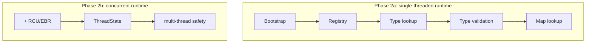

### Dependency graph

Dependencies flow downward and reverse edges are forbidden.

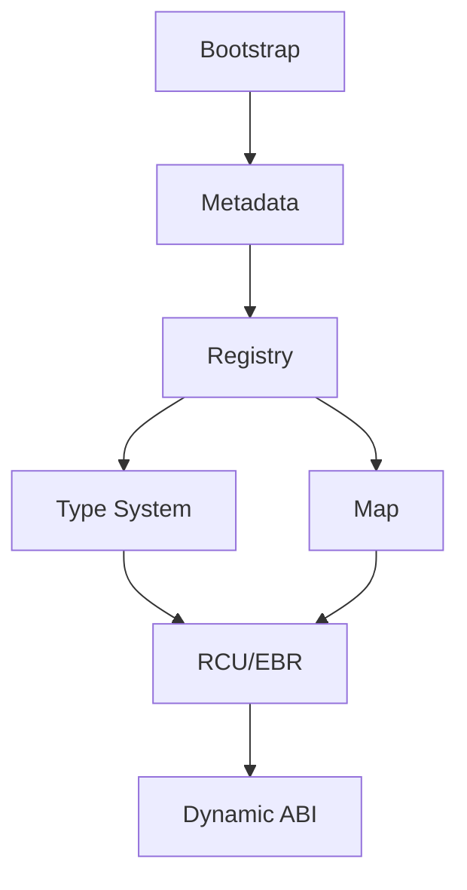

In particular, the following dependencies must not exist:

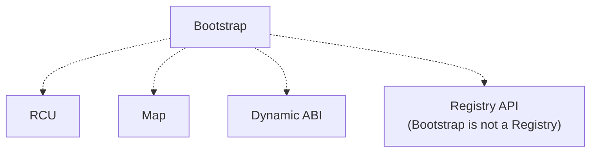

### State machine

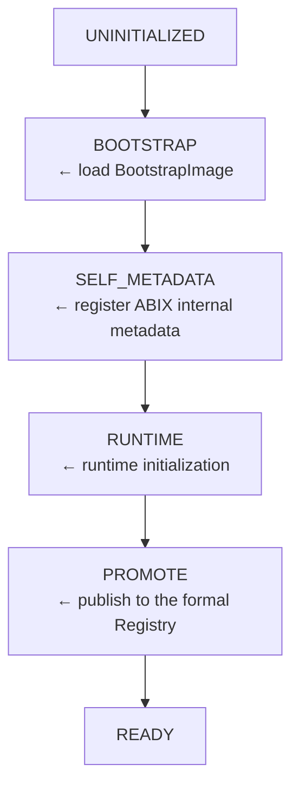

`BOOTSTRAP`, `SELF_METADATA`, `RUNTIME` and `PROMOTE` exist only on the
initialization thread. Ordinary user threads observe only `NOT_READY` and
`READY`, so the hot path carries no state-check overhead.

### Thread-safety handoff

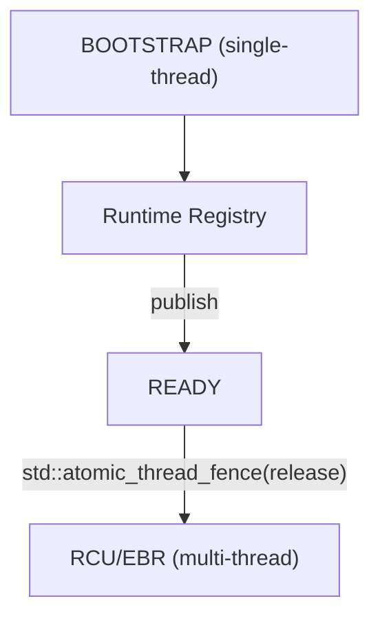

```cpp
initialize();

// publication point
std::atomic_thread_fence(std::memory_order_release);
state.store(State::READY, std::memory_order_release);

// other threads
if (state.load(std::memory_order_acquire) == State::READY) {
    // Registry fully initialized
}
```

This check happens only when a thread first enters the runtime, never on each
registry lookup.

### RCU bootstrap ordering

Type metadata and the registry come before RCU, not after:

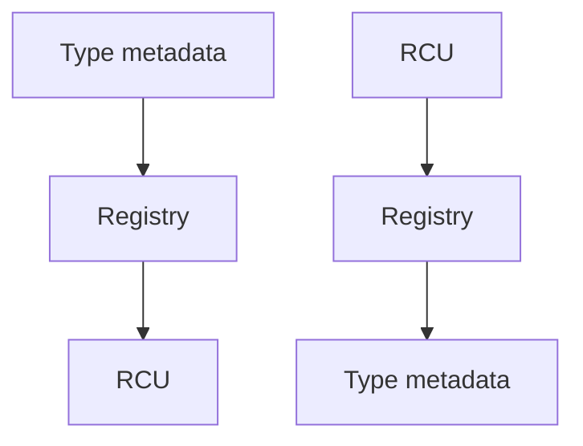

Before RCU initialization, `ThreadState`, `RetiredNode` and `Epoch` are
ordinary C++ types. After RCU initialization they are registered in the ABIX
registry, after which RCU itself can consume ABIX metadata.

## Map model

`Map` is one semantic model with two implementation paths, not two systems:

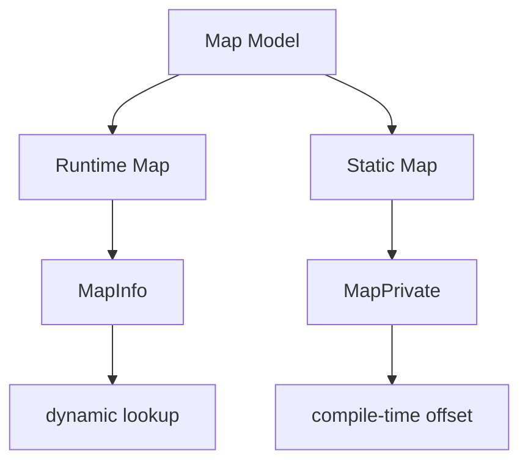

| Scenario | Path |
|----------|------|
| Debug | `MapInfo` → runtime validation |
| Release | `MapPrivate` → direct access (zero-cost) |

`MapPrivate` is implemented after the runtime map: the runtime semantics are
validated first, then an equivalent static form is generated. The two are
verified to agree on copy and default operations; other conversions require a
native converter.

## Self-hosting closure

### The kernel is the trusted base

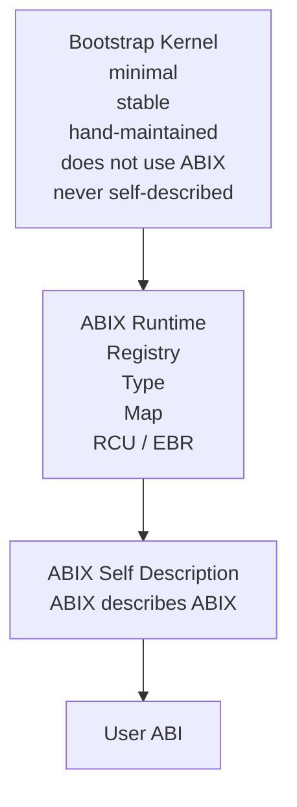

The bootstrap kernel is the trusted computing base (TCB). Like BIOS/firmware or
compiler bootstrap stage 0, it is never required to describe itself. See
[`self-hosting.md`](self-hosting.md).

### Verified capabilities

* generation chain from C++ headers to `.abix` to static runtime descriptors;
* type, field, function, layout, `Hash128` and symbol metadata;
* extraction of namespaces, aliases, bitfields, inheritance, access levels,
  template specializations and calling conventions;
* `RuntimeRegistry` registration, `TypeId` lookup and the canonical registry
  bridge;
* compatibility / map IR and the `MapPrivate` constexpr operation plan;
* a separate provider process and JSON-lines IPC;
* `amc/self.abic.toml` generates `amc_core.abix` from a clean directory, and
  the generated C++ descriptors register into `RuntimeRegistry`; lookups for
  `type_of<amc::AbiModule>()`, `type_of<amc::MapOperation>()` and
  `type_of<amc::CompatibilityRecord>()` resolve.

### Boundaries

The AMC verification shows that the compiled AMC stage can parse its own core
IR and emit consumable ABIX metadata and C++ projections. It is not strict
source-level self-hosting in the compiler-theory sense: the build and semantic
extraction of `amc-cpp` still depend on Clang/LLVM, and the generated
descriptors do not yet build `amc-cpp` itself.

### Self-hosting bootstrap

1. `abix/self/abix_self.abic.toml` covers the core type, registry, map,
   bootstrap and RCU/EBR types.
2. AMC generates `build/abix_self.abix` from a clean build directory and emits
   `abix_self_metadata.hpp` for consumers.
3. The generated `ModuleDescriptor` is attached through
   `RuntimeRegistry::register_module()`; only two bootstrap kernel wire records
   remain in `MetadataRegistry::bootstrap_self()` as the TCB.
4. Closure consumers verify `type_of<TypeInfo>()`, `type_of<RegistryEntry>()`,
   lookup by `TypeId` and name, the canonical registry bridge, and that
   generated descriptor size/alignment match the native types.
5. `ThreadState`, `RetiredNode`, `RetiredBatch`, `Epoch` and `rcu_domain` are
   included in the artifact; runtime type metadata comes from the generated
   module rather than hand-written metadata, with the two bootstrap kernel
   wire records as the only intentional TCB.

Acceptance criterion: a single build from a clean directory produces the
self-description artifact and the C++ projection; the runtime depends only on
the bootstrap kernel and that generated projection to register descriptors and
query ABIX's own core and RCU/EBR types. A runtime binary loader for `.abix` is
outside this stage.

## Milestones

The ABIX runtime bootstrap milestones are complete.

| Milestone | Scope | Status |
|-----------|-------|--------|
| M0 — ABI model | `TypeId`, `TypeDesc`, `TypeLayout`, `Field`, `Function`, `Symbol`, `MapInfo`, `Compatibility`, `ABI Identity`, `Target`; `Hash128` with TypeHash ≠ LayoutHash; RCU deliberately absent | Complete |
| M1 — `.abix` v0 | header, type/field/function tables (initial inline sequential serialization); `write_abix` / `read_abix` round-trip; `amc inspect` / `amc validate`; Section Directory with String Table dedup, offset/index references, length, flags and optional sections; ABI Identity, Target, Hash Table and Symbol Table sections | Complete |
| M2 — Bootstrap kernel | `BootstrapImage`, `BootstrapRecord`, loader; no allocator, registry, RCU or ABIX API; wire format with explicit endianness and padding | Complete |
| M3 — Runtime registry | type registration, lookup and validation; `Bootstrap → Registry → Type lookup` closed loop; registry self-description (`RegistryEntry` / `BootstrapMetadata`) | Complete |
| M4 — Type self-hosting | formal `.abic` self-description configuration for ABIX core types; AMC-generated `.abix` metadata for core types, `RegistryEntry` and `TypeDescriptor`; static descriptors registered in `RuntimeRegistry`; verified `RuntimeRegistry::type_of<TypeDesc>()` returns its own metadata | Complete |
| M5 — Compatibility | hash descriptor, hash domain, algorithm version and runtime key layering; `TypeHash`, `LayoutHash`, `SignatureHash` and compatibility checks | Complete |
| M6 — Runtime Map | `MapInfo` and dynamic map runtime conversion | Complete |
| M7 — RCU / EBR | AMC extraction of `ThreadState`, `Epoch` and `RetiredNode` layout and membership; RCU/EBR types registered in the runtime registry; `ABIX Registry → ABIX RCU → ABIX Registry` initialization loop; lookup and retire proven not to depend on unregistered metadata | Complete |
| M8 — MapPrivate | generated `MapPrivate<A, B>` static conversion; semantic equivalence with the runtime map (copy/default; conversions require a native converter) | Complete |
| M9 — Full self-hosting | type, registry, map, RCU, compatibility and bootstrap metadata all described by ABIX; self-description artifact regenerated from a clean build directory; runtime paths forbidden from depending on hand-written non-bootstrap metadata; runtime self-hosting achieved | Complete |

## Key design decisions

| Decision | Choice | Rationale |
|----------|--------|-----------|
| Number of phases | four, with Phase 0 freezing the meta-model | avoids late rework |
| `TypeInfo` | split into `TypeId` + `TypeDesc` + `TypeLayout` | separation of concerns; more flexible compatibility |
| Hash | abstracted as `Hash128` with a replaceable algorithm | avoids fixing FNV-1a as the final standard |
| TypeHash vs LayoutHash | distinct | foundation of the compatibility system |
| Bootstrap kernel role | static metadata loader, not a simplified registry | prevents the kernel from growing |
| Bootstrap ABI | explicitly defined wire format | cross-compiler stability |
| Development order | single-threaded registry before RCU/EBR | proves the loop before adding concurrency |
| Dependency graph | strict DAG, no reverse dependencies | clear architecture, no cycles |
| State machine | multiple states on the init thread; user threads see only NOT_READY/READY | zero hot-path overhead |
| `MapPrivate` timing | after the runtime map | validate semantics, then generate an equivalent static form |
| Bootstrap self-description | never required | the kernel is the TCB, like BIOS/firmware |
| `.abix` introduction | designed in from Phase 0 | shared ABI description across processes and languages |
