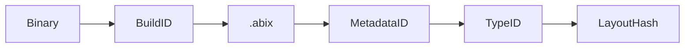
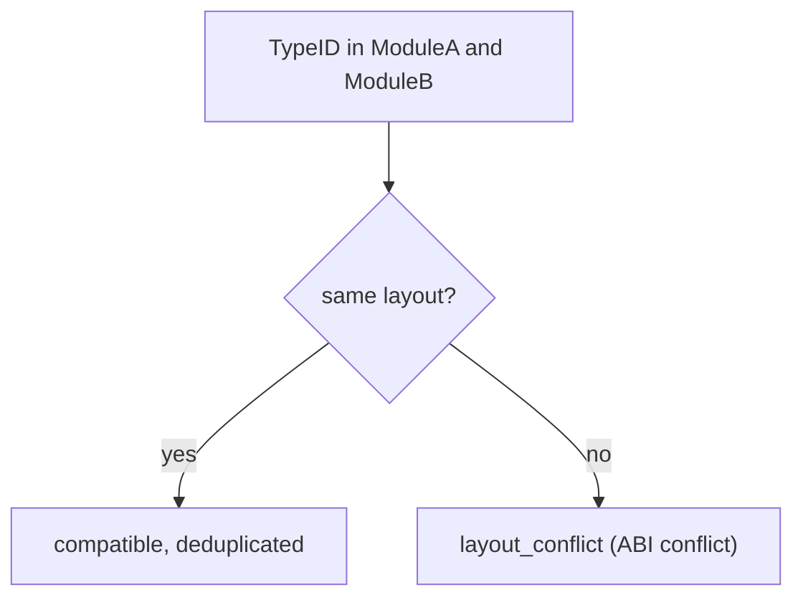

# ABI Identity & Compatibility

ABIX separates identities that are often conflated. Keeping them distinct makes
"is this the same type?" and "can I safely use this binary?" precise questions.

## Four identities

| ID | Meaning | Question it answers |
|----|---------|---------------------|
| **TypeID** | semantic type identity (128-bit) | is this the same type? |
| **LayoutHash** | physical layout identity | is the memory layout compatible? |
| **BuildID** | binary build identity | which artifact belongs to this binary? |
| **MetadataID** | metadata content identity | is this metadata image intact? |

Lookup chain:

* `TypeID` is name-independent: two modules may spell the same type differently
  and still share a TypeID. Names are diagnostic only.
* `LayoutHash` covers size, alignment and field offsets/types — the part that
  actually decides whether a call is safe.
* `BuildID` comes from the ELF `.note.gnu.build-id` (or is injected); it indexes
  the symbol server.
* `MetadataID` is a hash over the metadata region content (desc + hash + names)
  and detects tampering.

## Compatibility kinds

`amc compatibility` and `amc query --compatible` classify each type:

| Kind | Meaning |
|------|---------|
| `identical` | same TypeID and same LayoutHash |
| `layout_compatible` | same effective layout |
| `map_compatible` | layout differs but a mapping exists |
| `incompatible` | no safe use without an adapter |

`amc verify` is stricter: **any** difference — including *added* types or
functions — counts as drift, because widening the ABI surface must be an
explicit decision.

## Load-time cross-module validation

When a `RuntimeRegistry` registers modules, the same TypeID must resolve to the
same LayoutHash:

Compatible duplicates are shared; conflicting layouts are rejected. This is the
runtime implementation of the ABI boundary.

## Source origin

For go-to-definition, `.abix` may carry an optional, debug-only `sources`
section mapping `TypeID → file:line:column`. It is **excluded from `abi_hash`**
— declaration sites are diagnostic, not ABI identity.
