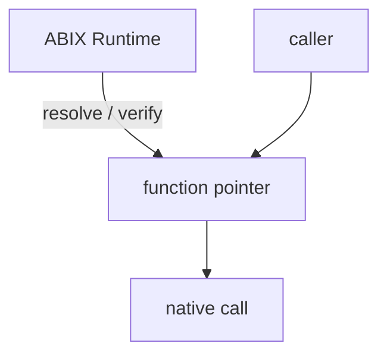
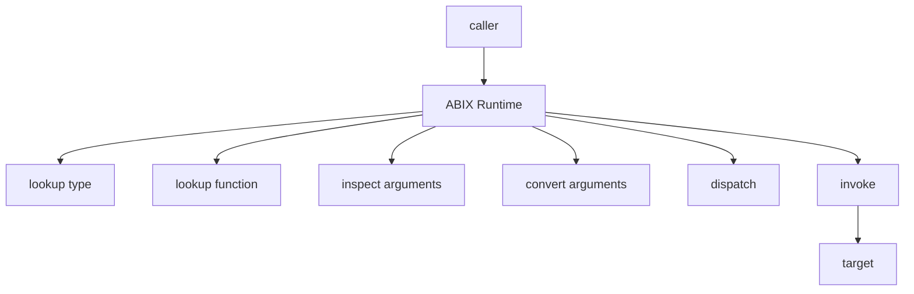
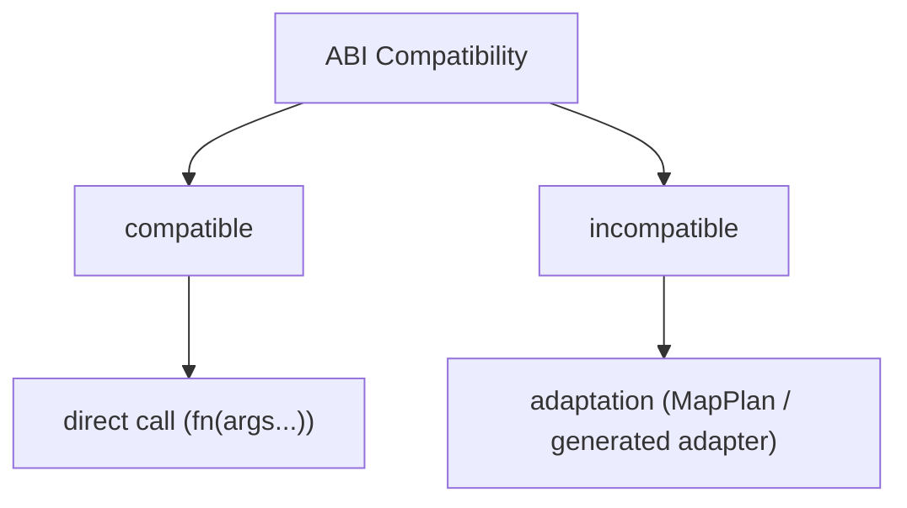
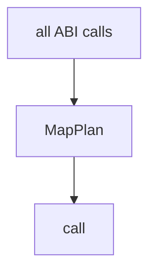
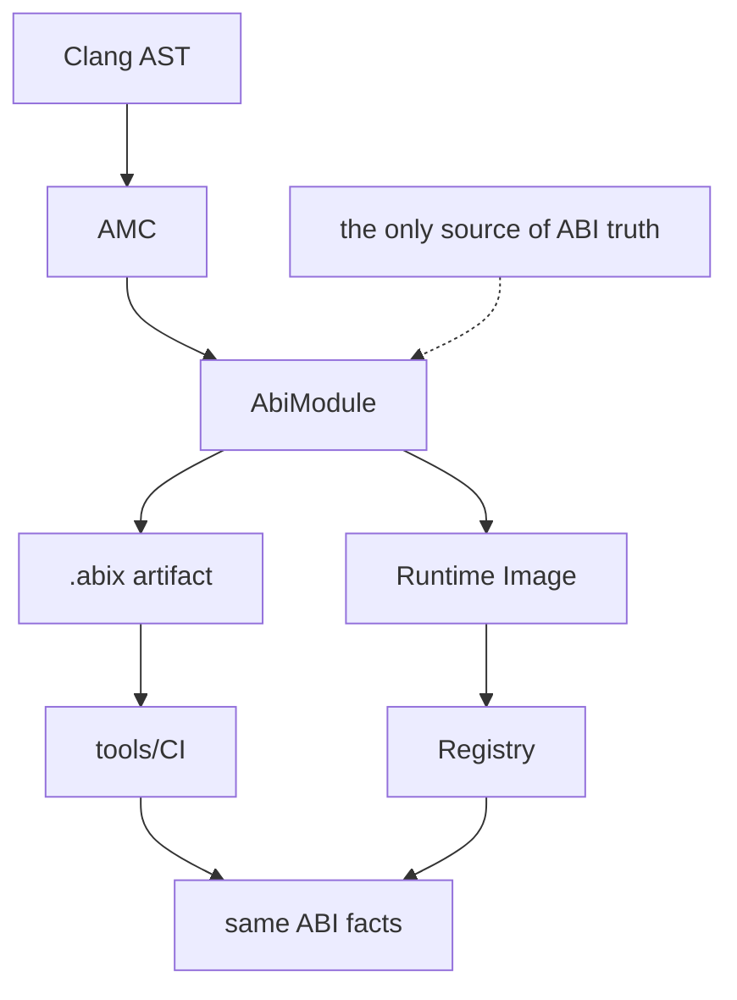
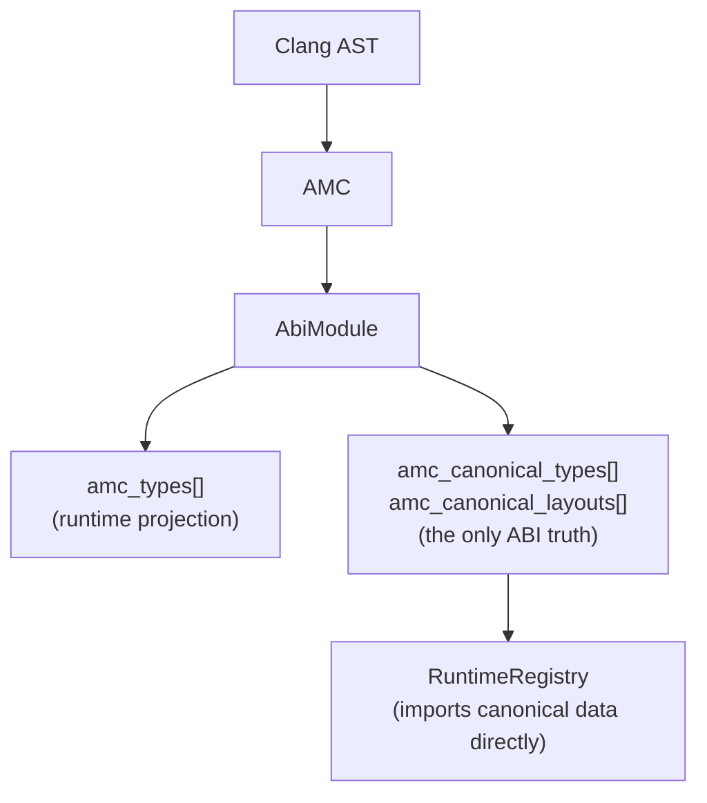
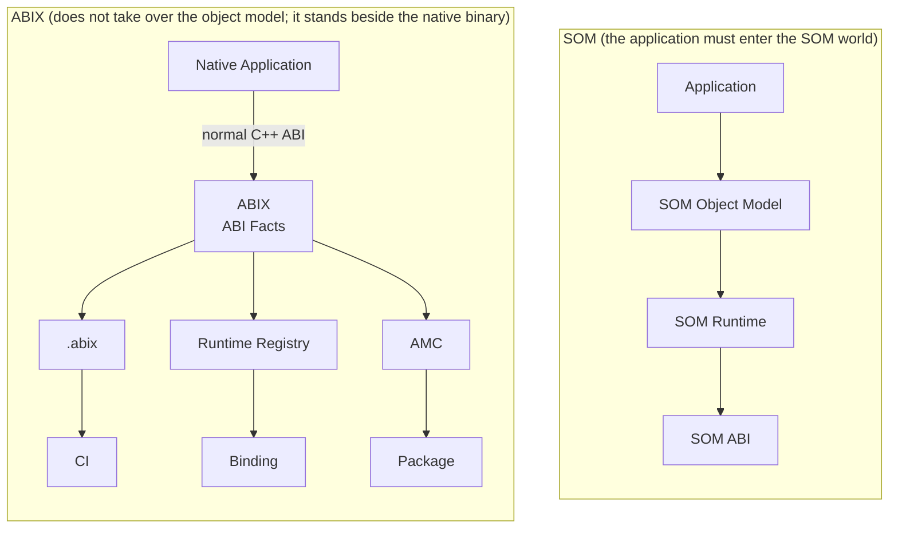
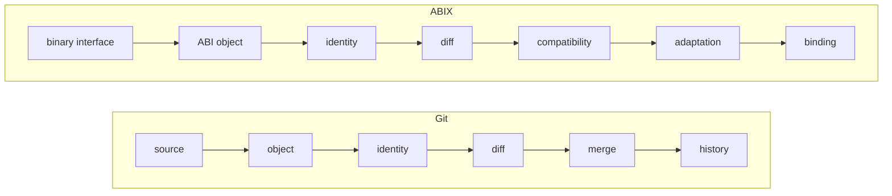
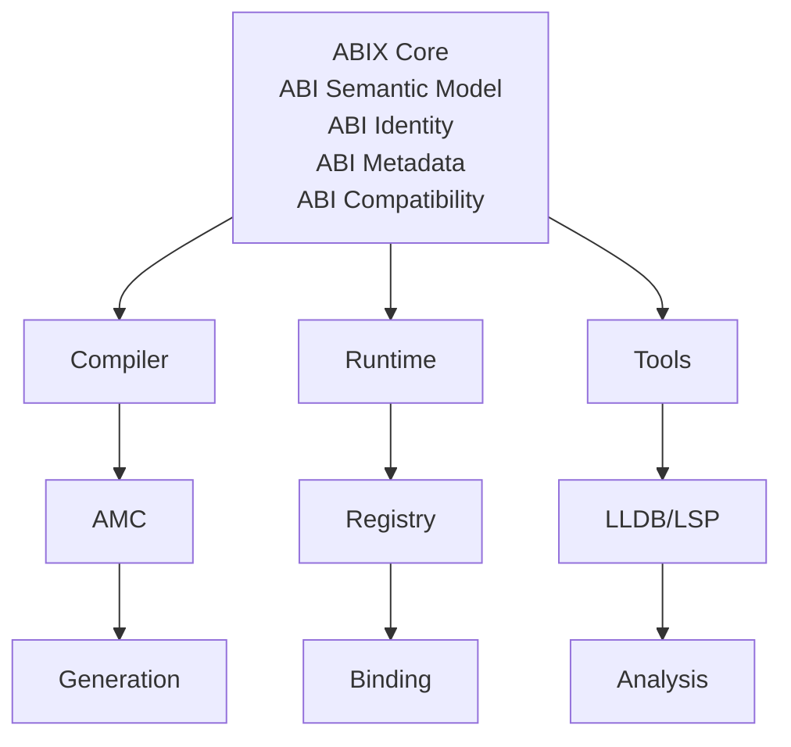

# Design Notes

<p align="center">
  <a href="design-notes_zh.md">中文</a> · English
</p>

<details>

<summary>Contents</summary>

- [Design Principles](#design-principles)
- [Development History](#development-history)

</details>

ABIX addresses type-safe function calls across DLL and shared-library boundaries. A stable
function table, compile-time signature hashing and version tokens replace the manual,
string-and-pointer resolution performed with `GetProcAddress` and `dlsym`. Two subsystems
grew around that core: MICS, a dual-track reflection library, and AMC, an ABI metadata
compiler. ABI truth converges into a language-independent `.abix` artifact.

This page collects the project's design principles and its development history. The
principles define the boundaries the architecture must not cross; the history records the
stages through which the current shape emerged.

## Design Principles

### The Anti-SOM/CORBA/COM Stance

The problem ABIX originally solves is narrow: type-safe function calls across DLL and
shared-library boundaries. Without explicit constraints, an implementation of that problem
drifts easily into a new VM or object model and repeats the mistakes of SOM, COM and CORBA.
The five principles below act as an architectural firewall rather than as descriptions of
the current implementation: any new feature that crosses one of these boundaries is
reviewed or rejected.

### Principle 1: The Runtime Establishes Relationships, It Does Not Execute Them

> The runtime may participate in binding, verification and adaptation construction, but it
> must not participate in the steady-state execution path of a compatible call.

The permitted architecture resolves and verifies, then hands the caller a function pointer;
the call itself is a native call.



The forbidden architecture places the runtime between caller and target and makes it look up
types and functions, inspect and convert arguments, dispatch and invoke on every call. The
first is the responsibility boundary of dynamic linking; the second slides towards a VM, an
object runtime or an RPC runtime.



Constraint: the hot path of the typed handle is a direct function pointer call. It performs
no type lookup, argument checking or dynamic dispatch; the runtime takes part only during
resolution.

### Principle 2: ABIX Is Not an Object Model

> ABIX describes existing native objects; it does not define a new type system that objects
> must conform to.

| | Object model | ABI fact model |
|---|---|---|
| Responsibility | define types, manage types, execute type semantics | describe types, identify types, verify types, compare types |
| Question | "how is an object constructed, inherited, dispatched?" | "what is this thing's ABI identity, how much space does it occupy, how is it laid out?" |
| User | application code must enter the model | native binaries stand beside it, unmodified |

The core records answer ABI facts. `TypeDesc` identifies a type and points at its layout;
`TypeLayout` records size, alignment, field range and layout hash. There is no
`create_object()`, `destroy_object()` or `dispatch_virtual()`.

```cpp
struct TypeDesc {       // 32 bytes
    TypeId id;          // what it is
    uint32_t flags;
    uint32_t name_offset;
    uint32_t layout_index;
};

struct TypeLayout {     // 32 bytes
    uint32_t size;      // how much space it occupies
    uint32_t align;
    uint32_t field_begin;
    uint32_t field_count;
    LayoutHash layout_hash;
};
```

Terminology: the project uses **ABI Fact Model** or **ABI Semantic Model**. "ABIX Type
System" is avoided because it suggests an object model.

### Principle 3: Adaptation Is Not the Default Call Path

> Compatible ABI → direct native call. Incompatible ABI → explicit or generated adaptation.



The forbidden shape routes every call through a plan:



`MapPlan` is explicit opt-in. The default path is a direct call with no conversion overhead;
type adaptation is triggered only when a plan is constructed and applied explicitly:

```cpp
// default path: direct call, zero conversion:
auto add = dll_func<int(int, int)>(lib, "add");
int result = add(2, 3);

// type adaptation is triggered only on explicit use:
MapPlan plan(info, ops, count);
plan.apply(src_layout, tgt_layout, src_fields, tgt_fields, target, source);
```

The basic semantic is therefore not "convert automatically" but "decide first whether the call
can be made directly; only if it cannot, enter adaptation". This resembles a linker: direct
binding versus relocation, PLT and resolver.

### Principle 4: ABIX Is Not Debug Information

> ABI facts are not source or debug facts. `.abix` must never become "DWARF but smaller".

| | DWARF (debug ontology) | ABIX (ABI ontology) |
|---|---|---|
| Answers | "where did this come from?" | "what binary contract does this expose?" |
| Describes | source, file, line, scope, variable, expression, call frame, inlining, macros | module, symbol, type, layout, function, parameter, calling convention, ownership, target, ABI version, compatibility |

Both may describe the same `Foo`:

```text
DWARF:
  Foo → foo.cpp:37

ABIX:
  Foo
    TypeID = ...
    Size = 32
    Align = 8
    LayoutHash = ...
    Field_count = 3
    ...
```

ABIX must not know what `foo.cpp:37` is.

Constraint: names are stripped, and the metadata modes (Debug / RelWithDebInfo / Release)
exist to keep `.abix` from inflating into DWARF. Any proposal to add source locations,
template instantiation paths or macro expansion history to `.abix` is rejected. See
[`metadata_modes.md`](metadata_modes.md).

### Principle 5: Single Source of ABI Truth

> There must be exactly one source of ABI truth. The runtime must never invent ABI semantics.



Two constraints define this boundary.

1. **`RuntimeRegistry` is a projection of `AbiModule`, not a second type system.** A
   projection may drop information but may not create ABI facts. AMC knows a type's name,
   TypeID, layout, fields, source origin and diagnostics; the runtime needs only TypeID,
   LayoutHash and a runtime pointer. That reduction is a legal lowering. The runtime may not
   define a new TypeID or LayoutHash of its own.

2. **The `AbiModule` → `.abix` / runtime projection is one-way.** It is not permitted for
   AMC to consider `Foo`'s ABI to be A, the runtime to consider it B, LLDB C and the package
   manager D.

Consistency: `ModuleDescriptor` carries both the runtime projection and the canonical arrays
generated by AMC. `RuntimeRegistry::register_module()` imports the canonical
`TypeDesc`/`TypeLayout` data directly instead of rebuilding it, and `valid()` checks that the
runtime projection and the canonical data agree on `type_id`, `size`, `align` and
`layout_hash`.



### Boundary Risk Checklist

| Risk | Principle | Severity | Countermeasure |
|------|-----------|----------|----------------|
| Type checking added to the `operator()` hot path | 1 | high | keep the direct `fn(args...)` call |
| Object lifetime management introduced in ABIX | 2 | high | describe, do not manage |
| Implicit conversion (`dll_func` calling `MapPlan` automatically) | 3 | medium | `MapPlan` must be constructed explicitly |
| `.abix` begins to store source line numbers or variable scopes | 4 | medium | code review |
| The runtime registers types that AMC did not generate | 5 | high | canonical hash validation on `.abix` |

### ABIX and SOM: Historical Difference



### "Git for Binary Interfaces", Made Precise



Git turns source evolution into a computable object; ABIX turns binary interface evolution
into a computable object. The runtime is only one consumer of that object.

### ABIX as a Semantic Layer

With the five principles in place, the central milestone is not the runtime but the ABI
semantic model.



Describing ABIX as "that runtime" is inaccurate: ABIX is an ABI semantic layer, and the
runtime is one of its execution carriers.

## Development History

The project moved through seven stages, from framing the problem to an engineering quality
system. The table summarizes the stages; the sections that follow record the decisions and
constraints of each.

| Stage | Focus | Key technical points |
|-------|-------|----------------------|
| 1 | Problem framing and option selection | raw resolution, layered resolution validation, compile-time FNV-1a, trivially copyable export table |
| 2 | ABIX core library | stable function table, calling convention in the signature, typed handles, version coexistence, RCU/EBR unload safety, resource lifetime, cross-boundary closures |
| 3 | MICS reflection library | dual-track compile-time and runtime reflection, `URefl::vector`, shared `type_hash<T>()` |
| 4 | ABI metadata layer | `.abix` / `.abic`, layered TypeId/LayoutHash/SignatureHash/ABIHash, Hash128, mmap-friendly layout |
| 5 | AMC metadata compiler | minimal ABI-IR core, Clang AST front end, projection back end, provider process isolation, bootstrap |
| 6 | Micro-RCU performance engineering | role-based benchmarks, measured cache-line isolation, epoch batching, experimental methodology |
| 7 | Engineering quality system | plugin matrix, tests, benchmarks, CMake and cross-platform reproducibility |

### Stage 1: Problem Framing and Option Selection

`GetProcAddress` and `dlsym` resolve a symbol as a raw string plus a raw pointer. They
perform no signature validation, so a type mismatch becomes undefined behavior; they are
unaware of same-name differences, calling conventions and CRT differences; and handle
semantics are fragile under hot reload and unload.

Two routes were compared: introduce reflection or IDL to generate a boundary description, or
keep a plain C structure plus headers and move validation to compile time. The second route
was adopted as the primary approach, with the first treated as the natural later evolution of
the metadata layer. The export-table macro system (`SKL_ABIX_DEFINE_TABLE`,
`SKL_ABIX_ENTRY*`) turns function registration into a declaration. Compile-time FNV-1a
expresses the signature (`sig_t`), the name hash (`name_hash`) and the version token
(`version_t`); resolution validates in layers: hash, then `strcmp`, then version, then
signature.

FNV-1a was chosen because it is deterministic, evaluable in `constexpr`, and stable across
compilers and standard libraries; `std::hash` and `typeid` have no stable binary semantics.
The `entry` and `table` structures are trivially copyable and standard-layout so that
different compilers and CRTs can interpret the same data.

### Stage 2: ABIX Core Library

The core library implements the registration, resolution, call, resource and unload-safety
layers.

1. **Registration macros and calling conventions.** `Cdecl` and `Stdcall` are mixed into the
   signature hash at compile time as a `cc::tag`, so a wrong calling convention is reported
   as `sig_mismatch` during resolution rather than crashing at run time.
2. **Typed handles.** `dll_func<Sig, CC>` wraps `(library, name, version)`; `operator()`
   automatically enters and leaves the read-side critical section, and errors converge to a
   thread-local `last_error()`.
3. **Signature and type hashes.** `type_sig` provides a unified type signature, with
   composite hash specializations for `*_dll_ptr` and `function_dll`, so which module owns an
   object and how it may be held become part of the ABI.
4. **Version coexistence and evolution.** Several versions of the same function name coexist
   through `SKL_ABIX_VERSION`, letting old and new clients each take what they need;
   `handle_id()` is stable across hot reload.
5. **Unload safety (RCU/EBR).** The Linux kernel RCU idea is ported to user space as a
   reader-side lock-free read-write lock. Readers do not take a lock and do not block each
   other; a writer that wants to unload waits until all readers have left (epoch plus grace)
   before reclaiming. It layers on top of an ownership/RAII model in which the creator also
   releases, adapting single-threaded lifetime management to multiple threads. `unload()` is
   therefore mark, wait for readers to drain, reclaim. Timeout policies are `Safe`,
   `ForceUnload` and `ForceLeak`; `Safe` prefers a zombie over a crash. Atomic operations use
   the compiler builtins `__atomic_*` and deliberately avoid `<std::atomic>`, whose layout
   varies by STL and would break cross-module ABI.
6. **Lookup acceleration.** Small tables are scanned linearly; large tables (64 entries and
   above) use an open-addressing hash index at roughly 50% load, built once at load time with
   no runtime initialization races. Hot functions, the 80/20 case, are supported.
7. **Resource lifetime.** Borrowing from Rust ownership and lifetimes, the
   `unique`/`ref`/`shared`/`weak`/`view_dll_ptr` smart-pointer family is internally a
   standard-layout, trivially copyable handle plus deleter, paired with DLL-side deleters and
   `abi_alloc`/`abi_free`. Objects are created by the DLL and freed by the DLL; ownership does
   not escape the module. Lifetimes were first made correct single-threaded and then handed
   to the RCU layer for multithreading.
8. **Cross-boundary closures.** `function_dll` is a fixed 8-byte, copyable and movable value
   with magic-number validation, carrying host callbacks into a DLL safely.

### Stage 3: MICS Dual-Track Reflection

A purely static reflection layer is zero-overhead but fixed; a purely dynamic one is flexible
but resource-heavy. MICS implements the same metadata semantics twice, once at compile time
and once at run time.

* **Static track (`mics::ct` / SRefl).** `type_list` plus a functional type library
  (`map`/`filter`/`fold`/`unique`), and `field_traits`/`fn_traits`/`enum_traits` to extract
  fields, methods and enumerations; `type_info<T>()` is `consteval`.
* **Dynamic track (`mics::rt` / DRefl).** A `Registry` singleton, `TypeInfo`,
  `FieldAccessor` (getter/setter), `MethodInvoker` and `Any` (16-byte small-buffer type
  erasure).
* **Shared utilities (`mics::utils` / URefl).** The ABI-stable immutable container
  `URefl::vector` (fixed `sizeof`, move-only, `malloc`/`free`, constructed only through
  `vector_builder`) is the uniform carrier for all reflection description data (fields,
  methods, parameters, enumerators) and the key to cross-compiler binary compatibility.
* **Hash consistency.** The static and dynamic tracks share `type_hash<T>()` as the single
  source of TypeId, so compile-time type identity and the identity found at run time are the
  same.

Declaring a struct and one registration macro yields runtime reflection, and
`register_dll_table` bridges a DLL export table to the reflection registry, so objects inside
a module are accessible to generic tools through reflection.

### Stage 4: ABI Metadata Layer

ABI truth should exist independently of any language and compiler, as a persistable artifact
that can be projected across languages and diffed.

* **Four hash layers.** `TypeId` answers whether two things are the same type; `LayoutHash`
  whether the layout is compatible; `SignatureHash` whether the call is compatible;
  `ABIHash` whether the artifact is consistent. `TypeHash ≠ LayoutHash` is the basis of
  compatibility and mapping: types with the same name may have different layouts, and
  size/align alone would miss field reordering.
* **`Hash128` abstraction with `HashDescriptor`.** FNV-1a is not hardwired; `Hash128{lo, hi}`
  together with algorithm, version and domain is recorded as schema information, so XXH3 or
  BLAKE3 can replace it later. Conversion across namespaces (MICS 64 to ABIX 128) must be
  explicit, and ABI identity must never be truncated to a single 64-bit value.
* **`.abix` v2 binary.** Little-endian, magic `ABIX`, header, section directory, and
  string/identity/type/field/function/parameter/symbol/hash sections. Strings are
  deduplicated as `(offset, length)`; symbols use a `(kind, index)` typed index. The artifact
  is directly `mmap`-able, and `validate` covers truncation, bad magic and out-of-range
  references.
* **`.abic` declarative configuration.** Build configuration is elevated to an ABI boundary
  declaration. `[[import]]` states where the ABI is taken from, and `[[export]]` states where
  `.abix` is written and which symbol subset is projected. Code generation is assigned to a
  separate `amc generate` step so that `.abix` stays language-independent.

`.abix` is the single source of ABI truth. The runtime can consume it through `mmap`, and the
same artifact can be projected into compile-time constants in several languages, uniting
dynamic ABI with static performance. See [`abix.md`](abix.md) and [`abic.md`](abic.md).

### Stage 5: AMC Metadata Compiler

`.abix` cannot be handwritten, so it is extracted automatically from source. Two questions
had to be answered together: which front end obtains ABI facts, and how to decouple front
end, core and back end.

* **AMC Core.** A minimal ABI-IR compiler core that builds, validates, hashes and serializes
  `.abix`. It knows neither Clang nor C++ syntax; keeping the core small means changing the
  language front end does not affect the artifact format.
* **C++ front end (Clang LibTooling/AST).** A `RecursiveASTVisitor` walks records, enums and
  functions; a compilation database is built from `compile_commands` or flags; explicit
  symbol filtering avoids parsing the whole project. It extracts field offsets
  (`getFieldOffset`), `sizeof`/`alignof`, bitfields, template instantiations, calling
  conventions, visibility, inheritance and base classes, and member-level exports
  (`Foo::method`).
* **C++ back end (projection).** Reads `.abix` and generates C++17 `constexpr` `TypeTraits`,
  TypeId constants, `LayoutInfo` and field offsets in the `amc_generated` namespace. The back
  end consumes the hashes and layouts already present in `.abix` and never recomputes them.
* **Provider process isolation.** `amc-cpp` is a standalone executable carrying the heavy
  Clang/LLVM dependency. `amc` schedules it as a subprocess instead of loading it as a
  `dlopen` plugin, because the Clang/LLVM plugin ABI is itself version-sensitive; process
  isolation keeps the main program clean. The interface is abstracted as a provider protocol,
  leaving extension points for Rust, Zig and C providers.
* **CLI driver.** `build`, `frontend`, `backend`, `inspect` and `validate` subcommands. The
  CMake integration (`amc_add_abi`) attaches `.abic → .abix → optional header` to an existing
  target's incremental build graph.
* **Bootstrap.** The ABI metamodel is frozen first (Phase 0); a minimal, static bootstrap
  kernel that uses neither ABIX, dynamic memory nor RCU acts as the equivalent trusted
  computing base, with strict DAG dependencies to avoid recursion.

The loop `C++ header → Clang AST → AbiModule → .abix → projection code` is closed;
round-trip tests and CTest keep the format stable, and `amc-dump` provides text and JSON
summaries. See [`amc.md`](amc.md) and [`self-hosting.md`](self-hosting.md).

### Stage 6: Micro-RCU Performance Engineering

Once the functionality was correct, `synchronize()` became noticeably slower as the number of
readers grew; shared cache-line write contention was the suspected cause.

* **Layered benchmarks.** Microbenchmarks first, then role-based benchmarks. The role-based
  configuration (N readers plus one writer) is the most representative; other configurations
  corroborate.
* **Bottleneck chain.** `synchronize → WriterLock → publish → global_epoch RMW → shared
  cache-line bouncing`. The shared atomic RMW in `_global_epoch.fetch_add` is the largest
  single point.
* **Cache-line isolation only for fields with measured contention.** `alignas(64) _epoch`
  gives a clear gain (about 43% on 20 threads); padding every field enlarges `sizeof` and
  hurts the cache, so global padding is not used.
* **Epoch advancement batching.** The default is B8, one epoch per 8 `synchronize` calls. B16
  is better for high-concurrency read-heavy workloads (about +24% on read-heavy 20 threads)
  but regresses write-heavy workloads slightly, because delayed advancement accumulates
  retired entries. The default therefore remains B8, with B16 as a platform-measured tunable.
* **Experiment methodology.** For single-point anomalies such as the thr16/thr32 collapse, a
  fine-grained neighborhood scan (14–18, 30–33) excludes system noise before a conclusion is
  drawn. Formal benchmarks report median, p90 and coefficient of variation rather than single
  values.

Steady-state unload and reclamation overhead is brought close to that of a direct call. The
work produced tuning guidance for read-mostly concurrent reclamation and the norm that batch
size is not an architectural constant but must be remeasured on the target platform. See
[`benchmark.md`](benchmark.md).

### Stage 7: Engineering Quality System

Testing, the plugin matrix, benchmarks and documentation keep fragile points such as
cross-module ABI valid after changes.

* **Tests.** Catch2 v3 covers load and unload, resource smart pointers, callback closures,
  version coexistence, lookup performance, hot-reload handle stability, calling-convention
  boundaries, RCU configuration, concurrent load and unload, and shutdown/zombie states.
* **Example plugin matrix.** Each plugin under `dlls/` verifies one class of behavior
  (math, versioning, signature checking, resources, callbacks, hot reload a and b, the
  stdcall boundary, the hot-function cache, shutdown) and acts as executable documentation of
  framework behavior.
* **Benchmarks.** Google Benchmark covers function call overhead, lookup, reload, atomic
  versus builtin, EBR grace/retire, false sharing and cross-table resolution, together with
  topology and workload infrastructure.
* **Build.** CMake provides unified `abi_add_dll` and `abi_add_test`; Linux builds hide
  symbols and use `--no-undefined`; debug builds add ASan/TSan; DSOs, executables and dSYM are
  handled per platform, and toolchain-variant DLLs are supported.

ABI stability becomes an engineering fact enforced jointly by the plugin matrix, the tests
and the benchmarks, and `dlls/` gives a fast way to understand a feature.
