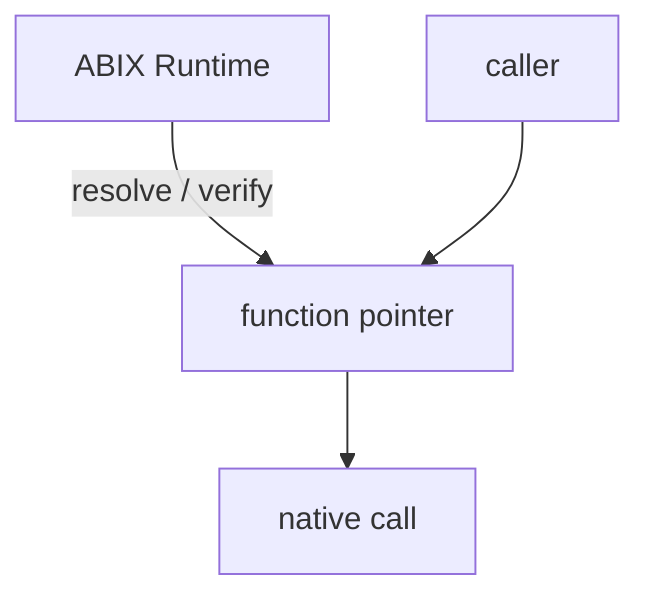
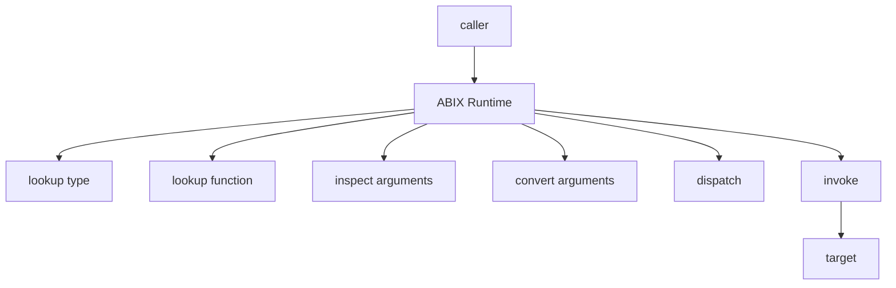
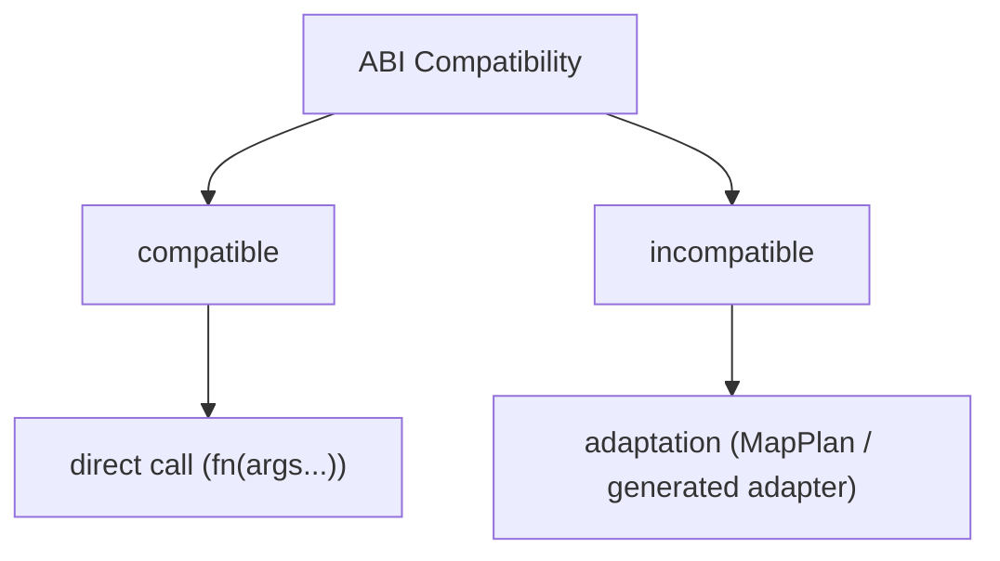
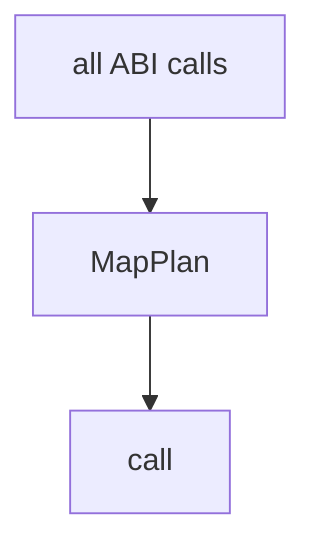
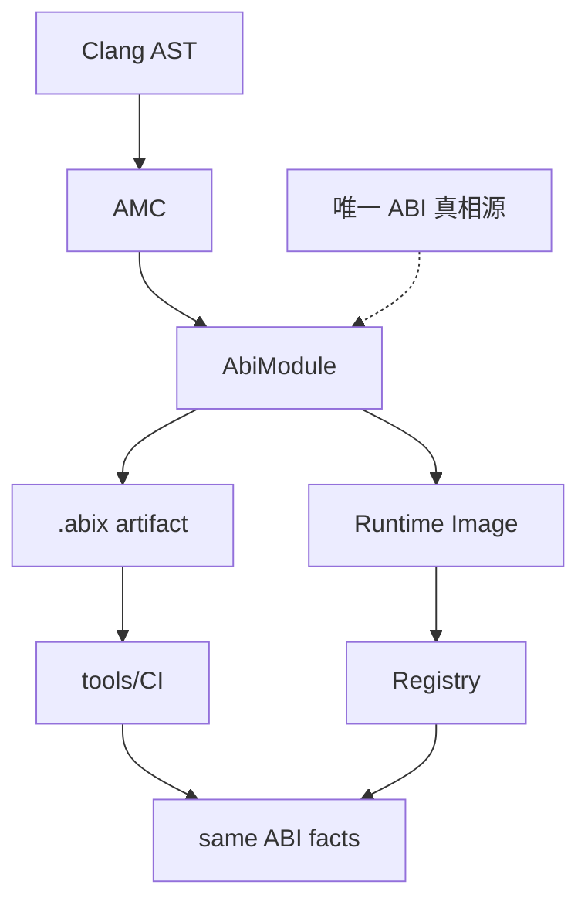
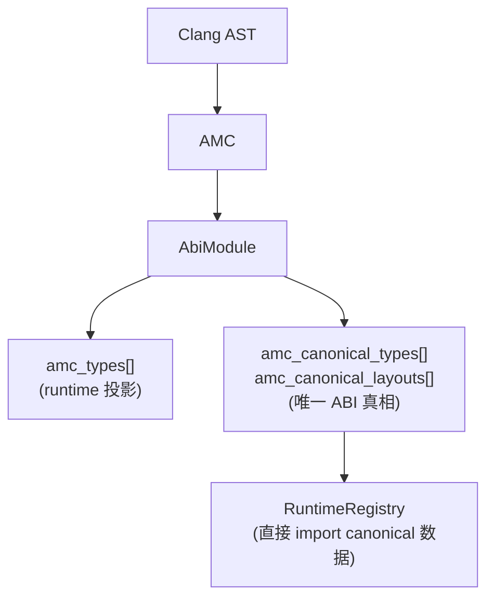
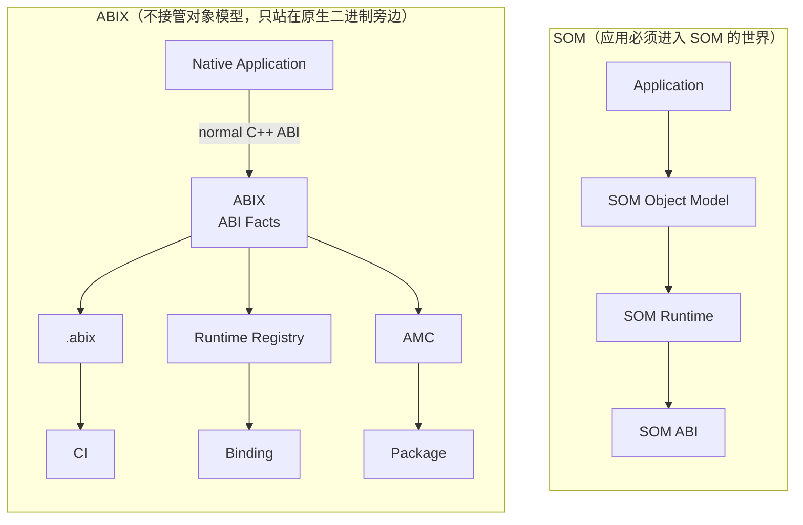
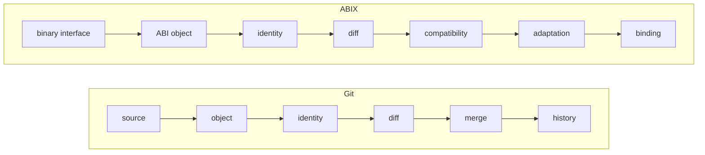
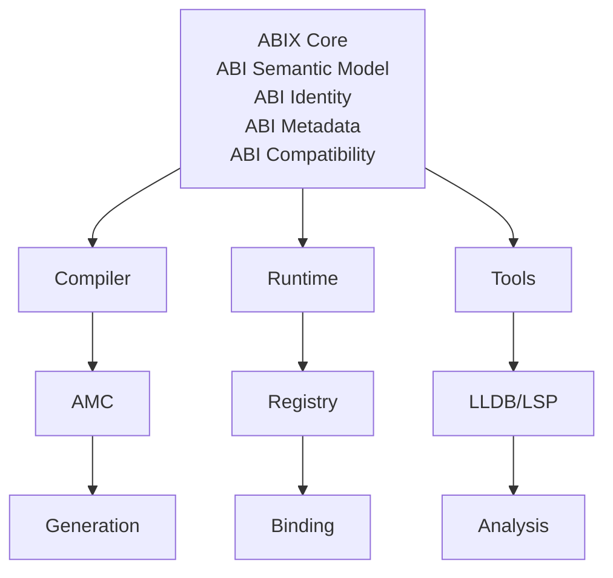

# 设计说明

ABIX 面向跨 DLL / 共享库边界的类型安全函数调用，用稳定函数表、编译期签名哈希与版本令牌替代
`GetProcAddress` / `dlsym` 的手工字符串加裸指针解析。围绕这一核心长出两个子系统：双轨反射库
MICS 与 ABI 元数据编译器 AMC，"ABI 真相"收敛到语言无关的 `.abix` 产物。

本页汇总项目的设计原则与发展历程。原则界定架构不可跨越的边界；历程记录当前形态经由的各个阶段。

## 设计原则

### 反 SOM/CORBA/COM 立场

ABIX 解决的原始问题是狭义的：跨 DLL / 共享库边界的类型安全函数调用。若不施加显式约束，这类
实现很容易滑向一个新的 VM 或对象模型，重蹈 SOM、COM、CORBA 的覆辙。以下五条原则是架构防火墙，
而不是对当前实现的描述：任何跨越这些边界的新功能都应被重新审视或拒绝。

### 原则 1：Runtime 建立关系，但不执行关系

> Runtime 可以参与绑定、校验与适配构造，但不能参与兼容调用的稳态执行路径。

允许的架构先 resolve / verify，再把函数指针交给调用方；调用本身是原生调用。



禁止的架构把 Runtime 放在调用方与目标之间，在每次调用时查找类型与函数、检查与转换参数、分发并
调用。前者是 dynamic linking 的职责边界；后者开始滑向 VM、对象运行时或 RPC 运行时。



约束：类型化句柄的热路径直接调用函数指针，不做类型查询、参数检查或动态分发；Runtime 只在
resolve 阶段参与。

### 原则 2：ABIX 不是对象模型

> ABIX 描述既有的原生对象，不定义一套对象必须符合的新类型系统。

| | 对象模型 | ABI 事实模型 |
|---|---|---|
| 职责 | 定义类型、管理类型、执行类型语义 | 描述类型、标识类型、验证类型、比较类型 |
| 问题 | "对象如何构造？如何继承？如何分发？" | "这个东西的 ABI identity 是什么？占多少空间？怎么布局？" |
| 使用者 | 应用代码必须进入该模型 | 原生二进制站在旁边，不被侵入 |

核心记录回答的是 ABI 事实。`TypeDesc` 标识类型并指向其布局；`TypeLayout` 记录大小、对齐、
字段范围与布局哈希。没有 `create_object()`、`destroy_object()` 或 `dispatch_virtual()`。

```cpp
struct TypeDesc {       // 32 字节
    TypeId id;          // 是什么
    uint32_t flags;
    uint32_t name_offset;
    uint32_t layout_index;
};

struct TypeLayout {     // 32 字节
    uint32_t size;      // 占多少空间
    uint32_t align;
    uint32_t field_begin;
    uint32_t field_count;
    LayoutHash layout_hash;
};
```

术语规范：项目使用 **ABI Fact Model** 或 **ABI Semantic Model**。避免使用 "ABIX Type
System"，因为它会暗示一种对象模型。

### 原则 3：适配不是默认调用路径

> 兼容 ABI → 直接原生调用。不兼容 ABI → 显式或生成的适配。



禁止的形态让所有调用都经过计划：



`MapPlan` 是显式 opt-in。默认路径是零转换开销的直接调用；只有显式构造并 apply 计划时才触发
类型适配：

```cpp
// 默认路径——直接调用，零转换开销：
auto add = dll_func<int(int, int)>(lib, "add");
int result = add(2, 3);

// 类型适配只在显式使用时才触发：
MapPlan plan(info, ops, count);
plan.apply(src_layout, tgt_layout, src_fields, tgt_fields, target, source);
```

因此基本语义不是"自动转换"，而是"先判断能不能直接用；不能直接用才进入 adaptation"。这接近
linker 的行为：直接绑定 vs. relocation / PLT / resolver。

### 原则 4：ABIX 不是调试信息

> ABI 事实不等于源码 / 调试事实。`.abix` 绝不能变成"更小的 DWARF"。

| | DWARF（调试本体） | ABIX（ABI 本体） |
|---|---|---|
| 回答 | "这个东西从哪来？" | "它暴露的二进制契约是什么？" |
| 描述 | source、file、line、scope、variable、expression、call frame、inline、macro | module、symbol、type、layout、function、parameter、调用约定、ownership、target、ABI version、compatibility |

两者可能描述同一个 `Foo`：

```text
DWARF:
  Foo → foo.cpp:37

ABIX:
  Foo
    TypeID = ...
    Size = 32
    Align = 8
    LayoutHash = ...
    Field_count = 3
    ...
```

ABIX 不应该知道 `foo.cpp:37` 是什么。

约束：名字被剥离，三档 metadata 模式（Debug / RelWithDebInfo / Release）的存在就是为了防止
`.abix` 膨胀成 DWARF。任何向 `.abix` 中加入源码位置、模板实例化路径或宏展开历史的提议都应被
拒绝。见 [`metadata_modes_zh.md`](metadata_modes_zh.md)。

### 原则 5：单一 ABI 真相源

> 必须恰好有一个 ABI 真相源。Runtime 绝不能自行发明 ABI 语义。



两条约束界定了这条边界。

1. **`RuntimeRegistry` 是 `AbiModule` 的投影，不是另一套类型系统。** 投影可以丢信息，但不能
   创造 ABI 事实。AMC 知道类型名字、TypeID、布局、字段、source origin 与 diagnostics；
   Runtime 只需要 TypeID、LayoutHash 与 runtime 指针。这种缩减是合法的 lower。Runtime 不得
   自行定义新的 TypeID 或 LayoutHash。

2. **`AbiModule` → `.abix` / Runtime 投影是单向的。** 不允许 AMC 认为 `Foo` 的 ABI 是 A、
   Runtime 认为是 B、LLDB 认为是 C、Package Manager 认为是 D。

一致性：`ModuleDescriptor` 同时携带 runtime 投影与 AMC 生成的 canonical 数组。
`RuntimeRegistry::register_module()` 直接 import canonical 的 `TypeDesc`/`TypeLayout` 数据，
不再重建；`valid()` 校验 runtime 投影与 canonical 数据在 `type_id`、`size`、`align`、
`layout_hash` 上严格一致。



### 边界风险清单

| 风险场景 | 违反原则 | 严重程度 | 预防措施 |
|---------|---------|---------|---------|
| 在 `operator()` 热路径中加入类型检查 | 1 | 高 | 保持 `fn(args...)` 直接调用 |
| 引入 ABIX 自己的对象生命周期管理 | 2 | 高 | 只描述，不管理 |
| 隐式类型转换（`dll_func` 自动调用 `MapPlan`） | 3 | 中 | `MapPlan` 必须显式构造 |
| `.abix` 开始存储源码行号 / 变量作用域 | 4 | 中 | Code Review 把关 |
| Runtime 注册非 AMC 生成的类型 | 5 | 高 | `.abix` canonical hash 校验 |

### ABIX 与 SOM 的历史差异



### "二进制接口的 Git"之精确化



Git 把 source evolution 变成可计算对象；ABIX 把 binary interface evolution 变成可计算对象。
Runtime 只是该对象的一个 consumer。

### ABIX 是语义层

五条原则就位后，核心里程碑不是 Runtime，而是 ABI Semantic Model。



把 ABIX 描述成"那个 Runtime"是不准确的：ABIX 是 ABI 语义层，Runtime 只是它的一个执行载体。

## 发展历程

项目经由七个阶段，从问题确立走到工程质量体系。下表概括各阶段；其后各节记录每个阶段的决策与
约束。

| 阶段 | 侧重 | 关键技术点 |
|------|------|-----------|
| 一 | 问题确立与方案选型 | 裸解析的缺陷、分层解析校验、编译期 FNV-1a、可平凡拷贝的导出表 |
| 二 | ABIX 核心库 | 稳定函数表、调用约定并入签名、类型化句柄、版本共存、RCU/EBR 卸载安全、资源生命周期、跨边界闭包 |
| 三 | MICS 反射库 | 编译期与运行时双轨反射、`URefl::vector`、共用 `type_hash<T>()` |
| 四 | ABI 元数据层 | `.abix` / `.abic`、TypeId/LayoutHash/SignatureHash/ABIHash 分层、Hash128、mmap 友好布局 |
| 五 | AMC 元数据编译器 | 极小 ABI-IR 核心、Clang AST 前端、投影后端、Provider 进程隔离、Bootstrap |
| 六 | Micro-RCU 性能工程 | role-based 基准、按实测隔离 cache-line、epoch 批处理、实验方法论 |
| 七 | 工程质量体系 | 插件矩阵、测试、基准、CMake 与跨平台必现性 |

### 阶段一 · 问题确立与方案选型

`GetProcAddress` 与 `dlsym` 把符号解析成裸字符串加裸指针：无签名校验，类型错配即 UB；感知不到
同名差异、调用约定与 CRT 差异；句柄语义在热重载与卸载时脆弱。

方案对比了两条路线：引入反射或 IDL 生成边界描述；保持纯 C 结构与头文件，把校验前移到编译期。
第二条作为主路线采用，第一条则作为元数据层的自然后续演进。导出表宏体系
（`SKL_ABIX_DEFINE_TABLE`、`SKL_ABIX_ENTRY*`）把"注册函数"变成声明；编译期 FNV-1a 表达签名
（`sig_t`）、名称哈希（`name_hash`）与版本令牌（`version_t`）；解析分层校验：哈希、`strcmp`、
版本、签名。

选择 FNV-1a 是因为它确定、可在 `constexpr` 求值、跨编译器与标准库稳定；`std::hash` 与 `typeid`
没有稳定的二进制语义。`entry` 与 `table` 做成可平凡拷贝加标准布局的纯数据，才能被不同编译器与
CRT 共同解释。

### 阶段二 · ABIX 核心库

核心库实现注册层、解析层、调用层、资源层与卸载安全层。

1. **注册宏与调用约定。** `Cdecl`、`Stdcall` 作为 `cc::tag` 在编译期混入签名哈希，错误调用
   约定在解析期报 `sig_mismatch`，而不是运行时崩溃。
2. **类型化句柄。** `dll_func<Sig, CC>` 把 `(库, 名字, 版本)` 封装起来；`operator()` 自动进出
   读侧临界区，错误统一收敛到线程本地 `last_error()`。
3. **签名与类型哈希。** `type_sig` 统一类型签名，为 `*_dll_ptr`、`function_dll` 特化复合哈希，
   让"对象归属哪个模块、如何被持有"也成为 ABI 的一部分。
4. **版本共存与演进。** 同名多版本函数通过 `SKL_ABIX_VERSION` 并存，老、新客户端各取所需；
   `handle_id()` 在热重载前后稳定。
5. **卸载安全（RCU/EBR）。** 把 Linux 内核 RCU 的思想移植到用户态，做成读者侧无锁的读写锁：
   读者进临界区不拿锁、彼此不阻塞，写者卸载前等所有在读线程退出（epoch + grace）再回收。
   它叠在"谁创建、谁释放"的 ownership/RAII 模型之上，是单线程生命周期管理在多线程下的适配。
   于是 `unload()` 就是标记、等读侧清空、回收。超时策略有 `Safe`、`ForceUnload`、
   `ForceLeak`；`Safe` 宁转 zombie 也不崩溃。原子操作全部使用编译器内建 `__atomic_*`，刻意
   避开 `<std::atomic>`，因为其布局随 STL 而异，会破坏跨模块 ABI。
6. **查找加速。** 小表线性扫描；大表（≥64）使用开放寻址哈希索引，负载约 50%，加载时一次构建，
   运行时无初始化竞争。支持热点函数（80/20 场景）。
7. **资源生命周期。** 借鉴 Rust 的 ownership/lifetime：`unique`/`ref`/`shared`/`weak`/
   `view_dll_ptr` 智能指针族内部是标准布局、可平凡拷贝的句柄加删除器，配合 DLL 端删除器与
   `abi_alloc`/`abi_free`。对象由 DLL 创建、也由 DLL 释放，所有权不逃逸出模块。生命周期先在
   单线程理顺，再交给 RCU 层处理多线程。
8. **跨边界闭包。** `function_dll` 是固定 8 字节、可拷可移、带魔数校验的值，把宿主回调安全
   传入 DLL。

### 阶段三 · MICS 双轨反射库

纯静态反射零开销但固化，纯动态反射灵活但耗资源。MICS 把同一套元数据语义实现两遍：一遍在
编译期，一遍在运行时。

* **静态轨（`mics::ct` / SRefl）。** `type_list` 加类型函数式库（`map`/`filter`/`fold`/
  `unique`），`field_traits`/`fn_traits`/`enum_traits` 萃取字段、方法与枚举；`type_info<T>()`
  为 `consteval`。
* **动态轨（`mics::rt` / DRefl）。** `Registry` 单例、`TypeInfo`、`FieldAccessor`
  （getter/setter）、`MethodInvoker` 与 `Any`（16 字节 SBO 类型擦除）。
* **共享工具（`mics::utils` / URefl）。** ABI 稳定不可变容器 `URefl::vector`（固定 `sizeof`、
  仅移动、`malloc`/`free`、只能经 `vector_builder` 构造）是所有反射描述数据（字段、方法、
  参数、枚举项）的统一载体，也是跨编译器二进制兼容的关键。
* **哈希一致性。** 静态、动态两轨共用 `type_hash<T>()` 作为 TypeId 的唯一来源，使编译期类型
  身份与运行期查到的身份是同一份。

写一个结构体加一段注册宏即可获得运行时反射；`register_dll_table` 把 DLL 导出表桥接到反射注册
表，模块内对象也能被通用工具以反射方式访问。

### 阶段四 · ABI 元数据层

ABI 真相应独立于任何语言与编译器存在，作为可持久化、可跨语言投影、可 diff 的产物。

* **四类哈希分层。** `TypeId` 回答是不是同一类型；`LayoutHash` 回答布局是否兼容；
  `SignatureHash` 回答调用是否兼容；`ABIHash` 回答 artifact 是否一致。
  `TypeHash ≠ LayoutHash` 是兼容性与 mapping 的基础：同名类型布局可能不同，仅靠 size/align
  会漏掉字段重排这类破坏。
* **`Hash128` 抽象与 `HashDescriptor`。** 不把 FNV-1a 焊死；`Hash128{lo, hi}` 连同算法、
  版本、domain 作为 schema 信息记录，未来可换 XXH3 或 BLAKE3。跨命名空间转换（MICS 64 →
  ABIX 128）必须显式，禁止把 ABI 身份截断成单个 64 位。
* **`.abix` v2 二进制。** 小端、magic `ABIX`、Header、Section Directory，以及
  String/Identity/Type/Field/Function/Parameter/Symbol/Hash 多节。字符串用
  `(offset, length)` 去重；Symbol 用 `(kind, index)` typed index。产物可直接 `mmap`，
  `validate` 覆盖截断、坏 magic 与越界引用。
* **`.abic` 声明式配置。** 把构建配置提升为 ABI 边界声明：`[[import]]` 说明从哪取 ABI，
  `[[export]]` 说明 `.abix` 输出到哪、投影哪些 symbol 子集。代码生成明确划给独立的
  `amc generate`，以保持 `.abix` 语言无关。

`.abix` 是单一 ABI 真相源。Runtime 可经 `mmap` 消费它，同一产物也可投影成多语言的编译期常量，
统一动态 ABI 与静态性能。见 [`abix_zh.md`](abix_zh.md) 与 [`abic_zh.md`](abic_zh.md)。

### 阶段五 · AMC 元数据编译器

`.abix` 不能手写，需从源码自动提取。两个问题必须一起回答：用哪个前端拿 ABI 事实，以及前端、
核心、后端如何解耦。

* **AMC Core。** 极小的 ABI-IR 编译核心，只负责构建、校验、哈希与序列化 `.abix`。它既不认识
  Clang 也不认识 C++ 语法；核心小，换语言前端不影响产物格式。
* **C++ 前端（Clang LibTooling/AST）。** `RecursiveASTVisitor` 遍历 Record、Enum 与
  Function；经 `compile_commands` 或 flags 建编译数据库；显式 symbol 过滤避免全项目 AST
  解析。提取字段偏移（`getFieldOffset`）、`sizeof`/`alignof`、bitfield、模板实例化、调用
  约定、可见性、继承与基类，以及成员级导出（`Foo::method`）。
* **C++ 后端（投影）。** 读 `.abix`，在 `amc_generated` 命名空间生成 C++17 `constexpr` 的
  `TypeTraits`、TypeId 常量、`LayoutInfo` 与字段偏移。后端只消费 `.abix` 中已有的
  Hash/Layout，绝不重算。
* **Provider 进程隔离。** `amc-cpp` 是独立可执行文件，自带 Clang/LLVM 重依赖。`amc` 以子进程
  调度它，而不是 `dlopen` 插件，因为 Clang/LLVM 插件 ABI 本身受版本影响；进程隔离让主程序
  保持干净。接口按 provider protocol 抽象，为 Rust、Zig、C provider 留扩展点。
* **CLI Driver。** `build`、`frontend`、`backend`、`inspect`、`validate` 子命令。CMake 集成
  （`amc_add_abi`）把 `.abic → .abix → 可选 header` 挂进既有 target 的增量构建图。
* **Bootstrap。** 先冻结 ABI 元模型（Phase 0）；再用一个极小、静态、不用 ABIX、不用动态内存、
  不用 RCU 的 bootstrap kernel 作为等价可信计算基（TCB），严格 DAG 依赖避免递归。

`C++ 头文件 → Clang AST → AbiModule → .abix → 投影代码` 的闭环被打通；round-trip 测试与
CTest 保证格式稳定，`amc-dump` 提供文本与 JSON 摘要。见 [`amc_zh.md`](amc_zh.md) 与
[`self-hosting_zh.md`](self-hosting_zh.md)。

### 阶段六 · Micro-RCU 性能工程

功能正确之后，`synchronize()` 随 reader 数增长而明显变慢，怀疑是共享 cache-line 写竞争。

* **分层基准。** 先 microbench，再 role-based。role-based 配置（N reader + 1 writer）最具
  代表性，其余配置作佐证。
* **瓶颈链。** `synchronize → WriterLock → publish → global_epoch RMW → 共享 cache-line
  bouncing`。`_global_epoch.fetch_add` 的共享原子 RMW 是最大单点。
* **只隔离实测竞争的字段。** `alignas(64) _epoch` 收益明显（20 线程下约 43%）；把所有字段都
  `alignas(64)` 反而把 `sizeof` 撑大、伤缓存，因此不做全局 padding。
* **Epoch 推进批处理。** 默认 B8，即每 8 次 `synchronize` 推进一次 epoch。B16 在高并发
  read-heavy 场景更优（read-heavy 20 线程约 +24%），但 write-heavy 轻微回退，因为延迟推进使
  retire 累积。默认因此保守取 B8，B16 作为平台实测可调参数。
* **实验方法论。** 对 thr16/thr32 崩塌这类单点异常，先做细粒度邻域扫描（14–18、30–33）
  排除系统噪声再下结论。正式 benchmark 记中位数、p90 与变异系数，而非单次值。

卸载与回收的稳定态开销被压到接近直接调用。该阶段沉淀了读多写少并发回收的调优指引，以及
"batch 不是架构常量、必须在目标平台重测"的规范。见 [`benchmark_ZH.md`](benchmark_ZH.md)。

### 阶段七 · 工程质量体系

测试、插件矩阵、基准与文档共同保证"跨模块 ABI"这类易碎点在改动后仍然成立。

* **测试。** Catch2 v3 覆盖加载与卸载、资源智能指针、回调闭包、版本共存、查找性能、热重载
  句柄稳定性、调用约定边界、RCU 配置、并发加载与卸载，以及关闭/僵尸态。
* **示例插件矩阵。** `dlls/` 下每个插件只验证一类特性（数学、版本、签名校验、资源、回调、
  热重载 a 与 b、stdcall 边界、热点缓存、关闭），是框架行为的可执行文档。
* **基准。** Google Benchmark 覆盖函数调用开销、lookup、reload、atomic 与 builtin 对比、
  EBR grace/retire、false sharing、跨表解析，以及 topology/workload 基础设施。
* **构建。** CMake 统一 `abi_add_dll` 与 `abi_add_test`；Linux 隐藏符号并使用
  `--no-undefined`；Debug 带 ASan/TSan；DSO、可执行文件与 dSYM 分平台处理，并支持工具链
  变体 DLL。

ABI 稳定性成为由插件矩阵、测试与基准共同约束的工程事实，`dlls/` 提供了快速理解某个特性的
入口。
