# ABIX Competitive Landscape

<p align="center">
  <a href="competitors_zh.md">中文</a> · English
</p>

<details>

<summary>Contents</summary>

- [Positioning](#positioning)
- [The Landscape](#the-landscape)
- [Direct ABI Competitors](#direct-abi-competitors)
  - [libabigail](#1-libabigail)
  - [ABI Compliance Checker](#2-abi-compliance-checker)
- [Package / Build Systems](#package--build-systems)
  - [Conan](#3-conan)
  - [vcpkg](#4-vcpkg)
- [Component Models](#component-models)
  - [COM](#5-com)
  - [WebAssembly Component Model](#6-webassembly-component-model)
- [FFI / Binding Generators](#ffi--binding-generators)
  - [bindgen / SWIG](#7-bindgen--swig)
- [RPC / Serialization](#rpc--serialization)
  - [gRPC / Protobuf / FlatBuffers](#8-grpc--protobuf--flatbuffers)
- [Build Systems](#build-systems)
  - [CMake / Bazel](#9-cmake--bazel)
- [Competitive Position Summary](#competitive-position-summary)
- [Strategic Implications](#strategic-implications)
- [ABIX Differentiation](#abix-differentiation)
- [Naming Note: ABIX vs ABIXML](#naming-note-abix-vs-abixml)
- [References](#references)

</details>

## Positioning

> **ABIX/AMC has no single one-to-one competitor.** The problems it aims to
> solve are currently scattered across ABI analysis, package management, FFI,
> plugin systems, build systems, component models, RPC/IDL, and AI tooling.
>
> ABIX's differentiation is not "better than libabigail" or "better than
> Conan." It is unifying native binary lifecycle capabilities onto a single
> ABI/IR.

## The Landscape

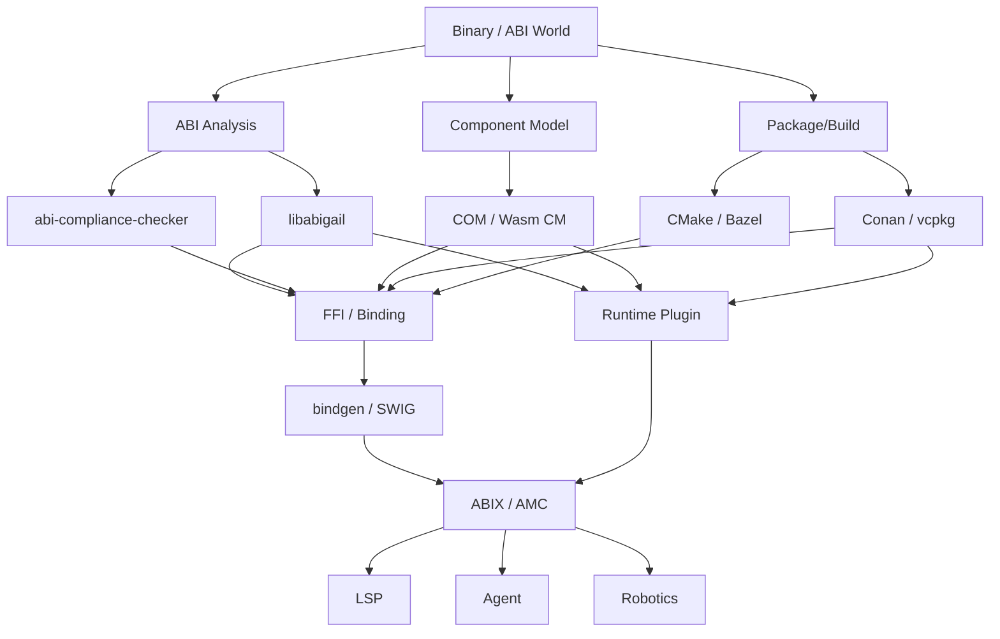

The question is not "Does ABIX have competitors?" but:

> **Where does ABIX overlap with existing projects, and where does it connect
> them?**

## Direct ABI Competitors

### 1. libabigail

libabigail analyzes ABI from ELF + DWARF, builds an ABI corpus, and diffs
two shared libraries (functions, variables, types, layout). `abidw`
serializes ABI to XML; `abidiff` compares ABI across versions.

```text
libabigail = ABI Analysis / ABI Diff
```

ABIX is broader:

```text
ABIX = ABI Representation / IR / Contract
     + Runtime Metadata
     + Verification
     + Interop
     + Toolchain
```

There is significant overlap, but they are not the same layer.

### 2. ABI Compliance Checker

ABI Compliance Checker compares ABI dumps across versions for
compatibility. Its focus is: "Do these two ABIs have problems?"

ABIX goes further:

```text
ABI Compliance Checker → "Are these two ABIs compatible?"

ABIX → "What is this ABI?"
     → "How is it represented?"
     → "How is it transferred?"
     → "How is it generated?"
     → "How is it verified at runtime?"
     → "How do other tools consume it?"
```

The key distinction: ABIX is not another `abidiff`. If the project reduces
to `amc diff libA.so libB.so`, it falls squarely into existing territory.

## Package / Build Systems

### 3. Conan

Conan handles binary package management with build-configuration-aware
binary packages, revisions, package IDs, and private servers. It already
generates different binaries for different compilers, architectures, and
configurations.

### 4. vcpkg

vcpkg has binary caching with its own ABI Hash for build-reuse decisions.
The hash combines triplet, compiler, dependency ABI hashes, and toolchain
factors. Microsoft notes this is an implementation detail subject to change.

```text
Conan / vcpkg → Package / Build Identity
              → "Can this binary be reused?"
```

ABIX goes further:

```text
ABIX → "What does this binary actually provide?"
     → "Is this version ABI-compatible with that one?"
     → "Who can load it?"
     → "Which languages can bind to it?"
     → "Which plugins can use it?"
```

The ideal relationship is not ABIX vs Conan, but:

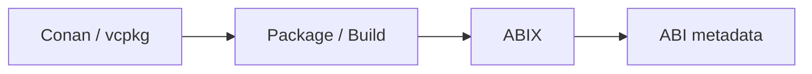

AMC can coexist with Conan and vcpkg.

## Component Models

### 5. COM

Microsoft COM defines a binary standard: components interact through
standardized interfaces, implementations can come from different languages,
and interfaces have stable binary contracts.

This proves that "native binary components + standardized interfaces" is not
a new idea. ABIX must answer: **Why not COM?**

| Aspect            | COM                     | ABIX                          |
|-------------------|-------------------------|-------------------------------|
| Platform          | Windows-oriented        | cross-platform                |
| Model             | Object Model            | ABI metadata                  |
| Identity          | Interface / IID         | existing C/C++ ABI            |
| Lifetime          | Reference Counting      | compiler/platform/runtime aware |
| Runtime           | predefined runtime model | arbitrary native binaries     |
| Interaction       | component interaction   | static metadata + introspection |

COM defines a component model. ABIX describes the semantics of existing
native ABIs. These are fundamentally different things.

### 6. WebAssembly Component Model

The WebAssembly Component Model pursues portable binary components, cross-
language composition, language-agnostic interfaces, WIT interface
descriptions, and type systems.

The overlap with ABIX is significant, but the boundary is clear:

```text
Wasm Component Model → Portable Component Runtime → WASM execution model → WIT

ABIX                 → Existing Native Binary → ELF / PE / Mach-O → MSVC / Clang / GCC
```

Wasm Component Model redefines a portable component world. ABIX gives
existing native binaries a unified semantic layer.

The Component Model also explicitly separates package management,
deployment, and live upgrade into other layers. This is a good architectural
reference for ABIX: core ≠ package manager ≠ runtime ≠ agent.

## FFI / Binding Generators

### 7. bindgen / SWIG

bindgen parses C/C++ headers via Clang and auto-generates Rust FFI. SWIG
generates bindings for multiple target languages. They solve:

```text
C/C++ source → Binding Generator → Rust / Python / Java
```

But they are source/header-oriented:

```text
bindgen = source/header oriented → Binding

amc-bind = ABI/binary oriented → Binding
```

For C++ specifically, bindgen has documented limitations mapping C++
features to Rust. ABIX offers a complementary path:

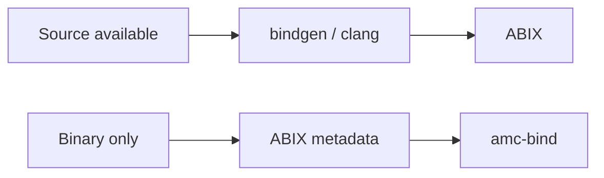

This is the theoretical foundation for the C++ ↔ Rust Demo.

## RPC / Serialization

### 8. gRPC / Protobuf / FlatBuffers

These are not direct ABIX competitors, but they are the clearest
comparison point for cross-language interface standardization.

Protocol Buffers define language-neutral, platform-neutral schemas and
generate multi-language code. gRPC defines service/method/request/response
as language-agnostic RPC interfaces.

But:

```text
gRPC / Protobuf → Wire ABI / Protocol (across network)

ABIX            → Native ABI / Process ABI (same process)
```

This yields a clear positioning statement:

> **Protobuf standardizes data on the wire; ABIX standardizes semantics at
> the native binary boundary.**

## Build Systems

### 9. CMake / Bazel

CMake provides a machine-readable File API for build system semantics,
including toolchain information. Bazel makes build actions, inputs/outputs,
commands, and environments explicit with remote cache support.

```text
CMake / Bazel → Build Graph
ABIX          → Binary / ABI Graph
```

These combine powerfully:

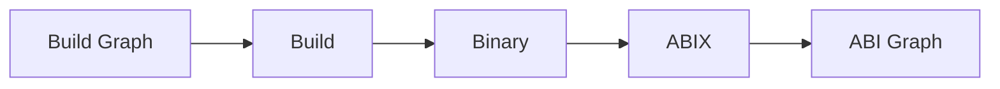

This is likely a key integration line for AMC in later stages.

## Competitive Position Summary

| System                  | Primary Object              | Focus                                         |
|-------------------------|-----------------------------|-----------------------------------------------|
| libabigail              | existing native binary ABI  | analysis / diff                                |
| ABI Compliance Checker  | ABI dump / library          | compatibility                                 |
| Conan                   | package / binary            | dependency / build                            |
| vcpkg                   | package / build config      | dependency / cache / ABI hash                 |
| COM                     | binary component            | Component Object Model                        |
| Wasm Component Model    | portable component          | cross-language component                      |
| bindgen                 | C/C++ source                | FFI generation                                |
| SWIG                    | C/C++ source                | multi-language binding                        |
| Protobuf/gRPC           | wire/service schema         | RPC / serialization                           |
| CMake/Bazel             | build system                | build graph / reproducibility                 |
| **ABIX**                | **native ABI state / metadata** | **ABI IR / contract / verification / composition** |

ABIX's core territory:

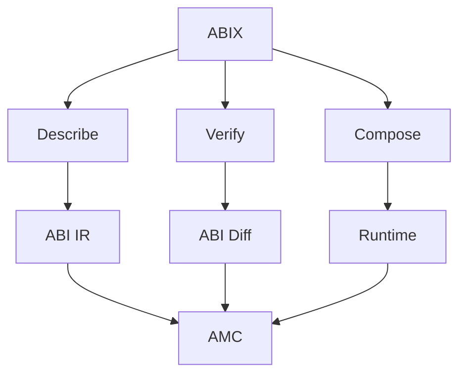

## Strategic Implications

### Five Application Lines

Rather than covering dozens of directions at once, ABIX applications
should focus on five lines:

#### ① ABI CI / ABI Governance (`amc-abi-ci`)

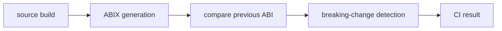

```bash
amc abi check --baseline v1.abix --current build/libfoo.dll
```

This directly competes with libabigail / ABI Compliance Checker but extends
the scope to dependency / plugin / binding / package.

#### ② ABIX Package / Binary Registry (`amc pkg`)

Not a reimplementation of Conan. A registry where each package carries:

```text
Package
 ├── source / binary / manifest
 ├── .abix / ABI hash
 ├── dependency ABI
 ├── target / compiler / runtime
 └── compatibility information
```

#### ③ Cross-language Binding (`amc-bind`)

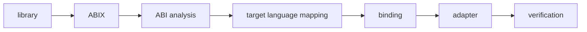

First targets: C++ → Rust, C++ → Zig. Complementary to bindgen (source-
available vs binary-only scenarios).

#### ④ Native Plugin Runtime (`amc-plugin`)

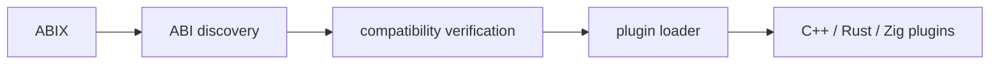

Elevates plugin ABI from framework-specific metadata (e.g. Qt's
QPluginLoader) to universal ABIX metadata.

#### ⑤ ABIX LSP

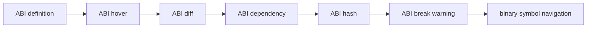

### AI as Orchestrator, Not Core Application

AI (MCP + Agent) sits on top of the five lines above:

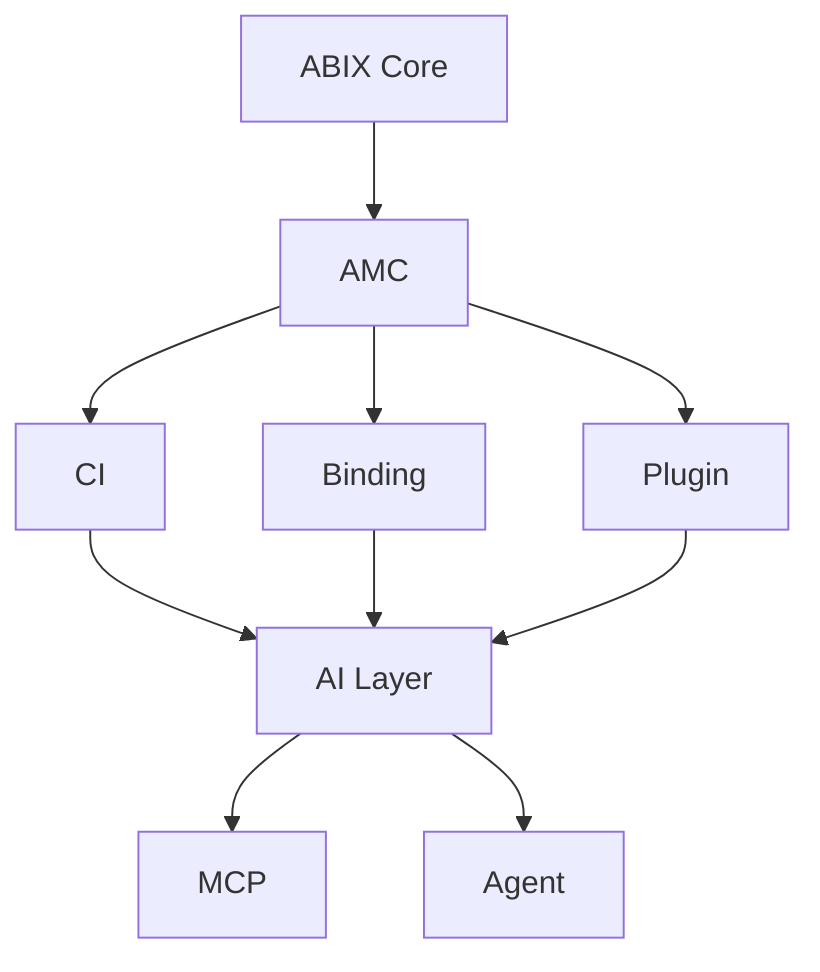

Agent is not a standalone chatbot. It is the orchestrator that operates and
verifies the ABIX Applications above.

### Four Demonstrations

| Demo             | Proves                                            |
|------------------|---------------------------------------------------|
| `amc-abi-ci`     | ABI / binary / compiler / tooling                  |
| `amc-bind`       | C++ / Rust / FFI / code generation                 |
| `amc-robotics`   | dynamic library / runtime / AI / robotics          |
| `amc-agent`      | AI Agent / MCP / structured context / verification |

All four share one foundation:

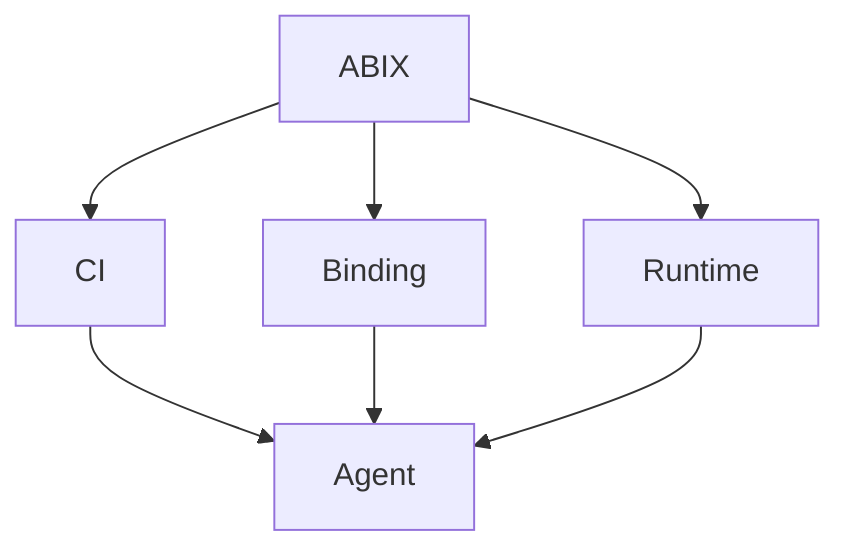

## ABIX Differentiation

What existing ecosystems solve individually:

```text
libabigail      → ABI analysis
Conan / vcpkg   → package / build
bindgen / SWIG  → language binding
COM / Wasm CM   → component model
gRPC / Protobuf → wire / service contract
CMake / Bazel   → build graph
```

What is missing:

> A layer that takes the **concrete ABI semantics of a native binary** as an
> independent, first-class IR/contract, and lets all of the above tools
> consume it uniformly.

That is the position ABIX occupies.

## Naming Note: ABIX vs ABIXML

libabigail already has **ABIXML** — its XML-based ABI representation
format. When communicating externally, distinguish clearly:

```text
ABIX   = this project's native binary ABI IR / metadata standard
ABIXML = libabigail's XML representation
```

Failure to do so will cause search and community-discovery confusion.

## References

| Tool | Link |
|------|------|
| libabigail | https://sourceware.org/libabigail/manual/libabigail-overview.html |
| ABI Compliance Checker | https://lvc.github.io/abi-compliance-checker/ |
| Conan | https://docs.conan.io/2/introduction.html |
| vcpkg binary caching | https://learn.microsoft.com/en-us/vcpkg/consume/binary-caching-overview |
| COM | https://learn.microsoft.com/en-us/windows/win32/com/the-component-object-model |
| Wasm Component Model | https://github.com/WebAssembly/component-model/blob/main/design/high-level/Goals.md |
| bindgen | https://rust-lang.github.io/rust-bindgen/ |
| Protobuf | https://protobuf.dev/overview/ |
| gRPC | https://grpc.io/docs/what-is-grpc/introduction/ |
| CMake File API | https://cmake.org/cmake/help/latest/manual/cmake-file-api.7.html |
| Bazel Remote Cache | https://bazel.build/remote/caching |
| Qt QPluginLoader | https://doc.qt.io/qt-6/qpluginloader.html |

---

*See also: [AI theory](../ai/ai.md), [TROI metric](../ai/troi.md), [MCP tools](../ai/MCP.md).*
