# ABIX 竞品分析

<p align="center">
  English · <a href="competitors_zh.md">中文</a>
</p>

<details>

<summary>目录</summary>

- [定位](#定位)
- [全景图](#全景图)
- [直接 ABI 竞品](#直接-abi-竞品)
  - [libabigail](#1-libabigail)
  - [ABI Compliance Checker](#2-abi-compliance-checker)
- [包管理 / 构建系统](#包管理--构建系统)
  - [Conan](#3-conan)
  - [vcpkg](#4-vcpkg)
- [组件模型](#组件模型)
  - [COM](#5-com)
  - [WebAssembly Component Model](#6-webassembly-component-model)
- [FFI / 绑定生成器](#ffi--绑定生成器)
  - [bindgen / SWIG](#7-bindgen--swig)
- [RPC / 序列化](#rpc--序列化)
  - [gRPC / Protobuf / FlatBuffers](#8-grpc--protobuf--flatbuffers)
- [构建系统](#构建系统)
  - [CMake / Bazel](#9-cmake--bazel)
- [竞品定位总览](#竞品定位总览)
- [战略推论](#战略推论)
- [ABIX 差异化](#abix-差异化)
- [命名问题：ABIX vs ABIXML](#命名问题abix-vs-abixml)
- [参考链接](#参考链接)

</details>

## 定位

> **ABIX/AMC 暂时看不到一个真正"一对一"的竞品。** 现有生态把 ABIX 要覆盖的问题拆散在 ABI 分析、包管理、FFI、插件、构建系统、组件模型、RPC/IDL、AI 工具等不同项目里。
>
> ABIX 的差异化不应该是"比 libabigail 更强"或"比 Conan 更好"，而是把这些原本分散的**原生二进制生命周期能力**统一到一个 ABI/IR 上。

## 全景图

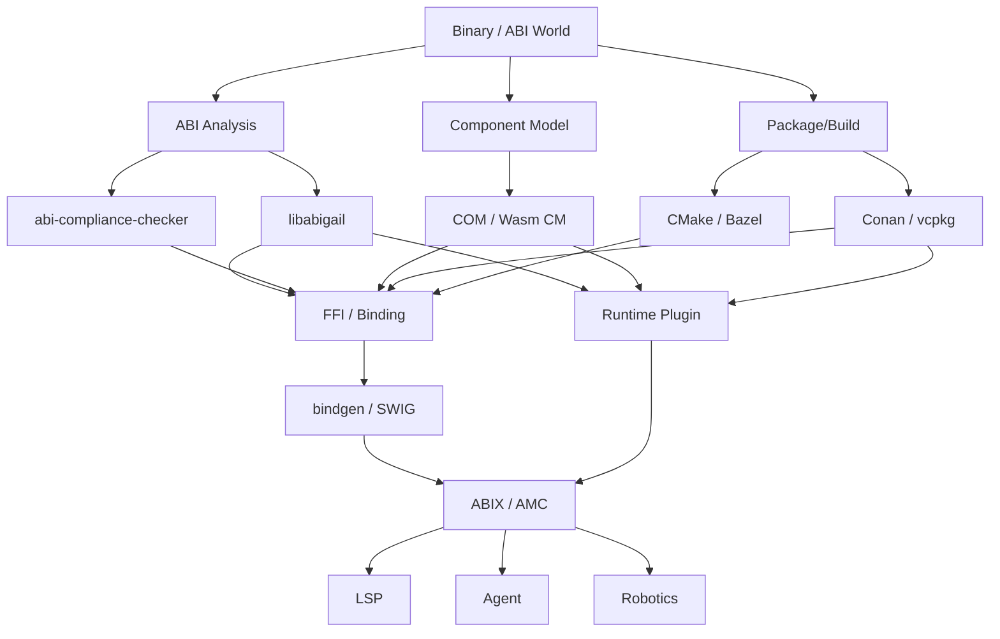

真正的问题不是"ABIX 有没有竞品"，而是：

> **ABIX 哪些层面和现有项目重叠，哪些层面把这些东西连接起来？**

## 直接 ABI 竞品

### 1. libabigail

libabigail 从 ELF + DWARF 分析 ABI，构建 ABI corpus，并对两个共享库做函数、变量、类型、布局的 ABI diff。`abidw` 将 ABI 序列化为 XML，`abidiff` 比较版本间 ABI 差异。

```text
libabigail = ABI Analysis / ABI Diff
```

ABIX 覆盖范围更广：

```text
ABIX = ABI Representation / IR / Contract
     + Runtime Metadata
     + Verification
     + Interop
     + Toolchain
```

两者有很大交叉，但不在同一层。

### 2. ABI Compliance Checker

ABI Compliance Checker 对比不同版本的 ABI dump，做兼容性分析。它的核心问题是："这两个 ABI 有没有问题？"

ABIX 更进一步：

```text
ABI Compliance Checker → "这两个 ABI 是否兼容？"

ABIX → "这个 ABI 本身是什么？"
     → "如何表示？"
     → "如何传递？"
     → "如何生成？"
     → "如何运行时验证？"
     → "如何让其他工具消费？"
```

关键区别：ABIX 不是又一个 `abidiff`。如果项目退化为 `amc diff libA.so libB.so`，就很容易落入现有空间。

## 包管理 / 构建系统

### 3. Conan

Conan 已有二进制包管理、build-configuration-aware 的 binary package、revision、package ID，以及私有服务器。它能针对不同编译器、架构生成不同二进制。

### 4. vcpkg

vcpkg 有 binary caching，内置 ABI Hash 用于判断构建复用。该 hash 综合 triplet、编译器、依赖 ABI hash、工具链等因素。微软文档特别说明这是实现细节，未来可能变化。

```text
Conan / vcpkg → Package / Build Identity
              → "这个 binary 能不能复用？"
```

ABIX 进一步承担：

```text
ABIX → "这个 binary 到底提供什么？"
     → "这个版本和另一个版本 ABI 是否兼容？"
     → "谁能加载它？"
     → "哪些语言可以绑定？"
     → "哪些插件可以使用？"
```

比较理想的关系不是 ABIX vs Conan，而是：

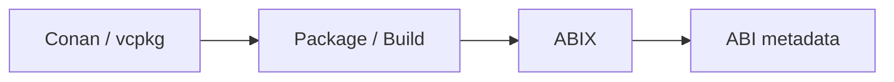

AMC 可以与 Conan / vcpkg 共存。

## 组件模型

### 5. COM

Microsoft COM 定义了一个 binary standard：组件通过标准化 interface 交互，实现可以来自不同语言，interface 具有稳定的 binary contract。

这说明"原生二进制组件 + 标准接口"本身并不是全新思想。ABIX 必须明确回答：**为什么不是 COM？**

| 方面              | COM                     | ABIX                          |
|-------------------|-------------------------|-------------------------------|
| 平台              | Windows-oriented        | cross-platform                |
| 模型              | Object Model            | ABI metadata                  |
| 身份              | Interface / IID         | existing C/C++ ABI            |
| 生命周期          | Reference Counting      | compiler/platform/runtime aware |
| 运行时            | predefined runtime model | arbitrary native binaries     |
| 交互              | component interaction   | static metadata + introspection |

COM 定义一种组件模型。ABIX 描述现有原生 ABI 的通用语义层。这两者差别非常大。

### 6. WebAssembly Component Model

WebAssembly Component Model 追求可移植的 binary component、跨语言组合、language-agnostic interface、WIT interface description 和 type system。

与 ABIX 有明显交集，但边界清晰：

```text
Wasm Component Model → Portable Component Runtime → WASM execution model → WIT

ABIX                 → Existing Native Binary → ELF / PE / Mach-O → MSVC / Clang / GCC
```

Wasm Component Model 重新定义一个可移植组件世界。ABIX 给现实世界已有的 native binary 建立统一语义。

Component Model 自身明确把 package management、deployment、live upgrade 放到其他层。这对 ABIX 的架构是很好的参考：core ≠ package manager ≠ runtime ≠ agent。

## FFI / 绑定生成器

### 7. bindgen / SWIG

bindgen 通过 Clang 解析 C/C++ header 自动生成 Rust FFI。SWIG 生成多种目标语言的绑定。它们解决：

```text
C/C++ source → Binding Generator → Rust / Python / Java
```

但天然是 source/header-oriented：

```text
bindgen = source/header oriented → Binding

amc-bind = ABI/binary oriented → Binding
```

C++ 方面，bindgen 有大量限制（官方文档明确说明 C++ 特性不能全部映射到 Rust）。ABIX 提供一条互补路径：

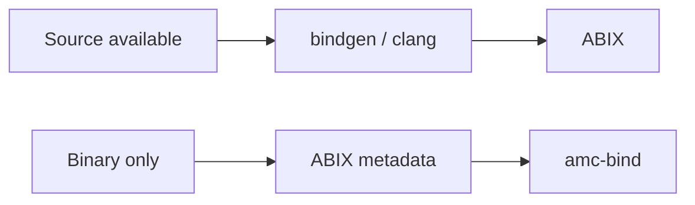

这是 C++ ↔ Rust Demo 的理论基础。

## RPC / 序列化

### 8. gRPC / Protobuf / FlatBuffers

不是 ABIX 的直接竞品，但最值得拿来对比——因为它们解决的是"跨语言接口标准化"。

Protocol Buffers 把结构化数据定义为 language-neutral、platform-neutral 的 schema，生成多语言代码。gRPC 把 service/method/request/response 定义成语言无关的 RPC interface。

但：

```text
gRPC / Protobuf → Wire ABI / Protocol（跨网络）

ABIX            → Native ABI / Process ABI（同进程）
```

因此一句非常清晰的定位：

> **Protobuf standardizes data on the wire; ABIX standardizes semantics at the native binary boundary.**

## 构建系统

### 9. CMake / Bazel

CMake 提供 machine-readable File API 获取 build system 语义信息，包括 toolchain。Bazel 把 build action、input/output、command、environment 显式化，支持 remote cache。

```text
CMake / Bazel → Build Graph
ABIX          → Binary / ABI Graph
```

两者结合非常强：

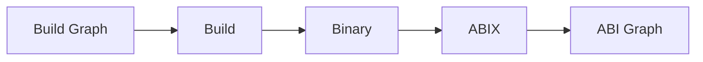

这很可能是 AMC-Toolchain 后期非常重要的一条主线。

## 竞品定位总览

| 方案                     | 主要描述对象                          | 重点                                                 |
| ---------------------- | ------------------------------- | -------------------------------------------------- |
| libabigail             | 已有 native binary ABI            | 分析 / Diff                                          |
| ABI Compliance Checker | ABI dump / library              | 兼容性                                               |
| Conan                  | package / binary                | 依赖 / 构建                                           |
| vcpkg                  | package / build configuration   | 依赖 / 缓存 / ABI hash                                |
| COM                    | binary component                | Component Object Model                             |
| Wasm Component Model   | portable component              | 跨语言组件                                            |
| bindgen                | C/C++ source                    | FFI generation                                     |
| SWIG                   | C/C++ source                    | 多语言绑定                                            |
| Protobuf/gRPC          | wire / service schema           | RPC / 序列化                                         |
| CMake/Bazel            | build system                    | 构建图 / 可复现性                                      |
| **ABIX**               | **native ABI state / metadata** | **ABI IR / contract / verification / composition** |

ABIX 最值得守住的领地：

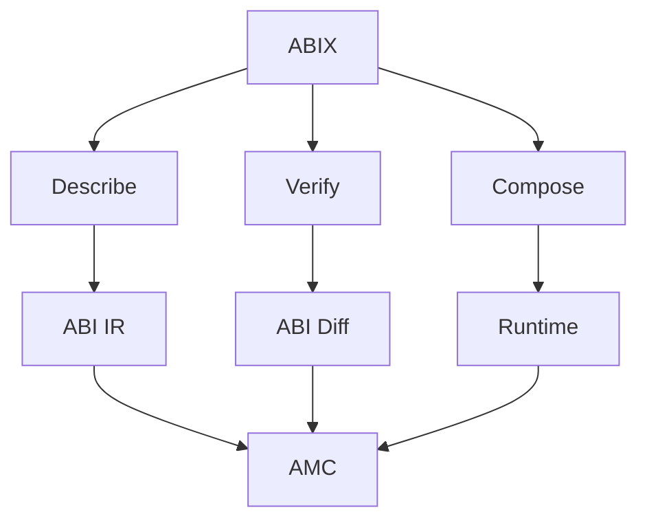

## 战略推论

### 五条应用主线

ABIX 应用层不应一次铺十几个方向，而是聚焦五条主线：

#### ① ABI CI / ABI Governance（`amc-abi-ci`）

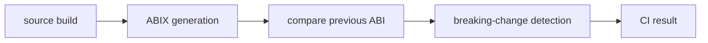

```bash
amc abi check --baseline v1.abix --current build/libfoo.dll
```

直接与 libabigail / ABI Compliance Checker 竞争，但范围扩大到 dependency / plugin / binding / package。

#### ② ABIX Package / Binary Registry（`amc pkg`）

不是简单重做 Conan，而是让每个 package 携带：

```text
Package
 ├── source / binary / manifest
 ├── .abix / ABI hash
 ├── dependency ABI
 ├── target / compiler / runtime
 └── compatibility information
```

#### ③ Cross-language Binding（`amc-bind`）

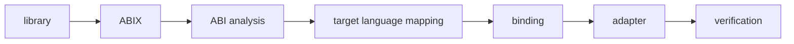

第一目标：C++ → Rust、C++ → Zig。与 bindgen 互补（source-available vs binary-only）。

#### ④ Native Plugin Runtime（`amc-plugin`）

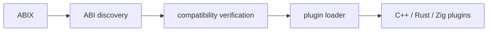

把 plugin ABI 从 framework-specific metadata（如 Qt QPluginLoader）提升为通用 ABIX metadata。

#### ⑤ ABIX LSP

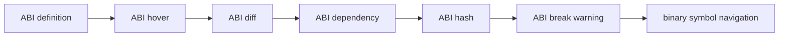

### AI 作为编排层，而非核心应用

AI（MCP + Agent）位于上述五条线之上：

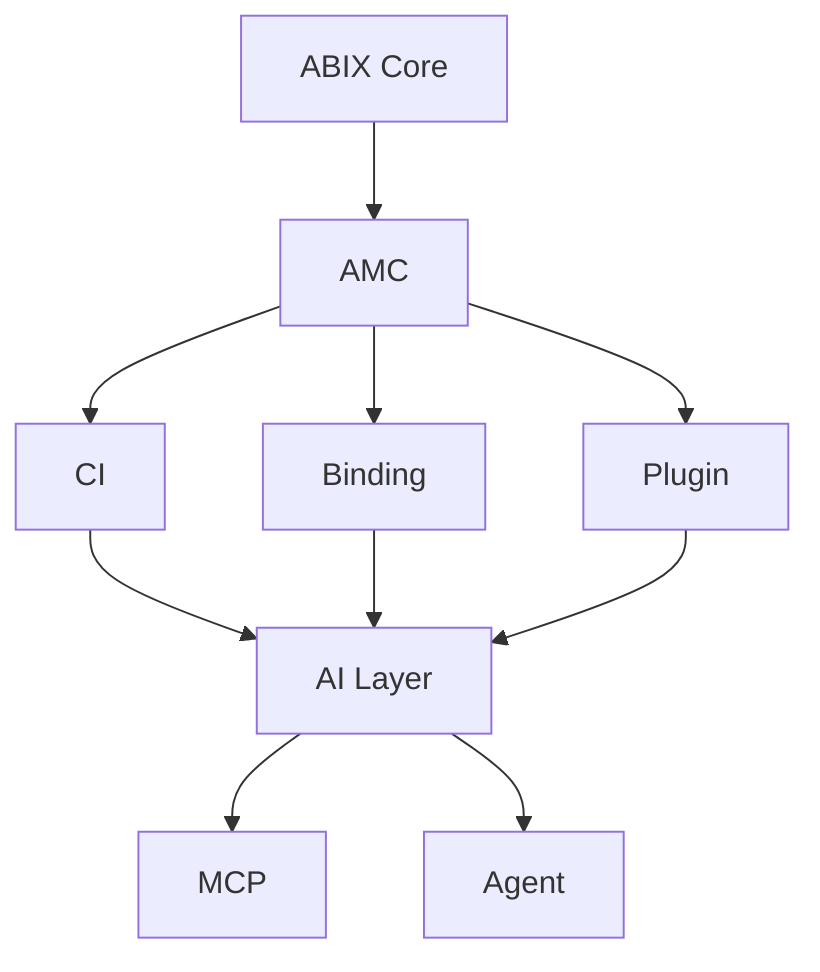

Agent 不是独立聊天机器人，而是把上述 ABIX Applications 自动编排起来的 Orchestrator。

### 四个可见作品

| 作品              | 证明能力                                        |
|-----------------|-----------------------------------------------|
| `amc-abi-ci`    | ABI / binary / compiler / tooling               |
| `amc-bind`      | C++ / Rust / FFI / code generation              |
| `amc-robotics`  | dynamic library / runtime / AI / robotics       |
| `amc-agent`     | AI Agent / MCP / structured context / verification |

四个作品共享同一个底座：

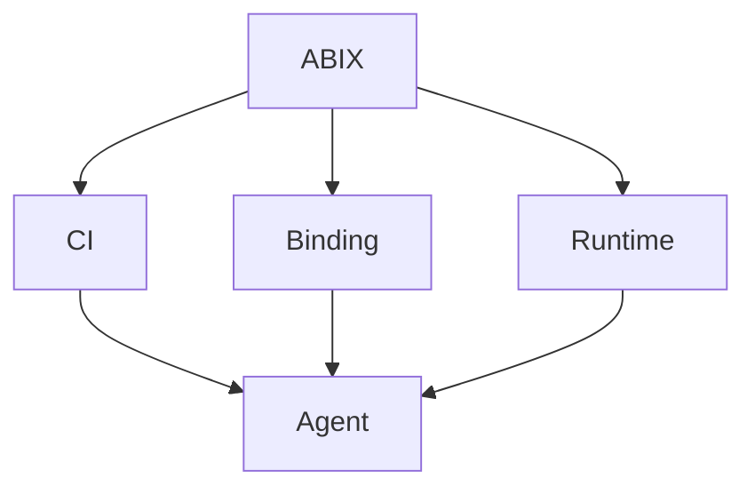

## ABIX 差异化

现有生态各自解决：

```text
libabigail      → ABI analysis
Conan / vcpkg   → package / build
bindgen / SWIG  → language binding
COM / Wasm CM   → component model
gRPC / Protobuf → wire / service contract
CMake / Bazel   → build graph
```

缺失的是：

> 一个把**具体 native binary 的 ABI 语义**作为独立、一等公民的 IR/契约，再让上述工具统一消费它的层。

这正是 ABIX 占据的位置。

## 命名问题：ABIX vs ABIXML

libabigail 已有 **ABIXML**——其 XML 格式的 ABI 表示。对外宣传时必须明确区分：

```text
ABIX   = 本项目的 native binary ABI IR / metadata 标准
ABIXML = libabigail 的 XML 表示
```

否则搜索和社区传播时容易产生认知混淆。

## 参考链接

| 工具 | 链接 |
|------|------|
| libabigail | https://sourceware.org/libabigail/manual/libabigail-overview.html |
| ABI Compliance Checker | https://lvc.github.io/abi-compliance-checker/ |
| Conan | https://docs.conan.io/2/introduction.html |
| vcpkg binary caching | https://learn.microsoft.com/en-us/vcpkg/consume/binary-caching-overview |
| COM | https://learn.microsoft.com/en-us/windows/win32/com/the-component-object-model |
| Wasm Component Model | https://github.com/WebAssembly/component-model/blob/main/design/high-level/Goals.md |
| bindgen | https://rust-lang.github.io/rust-bindgen/ |
| Protobuf | https://protobuf.dev/overview/ |
| gRPC | https://grpc.io/docs/what-is-grpc/introduction/ |
| CMake File API | https://cmake.org/cmake/help/latest/manual/cmake-file-api.7.html |
| Bazel Remote Cache | https://bazel.build/remote/caching |
| Qt QPluginLoader | https://doc.qt.io/qt-6/qpluginloader.html |

---

*另见：[AI 理论](../ai/ai_zh.md)、[TROI 指标](../ai/troi_zh.md)、[MCP 工具](../ai/MCP_zh.md)。*
