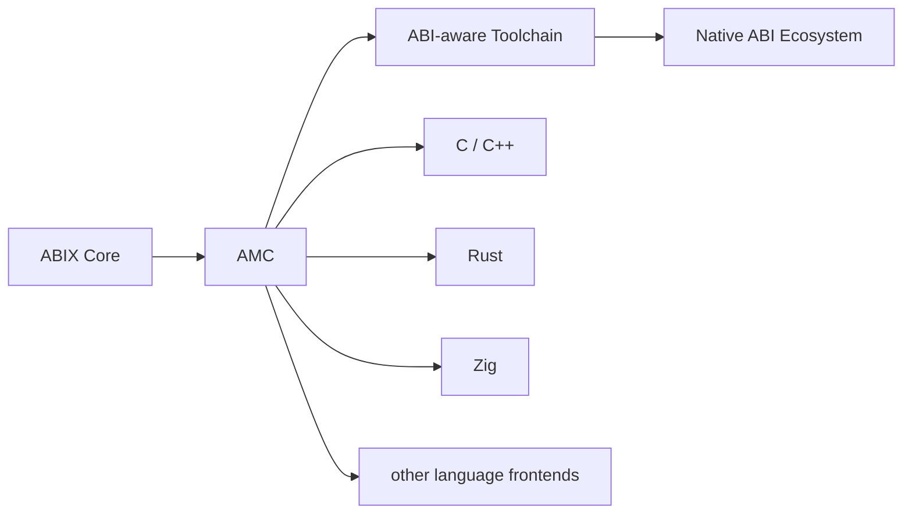

# Roadmap

<p align="center">
  English · <a href="roadmap_zh.md">中文</a>
</p>

<details>

<summary>Contents</summary>

- [Version Roadmap](#version-roadmap)
- [Direction](#direction)
- [Near-term](#near-term)
- [AI-native ABI toolchain](#ai-native-abi-toolchain)
- [Research / experimental](#research--experimental)
- [Release History](#release-history)
- [Explicitly out of scope](#explicitly-out-of-scope)

</details>

> The authoritative version is [`ROADMAP.md`](../../.agents/ROADMAP.md). This
> file is the English companion to the Chinese edition.

The roadmap prioritises interoperability and real-world usage over adding
runtime features.

## Version Roadmap

ABIX releases are project stages, not feature lists. Each major version marks a
phase, so the version number itself carries the product story.

```text
ABIX 1.0 — Foundation + Toolchain    the ABI foundation exists and ABIX is usable in real engineering
ABIX 2.0 — Cross-language            Rust / Zig frontends and cross-language bindings
ABIX 3.0 — Ecosystem                 others build on top of ABIX
```

### ABIX 1.0 — Foundation, self-hosting and toolchain (current/released)

* ABI specification, metadata format, core runtime.
* Bootstrap and self-hosting: ABIX describes and verifies its own public ABI.
* ABI stability: the external contract stays explicit while internals evolve.
* Complete core ABI workflow: inspection, diff, compatibility classification.
* ABI adapter generation and the metadata modes (Debug / Release /
  RelWithDebInfo).
* ELF / Mach-O binary inspection.
* Build-system and CI integration, runtime stability, benchmark baseline.

### ABIX 2.0 — Cross-language (next)

The main line: ABIX IR as the common ABI representation across languages.

* language plugin API and producer/consumer protocol.
* a second language prototype beyond C++ — Rust, then Zig.
* cross-language type projection on the ABI-normalised primitive identity
  (for example C `double` → Rust `core::ffi::c_double`).
* cross-language bindings and a C++ ↔ Rust interoperability demo.

### ABIX 3.0 — Ecosystem (future)

Target areas, not hard commitments:

* AI / Agent integration (MCP, TROI).
* LSP, plugin ecosystem, package management, application areas.

### Version independence

The ABIX specification version, the AMC toolchain version, and application
versions are independent dimensions. Toolchain features (Rust, AI, Agent, LSP)
never require a format version change by themselves. See
[`ABI-SPEC.md`](../../.agents/ABI-SPEC.md) §14.1.

## Direction



## Near-term

* **Specification** — strengthen the ABIX IR and `.abix` spec, keeping the model
  language-agnostic.
* **AMC usability** — clearer diagnostics, better error messages, editor/ and
  CI-friendly output.
* **Language / toolchain integration** — expand frontends beyond C++ (Rust,
  Zig); ABIX IR stays the common representation.
* **ABI compatibility analysis** — diff, compatibility classification and
  automatic adapter generation.
* **Documentation and examples** — quick-start material and real case studies.
* **External validation** — adopt ABIX in real projects and feed back results.

## AI-native ABI toolchain

One direction for ABIX is an AI-native ABI toolchain: an explicit ABI model is
the durable, machine-readable interface AI coding agents need.

Current and planned work:

* `amc context --format llm` — compact, token-friendly ABI context.
* Unified structured JSON errors across all tools.
* `amc verify` — contract-vs-implementation consistency checking.
* ABIX Metadata Region — versioned, mappable metadata image.
* `amc query` and the `amc-mcp` server — agent-facing ABI queries.
* Aue (experimental) — Lua boundary layer with L0/L1 diff consistency.

## Research / experimental

* Runtime materialization of the metadata image.
* ABI adaptation / shimming.
* Dynamic-language boundary layers with differential semantic verification.

## Release History

ABIX uses standard SemVer tags from `v1.0.0` onward. The project stage is named
in the release title (for example, `ABIX 1.0.0 — Foundation, self-hosting and
toolchain`).

* `v1.0.0` — Foundation, self-hosting and toolchain

## Explicitly out of scope

ABIX is not a VM, an RPC framework, a universal object model, a debug-info
format or a C-ABI wrapper. See [What ABIX Is Not](../../README.md#what-abix-is-not).
