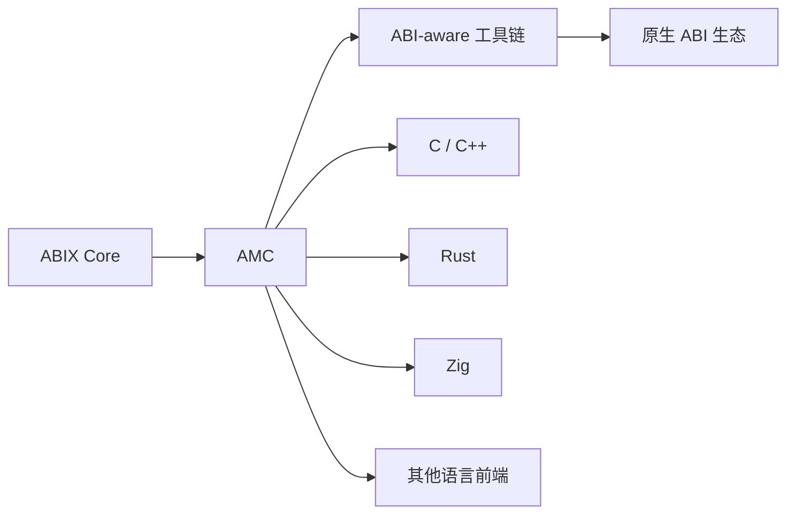

# 路线图

<p align="center">
  中文 · <a href="roadmap.md">English</a>
</p>

<details>

<summary>目录</summary>

- [版本路线](#版本路线)
- [方向](#方向)
- [近期](#近期)
- [AI-native ABI 工具链](#ai-native-abi-工具链)
- [研究 / 实验](#研究-实验)
- [发布历史](#发布历史)
- [明确不在范围内](#明确不在范围内)

</details>

> 英文权威版本见 [`ROADMAP.md`](../../.agents/ROADMAP.md)。本文件为中文版。

路线图优先考虑互操作性与真实使用，而不是增加运行时特性。

## 版本路线

ABIX 的发布是项目阶段，而不是功能清单。每个大版本代表一个阶段，版本号本身承载产品叙事。

```text
ABIX 1.0 — Foundation    建立 ABI 基础
ABIX 2.0 — Toolchain     ABIX 可用于真实工程
ABIX 3.0 — Ecosystem     其他项目建立在 ABIX 之上
```

### ABIX 1.0 — Foundation（已发布）

* ABI 规范、metadata 格式、核心运行时。
* 引导与自举：ABIX 用自身描述并校验其公开 ABI。
* ABI 稳定性：外部契约保持显式，内部实现可演进。

### ABIX 2.0 — Toolchain（当前）

* 完整核心 ABI 工作流：检查、diff、兼容性分类。
* ABI adapter 生成与 metadata 模式（Debug / Release / RelWithDebInfo）。
* ELF / Mach-O 二进制检查。
* 构建系统与 CI 集成、运行时稳定性、benchmark 基线。

### ABIX 3.0 — Ecosystem（未来）

目标方向，而非硬性承诺：

* 跨语言绑定（Rust、Zig）。
* AI / Agent 集成（MCP、TROI）。
* LSP、插件生态、包管理、应用领域。

### 版本独立性

ABIX 规范版本、AMC 工具链版本与应用版本是相互独立的维度。工具链功能（Rust、AI、Agent、LSP）本身永远不会要求格式版本变更。见 [`ABI-SPEC.md`](../../.agents/ABI-SPEC.md) §14.1。

## 方向



## 近期

* **规范** — 强化 ABIX IR 与 `.abix` 规范，保持模型语言无关。
* **AMC 易用性** — 更清晰的诊断、更好的错误信息、面向编辑器与 CI 的输出。
* **语言 / 工具链集成** — 在 C++ 之外扩展前端，ABIX IR 始终是统一表示。
* **ABI 兼容性分析** — diff、兼容性分类与自动 adapter 生成。
* **文档与示例** — 快速上手材料与真实 case study。
* **外部验证** — 在真实项目中采用 ABIX 并反馈结果。

## AI-native ABI 工具链

ABIX 的发展方向之一是 AI-native ABI toolchain：显式 ABI 模型为 AI coding agent
提供持久、机器可读的接口。

当前与计划中的工作：

* `amc context --format llm` — 紧凑、token 友好的 ABI 上下文。
* 所有工具统一的结构化 JSON 错误。
* `amc verify` — 契约与实现一致性校验。
* ABIX Metadata Region — 版本化、可 mmap 的 metadata image。
* `amc query` 与 `amc-mcp` server — 面向 Agent 的 ABI 查询。
* Aue（实验性）— Lua 边界层与 L0/L1 差分一致性框架。

## 研究 / 实验

* metadata image 的运行时 materialization。
* ABI 适配 / shimming。
* 带差分语义验证的动态语言边界层。

## 发布历史

ABIX 自 `v1.0.0` 起使用标准 SemVer tag。项目阶段在 release 标题中命名（例如 `ABIX 2.0.0 — Toolchain`）。

* `v1.0.0` — Foundation
* `v2.0.0` — Toolchain

## 明确不在范围内

ABIX 不是 VM、RPC 框架、通用对象模型、调试信息格式或 C ABI wrapper。见 README 的
"What ABIX Is Not"。
