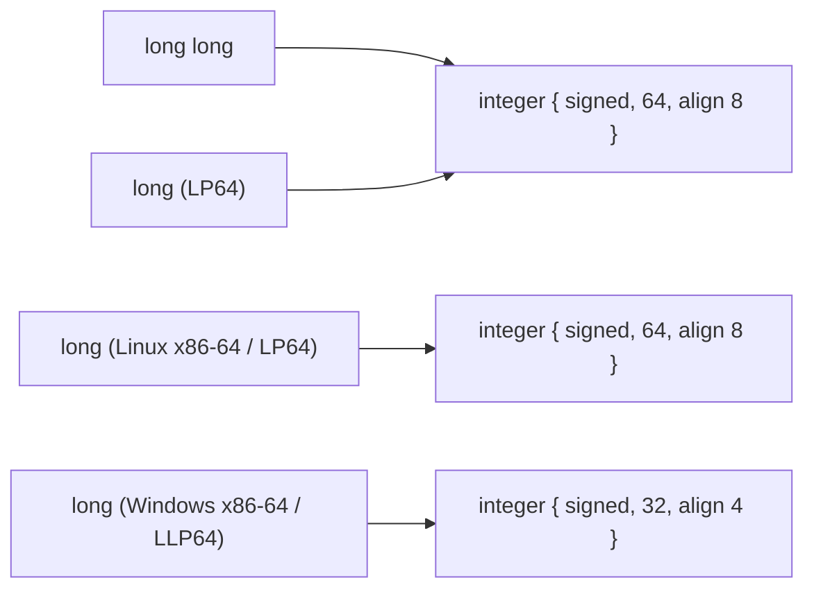
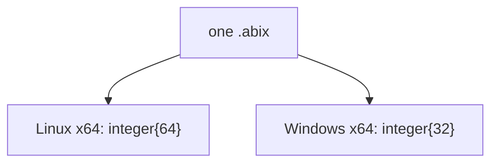
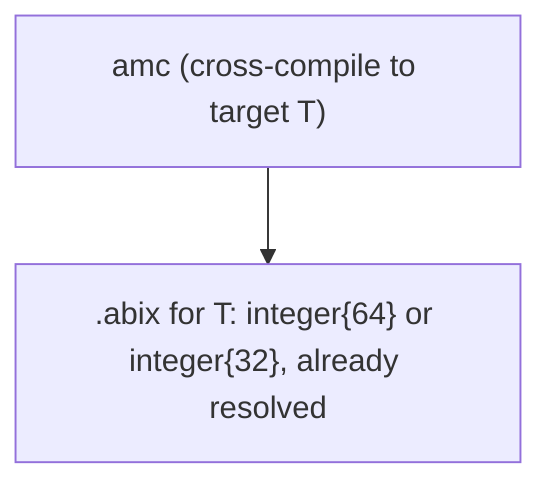
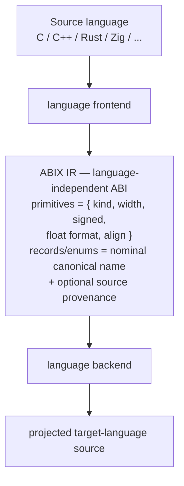
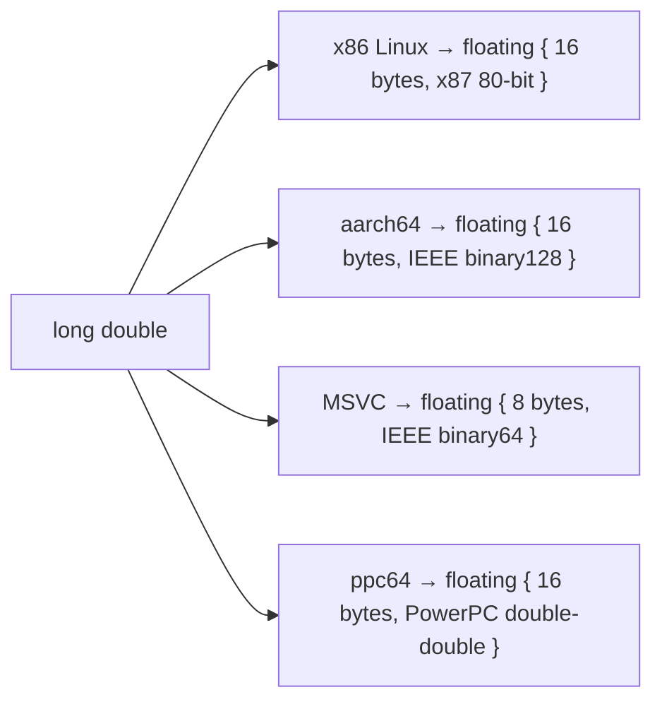
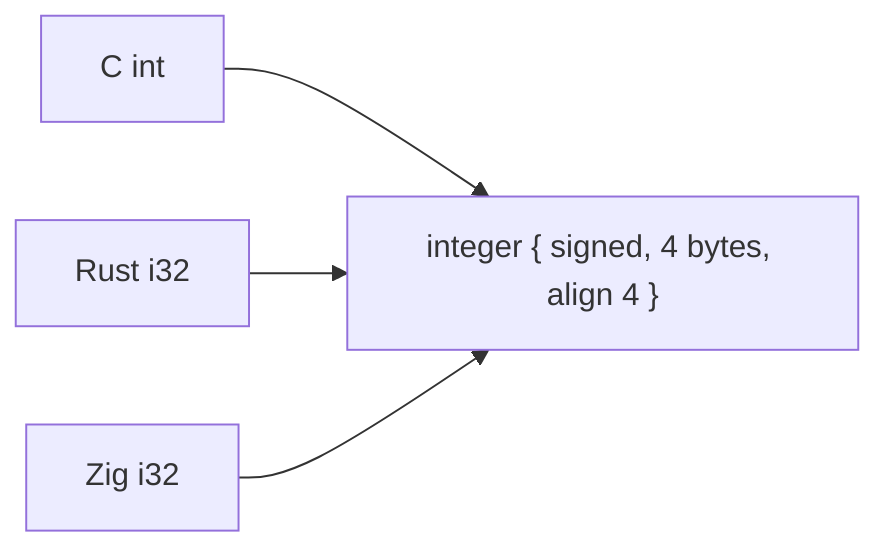

# Type Model: ABI Facts vs Source-Language Types

<p align="center">
  <a href="type-model_zh.md">中文</a> · English
</p>

<details>

<summary>Contents</summary>

- [Purpose](#purpose)
- [The distinction](#the-distinction)
- [Two generation models](#two-generation-models)
- [Decision: one artifact per target](#decision-one-artifact-per-target)
- [Layer boundaries](#layer-boundaries)
- [Primitive identity](#primitive-identity)
- [Source-language provenance](#source-language-provenance)
- [Worked examples](#worked-examples)
- [What the core model must not become](#what-the-core-model-must-not-become)

</details>

## Purpose

This note records the boundary between **source-language types** (`c_int`,
`long`, `i32`, `c_longdouble`) and the **ABIX ABI type system**. It exists
because an external review correctly identified that an ABI definition used for
cross-platform work must not simply record a final bit width — while also
warning that a language-neutral IR must not slide into a multi-language type
mapping database.

Both concerns are valid. They are reconciled by separating three things that are
easy to conflate:

1. **What machine-level ABI type this is** — the identity basis.
2. **How a source language spelled it** — projection metadata.
3. **Whether one artifact serves many targets** — the generation model.

See [`ABI-SPEC.md`](../../.agents/ABI-SPEC.md) §4, §5 and §10 for the normative
rules and [`LANGUAGE-PLUGIN.md`](../../.agents/LANGUAGE-PLUGIN.md) §5 for the
frontend contract.

## The distinction

There are three conceptually different descriptions of a primitive type:

```text
source spelling:        "long", "int", "double", "i32", "c_int"
language abstract type: C `long`, Rust `i32`, Zig `i32`
machine ABI fact:       signed / unsigned, width, alignment, float format
```

ABIX core stores the **machine ABI fact**. The other two describe *where the
fact came from*, not what it is at the binary boundary.

The reason this matters is that the same ABI fact has many spellings, and the
same spelling can have different ABI facts:



A type system that keys on spelling cannot merge the first pair; a type system
that keys only on the final width cannot reproduce `c_long` from the second
pair. ABIX resolves this by keying on the ABI fact and keeping the spelling as
optional metadata.

## Two generation models

The choice of identity basis is really a choice of **where target differences
are resolved**.

### Model A — one portable artifact, many targets



* Identity must be target-independent (a `c.long`-style abstract type).
* The `.abix` file must carry "unresolved" types and a resolution step.
* Consumers must resolve the target before they know the concrete width.

### Model B — one artifact per target



* Identity is the concrete ABI fact for that target.
* No resolution step; the width is already exact.
* The target lives in the module identity (see §10), not inside the type.

**Model B is the current ABIX design.** `AbiModule` records
`arch` / `os` / `target_abi` / `compiler` / `calling_convention`, and a primitive
already carries its measured width and format.

## Decision: one artifact per target

ABIX adopts **Model B**: `amc` generates a precise `.abix` per target, by
cross-compiling the frontend against that target's data model.

Rationale:

* **Precision over convenience.** A Clang-based frontend already knows the
  target's data model (LP64 / LLP64 / ILP32), `char` signedness, and the
  `long double` format at compile time. Generating per target records those as
  measured facts instead of deferring them to a resolver.
* **A single artifact stays single-semantics.** One `.abix` describes exactly
  one ABI. It can be memory-mapped, compared field-by-field and verified with
  exact offsets, with no conditional compatibility.
* **The differences are handled at generation time.** Complexity lives in the
  toolchain (which already understands targets), not in every consumer.
* **It matches how interop tools work.** `bindgen`, `cbindgen` and Zig's
  `translate-c` all produce bindings for one target at a time; cross-platform
  support means running them once per target.

This is also the honest reading of the external review: *"If you are happy to
make your users regenerate them for each platform, then bit widths are mostly ok
for FFI."* ABIX is, by design, happy to regenerate per platform.

### Why not a portable artifact

A portable artifact would require the core model to define abstract,
platform-neutral type identities. If the core admits `c.int` / `c.long` /
`c.long_double`, it will eventually be asked to admit `rust.i32`, `zig.i32`,
`cpp.long`, and so on. The core would drift from **a language-independent ABI
IR** into **a multi-language type mapping database**, which contradicts the
project's positioning (see [`AGENTS.md`](../../.agents/AGENTS.md) §1.6).

Portability is still achievable — by generating one precise artifact per target
rather than one ambiguous artifact for all of them.

## Layer boundaries



* The **frontend** owns the interpretation of source-language types. It maps
  `C long` onto the ABI fact for the chosen target.
* The **IR** owns only ABI facts and their identities.
* The **backend** owns how a fact is expressed in the target language — for
  example, that a C-ABI `double` projects to Rust `core::ffi::c_double` rather
  than `f64`.

The source-language type never becomes an ABIX core type. It becomes, at most,
provenance.

## Primitive identity

A primitive `TypeID` is the hash of an **ABI descriptor**, not of the source
spelling. The descriptor is:

| Field | Meaning |
|-------|---------|
| kind | `void` / `bool` / a character kind / `sint` / `uint` / `floating` |
| width | storage size in bytes, as measured by the target |
| signedness | for integers; for the implementation-defined `char` / `wchar_t` |
| float format | IEEE binary16/32/64/128, x87 80-bit, PowerPC double-double, … |

Consequences:

* `int` / `int32_t`, `long` / `long long` (LP64), and a 64-bit C `double` / a
  Rust `f64` on the same target share one `TypeID`.
* `char`, `signed char`, `unsigned char`, `char8_t`, `char16_t`, `char32_t`,
  `wchar_t` are distinct kinds; plain `char` and `wchar_t` carry their
  target-defined signedness.
* `long double` is identified by **format**, not spelling: on a target where
  `double` is 32-bit it collapses with `float`; x87 80-bit and IEEE binary128
  stay distinct even though both occupy 16 bytes.

The implementation is `PrimitiveAbiKind` and `FloatFormat` in
`amc/core/amc_core.h`, packed into `Type::primitive_abi` and serialized in the
`.abix` type table.

## Source-language provenance

The source-language type is retained as **optional provenance**, alongside the
existing source-origin record:

```text
ABIX Type #42
    core:        integer { signed = true, width = 4, align = 4 }
    provenance:  language = "c", spelling = "int", file = ..., line = ...
```

Rules:

* Provenance **never participates in identity**. It is excluded from `TypeID`,
  `LayoutHash` and `ABIHash`, exactly like the debug `sources` section
  ([`ABI-SPEC.md`](../../.agents/ABI-SPEC.md) §11).
* A consumer that only cares about the ABI reads the core descriptor.
* A language backend that wants to reproduce a C alias reads the provenance and
  emits `c_int` / `c_long` / `c_double` instead of `i32` / `i64` / `f64`.
* When provenance is absent, projection falls back to the ABI-equivalent
  fixed-width type, which is still ABI-correct.

This keeps the "cross-platform needs abstract types" requirement satisfiable
without admitting those abstract types into the core: the abstraction lives in
provenance and in the backend's projection rules.

## Worked examples

### `long` on Linux vs Windows

```text
C source:        long
target Linux:    integer { signed, 8 bytes, align 8 }
                 provenance { language = c, spelling = "long" }
                 → Rust backend may emit c_long

C source:        long
target Windows:  integer { signed, 4 bytes, align 4 }
                 provenance { language = c, spelling = "long" }
                 → Rust backend may emit c_long
```

Two different artifacts (one per target), each precise. Neither needs a
`c.long` primitive in the core.

### `long double`



Each is a distinct ABI fact. None is equated with Rust `f128`; the backend
decides the projection (and, until `c_longdouble` exists, may mark it
unsupported or opaque).

### `int` across languages



All three collapse to one `TypeID` because their ABI is identical.

## What the core model must not become

* Not a C type system: no `c.int` / `c.long` / `c.long_double` core primitives.
* Not a language union: no `rust.i32` / `zig.i32` core primitives.
* Not a per-language mapping table: source-language types live in frontends and
  in optional provenance, never in the identity basis.

The core model answers one question only: **what is this type at the machine
and calling-convention level?** Source-language naming is a projection concern.
