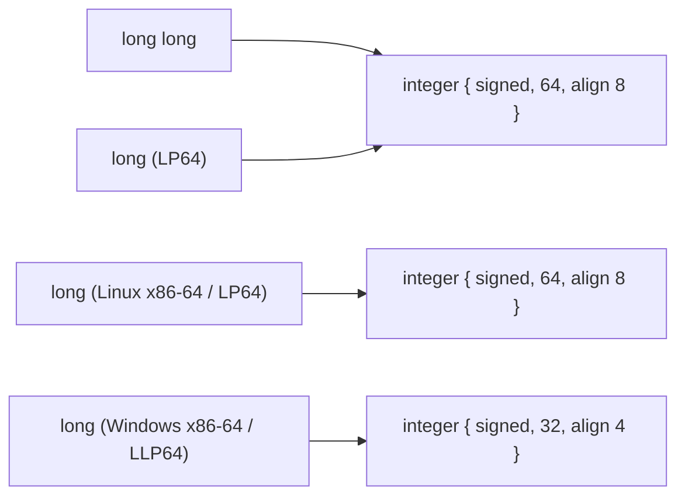
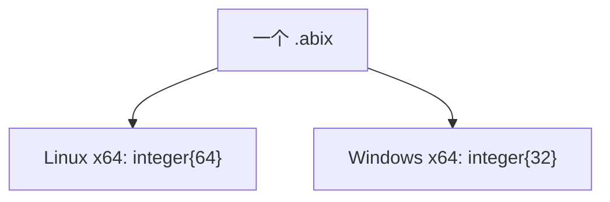
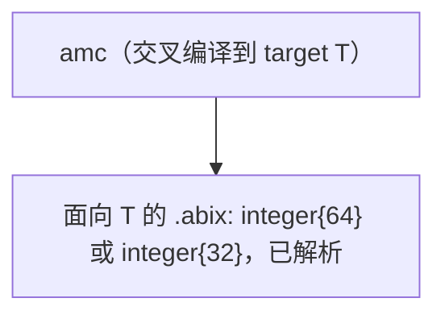
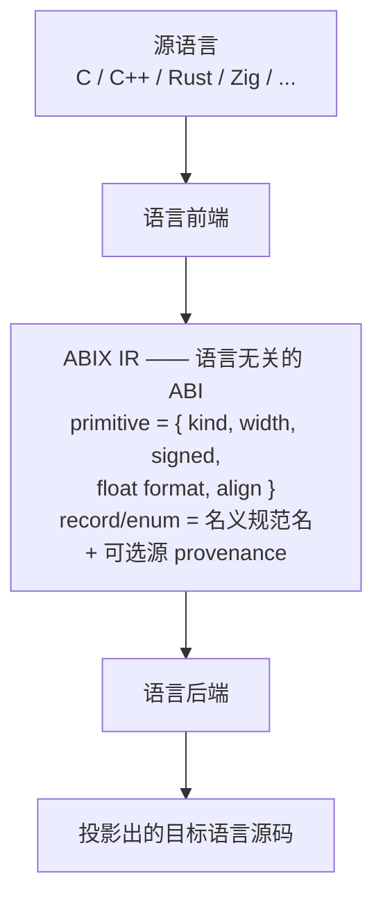
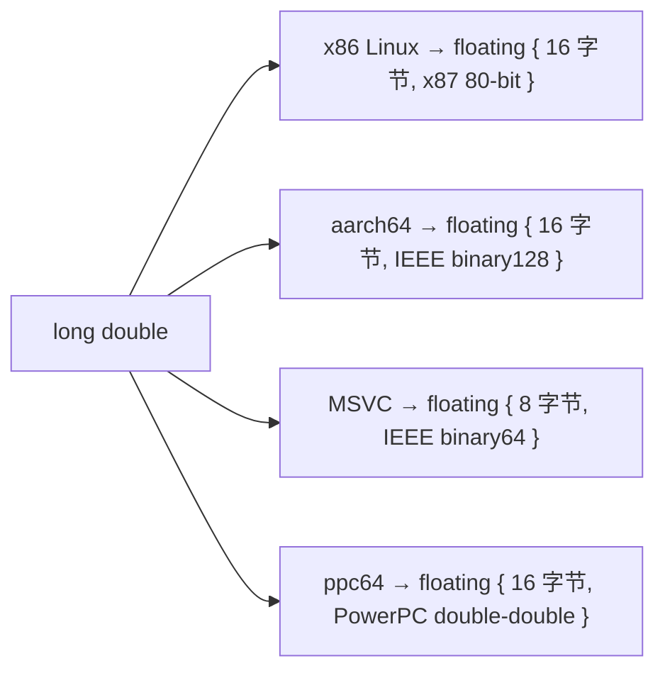
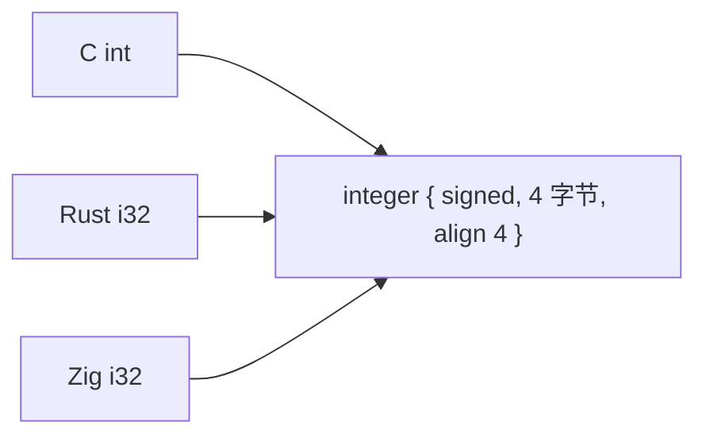

# 类型模型：ABI 事实与源语言类型

<p align="center">
  中文 · <a href="type-model.md">English</a>
</p>

<details>

<summary>目录</summary>

- [目的](#目的)
- [核心区分](#核心区分)
- [两种生成模型](#两种生成模型)
- [决策：每个 target 一个 artifact](#决策每个-target-一个-artifact)
- [分层边界](#分层边界)
- [primitive 身份](#primitive-身份)
- [源语言 provenance](#源语言-provenance)
- [示例](#示例)
- [核心模型不能变成什么](#核心模型不能变成什么)

</details>

## 目的

本文记录**源语言类型**（`c_int`、`long`、`i32`、`c_longdouble`）与 **ABIX ABI
类型系统**之间的边界。起因是一次外部评审正确地指出：用于跨平台的 ABI 定义不能
只记录最终 bit width；同时也提醒：语言无关的 IR 不应滑向「多语言类型映射数据库」。

两个担忧都成立。调和它们的办法是把容易混淆的三件事分开：

1. **这个类型在机器层面是什么** —— 身份基准。
2. **源语言怎么拼写它** —— 投影元数据。
3. **一个 artifact 是否服务多个 target** —— 生成模型。

规范规则见 [`ABI-SPEC.md`](../../.agents/ABI-SPEC.md) §4、§5、§10；前端契约见
[`LANGUAGE-PLUGIN.md`](../../.agents/LANGUAGE-PLUGIN.md) §5。

## 核心区分

对一个 primitive 类型，存在三种概念上不同的描述：

```text
源拼写:            "long"、"int"、"double"、"i32"、"c_int"
语言抽象类型:      C `long`、Rust `i32`、Zig `i32`
机器 ABI 事实:     有符号/无符号、宽度、对齐、浮点格式
```

ABIX 核心存储的是**机器 ABI 事实**。另外两者描述的是这条事实*从何而来*，而不是它
在二进制边界上*是什么*。

这很重要的原因是：同一条 ABI 事实有很多拼写，而同一个拼写可能有不同的 ABI 事实：



按拼写做身份的系统无法合并第一组；只按最终宽度做身份的系统无法从第二组还原
`c_long`。ABIX 的做法是：以 ABI 事实为身份，把拼写作为可选元数据保留。

## 两种生成模型

身份基准的选择，本质上是在选**平台差异在哪里被消解**。

### 模型 A —— 一个 portable artifact，多个 target



* 身份必须与 target 无关（类似 `c.long` 的抽象类型）。
* `.abix` 文件必须携带「未解析」的类型以及解析步骤。
* 消费者必须先解析 target 才能知道具体宽度。

### 模型 B —— 每个 target 一个 artifact



* 身份就是该 target 的具体 ABI 事实。
* 没有解析步骤；宽度已经精确。
* target 位于模块身份中（见 §10），而不是类型内部。

**模型 B 是 ABIX 当前的设计。** `AbiModule` 记录
`arch` / `os` / `target_abi` / `compiler` / `calling_convention`，而 primitive
已经携带实测的宽度与格式。

## 决策：每个 target 一个 artifact

ABIX 采用**模型 B**：`amc` 针对目标平台的数据模型交叉编译前端，为每个 target
生成精确的 `.abix`。

理由：

* **精确优于便利。** 基于 Clang 的前端在编译期就已知道目标数据模型
  （LP64 / LLP64 / ILP32）、`char` 符号性以及 `long double` 格式。逐 target 生成
  可以把这些记录为实测事实，而不是推迟给 resolver。
* **单个 artifact 保持单一语义。** 一个 `.abix` 只描述一个 ABI，可直接 mmap、
  逐字段比较、以精确 offset 校验，无需条件性兼容。
* **差异在生成期处理。** 复杂度落在工具链（它本就理解 target），而不是每个消费者。
* **与互操作工具一致。** `bindgen`、`cbindgen`、Zig `translate-c` 都为单一 target
  生成绑定；跨平台意味着逐 target 各跑一次。

这也是对外部评审的诚实解读：*「如果你乐于让用户为每个平台重新生成，那么对 FFI
来说位宽大多是可以接受的。」* ABIX 按设计就是乐于逐平台重新生成的。

### 为什么不用 portable artifact

portable artifact 会要求核心模型定义抽象、平台中立的类型身份。一旦核心接纳
`c.int` / `c.long` / `c.long_double`，它迟早会被要求接纳 `rust.i32`、`zig.i32`、
`cpp.long` 等。核心就会从**语言无关的 ABI IR** 漂移成**多语言类型映射数据库**，
与项目定位相悖（见 [`AGENTS.md`](../../.agents/AGENTS.md) §1.6）。

可移植性依然可以实现——通过为每个 target 生成一份精确 artifact，而不是为所有
target 生成一份含糊的 artifact。

## 分层边界



* **前端**负责解释源语言类型，把 `C long` 映射到所选 target 的 ABI 事实。
* **IR** 只负责 ABI 事实及其身份。
* **后端**负责事实在目标语言里如何表达——例如 C-ABI 的 `double` 投影为 Rust
  `core::ffi::c_double` 而非 `f64`。

源语言类型永远不会成为 ABIX 核心类型，最多成为 provenance。

## primitive 身份

primitive `TypeID` 是 **ABI 描述符**的哈希，而非源拼写。描述符为：

| 字段 | 含义 |
|------|------|
| kind | `void` / `bool` / 某种字符 kind / `sint` / `uint` / `floating` |
| width | 存储字节数，由 target 实测 |
| signedness | 整数；以及实现定义的 `char` / `wchar_t` |
| float format | IEEE binary16/32/64/128、x87 80-bit、PowerPC double-double … |

推论：

* `int` / `int32_t`、`long` / `long long`（LP64）、以及同 target 的 64 位 C
  `double` / Rust `f64` 共享同一个 `TypeID`。
* `char`、`signed char`、`unsigned char`、`char8_t`、`char16_t`、`char32_t`、
  `wchar_t` 是不同的 kind；plain `char` 与 `wchar_t` 携带目标定义的有符号性。
* `long double` 按**格式**而非拼写识别：某 target 上 `double` 为 32 位时它与
  `float` 合并；x87 80-bit 与 IEEE binary128 即使都占 16 字节也保持区分。

实现为 `amc/core/amc_core.h` 里的 `PrimitiveAbiKind` 与 `FloatFormat`，打包进
`Type::primitive_abi` 并序列化进 `.abix` 类型表。

## 源语言 provenance

源语言类型作为**可选 provenance**保留，与既有的 source-origin 记录并列：

```text
ABIX Type #42
    core:        integer { signed = true, width = 4, align = 4 }
    provenance:  language = "c", spelling = "int", file = ..., line = ...
```

规则：

* provenance **永不参与身份**，与 debug 的 `sources` 段一样被排除出 `TypeID`、
  `LayoutHash` 和 `ABIHash`（[`ABI-SPEC.md`](../../.agents/ABI-SPEC.md) §11）。
* 只关心 ABI 的消费者读 core 描述符。
* 想还原 C 别名的语言后端读 provenance，输出 `c_int` / `c_long` / `c_double`
  而非 `i32` / `i64` / `f64`。
* 缺少 provenance 时，投影退回 ABI 等价的定宽类型，仍 ABI 正确。

这样「跨平台需要抽象类型」的需求无需把抽象类型引入核心即可满足：抽象存在于
provenance 与后端的投影规则中。

## 示例

### Linux 与 Windows 上的 `long`

```text
C 源:        long
target Linux:    integer { signed, 8 字节, align 8 }
                 provenance { language = c, spelling = "long" }
                 → Rust 后端可输出 c_long

C 源:        long
target Windows:  integer { signed, 4 字节, align 4 }
                 provenance { language = c, spelling = "long" }
                 → Rust 后端可输出 c_long
```

两份不同的 artifact（逐 target 一份），各自精确。都不需要在核心里放 `c.long`。

### `long double`



每个都是不同的 ABI 事实。都不等同于 Rust `f128`；由后端决定投影（在
`c_longdouble` 出现前，可标为 unsupported 或 opaque）。

### 跨语言的 `int`



三者因 ABI 相同而合并为同一个 `TypeID`。

## 核心模型不能变成什么

* 不是 C 类型系统：核心 primitive 不包含 `c.int` / `c.long` / `c.long_double`。
* 不是语言并集：核心 primitive 不包含 `rust.i32` / `zig.i32`。
* 不是逐语言映射表：源语言类型属于前端与可选 provenance，永不进入身份基准。

核心模型只回答一个问题：**这个类型在机器与调用约定层面是什么？** 源语言命名属于
投影层面。
