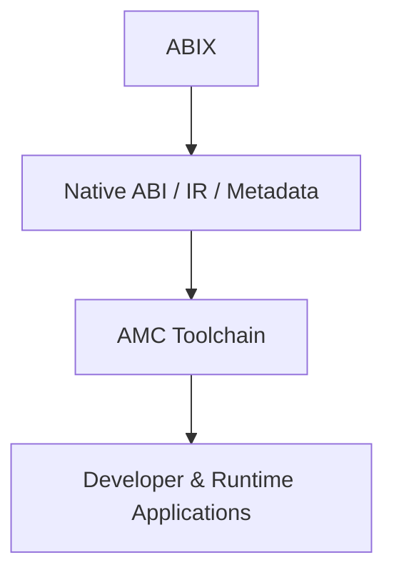

# ABIX Ecosystem & Adoption

  <a href="ecosystem_zh.md">中文</a> · English

Contents

- [Layered Architecture](#layered-architecture)
- [Scope](#scope)
- [Individual Developers](#individual-developers)
- [Application and Platform Developers](#application-and-platform-developers)
- [Enterprise](#enterprise)
- [AI Integration](#ai-integration)
- [Robotics](#robotics)
- [Existing Ecosystems](#existing-ecosystems)
- [Open Ecosystem](#open-ecosystem)

## Layered Architecture

ABIX is structured in four layers:

Each layer can be adopted independently. A package manager can consume
ABIX metadata without running the full AMC toolchain; an IDE plugin can
use the ABI model without the runtime.

## Scope

ABIX covers native binary interfaces across the full lifecycle:

* ABI inspection and compatibility analysis
* ABI-aware CI and release validation
* Cross-language binding generation
* Native plugin and component systems
* Binary package and dependency management
* IDE and LSP integration
* AI-assisted binary and software engineering
* Robotics and other native runtime environments

These are ecosystem directions, not specification requirements.

## Individual Developers

Typical workflows:

ABIX does not replace existing tools. It provides a common ABI
representation that build systems, package managers, and binding
generators can consume.

## Application and Platform Developers

Applications with large native dependency or plugin ecosystems use ABIX
to make binary compatibility explicit:

* SDK integration
* native plugin systems
* cross-language interfaces
* binary component discovery
* compatibility validation
* release and upgrade workflows

An existing package manager continues to manage package versions and
artifacts. ABIX adds ABI metadata: what each artifact exposes, who can
load it, and whether two versions are compatible.

## Enterprise

Large native software systems benefit from treating ABI information as a
first-class engineering artifact:

Applicable to software with:

* multiple shared libraries
* third-party plugins
* long-lived SDKs
* multiple compiler or platform configurations
* cross-language integrations
* independently versioned binary components

## AI Integration

AI integration is an optional AMC application layer:

ABIX provides structured, machine-verifiable ABI information. AMC
provides deterministic operations (inspection, comparison, generation,
verification).

Modern AI systems already understand many ABI concepts. ABIX does not
teach ABI to LLMs. It provides a standardized external representation of
concrete native binary state, so AI systems can reason over verifiable
facts rather than inferred guesses.

## Robotics

ABIX extends beyond desktop and server software:

ABIX describes the binary interfaces between these components. AMC
provides inspection, compatibility checking, loading, and verification.

Robotics projects are application demonstrations, not core specification
requirements.

## Existing Ecosystems

ABIX complements existing infrastructure:

| Domain          | Examples                        |
|-----------------|---------------------------------|
| Build systems   | CMake, Bazel                    |
| Package managers | Conan, vcpkg                   |
| Binding tools   | bindgen, SWIG                   |
| Component systems | framework-specific plugins    |
| IDE tooling     | clangd, language servers        |
| AI protocols    | MCP and other tool interfaces   |

ABIX provides a common native ABI representation that these systems
consume.

## Open Ecosystem

ABIX serves a broad audience:

* open-source projects
* commercial software
* independent developers
* framework and platform vendors
* language communities
* research projects

Application-specific integrations can be developed independently. Different
ecosystems build on the same ABI foundation without shared infrastructure
dependencies.

---

*See also: [Sustainability](sustainability.md), [Competitive Landscape](../development/competitors.md), [AI Theory](../ai/ai.md).*
