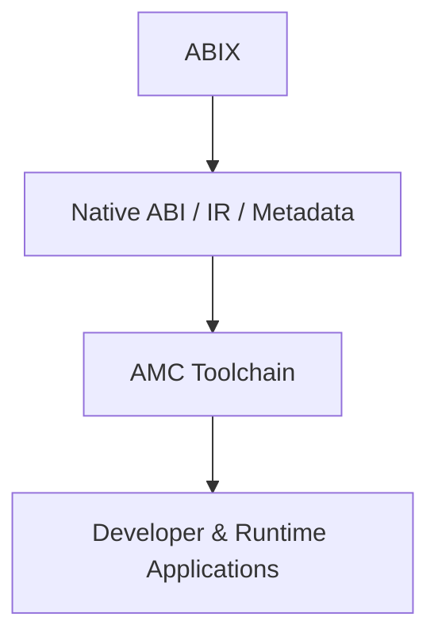
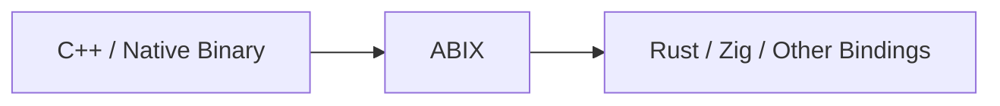
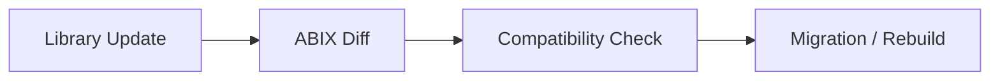
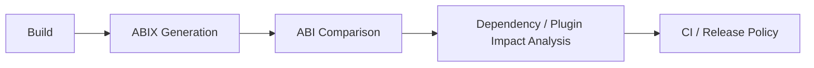
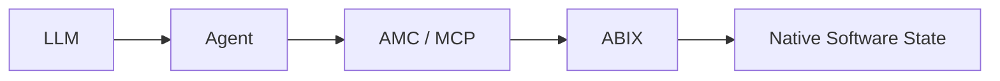
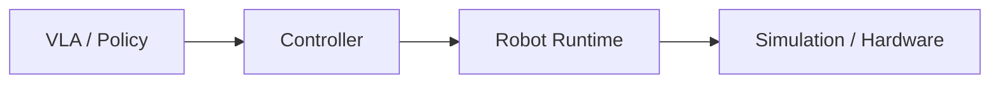

# ABIX 生态与采用

  English · <a href="ecosystem_zh.md">中文</a>

目录

- [分层架构](#分层架构)
- [覆盖范围](#覆盖范围)
- [个人开发者](#个人开发者)
- [应用与平台开发者](#应用与平台开发者)
- [企业](#企业)
- [AI 集成](#ai-集成)
- [Robotics](#robotics)
- [与现有生态的关系](#与现有生态的关系)
- [开放生态](#开放生态)

## 分层架构

ABIX 采用四层架构：

每层可独立采用。包管理器可以直接消费 ABIX metadata，无需运行完整 AMC 工具链；IDE 插件可以使用 ABI 模型，无需依赖运行时。

## 覆盖范围

ABIX 覆盖原生二进制接口的完整生命周期：

* ABI 检查与兼容性分析
* ABI 感知的 CI 与发布验证
* 跨语言绑定生成
* 原生插件与组件系统
* 二进制包与依赖管理
* IDE 与 LSP 集成
* AI 辅助的二进制与软件工程
* Robotics 及其他原生运行时环境

这些是生态方向，不是规范的强制组件。

## 个人开发者

典型工作流：

ABIX 不取代现有工具。它提供一种通用 ABI 表示，供构建系统、包管理器和绑定生成器消费。

## 应用与平台开发者

拥有大量原生依赖或插件生态的应用，使用 ABIX 使二进制兼容性变得显式：

* SDK 集成
* 原生插件系统
* 跨语言接口
* 二进制组件发现
* 兼容性验证
* 发布与升级工作流

现有包管理器继续管理包版本和 artifact。ABIX 补充 ABI metadata：每个 artifact 暴露什么、谁可以加载、两个版本是否兼容。

## 企业

大型原生软件系统将 ABI 信息视为一等工程 artifact：

适用场景：

* 包含多个共享库
* 第三方插件
* 长期维护的 SDK
* 多种编译器或平台配置
* 跨语言集成
* 独立版本管理的二进制组件

## AI 集成

AI 集成是 AMC 的可选应用层：

ABIX 提供结构化、机器可验证的 ABI 信息。AMC 提供确定性操作（检查、比较、生成、验证）。

现代 AI 系统已经理解许多 ABI 概念。ABIX 不负责教会 LLM 什么是 ABI，而是提供一种标准化的外部表示，让 AI 系统可以基于可验证的事实进行推理，而非依赖猜测。

## Robotics

ABIX 超越桌面和服务器软件：

ABIX 描述这些组件之间的二进制接口。AMC 提供检查、兼容性验证、加载和验证。

Robotics 项目是应用示范，不是核心规范的要求。

## 与现有生态的关系

ABIX 补充现有基础设施：

| 领域          | 示例                            |
|--------------|---------------------------------|
| 构建系统       | CMake, Bazel                    |
| 包管理器       | Conan, vcpkg                    |
| 绑定工具       | bindgen, SWIG                   |
| 组件系统       | 各框架的插件系统                  |
| IDE 工具       | clangd, language servers        |
| AI 协议        | MCP 及其他工具接口               |

ABIX 提供一种通用原生 ABI 表示，供上述系统消费。

## 开放生态

ABIX 服务对象广泛：

* 开源项目
* 商业软件
* 独立开发者
* 框架与平台供应商
* 语言社区
* 研究项目

应用层集成可独立开发。不同生态在同一 ABI 基础上构建，无需共享基础设施依赖。

---

*另见：[可持续性](sustainability_zh.md)、[竞品分析](../development/competitors_zh.md)、[AI 理论](../ai/ai_zh.md)。*
