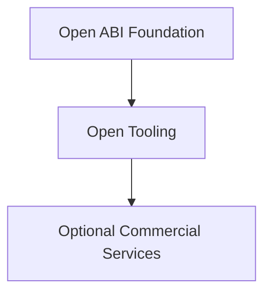

# Project Sustainability

  <a href="sustainability_zh.md">中文</a> · English

Contents

- [Open Infrastructure](#open-infrastructure)
- [Community Support](#community-support)
- [Enterprise Participation](#enterprise-participation)
- [Optional Commercial Services](#optional-commercial-services)
- [Independence](#independence)
- [Long-Term Goal](#long-term-goal)

## Open Infrastructure

ABIX and AMC remain open infrastructure for native software ecosystems.
Long-term development depends on both technical contributions and
sustainable project resources.

## Community Support

Community members and organizations support development through:

* code contributions
* documentation
* testing and interoperability work
* sponsorship
* hardware or infrastructure support
* ecosystem integrations

Sponsorship funds long-term maintenance, cross-platform testing,
documentation, infrastructure, and continued development.

## Enterprise Participation

Companies participate in the ABIX ecosystem as:

* users
* contributors
* integration partners
* sponsors
* research collaborators
* providers or consumers of application-layer tooling

Enterprise participation does not require the ABIX core specification to
be controlled by a single organization.

## Optional Commercial Services

As adoption grows, maintainers or ecosystem participants may provide
optional commercial services: integration, support, hosted infrastructure,
governance tooling, or enterprise automation.

These services complement the open-source project. They do not make the
core ABI technology inaccessible.

## Independence

The project preserves a clear separation:

Organizations adopt ABIX without requiring a specific vendor, hosted
service, or commercial product.

## Long-Term Goal

Build a sustainable ecosystem around a common native ABI foundation. The
project remains valuable regardless of changes in commercial services, AI
technologies, package managers, or application frameworks.

---

*See also: [Ecosystem](ecosystem.md), [Competitive Landscape](../development/competitors.md).*
