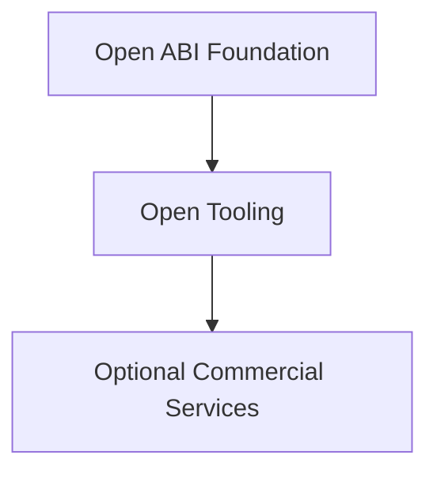

# 项目可持续性

  English · <a href="sustainability_zh.md">中文</a>

目录

- [开放基础设施](#开放基础设施)
- [社区支持](#社区支持)
- [企业参与](#企业参与)
- [可选的商业服务](#可选的商业服务)
- [独立性](#独立性)
- [长期目标](#长期目标)

## 开放基础设施

ABIX 和 AMC 作为原生软件生态的开放基础设施长期存在。长期开发依赖于技术贡献和可持续的项目资源。

## 社区支持

社区成员和组织通过以下方式支持开发：

* 代码贡献
* 文档编写
* 测试与互操作性工作
* 赞助
* 硬件或基础设施支持
* 生态集成

赞助用于资助长期维护、跨平台测试、文档、基础设施和持续开发。

## 企业参与

企业可以以下列身份参与 ABIX 生态：

* 用户
* 贡献者
* 集成合作伙伴
* 赞助方
* 研究合作者
* 应用层工具的提供者或消费者

企业参与不要求 ABIX 核心规范受单一组织控制。

## 可选的商业服务

随着采用增长，维护者或生态参与者可能提供可选的商业服务：集成、支持、托管基础设施、治理工具或企业自动化。

这些服务补充开源项目，不构成对核心 ABI 技术的封锁。

## 独立性

项目保持清晰分离：

组织采用 ABIX 无需依赖特定供应商、托管服务或商业产品。

## 长期目标

围绕通用原生 ABI 基础建立可持续的生态。无论商业服务、AI 技术、包管理器或应用框架如何变化，项目保持价值。

---

*另见：[生态与采用](ecosystem_zh.md)、[竞品分析](../development/competitors_zh.md)。*
