# 自举与运行时

<p align="center">
  中文 · <a href="bootstrap.md">English</a>
</p>

<details>

<summary>目录</summary>

- [核心问题](#核心问题)
- [四阶段路线](#四阶段路线)
- [类型与哈希模型](#类型与哈希模型)
- [`.abix` artifact](#abix-artifact)
- [Bootstrap 内核](#bootstrap-内核)
- [运行时依赖与状态模型](#运行时依赖与状态模型)
- [Map 模型](#map-模型)
- [自举闭环](#自举闭环)
- [里程碑](#里程碑)
- [关键设计决策](#关键设计决策)

</details>

ABIX 希望用自身提供的跨 ABI 模型描述自己的内部类型——`Registry`、`TypeInfo`、
RCU/EBR 状态等。递归地描述这套机制会陷入鸡生蛋问题。自举路线通过把工作拆成四个
阶段，并在最底层放置一个极小的、手工维护的内核来解决它。

本文档记录这条路线：元模型、Bootstrap 内核、运行时依赖与状态模型，以及由此实现的
自举闭环。artifact 格式本身见 [`abix_zh.md`](../abix/abix_zh.md)；运行时 API 见
[`runtime_zh.md`](../architecture/runtime_zh.md)。

## 核心问题

"ABIX 描述自己"意味着 ABIX 自身的内部类型也应当能通过 ABIX 的跨 ABI 机制消费。
直接实现是循环的：描述类型的机制本身也是一种类型，它必须先被描述才能运行。没有固定
的基座就没有起点。

解决方案是先冻结数据模型，在其上实现尽可能小的 loader，再从该 loader 生长出运行时，
最后让运行时描述自己的组成部件。

## 四阶段路线

原方案为三阶段——`Bootstrap → Runtime → Self-hosting`。工程上调整为四阶段，将
ABI 元模型前置为独立的 Phase 0。

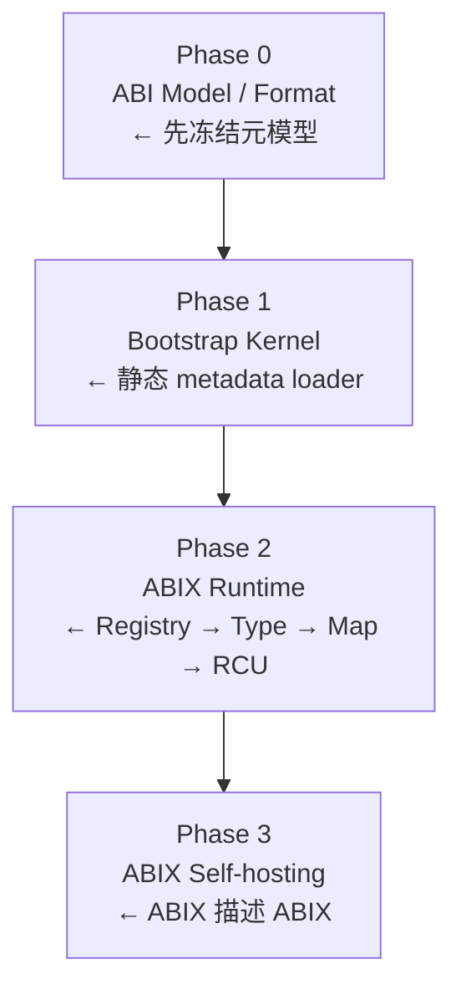

Phase 0 至关重要。Bootstrap 内核需要消费什么，取决于 `.abix`、`TypeInfo`、
`Registry` 和 `Map` 最终是什么形式；先冻结元模型可避免后期发现这些数据模型互相依赖
而返工。

### Phase 0 —— ABI 元模型

定义后续所有阶段消费的对象模型：

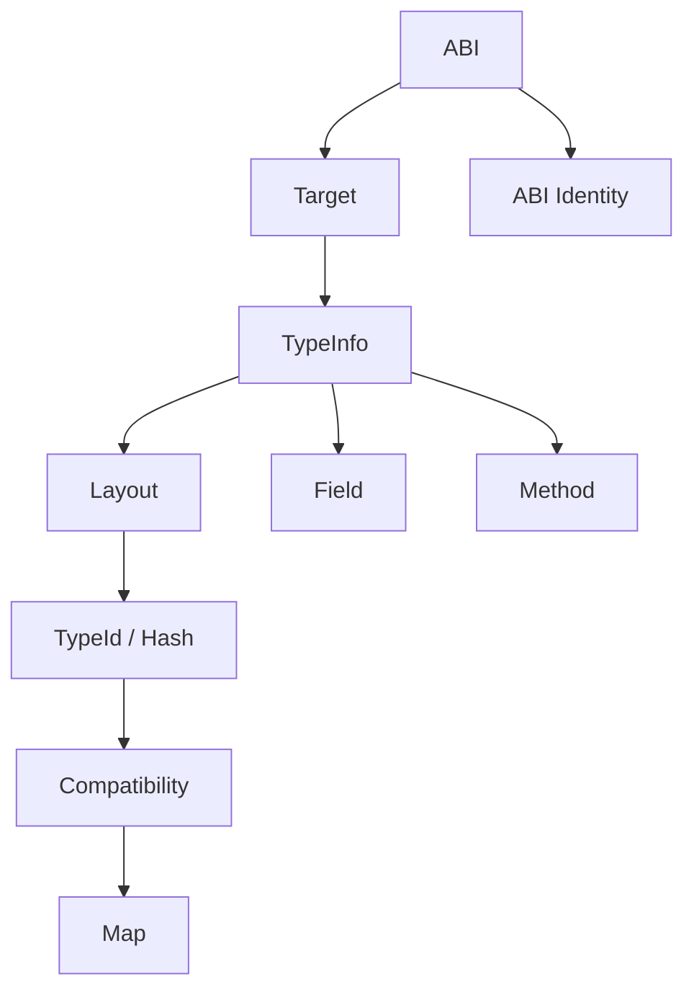

### Phase 1 —— Bootstrap 内核

Bootstrap 内核是静态 metadata loader，不是简化版 Registry。它把生成的 metadata
从只读存储送入运行时，随后不再被使用。其约束详见后文 Bootstrap 内核一节。

### Phase 2 —— ABIX 运行时

在已加载的 metadata 之上依次构建 `Registry`、类型系统、`Map`，最后是 RCU/EBR。
开发先单线程进行，从而在引入并发之前先证明
`Bootstrap → Registry → Type lookup → self metadata` 闭环成立。

### Phase 3 —— 自举

ABIX 自身的 type、registry、map、RCU、compatibility 与 bootstrap metadata 均由
ABIX 工具链产出并在运行时注册，Bootstrap 内核作为唯一手工维护的可信基座保留。

## 类型与哈希模型

### TypeInfo 拆分为三种类型

不允许一个 `TypeInfo` 同时承担所有职责，按所回答的问题拆分：

| 类型 | 回答 | 内容 |
|------|------|------|
| `TypeId` | "我是谁？" | 以 `Hash128` 表示的规范类型标识 |
| `TypeDesc` | "我是什么？" | id、flags、名称偏移、layout 引用 |
| `TypeLayout` | "我的 ABI layout 是什么？" | size、align、字段范围、layout hash |

```cpp
struct TypeId {
    Hash128 hash;       // 规范类型标识的哈希
};

struct TypeDesc {
    TypeId id;
    uint32_t flags;     // POD / trivially_copyable / polymorphic ...
    uint32_t name;      // 名称在 StringTable 中的偏移
    uint32_t layout;    // 指向 TypeLayout 的索引
};

struct TypeLayout {
    uint32_t size;
    uint32_t align;
    uint32_t field_begin;   // Field 表起始索引
    uint32_t field_count;   // 字段数量
    Hash128 layout_hash;    // Layout 的完整哈希
};
```

这种拆分使标识、描述与物理布局彼此独立，兼容性可以分别针对三者推理而不会混淆。

### TypeHash 与 LayoutHash

两个哈希由不同输入导出：

```cpp
// 类型标识哈希（谁）
TypeId = hash(canonical type identity)

// 布局哈希（长什么样）
LayoutHash = hash(
    TypeId,
    size,
    alignment,
    field_count,
    field TypeId,
    field offset,
    bitfield,
    base_class,
    vtable_abi,
    ...
)
```

`TypeHash ≠ LayoutHash` 是兼容性系统的基础。同一类型标识在不同构建配置下可能具有
不同布局，兼容性检查正是基于这一区分进行的。见
[`compatibility_zh.md`](../architecture/compatibility_zh.md)。

### Hash128

哈希算法不固定为任何特定函数：

```cpp
struct Hash128 {
    uint64_t lo;
    uint64_t hi;
};

constexpr TypeId type_id(...);
constexpr LayoutHash layout_hash(...);
```

第一版可以使用 FNV-1a；后续实现可替换为 XXH3、BLAKE3 或截断的 SHA-256，而不改变
`.abix` 模型。哈希算法作为显式的 schema/version 信息记录在 artifact 中，而不是隐含
在实现里。

### 其他核心概念

| 概念 | 说明 |
|------|------|
| `Field` | 字段描述：name、`TypeId`、offset、bitfield、flags |
| `Function` | 函数描述：name、signature hash、调用约定、参数 |
| `Symbol` | 可导出符号：name、`TypeId`/`FunctionId`、visibility |
| `MapInfo` | ABI 映射描述：源类型到目标类型的转换规则 |
| `Compatibility` | 兼容性规则：`TypeId` 对 → compatible / incompatible |
| `ABI Identity` | 平台、编译器与调用约定的唯一标识 |
| `Target` | 目标平台描述：arch、OS、ABI convention |

## `.abix` artifact

`abixc` 消费 Clang AST 并产出两个相互配合的产物：

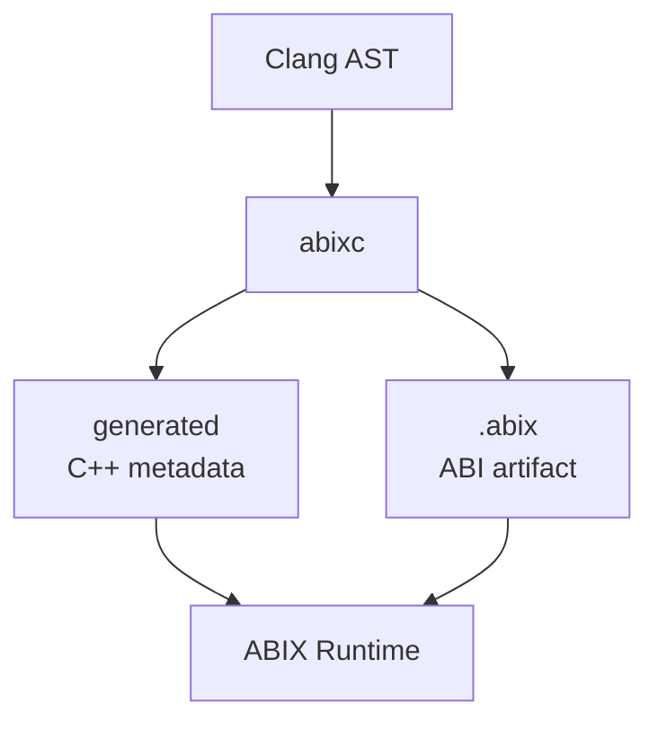

* `.abix` —— 跨进程、跨工具、跨语言共享的稳定 ABI artifact。
* `generated/*.abix.hpp` —— 针对当前编译环境的 zero-cost C++ 编译期元数据。

v0 布局为顺序结构：

```mermaid
graph TD
    Header --> H_magic["magic"]
    Header --> H_fmt["format_version"]
    Header --> H_hash["hash_algorithm<br/>← Hash 算法记录在 schema 中"]
    Header --> H_sec["section_offsets"]
    ABIIdentity["ABI Identity"] --> AI["arch, os, compiler, calling_convention, abi_flags"]
    Target --> T["target_arch, target_os, target_abi"]
    StringTable["String Table"] --> ST["count, entries (offset, length)"]
    TypeTable["Type Table"] --> TT["count, entries (TypeDesc)"]
    FieldTable["Field Table"] --> FT["count, entries (name, TypeId, offset, flags)"]
    FunctionTable["Function Table"] --> FuT["count, entries (name, signature_hash, cc, params)"]
    SymbolTable["Symbol Table"] --> SyT["count, entries (name, kind, type_id / function_id)"]
```

当前实现采用 Section Directory 布局，配合去重的 String Table 与 offset/index 引用
（包含 length、flags 与 optional section），并增加 ABI Identity、Target、Hash Table
和 Symbol Table section。权威描述见 [`abix_zh.md`](../abix/abix_zh.md)。

## Bootstrap 内核

### 接口

内核是只有一个入口的静态 metadata loader，而不是 Registry；不为它定义
`lookup()` / `insert()` / `erase()` API。

```cpp
namespace abix::bootstrap {

struct BootstrapRecord {
    uint64_t type_hash;
    uint32_t size;
    uint32_t align;
    const void* metadata;   // 指向生成的 TypeDesc / TypeLayout
};

struct BootstrapImage {
    const BootstrapRecord* records;
    uint32_t count;
};

// 唯一入口函数
void abix_bootstrap(const BootstrapImage& image);

} // namespace abix::bootstrap
```

### 约束

| 约束 | 规则 |
|------|------|
| 不使用 ABIX | 不出现 `ABIX_EXPORT(...)` 等宏 |
| 不使用动态内存 | 无 `std::vector`、`std::unordered_map`、`std::string` |
| 不使用 RCU/EBR | 仅静态数据、普通指针与固定布局 |
| 不依赖 C++ ABI | 接近 `extern "C"` 加 POD |
| 无完整 Registry API | 只负责将静态 metadata 送入运行时 |

### Wire format

不假设 `sizeof(BootstrapType)` 跨编译器自然一致，而是明确定义 Bootstrap ABI 的
wire format：

```cpp
struct BootstrapType {
    uint64_t hash;          // 8 bytes, little endian
    uint32_t size;          // 4 bytes, little endian
    uint32_t align;         // 4 bytes, little endian
};
```

内核还可以进一步简化为只处理 byte span 加 offset、length。

### 启动流程

```cpp
// .rodata 中的静态数据
static const BootstrapRecord self_records[] = {
    { type_hash<RegistryEntry>, sizeof(RegistryEntry), alignof(RegistryEntry),
      &generated::RegistryEntry_Desc },
    // ...
};

static const BootstrapImage self_image = {
    .records = self_records,
    .count   = sizeof(self_records) / sizeof(self_records[0])
};

void abix_initialize() {
    abix::bootstrap::abix_bootstrap(self_image);
    // Bootstrap 完成后，BootstrapImage 不再使用
}
```

## 运行时依赖与状态模型

### 实现顺序

不一开始就实现 RCU/EBR。初始目标是证明
`Bootstrap → Registry → Type lookup → self metadata` 闭环：


### 依赖图

依赖自上而下，禁止反向依赖。

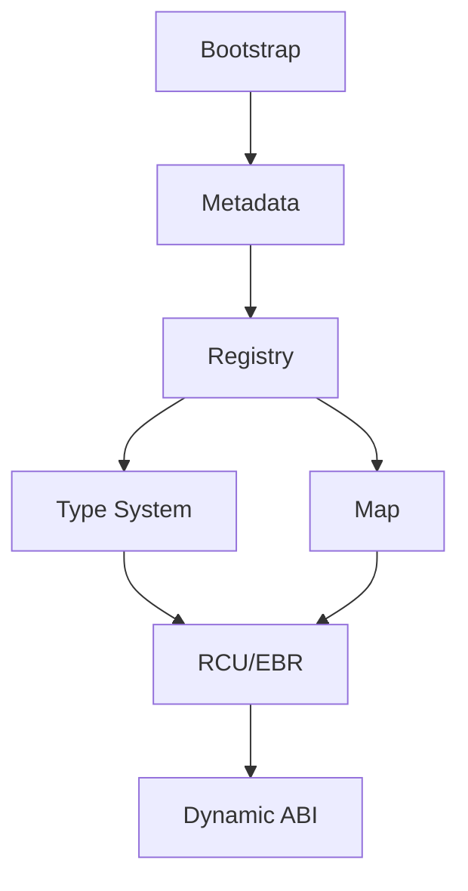

尤其禁止以下依赖：

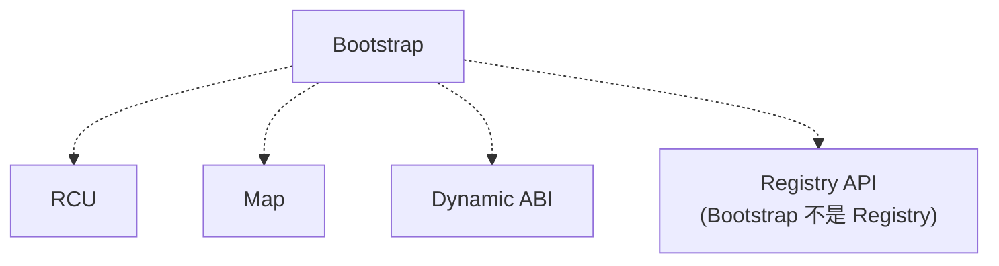

### 状态机

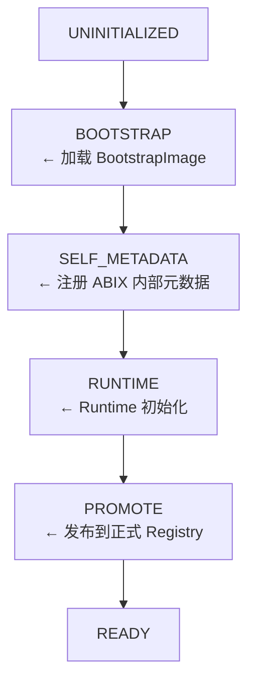

`BOOTSTRAP`、`SELF_METADATA`、`RUNTIME` 与 `PROMOTE` 只存在于初始化线程。普通用户
线程只观察到 `NOT_READY` 和 `READY`，因此热路径没有状态检查开销。

### 线程安全切入点

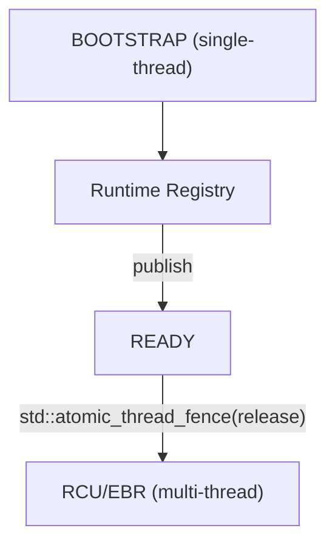

```cpp
initialize();

// 内存发布点
std::atomic_thread_fence(std::memory_order_release);
state.store(State::READY, std::memory_order_release);

// 其他线程
if (state.load(std::memory_order_acquire) == State::READY) {
    // Registry fully initialized
}
```

该检查只发生在线程第一次进入 Runtime 时，不发生在每次 Registry lookup 中。

### RCU 自举顺序

类型 metadata 与 registry 先于 RCU，而不是相反：

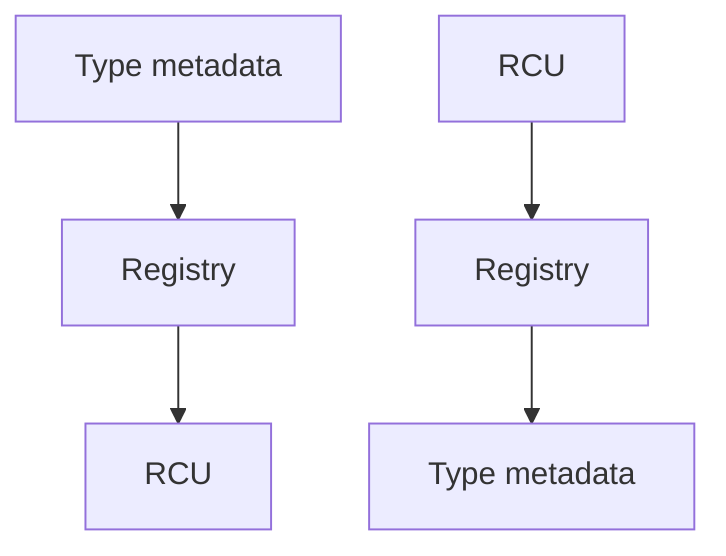

在 RCU 初始化之前，`ThreadState`、`RetiredNode`、`Epoch` 只是普通 C++ 类型。RCU
初始化之后，它们被注册到 ABIX Registry 中，此后 RCU 自身可以使用 ABIX metadata。

## Map 模型

`Map` 是同一语义模型的两条实现路径，而不是两个系统：

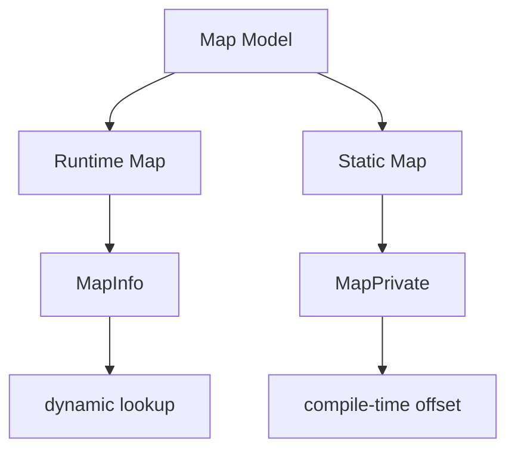

| 场景 | 路径 |
|------|------|
| Debug | `MapInfo` → runtime validation |
| Release | `MapPrivate` → direct access (zero-cost) |

`MapPrivate` 晚于 Runtime Map 实现：先验证 Runtime Map 语义正确，再生成等价的静态
版本。二者在 copy 与 default 操作上经验证语义一致；其他转换需要 native converter。

## 自举闭环

### 内核是可信任基

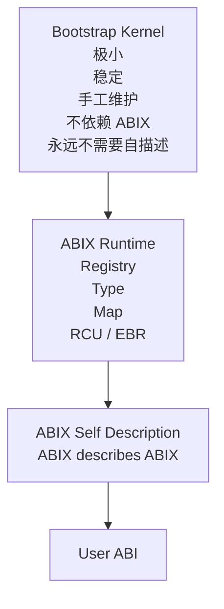

Bootstrap 内核是 TCB（可信计算基）。类似 BIOS/firmware 或 compiler bootstrap
stage 0，它永远不需要被 ABIX 描述。见 [`self-hosting_zh.md`](self-hosting_zh.md)。

### 已验证能力

* 从 C++ header 到 `.abix` 再到静态 Runtime descriptor 的生成链路；
* Type、field、function、layout、`Hash128` 与 Symbol metadata；
* namespace、alias、bitfield、继承、访问级别、模板特化与调用约定的提取；
* `RuntimeRegistry` 注册、`TypeId` 查询与 canonical registry bridge；
* Compatibility / Map IR 与 `MapPrivate` constexpr 操作计划；
* 独立 provider 进程与 JSON-lines IPC；
* `amc/self.abic.toml` 可从干净目录生成 `amc_core.abix`，生成的 C++ descriptor
  注册进 `RuntimeRegistry`；`type_of<amc::AbiModule>()`、`type_of<amc::MapOperation>()`
  与 `type_of<amc::CompatibilityRecord>()` 均可查询。

### 自举边界

AMC 的验证表明，已编译的 AMC stage 能解析自身 core IR，并生成可消费的 ABIX
metadata 与 C++ 投影。它不是严格编译器理论意义上的源码自托管：`amc-cpp` 的构建与
语义提取仍依赖 Clang/LLVM，生成的 descriptor 尚未反过来构建 `amc-cpp` 本身。

### Self-hosting Bootstrap

1. `abix/self/abix_self.abic.toml` 覆盖 Type、Registry、Map、Bootstrap 与 RCU/EBR
   核心类型。
2. AMC 从干净构建目录生成 `build/abix_self.abix`，并生成消费者使用的
   `abix_self_metadata.hpp`。
3. 生成的 `ModuleDescriptor` 通过 `RuntimeRegistry::register_module()` 接入；
   `MetadataRegistry::bootstrap_self()` 中仅保留两条 Bootstrap Kernel wire record
   作为 TCB。
4. 闭环消费者验证 `type_of<TypeInfo>()`、`type_of<RegistryEntry>()`、按 TypeId/名称
   lookup、canonical registry bridge，以及生成 descriptor 的 size/align 与本机类型
   一致。
5. `ThreadState`、`RetiredNode`、`RetiredBatch`、`Epoch` 与 `rcu_domain` 已纳入
   artifact；运行时类型 metadata 来自生成的 module，而非手写 metadata；Bootstrap
   Kernel 的两条自描述 wire record 是唯一刻意保留的 TCB。

验收标准：从干净构建目录执行一次构建即可生成 self-description artifact 与 C++ 投影；
运行时仅依赖 Bootstrap Kernel 与该生成投影注册 descriptor，并查询 ABIX 自身核心类型
与 RCU/EBR 类型。`.abix` 的运行时二进制 loader 不属于这一阶段。

## 里程碑

ABIX Runtime 自举里程碑均已完成。

| 里程碑 | 范围 | 状态 |
|--------|------|------|
| M0 —— ABI Model | `TypeId`、`TypeDesc`、`TypeLayout`、`Field`、`Function`、`Symbol`、`MapInfo`、`Compatibility`、`ABI Identity`、`Target`；`Hash128` 抽象与 TypeHash ≠ LayoutHash；刻意不实现 RCU | 已完成 |
| M1 —— `.abix` v0 | Header、Type/Field/Function Table（首版 inline 顺序序列化）；`write_abix` / `read_abix` round-trip；`amc inspect` / `amc validate`；Section Directory 与 String Table 去重、offset/index 引用、length、flags 与 optional section；ABI Identity、Target、Hash Table、Symbol Table section | 已完成 |
| M2 —— Bootstrap Kernel | `BootstrapImage`、`BootstrapRecord` 与 loader；无 allocator、无 Registry、无 RCU、无 ABIX API；以显式 endianness 与 padding 定义 wire format | 已完成 |
| M3 —— Runtime Registry | Type registration、lookup、validation；打通 `Bootstrap → Registry → Type lookup` 闭环；Registry 自描述（`RegistryEntry` / `BootstrapMetadata`） | 已完成 |
| M4 —— Type Self-hosting | 为 ABIX 核心类型建立正式 `.abic` self-description 配置；AMC 生成核心类型、`RegistryEntry`、`TypeDescriptor` 的 `.abix` metadata；静态 descriptor 注册进 `RuntimeRegistry`；验证 `RuntimeRegistry::type_of<TypeDesc>()` 能返回自身 metadata | 已完成 |
| M5 —— Compatibility | HashDescriptor、Hash Domain、算法版本与 RuntimeKey 分层模型；`TypeHash`、`LayoutHash`、`SignatureHash` 与兼容性检查 | 已完成 |
| M6 —— Runtime Map | `MapInfo` 与 dynamic Map 的运行时转换 | 已完成 |
| M7 —— RCU / EBR | AMC 提取 `ThreadState`、`Epoch`、`RetiredNode` 的布局与成员关系；将 RCU/EBR 类型注册进 Runtime Registry；完成 `ABIX Registry → ABIX RCU → ABIX Registry` 初始化闭环；验证 lookup 与 retire 不依赖未注册 metadata | 已完成 |
| M8 —— MapPrivate | 生成 `MapPrivate<A, B>` 静态转换；验证 Runtime Map 与 `MapPrivate` 语义一致（copy/default；转换需 native converter） | 已完成 |
| M9 —— Full Self-hosting | ABIX 的 Type、Registry、Map、RCU、Compatibility、Bootstrap metadata 全部由 ABIX 描述；从干净构建目录重新生成 self-description artifact；禁止运行时路径依赖手写的非 Bootstrap metadata；至此完成 Runtime Self-hosting | 已完成 |

## 关键设计决策

| 决策 | 选择 | 理由 |
|------|------|------|
| 阶段数 | 四阶段，Phase 0 先冻结元模型 | 避免后期返工 |
| `TypeInfo` | 拆分为 `TypeId` + `TypeDesc` + `TypeLayout` | 职责分离，兼容性更灵活 |
| Hash | 抽象为 `Hash128`，算法可替换 | 不将 FNV-1a 定死为最终标准 |
| TypeHash vs LayoutHash | 区分 | 兼容性系统的基础 |
| Bootstrap Kernel 定位 | 静态 metadata loader，而非简化 Registry | 防止内核自身膨胀 |
| Bootstrap ABI | 明确定义 wire format | 跨编译器稳定性 |
| 开发顺序 | 先单线程 Registry，后 RCU/EBR | 先证明闭环成立，再引入并发 |
| 依赖图 | 严格 DAG，禁止反向依赖 | 架构清晰，避免循环依赖 |
| 状态机 | 初始化线程多状态，用户线程仅 NOT_READY/READY | 热路径零开销 |
| `MapPrivate` 时机 | 晚于 Runtime Map | 先验证语义，再生成等价静态版本 |
| Bootstrap 自描述 | 永远不需要 | Bootstrap 是 TCB，类似 BIOS/firmware |
| `.abix` 引入时机 | Phase 0 即纳入设计 | 跨进程、跨语言共享 ABI 描述 |
