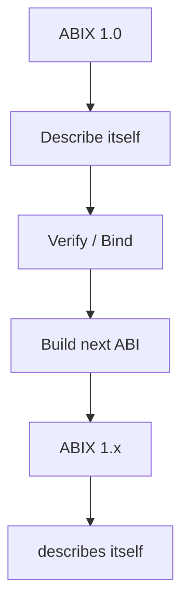
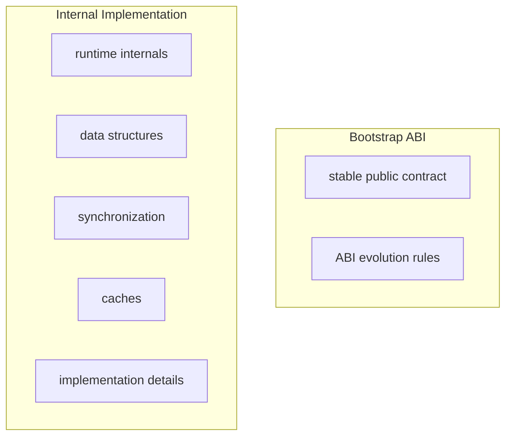
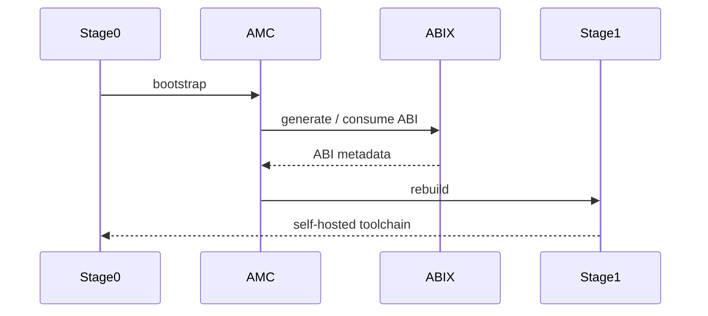

# Self-Hosting

  <a href="self-hosting_zh.md">中文</a> · English

Contents

- [What self-hosting means here](#what-self-hosting-means-here)
- [Bootstrap sequence](#bootstrap-sequence)
- [Bootstrap artifacts](#bootstrap-artifacts)
- [Why it matters](#why-it-matters)

ABIX 1.0 is self-hosting for its own public ABI: it describes its public ABI
with its own model, and uses that description to build and verify later
versions.

## What self-hosting means here

Self-hosting does **not** mean the implementation is frozen. It separates:

The public ABI is explicit and verifiable; internals remain free to evolve.

## Bootstrap sequence

The bootstrap loop works as follows:

Stage 0 is the initial hand-built loader; Stage 1 is the first version built
by the toolchain itself. From this point forward each new version is described
and verified by its predecessor.

## Bootstrap artifacts

ABIX describes its own core IR through its own configuration and validates the
result:

* `abix/self/abix_self.abic.toml` — the ABIX runtime's public types
* `amc/self.abic.toml` — the AMC core IR
* `abix/self_types.cpp`, `amc/self_types.cpp` — the inputs described

The integration suite builds these artifacts, validates them, generates a
native projection and compiles a consumer that uses
`RuntimeRegistry::type_of<T>()` — proving the bootstrap loop is intact.

## Why it matters

Self-hosting shows that the model is expressive enough to describe the system
that implements it. It also gives the project a stable contract to evolve
against, rather than an implicit ABI that changes whenever internals change.

[`bootstrap.md`](bootstrap.md) documents the bootstrap model, its phases and
the milestone history.
