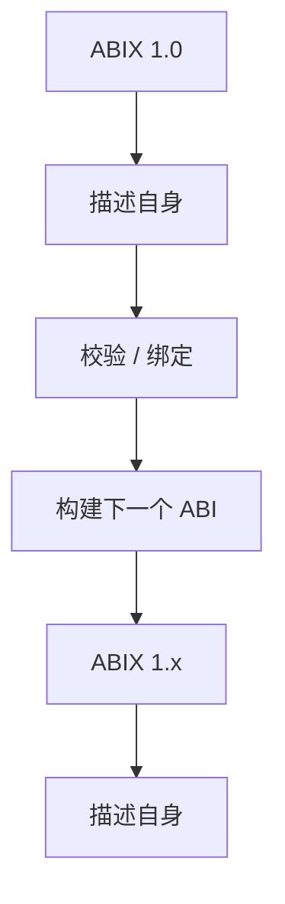
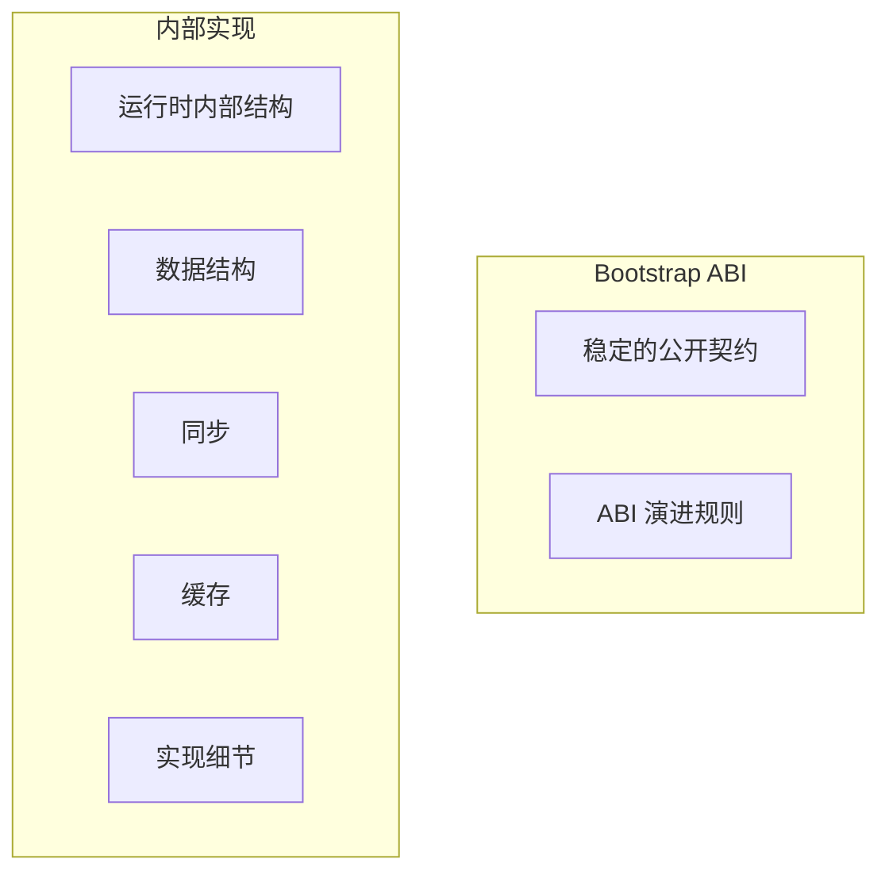
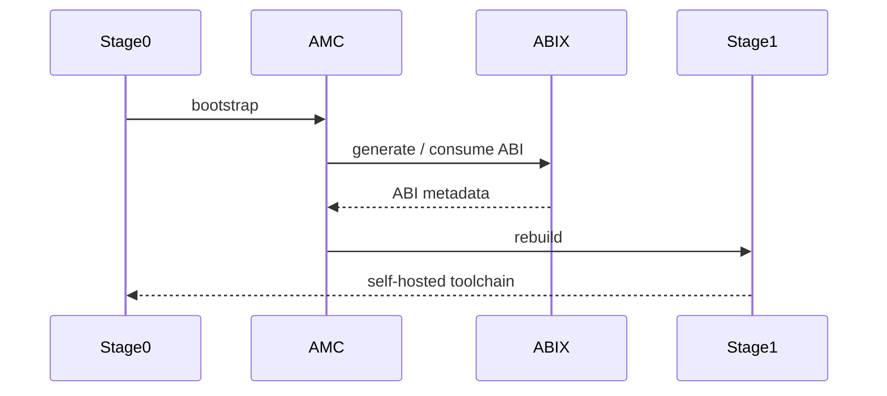

# 自举（Self-Hosting）

  中文 · <a href="self-hosting.md">English</a>

目录

- [自举的含义](#自举的含义)
- [自举时序](#自举时序)
- [Bootstrap artifact](#bootstrap-artifact)
- [为什么重要](#为什么重要)

ABIX 1.0 对自身公开 ABI 是自举的：用自己的模型描述自己的公开 ABI，并用该描述构建与
校验后续版本。

## 自举的含义

自举**不**意味着实现被冻结。它把两者分离：

公开 ABI 显式、可验证；内部实现可自由演进。

## 自举时序

自举闭环的工作流程如下：

Stage 0 是初始的手工构建 loader；Stage 1 是工具链自身构建出的第一个版本。
此后每个新版本都由其前驱描述和校验。

## Bootstrap artifact

ABIX 用自己的配置描述自身 core IR 并校验结果：

* `abix/self/abix_self.abic.toml` — ABIX 运行时的公开类型
* `amc/self.abic.toml` — AMC core IR
* `abix/self_types.cpp`、`amc/self_types.cpp` — 被描述的输入

集成测试会构建这些 artifact、校验、生成原生投影，并编译一个使用
`RuntimeRegistry::type_of<T>()` 的消费者，证明 bootstrap 闭环完好。

## 为什么重要

自举表明模型足以描述实现它的系统。它也让项目拥有一个稳定契约可供演进，
而不是一个随内部实现变化而变化的隐式 ABI。

自举模型、阶段与里程碑历史见 [`bootstrap_zh.md`](bootstrap_zh.md)。
