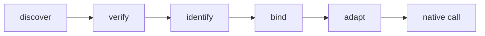
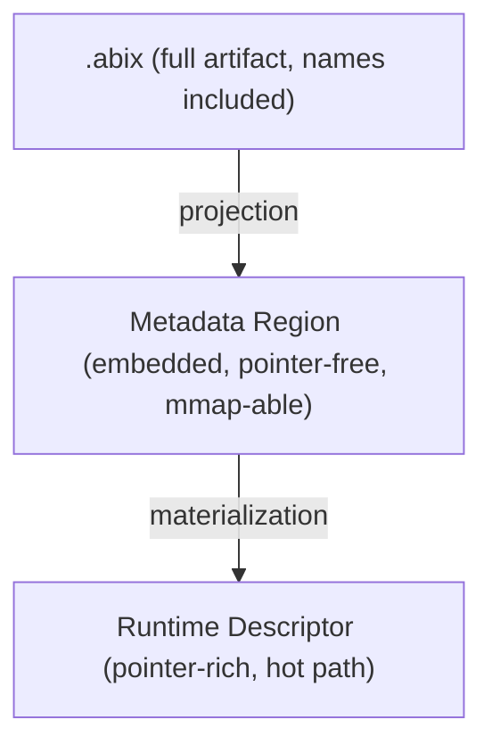

# Runtime Overview

The ABIX runtime consumes ABI metadata and keeps the execution path native. It
does not interpret compatible calls.

## Responsibilities



The runtime may participate in all of these, but after binding, a compatible
call goes through the native ABI with no per-call ABI machinery.

## Registry

`RuntimeRegistry` holds the ABI facts for all loaded modules and validates them
at load time:

* canonical `TypeDesc` / `TypeLayout` records are the one ABI truth;
* a shared `TypeID` must carry the same `LayoutHash` within one module version
  (compatible duplicates are deduplicated; conflicts are rejected), while a
  newer version may carry a different layout as a separate entry;
* lookups are by `TypeID` (`find_by_id` for the newest version,
  `find_type(id, version)` for a pinned one, `type_of<T>()`); name lookup is
  intentionally diagnostic-only and returns `nullptr` in the compact build.

## Three metadata modes



* The toolchain emits the Region into the `.abix.metadata` section of a
  generated header; an offline tool can scan a binary without loading it.
* `MaterializedModule` projects a Region back into a pointer-rich
  `ModuleDescriptor`, so a registry can be driven entirely by the metadata
  image — no compile-time descriptor arrays required.

See [`metadata_modes.md`](metadata_modes.md) for the design.

## DLL function table

The stable public call ABI is the DLL export table: a flat, versioned table of
function entries. Metadata is an additional, explicit layer on top of it.

## Quick Start

### DLL Side (Provider)

```cpp
#include "abix/abix.hpp"

extern "C" int add(int a, int b) { return a + b; }
extern "C" double multiply(double a, double b) { return a * b; }

SKL_ABIX_DEFINE_TABLE(
    SKL_ABIX_ENTRY("add", add),
    SKL_ABIX_ENTRY("multiply", multiply),
)
```

### Host Side (Consumer)

```cpp
#include "abix/abix.hpp"

using namespace skl::abix;

dll_object lib;
lib.load("math_dll.dll");

auto add = dll_func<int(int, int)>(lib, "add");
if (add.valid()) {
    int result = add(2, 3);  // 5
}

auto mul = dll_func<double(double, double)>(lib, "multiply");
if (mul.valid()) {
    double result = mul(1.5, 4.0);  // 6.0
}
```

See [`api.md`](api.md) for the runtime API.

## API reference

The full runtime API — `entry`, `table`, `dll_object`, `call_error`, smart
pointers for DLL resources, logging, RCU timeout policies, typed function
handles and signature hashing — is documented in
[`api.md`](api.md).

## Performance

Runtime binding and metadata projection happen at initialization. Boundary
overhead and lookup benchmarks are documented in [`benchmark.md`](benchmark.md).
